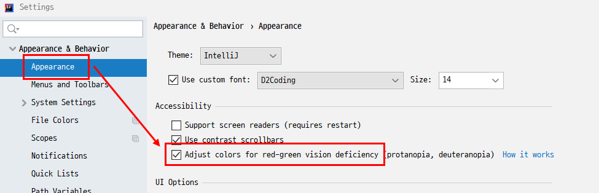
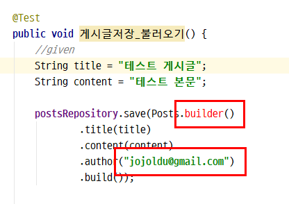
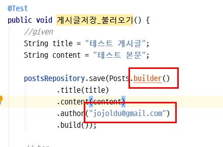
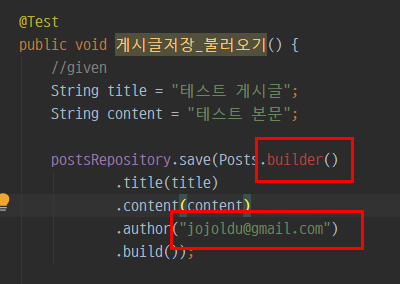
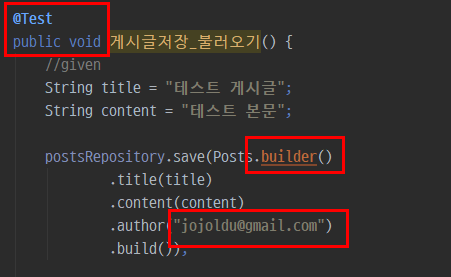
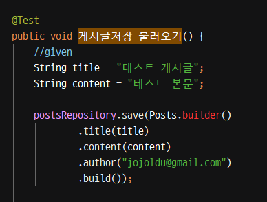
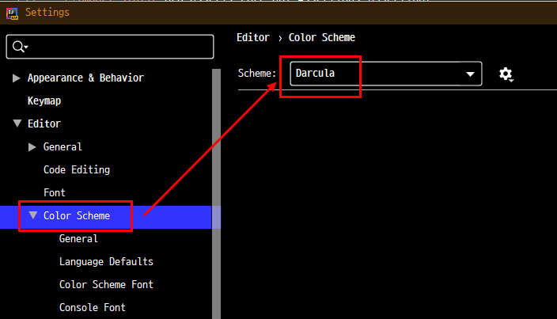
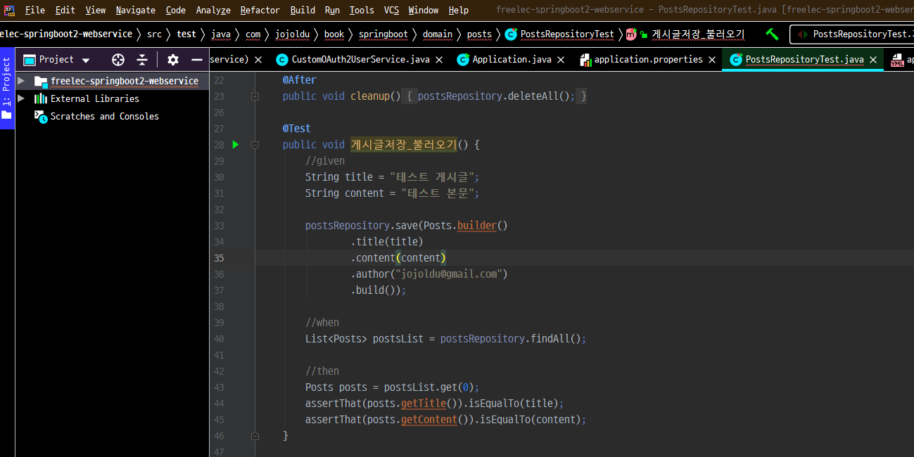

# IntelliJ 에서 적록색약 모드 적용하기

적록 색약이라고 하여 적색과 녹색을 잘 구분하지 못하는 증상이 있습니다.  

> 실제로 제가 그런 상황입니다.  

살면서 크게 부담이 있는건 아닌데,  
IDE의 경우 이 적색 (Error)과 녹색 (Warning) 이 많이 사용되다보니 둘을 구분하지 못하는건 조금(?) 불편하기도 합니다.  
  
저 같은 분들을 위해서 IntelliJ IDEA에서는 적록 색약 모드를 지원하는데요.  

* 적색은 오렌지색으로
* 녹색은 청색으로

색상이 변경되어 노출됩니다.  
  
한번 적용해보겠습니다.

## 설정

IDEA의 좌측 상단에 있는 Settings/Preferences 으로 이동합니다.  
해당 설정 창을 열어 Appearance & Behavior -> Appearance로 이동하셔서 "Adjust colors for red-green vision deficiency (protanopia, deuteranopia)" 옵션을 **체크** 합니다.



옵션을 체크 하신뒤 IDEA를 **재시작** 하셔야만 적용이 되니 재시작을 합니다.  
  
여기서 본인이 사용중이신 테마에 따라 색상 변경이 다르게 적용되니 테마에 따라 어떻게 변화되는지 확인해보겠습니다.

### Light (IntelliJ) 테마

먼저 기본 (Light) 테마입니다.  

**before**



**after**



보시는것처럼 오렌지 & 청색으로 명확히 구분되도록 변환된 것을 확인할 수 있습니다.

> 참고로 2020.1 버전부터는 Light 테마도 2가지 종류로 나눠집니다.  
> IntelliJ Light와 Windows 10 Light 테마가 생기는데 둘은 버튼 모양과 같이 전반적인 느낌이 조금은 다릅니다.  
> 현재 이 글은 2019.3 버전을 기준으로 하고 있어 IntelliJ Light 밖에 없기 때문에 이 테마 적용 버전만 보여드립니다.
 
### Darcula 테마

다음은 많은 분들이 사용중이신 Darcula 테마입니다.  

> Eclipse 사용하시는 분들이 많이들 부러워하는 테마죠?

**before**



**after**



Darcula 테마의 경우 청색의 대상이 기본색과 달리 ```@Test``` 와 ```public void```에만 적용되었습니다.  
아마도 테마의 전반적인 색상에 효과적인 부분들이 대치되는것 같습니다.

### High contrast 테마

제일 문제가 High contrast 테마인데요.  
  
**before**



**after**


보시다시피 **옵션을 적용해도 변경되는게 없습니다**.  
적록 색약이신 분들은 이 테마를 안쓰셔서 그런지 별도로 제보 올라온건 없어서 좀 답답했습니다.

### High contrast 테마 + Darcular Color Scheme

High contrast 테마에서 적용 안되는걸 살짝 우회할 수 있는 방법이 있는데요.  
바로 Color Scheme만 적록색약 옵션이 지원되는 다른 스키마로 교체하는 것입니다.  
  
아래와 같이 그나마 High contrast 테마와 비슷한 형태인 Darcular scheme를 선택합니다.



그럼 아래와 같이 **에디터는 Darcular** 모드가 되어 적록 색약 옵션을 사용할 수도 있습니다.



저 같은 경우 High contrast 테마를 너무 좋아해서 어쩔수 없이 적록색약 모드는 포기하였습니다.  
(제보는 올리겠지만)  
  
그래도 혹시나 저처럼 적록색에 대해 구분이 모호해 좀 더 명확하게 분리해서 사용하고 싶으신 분들 (그 중에서 High contrast 테마 안쓰신다면) 은 한번 적용해보시는 것을 추천드립니다 :)
