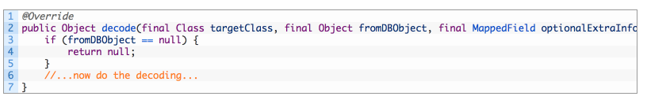
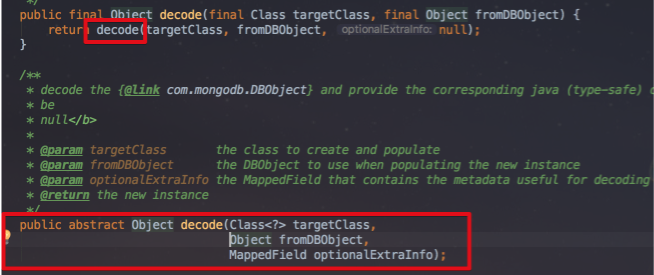
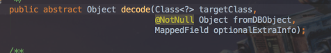
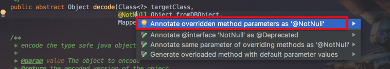
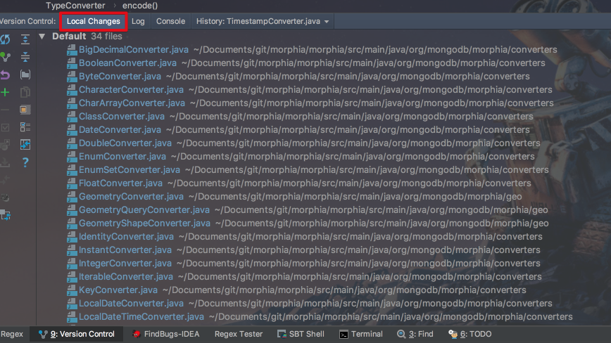
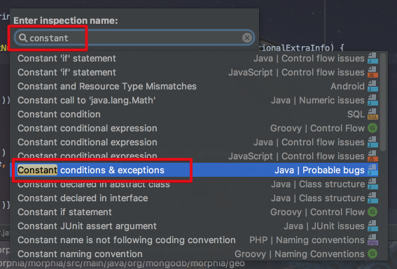
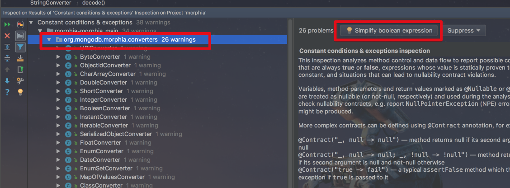
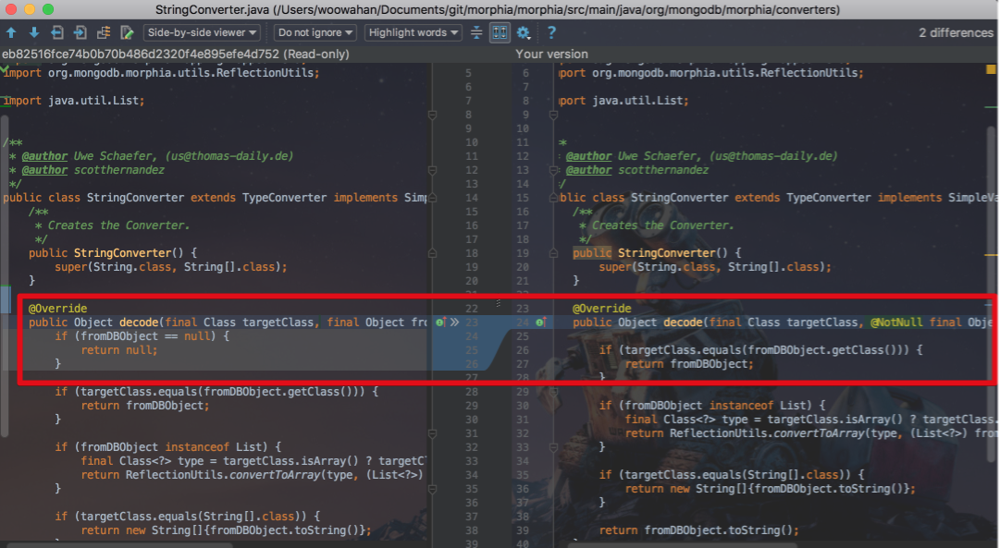
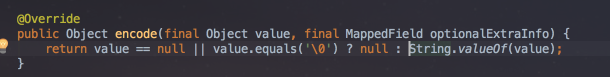
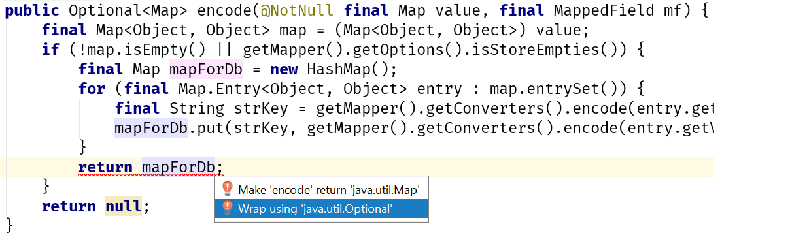

[IntelliJ 블로그](https://blog.jetbrains.com/idea/2017/08/code-smells-null/)에 올라온 시리즈물을 번역 & 재정리 하였습니다. 


# 1. Code Smells: Null

리팩토링에 대한 연구 중에 저는 여러가지 패턴(냄새나는 패턴)이 계속해서 반복되는 것을 보았습니다.  
  
이런 패턴들은 특별히 새로운 것이 하나도 없으며, 많은 책들([리팩토링](http://www.yes24.com/24/goods/7951038?scode=032&OzSrank=1), [패턴을 활용한 리팩토링](http://www.yes24.com/24/goods/14752528?scode=032&OzSrank=2))과 [블로그](https://refactoring.com/) 및 [동영상](https://www.youtube.com/watch?v=y4_SJzNJnXU&feature=youtu.be) 에서 이런 냄새나는 패턴들을 어떻게 다루는지 알려주고 있습니다.  
하지만 저는 IntelliJ IDEA가 어떻게 당신을 도울 수 있는지 (아닐 수도 있지만) 몇 가지 구체적이고 사소한 예로 설명하고 싶었습니다.  
  
내가 반대하려는 첫 번째 문제는 **null을 사용하는 것**입니다.  
특히 null-check 코드가 주위에 흩어져있을 때 더욱 그렇습니다.  
  
Java 8의 ```Optional```은 이러한 많은 문제를 해결해야 한다고 생각했습니다.  
저는 그것이 null 일 수 있다고 명시하는 유형, 즉 **이러한 경우에는 무엇을 해야 하는지를 명확히 알려주는 것이 정확히 올바른 해결책**이라고 생각했습니다.  
  
그러나 사태가 그렇게 단순하지는 않았습니다.  
그래서 이것은 IntelliJ에서 의도적으로 지원하지 않는 것이라 생각합니다.  
오히려 실망스럽게도, 이것은 개발자가 해야 할 일에 대해 열심히 생각할 필요가 있는 영역입니다.  
  
우리는 ```null```이 많은 것을 의미한다는 사실에 동의해야합니다.  
의미 할 수있는 것들 :

1. 값이 실수로 또는 의도적으로 초기화되지 않음.
2. 유요하지 않은 값.
3. 필요 없는 값.
4. 값이 없음.
5. 끔찍한 잘못이 있었고 있어야 할 것이 없음.
6. ... 아마도 수십 가지 다른 것들

명확한 설계 목표를 가진 훈련 된 팀이라면, 이 중 일부는 코드 기반에 적용되지 않는다고 가정 할 수 있습니다.  
  
예를 들어, 생성자에서 항상 초기화되는 최종 필드를 사용하거나, 인스턴스 생성 전에 올바른 조합을 검증하기 위해 빌더 또는 팩토리를 사용하거나, 응용 프로그램의 핵심에서 널 (null)을 사용하지 않는 등등  
  
```Optional```은 이러한 케이스 중 하나를 해결해줍니다. (위 4번째 사례 : 값이 없는 경우)  
예를 들어 데이터베이스에 특정 ID가 있는 고객을 요청합니다.  
이전에는 ```null```이 이를 표현 하곤 했었지만 모호 할 수 있습니다.  
```null```이 리턴될 경우에,  
이는 고객을 찾을 수 없다는 뜻입니까?  
또는 ID가 있지만 값이 없는 고객이 있습니까? 
또는 데이터베이스 연결이 실패했기 때문에 ```null```이 반환 되었습니까?  
```null```대신에 ```Empty Optional```을 리턴함으로써 모호성을 제거할 수 있게 되었습니다.- 해당 ID를 가진 고객은 없습니다.  
  
수많은 사람들이 작업 한 정상적이고 많은 코드 사이에서 **우리의 모든 ```null```이 무엇을 의미하는지**, 그리고 그것들에 대해 **무엇을 해야 하는지**를 말할 수 있습니까?  
아주 작은 부분부터 조금씩 진행해보겠습니다.

## 사례 연구

여기에서는 [Morphia 프로젝트](https://github.com/mongodb/morphia)를 예로 사용합니다.  
이것은 
* 오픈 소스이며, 
* 쉽게 다운로드하고 탐색 할 수 있을 만큼 작고 
* 실제 사용할수 있을만큼의 프로덕션 레벨 코드이기 때문에 

훌륭한 예제 프로젝트입니다.  

## The Smell: return null

먼저 ```null```이 명시적으로 반환 된 모든 곳을 찾아보았습니다.  
(Mac 기준 : ```Command+shift+f```)  
  
이렇게 ```null```을 리턴하는 메소드들은 ```Optional```로 대체할 수 있다고 생각합니다.


### 예제1. Converter.decode()

프로젝트의 많은 ```XXXConverter``` 클래스들이 ```decode```메서드에서 null 값을 반환하는 것으로 보이기 때문에 ```Converter```의 부모 클래스 (```TypeConverter```란 이름의 추상클래스)에서 ```Optional```을 반환 하도록 변경하는 것이 좋습니다.  
그러나 코드를 자세히 살펴보면 실제로 무슨일이 일어나는지 알수 있습니다.  
동일한 패턴이 계속 반복해서 발생하는 것을 볼 수 있습니다.  
메서드는 전달 된 값이 ```null```인지 확인하고 ```null```일 경우 다시 ```null```을 반환합니다.



첫 번째 질문은 "```fromDBObject```는 실제로 ```null```일 수 있습니까?"입니다.  
코드가 복잡하기 때문에 확실하게 말할수는 없지만 **데이터베이스에서 가져온 값이므로 이론적으로는 그럴 수 있을것 같습니다**.  
  
Usage Search(```command+좌클릭```)를 통해 ```decode```메소드를 사용하는 곳을 보면 대부분 하나의 위치(일반메소드 ```decode```)에서 사용되는 것을 알 수 있습니다.



검색을 통해 21개의 ```decode``` 구현 메소드들이 모두 ```null```체크를 수행하기 때문에 구현 메소드 내부에서 **```fromDBObject```는  ```null```이 될 수 없다**는 것을 보여줍니다.

### Solution: @NotNull 파라미터

```null```은 절대 들어올수 없음을 확인했기에 ```Optional```을 여기서 사용할 수 있다는 원래의 가정은 틀렸음을 알게 되었습니다.  
대신 ```decode```의 인자값인 ```fromDBObject```가 값이 무조건 있어야 한다는 것을 표시해놓겠습니다.  
[JetBrains 어노테이션](https://www.jetbrains.com/help/idea/nullable-and-notnull-annotations.html) 을 사용하여 이 작업을 수행했습니다.  


(역자 주: 해당 어노테이션은 별도의 의존성이 필요합니다.  
Maven / Gradle에 [의존성](https://mvnrepository.com/artifact/org.jetbrains/annotations-java5/15.0)을 추가하셔야만 사용가능 합니다.)  
  
그런 다음 ```fromDBObject```에 실제로 ```null```이 들어올 수 있는 장소, 즉 호출하는 단일 장소(일반 메소드 ```decode```) 로 ```null``` 체크 코드를 이동시키겠습니다.  


이렇게 작업함으로써 코드가 좀 더 정돈되었지만, 모든 구현체에 흩어져있던 이 체크 로직이 강제로 한 곳에 위치하게 되었습니다.  
  
이제 ```fromDBObject```가 null이 아닌 사실을 문서화 하거나 어노테이션을 사용하여 작업을 수행 할 수 있으므로 **Converter 구현체들에서 null 체크를 수행 할 필요가 없습니다**.  
  
다음으로 중복 코드를 정리하고 제거 할 수 있습니다.  
여기 IntelliJ IDEA가 우리를 도울 수 있습니다.  
```TypeConverter```의 추상메소드(```decode```) 인자값에 추가한 ```@NotNull``` 어노테이션이 선언된 곳으로 가보면 경고 메시지가 표시됩니다.


이 경고 메세지에 ```option + enter```를 사용하면 quick fix가 제안됩니다.



이 quick fix는 한 번에 이 메소드의 모든 구현체에 변경 사항을 적용 해줍니다.  
한번 진행해보겠습니다.  
  
변경이 완료되면 VCS(SVN, Git 등)의 Local Changes(```command+9```)를 통해 모든 구현체 메소드들이 변경되었음을 확인할 수 있습니다.



```decode``` 메소드의 인자값에 ```@NotNull``` 주석이 추가되었지만, 여전히 중복된 ```null``` 체크 코드를 추적하고 제거하지 못했습니다.  
  
좋은 소식은 이제 우리는 ```fromDBObject```가 ```null``` 일 수 없다고 말할 수 있게 되었고, 검사를 통해 중복 된 ```null``` 체크를 모두 찾을 수 있고, 제거 할 수 있습니다.  
  
이를 수행하는 한 가지 방법은 해당하는 **중복 경고 메세지가 있는 구현 코드로 이동하는 것**입니다.  
(여기선 ```StringConverter```를 선택) 


(값이 null이 아니기 때문에 null 체크가 필요없다는 경고메세지)  
  
이 경고 메세지는 "```Constant conditions & exceptions```" 검사 에 의해 수행된 것으로 나타납니다.  
  
동일한 경고 메세지를 받고 있는 코드를 찾기 위해 [Running Inspection by Name](https://www.jetbrains.com/help/idea/running-inspection-by-name.html) (```command + shift + option + i```)를 사용하겠습니다.




(OK버튼을 클릭하여 실행)  
  
찾고자 했던 ```XXXConverter```보다 많은 결과가 반환하지만, 이를 디렉토리별로 그룹화합니다.  
모든 ```Converter```구현체를 쉽게 확인할 있습니다.  


오른쪽에 있는 미리보기 창을 사용하여 플래그가 지정된 코드를 확인하고 각 문제에 대해 **IntelliJ IDEA가 제안하는 내용**을 확인할 수 있습니다.  
  
처음부터 끝까지 스캔 한 후 이것이 ```null``` 체크인지 확인한 후 converters 패키지를 선택하고 "**Simplify boolean expression**" 버튼을 누릅니다.



변경 사항을 정상적으로 확인하려면 VCS Local Changes(```command+9```) 창 으로 가서 Diff (```Ctrl + D```) 를 사용하여 36 개의 파일에 적용된 변경 사항을 확인합니다.



원하는 경우 diff보기를 사용하여 편집을 할 수도 있습니다.  
**오른쪽 파일의 코드를 수정하면 바로 실제 파일에 반영**됩니다.  
  
diff 보기에서 ```alt + right (mac 기준 : command + shift+ ])```을 사용하여 변경된 모든 파일을 쉽게 검사하여 ```null``` 체크가 제거되지 않은 곳을 찾을 수 있습니다.  
  
이 검사로 저는 IntelliJ IDEA가 만든 자동 변경 사항에 안심할 수 있었고, 몇 가지 추가 조정을 진행했습니다.  
마지막으로 해야 할 일은 모든 테스트를 실행하는 것입니다.  
통과하면 (만세!) 이제는 이러한 모든 변경 사항을 commit 할 수 있는 좋은 상황이 된 것입니다.  
  
파라미터가 ```nulll```이 될수 없는 것과 ```null```값에 대해 IDE가 경고를 남기는 것들을 위해 새 라이브러리를 추가하는것이 불편하다면, 언제든 commit 직전에 ```@NotNull```를 제거할 수 있습니다.  
아무튼 이제 이 부분은 끝났습니다.  
이 경우 최소한 파라미터값이 null이 아닌 것으로 간주하도록 Javadoc을 업데이트 해야합니다.

### 예제2. Converter.encode()

이전에 이 ```decode```메소드는 ```null``` 값을 명시적으로 반환하는 메소드 중 하나였습니다.  
우리는 그 문제를 다루었고, 이제 다른 예를 살펴보겠습니다.  
  
```encode```같은 ```TypeConverter``` 클래스의 메소드는 null을 리턴할 수도 있습니다.  
그러나 ```decode```와 달리 converter 구현체들 중엔 명시 적으로 null을 반환하는 것들이 있습니다.



(```CharacterConverter```의 ```encode```)  
  
### Solution : ```Optional```

이건 ```Optional```을 쓰기에 아주 좋은 예제입니다.  
이 코드에선 ```encode```메소드가 **값을 반환하지 않는 경우가 있음을 명시**하고 있습니다.  
```Optional.empty()```는 이 내용을 아주 잘 표현해줍니다.  
  
그래서 ```TypeConverter.encode()```의 리턴타입을 ```Optional```로 변경하겠습니다.  

저는 이 글을 보고 있는 분들에게 IntelliJ IDEA의 마법을 보여주고 싶습니다.(어떤 경우에는 [Type Migration](https://www.jetbrains.com/help/idea/type-migration.html)을 사용하겠지만, 여기에선 사용하지 않습니다.)  
  
단, 조금 어려운 방법을 사용했습니다.  
저는 부모 클래스의 리턴 타입을 ```Optional```로 변경하고 모든 하위 클래스의 코드를 수정하였습니다.  
좋은 소식은 리턴 타입을 ```Optional```로 변경하면, IntelliJ IDEA는 quick fix(```option+enter```)로 리턴 값을 ```Optional```로 제시합니다.



위와 비슷하게, ```null``` 값 또한 Optional을 제시합니다.


이제 이 메소드들은 ```Optional```을 리턴하며, 이를 호출하는 쪽에선 Optional을 받을 수 있도록 변경해야 합니다.  
기존의 리턴 타입이 ```Object```이고, ```Optional```또한 ```Object```이기 때문에 어떠한 컴파일 에러도 발생하지 않았습니다.  
(참고: ```Object```를 사용하면 강한타입 or 정적타입 언어의 장점을 전혀 살리지 못하기 때문에 이 코드들은 [제네릭](https://docs.oracle.com/javase/tutorial/java/generics/)이 였다면 더 좋았을것 같습니다.)  
  
```encode```메소드를 호출하는 곳에선 ```Optional```의 Wrapping을 풀어서 사용하기 때문에 하나의 코드를 수정해야만 합니다.  
저는 ```orElse(null)```를 사용하여 꽤 심술궃게 변경했습니다.  

 

물론 이렇게 변경하는 것이 결국엔 그전의 메소드와 동일한 행위(```null```리턴) 를 하는 것에 불과하지만, 대신 코드가 한 곳으로 제한 됩니다.  
저는 이것만으로도 기쁩니다.  
(이번 수정으로 기술 부채로 표시 할 수 있으며, **코드 전체를 쫓는 대신 점진적으로 문제를 처리 할 수 있게 되었습니다**.)  
  
```encode```메소드를 사용하는 테스트들은 ```encode(o).get()```으로 간단하게 수정하였습니다.  
일반적으론 이는 안전한 방식은 아니지만, 

1. 해당 테스트들이 절대 empty ```Optional```을 리턴하지 않거나 
2. 만약 empty ```Optional```이 리턴 된다면 그건 잘못된 경우

위와 같은 상황에서는 올바른 방식입니다.  
사실 제 경우에 기존 코드들은 **값이 반환되지 않는 경우에 대한 테스트가 없다는 것을 강조**하므로 empty ```Optional``` 리턴에 대한 새 테스트를 추가되어야만 합니다.  
  
```Optional```을 사용하기위해 API를 변경하는 것은 종종 큰 업무가 될 수 있지만, **코드가 의도하는 바를 명확히 표현하는데 정말 도움이 됩니다**.  
유효하지 않은 값이 있을때 ```null```을 리턴 하는 대신에 empty ```Optional```을 리턴하고 무엇을 해야할지 선언할 수 있습니다.  
(대체값을 리턴하거나, Exception을 발생시키거나, 다른 명령을 수행하는지 등)  
  
참고: 이 예제는 괜찮았습니다. 여러 메소드에서 ```Optional```을 리턴하기에 완벽한 상황이였지만, 이런 **변경사항을 적용하기에는 upstream effect가 너무나 컸습니다**.  
(메소드들은 여러 곳에서 호출되며 리턴 타입들은 아주 복잡한 메소드들에서 사용되는 상황에서, ```Optional``` 혹은 Wrapping되지 않은 ```Optional```을 테스트하고 코드를 사용하지 않는 위치를 추적하는 것은 거의 불가능하다고 봅니다.)  
  
제가 이번 시간에 알게된 교훈은 이런 적용은 **하나 또는 두 개의 호출되는 곳에만 영향을 미치도록 제한하고, ```Optional``` 리턴 타입을 즉시 다룰 수 있을 곳에만 적용**해야만 한다는 것입니다.


### 예제3. Mapper.getId()

여기 ```null```을 리턴하는 다른 예제가 있습니다.


이것은 ```null```이 **다른 두 가지 의미**를 나타내는 좋은 예입니다.  
첫 번째 ```null```은 우리가 ```null``` 입력을 받았음을 의미하므로 ```null```을 출력합니다. 조금이라도 도움이 된다면 상당히 유요합니다.  
두 번째 ```null```은 "오류가 발생해서 값을 줄 수 없으므로 null을 전달합니다" 라는 의미가 있습니다.  
아마 첫 번째 경우에 ```null``` ID는 유효한 응답이지만, 호출한 쪽에서는 오류가 무엇인지 파악하고 적절하게 처리하는 것이 도움이 될것입니다.  
호출한 쪽에서 Exception을 처리할 수 없는 경우에도 **Exception을 catch하고 ```null```을 반환하는 것은 매우 불친절한 방법**입니다.  
Exception을 log로 남기지 않는 경우에는 특히 더 그렇습니다.  
이것은 **진짜 문제를 숨기는** 아주 좋은 방법입니다.  
Exception은 발견된 곳에서 처리되거나 유용한 방법으로 전달되어야하며, 실제로 **에러가 아니면 절대로 절대로 삼켜서는 안됩니다**.  
  
그래서 여기에서의 ```null```은 다음을 의미합니다.  
"예기치 않은 일이 일어 났고, 그 일에 대해 무엇을 해야할지 모르겠다. 그래서 **null을 반환하고 괜찮을 거라 희망**한다."  
이것은 호출한쪽에게 명확하지 않습니다.  
이런 경우에는 반드시 피해야하며 **```Optional```은 해결책이 될 수 없습니다**.  
해결책은 **훨씬 명확한 오류 전달을 구현하는 것**입니다.  


### 요약

Null은 특히 어려운 문제입니다.  
```null```의 가장 큰 문제점은 **그것이 무엇을 의미하는지 모른다**는 것입니다.  
값이 없지만 그 이유는 여러가지 일 수 있습니다.  
```null```은 값도, 의미도 없으므로 어떤 의미를 나타내는데에 유용한 방법이 아닙니다.  
  
조짐:

* Null 체크는 어플리케이션 코드 전반에 걸쳐 광범위하게 사용되고 있으며, 개발자에게 명확한 의미 전달이 되지 않습니다. 
* 명백한 ```return null```

가능한 해결책:

* ```Optional``` 
  * **null 대신에 어디서나 사용될 수 있는 해결책은 아닙니다**. 
  * 그러나 메소드가 의도적으로 null 값을 "찾을 수 없음" 혹은 "나는 그 중 하나를 갖고 있지 않음"을 의미하도록 반환하는 경우에는 좋은 후보자입니다.

* ```@NotNull/@Nullable```
  * 복잡한 코드 기반의 문제점 중 하나는 실제로 유효한 값인지 이해하는 것입니다.
  * 만약 null 파라미터를 체크해야한다면 ```@NotNull```을 추가하고 null값이 전달되었는지 확인해보세요
  * null이 전달되지 않으면 null 체크를 제거할 수 있습니다.
  * ```@NotNull``` 어노테이션을 사용하기 위해 의존성을 추가하는 것이 불편하다면, 일시적으로 어노테이션을 적용하고, 문제가 있을 경우 IntelliJ IDEA를 통해 수정하고 모든 테스트를 실행하여 모든 것이 제대로 작동하는지 확인할 수 있습니다.
  * 모든 경우에 잘 작동이 되면, 어노테이션을 제거하고 Javadoc 주석(어노테이션만큼 안전하지는 않지만 메소드를 호출하거나 유지보수하는 개발자에게는 유용합니다)을 추가하고 수정된 코드를 commit 할 수 있습니다.

* 예외처리
  * 예외적인 경우 null을 리턴하는 것은 **매우 불친절하고 호출자의 관점에서 예상치 못한 결과**입니다.
  * ```NullPointerException```의 발생범위를 더 넓히게 되거나, **무분별한 null체크**를 하게 만듭니다.
  * 설명적인 Exception(ex: ```DuplicateIdException```)을 던지면 받는쪽에선 훨씬 더 가치가 있습니다.

* 때때로는 괜찮습니다.
  * **필드 레벨의 null** (여기서 무엇이 null인지, 왜 null이 될 수 있는지 잘 이해해야함) 은 null이 허용될 수 있는 예제입니다.