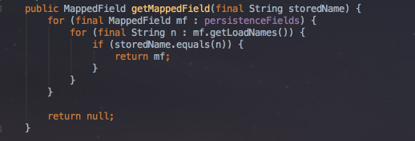

[IntelliJ 블로그](https://blog.jetbrains.com/idea/2017/08/code-smells-null/)에 올라온 시리즈물을 번역 & 재정리 하였습니다. 


# 2. Code Smells: 심하게 중첩된 코드

악취나는 코드 개선하기 시리즈를 계속 진행하며, 이번 포스트에서는 명백한 리펙토링을 거부하는 천진난만한 코드를 살펴 보려고 합니다.  
  
코드 예제 자체는 매우 사소한 것이지만 실제로는 이 특정 프로젝트에서 반복적으로 발견되는 문제의 증상입니다.  
즉 **코드의 중첩**입니다.  
이것은 loop문, if 문, 심지어 람다 표현식 또는 내부 클래스, 또는 위의 모든 것의 조합 일 수 있습니다.  

## The Smell: Deeply Nested Code 

먼저 발견한 문제있는 코드는 내부 if 문이있는 double for 루프입니다.



(```MappedClass```의 메소드)  
  
이 코드의 문제점은 무엇입니까?  
**단일 문자 변수 이름(```mf, n```)를 관대하게 봐줄수 있고**, **절차적 방식으로 작업하는 데 익숙**하다면 괜찮습니다.  

* 모든 필드를 살펴본 다음 
  * ```for (final MappedField mf : persistenceFields)```
* 각 필드에 대해 모든 이름을 살펴보고
  * ```for (final String n : mf.getLoadNames())```
* 이름이 우리가 찾고있는 이름과 일치한다면 
  * ```if (storedName.equals(n))```
* 우리는 그 필드를 반환합니다.
  * ```return mf```

단순하죠?

### Solution 1: Java 8 구조

여기서 코드의 아름다운 화살표 모양은 사용하기에 의심스러운 점들이 있습니다.([Arrow Anti Pattern 참고](http://wiki.c2.com/?ArrowAntiPattern))  
  
이전의 [블로그](https://blog.jetbrains.com/idea/2016/12/intellij-idea-inspection-settings-for-refactoring-to-java-8/) 와 [대화](https://www.youtube.com/watch?v=2xOtyGUTpQU&feature=youtu.be)에서 중첩 된 for / if 문은 종종 Java 8 Streams로 대체 될 수 있으며 이는 종종 더 나은 가독성을 제공한다는 것을 보여드렸습니다.  
  
IntelliJ IDEA가 이 코드를 Stream 작업으로 개선 할 수 있다고 제안하지 않는 이유가 궁금한데, 아마도 그 이유는 ```flatMap/findFirst``` 때문일것 같습니다.  
그러나 그렇게 간단하지는 않습니다.  
저는 IDE에서 자동적인 도움없이 다음과 같이 코드를 개선해봤습니다.


