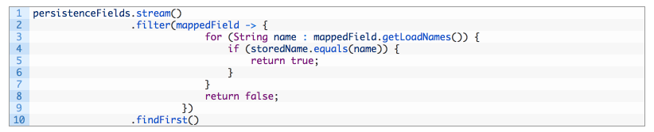
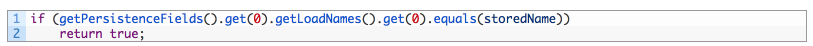
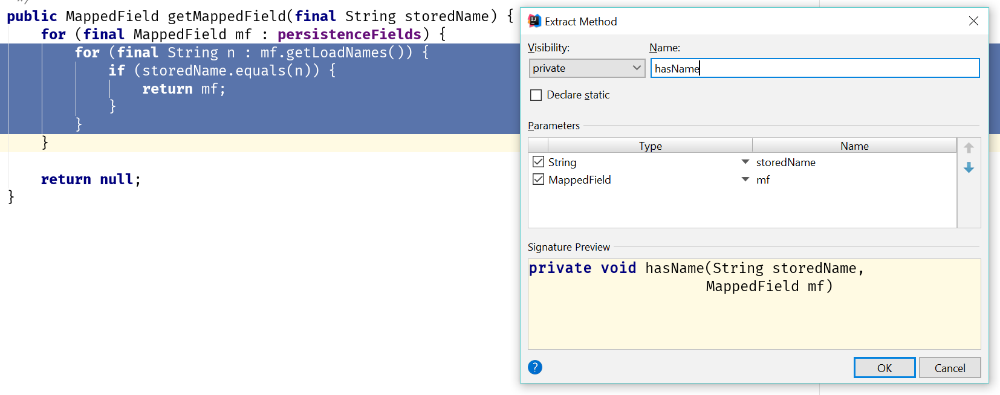
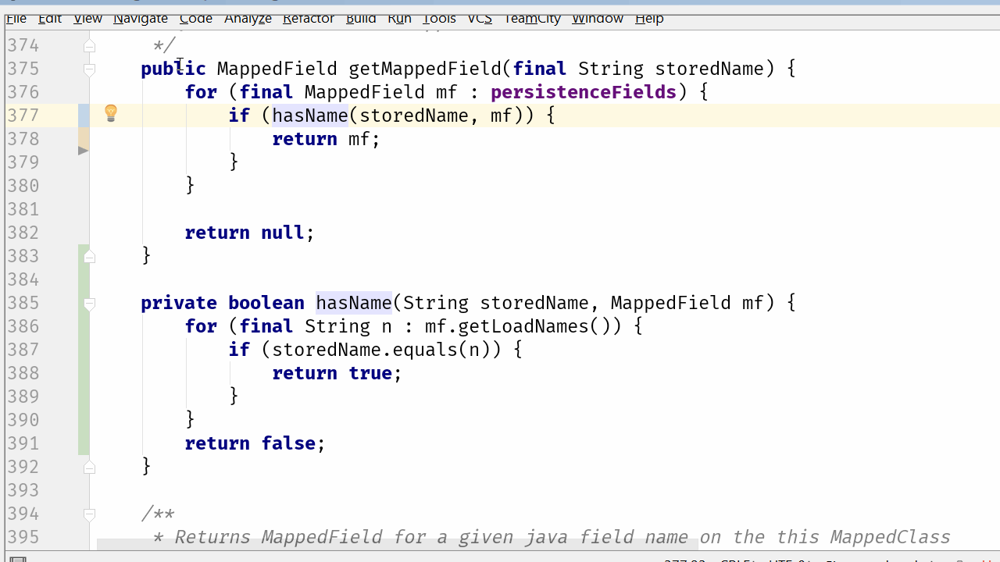
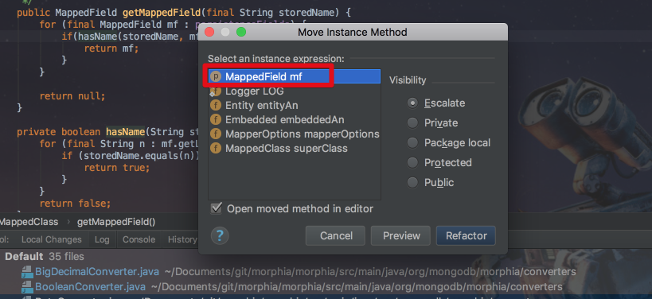
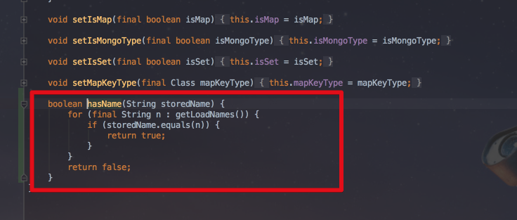
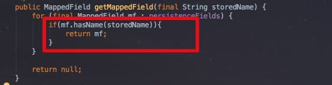
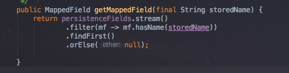

[IntelliJ 블로그](https://blog.jetbrains.com/idea/2017/08/code-smells-deeply-nested-code/)에 올라온 시리즈물을 번역 & 재정리 하였습니다. 


# 2. Code Smells: 심하게 중첩된 코드

악취나는 코드 개선하기 시리즈를 계속 진행하며, 이번 포스트에서는 명백한 리펙토링을 거부하는 천진난만한 코드를 살펴 보려고 합니다.  
  
코드 예제 자체는 매우 사소한 것이지만 실제로는 이 특정 프로젝트에서 반복적으로 발견되는 문제의 증상입니다.  
즉, **코드의 중첩**입니다.  
이것은 loop문, if 문, 심지어 람다 표현식 또는 내부 클래스, 또는 위의 모든 것의 조합 일 수 있습니다.  

## The Smell: Deeply Nested Code 

먼저 발견한 문제있는 코드는 내부 if 문이있는 double for 루프입니다.


(```MappedClass```의 메소드)  
  
이 코드의 문제점은 무엇입니까?  
**단일 문자 변수 이름(```mf, n```)를 관대하게 봐줄수 있고**, **절차적 방식으로 작업하는 데 익숙**하다면 괜찮습니다.  

* 모든 필드를 살펴본 다음 
  * ```for (final MappedField mf : persistenceFields)```
* 각 필드에 대해 모든 이름을 살펴보고
  * ```for (final String n : mf.getLoadNames())```
* 이름이 우리가 찾고있는 이름과 일치한다면 
  * ```if (storedName.equals(n))```
* 우리는 그 필드를 반환합니다.
  * ```return mf```

단순하죠?

### Solution 1: Java 8 구조

여기서 코드의 아름다운 화살표 모양은 사용하기에 의심스러운 점들이 있습니다.([Arrow Anti Pattern 참고](http://wiki.c2.com/?ArrowAntiPattern))  
  
이전의 [블로그](https://blog.jetbrains.com/idea/2016/12/intellij-idea-inspection-settings-for-refactoring-to-java-8/) 와 [대화](https://www.youtube.com/watch?v=2xOtyGUTpQU&feature=youtu.be)에서 중첩 된 for / if 문은 종종 Java 8 Stream으로 대체 될 수 있으며 이는 종종 더 나은 가독성을 제공한다는 것을 보여드렸습니다.  
  
IntelliJ IDEA가 이 코드를 Stream 으로 개선 할 수 있다고 제안하지 않는 이유가 궁금한데, 아마도 그 이유는 ```flatMap/findFirst``` 때문일것 같습니다.  
그러나 그렇게 간단하지는 않습니다.  
저는 IDE에서 자동적인 도움없이 다음과 같이 코드를 개선해봤습니다.


음.. 이건 좋지 않은것 같습니다.  
저는 **```Optional```로 Wrapping된 name 값이 아닌, name을 갖고 있는 ```mappedField```를 리턴**하고 싶습니다.  
그리고, 나중에라도 Stream에 있는 ```mappedField```를 가져올 수도 없습니다.  
제가 할 수 있는 최선의 방법은 다음과 같습니다.



으악! 추잡합니다

### Solution 2: 보다 나은 캡슐화

여기서 진짜 문제가 뭘까요?  
지금의 코드는 **다른 오브젝트 내부 깊숙이 들어가 모든 데이터를 가져오고, 그것을 통해 반복적으로 이동한 다음, 최상위 오브젝트만 다루는것**처럼 보입니다. 
이럴때는 루프 구문을 제거하면 효과적입니다.



이는 [데메테르의 법칙](https://en.wikipedia.org/wiki/Law_of_Demeter)이 경고하는 내용이니, [물어보지 말고, 말하라(Tell, Don't Ask)](https://martinfowler.com/bliki/TellDontAsk.html) 방법을 제안하고 싶습니다.  
```mappedField```의 name이 우리가 원하는 값과 일치하는지 **묻는 것이 더 낫지 않을까요?**  
  
아래와 같이 조건문을 메소드로 추출하겠습니다.


```mappedField```가 우리가 원하는 name을 갖고 있는지는 ```mappedField```만 알고 있으면 됩니다.  
바깥의 클래스에서 굳이 갖고 있는지 아닌지에 대해 비교하고 판단할 필요가 없습니다.  
그래서 이 부분은 ```mappedField```가 책임을 가지도록 변경하겠습니다.  
이 리팩토링을 수행하는 한 가지 방법을 단계별로 설명해 보겠습니다.  
당연히 여러 접근법이 있기 때문에 이것은 단지 하나의 예입니다.  
  
첫째, 내부 for문을 별도의 메서드로 추출합니다.  
이 경우엔 다음과 같이 ```hasName```란 이름의 메소드로 진행합니다.



(Extract Method: ```option+command+m```)  
  
추출된 메소드는 void 형이지만, 코드에선 ```return mf;```을 하고 있으니 컴파일은 되지 않습니다.  
그래서 이 부분을 filter처럼 찾고자하는 name과 일치하면 true, 그렇지 않으면 false를 리턴하도록 변경합니다.


```return mf;```에서 ```mf```를 ```true```로 수정합니다.  
그리고 show intention action(```option+enter```)를 사용하여 ```Make 'hasName' return 'boolean'```를 선택합니다.  
  
그리고 원래 메소드에서 이 반환값을 사용하도록 수정하겠습니다.


코드는 이제 컴파일되고, 원본과 동일한 방식으로 작동합니다.  
이제 ```hasName```메소드를 ```MappedField```클래스로 옮겨야 합니다.



(역자: gif가 빨라 못보실분들을 위해 아래 이미지로 첨부합니다.)

```if(hasName(storedName, mf)){...}```에서 ```hasName```메소드에 포커스를 두고, move (```F6```) 를 실행합니다.  
그럼 아래와 같이 Move Instance Method 창이 등장합니다.



```MappedField mf```를 선택하고 ```Refactor```를 클릭합니다.  
그럼 아래와 같이 ```MappedField```로 메소드가 이동합니다.  



```command + [```를 사용하여 바로 전 포커스 화면으로 이동해보시면 깔끔하게 ```mf.hasName``` 메소드를 사용하는 코드로 변경된 것도 확인할 수 있습니다.



이제 ```MappedField```는 ```hasName```메소드를 가지게 되었습니다.  

```getMappedFieldmethod```는 더이상 ```MappedField```의 내부 구조를 알고 있어야할 필요가 없으며, 다른 클래스 혹은 메소드에서 동일한 기능이 필요할때면 **```MappedField```에 원하는 name값이 있는지에 대해서는 ```MappedField```가 직접 판단하다록 시키면 됩니다**!

### 선택적 추가 단계: Java 8

원하는 경우 이 메소드들 모두 Java8의 stream을 사용할 수 있습니다.  
특히 ```hasName```은 더 설명하기가 쉽습니다.  
```name```이 일치하는 경우에만 신경쓰겠습니다.


```getLoadNames()```에 포커스를 두고 show intention action (```option+enter```)를 사용하여 ```Replace with anyMatch()```를 선택합니다.


그럼 이렇게 깔끔하게 stream 형태로 변경됩니다.  
  
한편, ```getMappedField```에서도 Java8의 장점을 받을 수 있습니다.  
바로 위와 마찬가지로 ```persistenceFields```에 포커스를 두고 ```option+enter```를 실행합니다.


결과는 아래와 같은 형태가 됩니다.



### 마지막 단계, 이 냄새나는 코드와는 무관하지만!

저는 이전 글에서 ```Optional```을 리턴할 수 있는 상황에 대해 설명했지만, 적절한 예제를 찾지 못했습니다. 이 예제가 아주 좋은 후보인것 같습니다.
```storedName```과 일치하는 값이 없는 경우에는 ```null```을 리턴하고 있습니다.  
  
이제 Java8 문법을 사용하니, 아주 쉽고 명확하게 ```Optional```을 사용할 수 있습니다.


저희가 해야할 일은 이제 이 메소드를 호출한 곳에서 ```Optional``` 리턴 타입을 다룰수 있도록 변경하는 것입니다.  
하지만 이것은 다른 블로그의 주제이니 Pass..


### 요약

Java와 같은 언어에서는 루프와 if 문이 여러 곳에 중첩되어있는 것을 볼 수 있습니다.  
이러한 종류의 코드는 저수준 데이터 구조 (배열, 컬렉션 등)를 조작하는 데 완벽하게 사용될 수 있지만 (특히 Java8 이전의 코드에선 더욱), 중첩이 매우 깊어지면 **도메인 코드에서 볼 때 악취가 나는게 아닌지 의심**해봐야 합니다.  
  
우리의 예에서, 비록 ```MappedClass```가 ```MappedField```에 대해 알고 있어야 하지만, 더이상 ```MappedField```의 내부를 알아야 할 필요가 없고, 그것은 **```MappedField```가 스스로 질문에 대답해야 합니다**.

조짐:

* 깊이 중첩 된 코드, 일반적으로 루프 and/or 조건문
* 계속 연결되어 호출되는 모든 getter 메소드 (chain method) (또는 빌더가 아닌 비 DSL 메소드 체인)

가능한 해결책:

* 묻지마세요. 
  * 코드가 내부 데이터를 가져 와서 체크를 하는 경우, **해당 체크를 데이터가 들어있는 객체로 옮기고** 유용한 이름으로 메소드를 작성하여 다른 객체가 해당 객체에게 명령을 내릴 수 있도록 하세요

* 캡슐화를 검사하세요. 
  * 데이터가 다른 클래스에 노출 될 필요가 있나요? 
  * 데이터에 대한 작업이 꼭 데이터를 다 호출해서만 사용할 필요가 있을까요?

* [컬렉션 캡슐화](https://martinfowler.com/bliki/EncapsulatedCollection.html)
  * 때때로 이 패턴은 **데이터 구조를 도메인 객체로 사용한다는 신호**입니다.
  * 이 데이터 구조 (Collection, array 등)를 자체 도메인 객체 내에 캡슐화하고 다른 객체가 내부 객체를 훑어보기보다는 질문을 하도록 **헬퍼 메소드를 추가하는 것을 고려**해보세요.