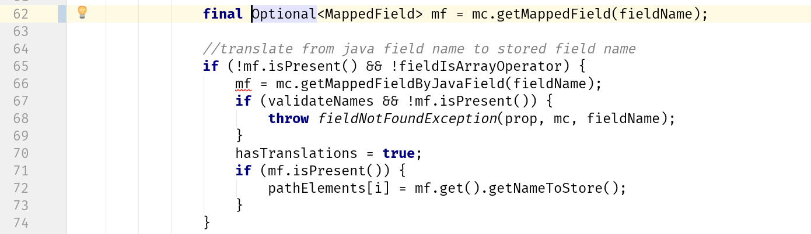
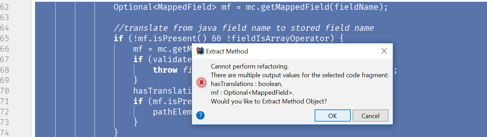
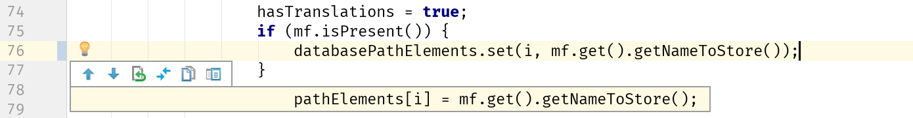
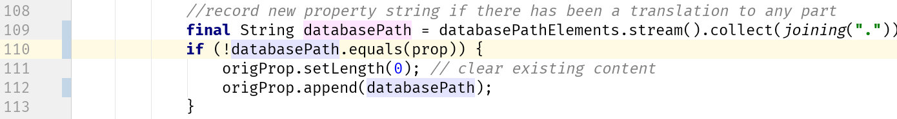
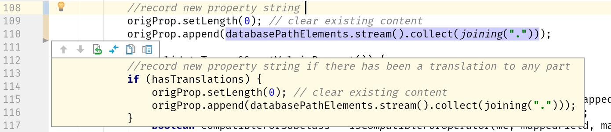
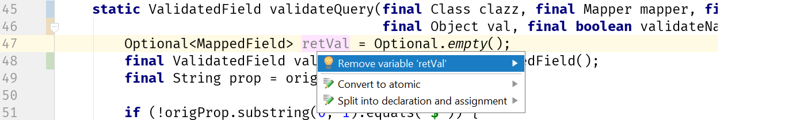
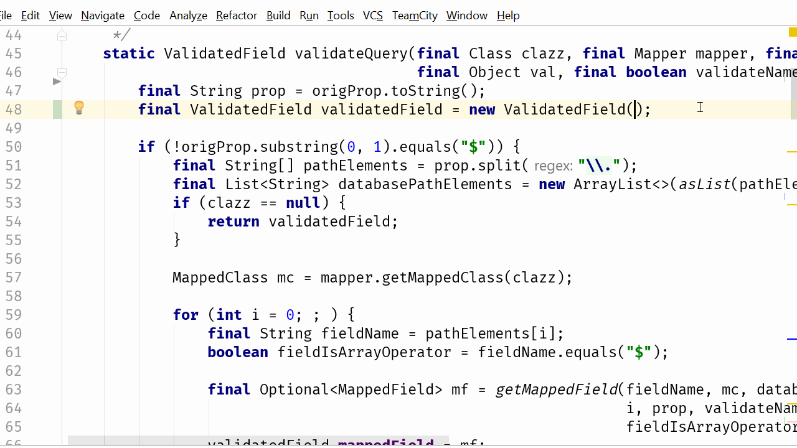
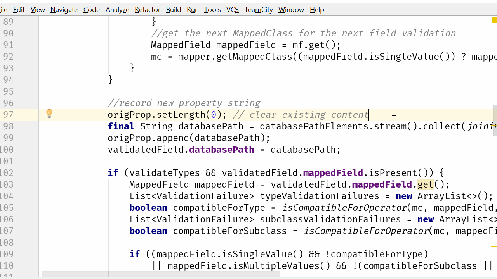
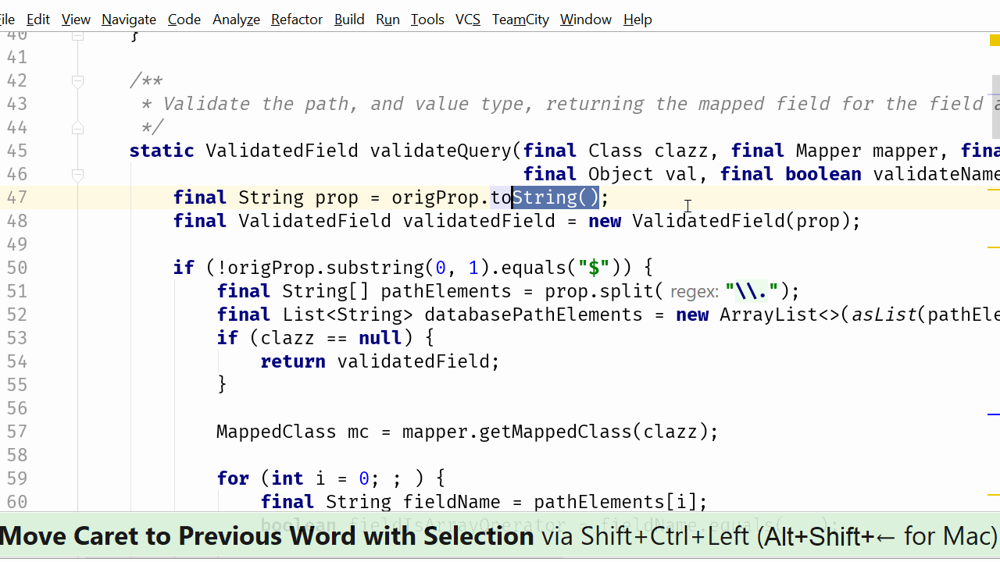

[IntelliJ 블로그](https://blog.jetbrains.com/idea/2017/08/code-smells-iteration/)에 올라온 시리즈물을 번역 & 재정리 하였습니다. 


# 4. Code Smells: 값의 가변성 (변경가능한 값)

[심하게 중첩된 코드](http://jojoldu.tistory.com/177)글에서 저는 ```getMappedField``` 메소드의 리턴 타입을 ```Optional```로 변경하고 싶었습니다.  
변경자체는 굉장히 사소한 일이지만, 그 메소드를 호출하는 코드들의 변경은... 음 또다른 문제였습니다.  
  
 ```QueryValidator```클래스의 ```validateQuery```메소드는 여러 호출자 중에서 예상했던 것보다 훨씬 더 복잡한 메소드였습니다.  
 ```getMappedField```를 ```Optional```로 변경하려고 할때, 놀라울 정도로 많은 Null 체크 코드를 ```isPresent```로 변경했습니다.


이게 전부가 아닙니다.  
이 메소드는 거의 100라인이라 1개의 캡쳐화면에 전부 담을수가 없었습니다. (이것 역시 다른 글의 주제가 될 예정입니다.)  
**```Optional```은 전혀 Null 체크 문제를 해결하지 못할뿐더러, 체크 코드의 추가와 관련된 것을 가져오는 것까지 더해져 코드를 더 흉측하게** 만들어버린다는 것에 저는 짜증이 났습니다.  
그러나 이것은 더 근본적인 문제의 징후였습니다.

### 냄새: 가변성

이 메소드는 1개 이상의 악취가 나기에 충분할만큼 긴 코드를 가졌습니다.  
이번 글에서 저는 얘기했던대로 첫번째 이슈에 초점을 맞추겠습니다.  
  
 ```mf```는 **변수**입니다.  
이것은 가변적인 값이며 어떤 경우엔 재할당되기도 합니다.  
만약 ```mf```가 final로 만든다면 아래와 같은 코드가 됩니다.



만약 ```getMappedField``` 메소드가 값을 리턴하지 않는다면 mf는 ```getMappedFieldByJavaField```를 통해 값을 할당받아야 합니다.  
  
이 글을 보고 계신 분들은 이 특정 코드의 문맥에 대해 명확하게 알고 있지 않다고 가정하지만, 솔직히 말해서 저 역시 이 프로젝트를 몇년 동안 계속해서 해왔지만 그 중 무엇을 하고 있는지 이해하지 못합니다.  
  
이것이 개발자가 되는 것입니다.  
코드를 작성하기가 어렵고, 코드를 읽는 것은 더 어렵습니다.  
  
어쨌든,  
  
요점은 **```mf```의 값은 변경되고 있으며, 이로 인해 추론하기가 더욱 어렵습니다.**  
예를 들어 코드의 뒷부분에서 값을 검사 할 때 값이 비어 있으면 ```getMappedField```가 값을 반환하지 않았거나, ```getMappedFieldByJavaField```가 값을 반환하지 않았기 때문에 ```mf```값이 비어 있는지 알 수가 없습니다.  
값이 비어있지만, **비어있다는 것이 무엇을 의미하는지 알수 없다는 것**입니다.  
  
이 특별한 문제는 해당 로직을 이동시키고, 유용한 변수명으로 값을 재할당을 하는 등으로 해결할 수 있을것 같습니다.  
그러면 변수가 무엇인지, 그리고 왜 그것이 존재할 수도 있고 존재하지 않을 수도 있는지에 대해 작은 아이디어를 얻을지도 모릅니다.  
  
IntelliJ IDEA에서 이 코드를 메소드로 추출하면 ...



(```command+option+m```)  
  
이렇게 **변경 가능한 1개 이상의 값**들이 있어 수행할 수 없습니다.  
  
여기서는 ```pathElements```배열 내부의 값을 수정하고 있습니다.  
우리가 이 배열을 파라미터로 전달하고 메서드에서 변경할 수 있기 때문에 이것이 리팩토링을 막을수는 없지만 이 값을 변경하는 데는 문제가 있습니다.  
  
메소드를 추출할 수 없는 수정은 특정 상황에서 ```hasTranslations``` 플래그가 true로 될 경우입니다.  
 true로 설정된 경우 다른값을 수정해야 합니다.


이 코드를 좀 더 자세히 살펴보면 아래 내용이 궁금하게 됩니다.

* ```origProp```의 값을 변경하는 것일까요? 
  * 변경후에 더이상 원래의 속성이 유지되지 않습니다.

* 왜 ```StringBuilder```를 재사용하고 재설정할까요? 
  * 새로운 String 값을 사용하거나 일부 도메인 객체에서 String 값을 설정하는 것보다 더 이상한 일처럼 보입니다.

 ```StringBuilder``` 이 코드가 의도적으로 파라미터 값을 변경하기 때문에 변경하려고 합니다.  
 이 코드는 길고 복잡한 메서드 내에서 **상태를 설정하기 위해 가변성을 많이 사용**할 뿐만 아니라 **Java가 다중 출력 값을 지원하지 않기 때문에 파라미터의 값을 실제로 변경**합니다.  
 이는 괜찮은 절충안으로 보입니다.  
 (참고 : 이렇게 생각하시면 안됩니다.)  
   
  
값의 가변성으로 인해 발생하는 문제를 요약하면 다음과 같습니다.

1. ```mf```의 가변성으로 인해 **뒤에 있는 복잡한 논리를 추론하기가 어렵**습니다.

2. 메소드에서 **나중에 사용할 boolean 플래그 값을 설정**하면 코드 섹션을 보다 읽기 쉬운 작은 메소드로 추출하는 것이 매우 어려워집니다.

3. 파라미터 값을 변경하면 해당 메서드는 복잡해지고, 메소드의 호출자는 높은 확률로 놀라게 됩니다. - 일반적으로 파라미터 값을 메서드에 전달할 때 **파라미터 값이 변경되는 것을 기대하지 않습니다**.

저희는 이런 상황에서 리팩토링하기가 매우 어렵고 길고 복잡하며 이해하기 어려운 메소드를 가지고 있습니다.  
그리고 이것은 이 코드에서 변경 가능성 냄새를 보고있는 것입니다.  
  
유사하지만 관련이 없는 예제를 보여준 이전 글과 달리 이 글의 리팩토링 제안은 순서대로 수행해야하는 일련의 단계로 이루어집니다.  
이 단계는 처음 시도한 것이 아닐 수 있지만 (시도한 첫 번째 아이디어가 아닐 수 있습니다), 한 번에 하나의 작은 문제를 해결하고 코드에 가능한 한 적은 영향을 미치려고 합니다.

[[ad]]

### 1 단계 : 반복되는 배열의 변형을 중지합니다.

우선 해결해야할 첫 번째 문제는 ```pathElements``` 배열의 가변성입니다.  
 ```pathElements```의 값을 변경하는 코드를 제거함으로써, 저는 다음과 같은 내용을 기대합니다.

1. 배열, Collection을 변경하는 다소 불쾌한 냄새 제거
2. ```hasTranslations``` 플래그의 필요성 제거 

2번째 기대는 이 막대한 코드 중 일부를 간단한 방법으로 추출하여 **```mf```변수의 가변성을 간단하고 단순한 방법으로 제한**하는 데 도움이됩니다.  
  
먼저 새 값을 저장하기 위해 원래의 객체를 변경하는 대신 새 값을 저장하는 다른 객체를 소개합니다.  
여기서 저는 ```List```를 선택하겠습니다.  
콜렉션을 사용하기를 좋아하고, Streams는 나중에 이 메소드에서 사용할 좋은 기능을 제공하기 때문입니다.  
저는 문자열 배열을 쉽게 선택했는데, 이는 완전히 개인적인 선택입니다.  
(성능을 위해 가독성을 거래 할 수 있습니다. 이는 사용자 코드에 따라 선택하시면 됩니다.)


원본 ```pathElements```배열이 만들어진 같은 위치에 이 컬렉션을 만들고 초기화합니다.  
동일한 값으로 초기화 할 것입니다.  
  
다음으로 ```pathElements```을 변경한 곳에서  ```databasePathElements```의 값을 변경하려고 합니다.  
지금은 코드가 깨지는 것을 최소화하기 위해 두 가지 변경을 계속 수행하겠습니다.


마지막으로, ```pathElements``` 대신에 ```databasePathElements```를 사용하여 ```StringBuilder``` ```origProp```의 새 값을 설정합니다.  


Java 8에서 가장 좋아하는 기능 중 하나인 ```Collectors.joining```를 사용했습니다.  
이렇게하면 5줄의 코드가 한 줄로 대체되었으므로 CSV 내용을 생성하거나, 콜렉션을 ```.```으로 구분 된 문자열로 변환하는 데 정말 유용합니다.  
이 메소드의 성능은 원래 코드와 다를 수 있으며 (추가로 우리는 배열 대신 콜렉션을 사용합니다), 따라서 나노 초 성능이 중요하다면 성능 테스트를 수행해야합니다.  
대부분의 어플리케이션에서 그 영향은 미미할 것으로 예상하고 새로운 구문은 반복적으로 사용되는 코드를 줄입니다.  
  
모든 테스트를 실행하면 모든 것이 여전히 통과됩니다.  
다시 돌아가서 ```pathElement```변경된 코드를 제거합니다.  
(IntelliJ IDEA의 라인넘버가 있는 곳의 파란색 영역을 클릭하여 이전 코드와 새 코드를 비교했습니다.)



테스트를 다시 실행하면 이전과 마찬가지로 모든 작업이 수행되는 것을 볼 수 있습니다.  
  
이것은 약간의 변화이며 오류의 가능성을 최소화하기 위해 이 메소드의 내부에만 영향을 미치도록 제한했습니다.  
약간 무의미해 보일지 모르지만 이 메소드의 복잡성을 줄이는 1단계입니다.

[[ad]]

### 2 단계 : hasTranslations 플래그 제거

이 플래그는 더 작은 메소드로 추출하려고 할 때 여러 가지 문제를 일으킵니다.  
한 가지 방법은 원래 path와 새 path 사이를 검사하여 **변경된 시점을 기록하는 대신 변경되었는지 확인하는 것**입니다.



이것은 단순한 boolean 체크보다 더 많은 비용이 드는 체크 (성능면에서)입니다.  
String 비교를 할뿐만 아니라, 사용할지 여부에 관계없이 새로운 ```databasePath``` String을 만들어야합니다.  
필요로 하지 않는다면 새로운 String을 만들지 않고도 원래의 boolean이 거기에 있다고 가정한다.
그것을 필요로 하지 않는다면 새로운 문자열을 생성해야한다는 것을 원래의 boolean을 보고 가정하겠습니다.  
(테스트나 문서가 없으므로 추측하고 있습니다).  
따라서 현재 이 최신 버전의 코드에는 어떠한 진짜 값들도 없는 것 같습니다.  
  
현재 프로젝트인 Morphia가 a) java.lang.reflect를 광범위하게 사용하고 b) 네트워크를 통해 데이터베이스에 접근하도록 설계되었으므로 nano초 단위의 CPU 성능이 가장 큰 관심사는 아닙니다.  
또한 코드의 이 부분에 대한 성능 테스트 / 성능 기준이 없기 때문에 경영진이 의사 결정을 내리고 ```databasePath```가 다른지 여부에 관계없이 항상 값을 업데이트 할 것입니다.  
**성능에 미치는 영향은 미미**할 것으로 예상되며 **가독성에 미치는 영향은 매우 긍정적**입니다.  
  
그래서 체크 코드를 제거하겠습니다.



그리고 이제 플래그를 제거할 수 있습니다.


모든 테스트를 다시 실행하면 모든 것이 여전히 작동함을 알 수 있습니다.

[[ad]]

### 3 단계 : Extract Method

이제 이 플래그를 제거하고 업데이트 된 database path를 저장하기 위해 새 Collection을 도입했습니다.  
 ```MappedField mf```의 가변성 범위를 줄이고, 쉽게 추론 할 수 있도록 메서드로 추출하겠습니다.


(Extract Method :```command+option+m```)  
  
특별히 좋은 방법은 아니지만 많은 파라미터가 필요하지만 나중에 간단하게 작성할 수 있습니다.  
지금의 초점은 **가변성을 제한하고 매우 긴 메소드를 추론하기 쉽도록 만드는 것**입니다.  

### 4 단계 : 새로운 타입 소개

다음으로 파라미터 중 하나의 값을 바꾸는 냄새를 해결하고 싶습니다.  
둘 이상의 값을 반환해야하는 경우 **반환되는 객체의 구조를 변경하거나 모든 반환 값을 캡슐화하는 새로운 타입을 반환**해야합니다.  
  
어떤 방식을 사용할지 결정하기 위해 우리가 이야기하는 값들에 대해 생각해볼 필요가 있습니다.  
(그 값들이 무엇인지, 어디에 존재해야할지, 그들과 연관된 데이터들은 무엇인지 등등)  
  
이 메소드의 두 반환 값 ```MappedField```은 원래 리턴 타입인 MongoDB 데이터베이스에서 이 필드의 path를 나타내는 ```String``` 값입니다.  
리턴된 ```MappedField```가 null이지만 database path는 항상 존재한다는(쿼리의 일부이기 때문에 항상 가질 수 있습니다.)  간단한 이유 때문에 database 이름을 저장하는데 ```MappedField```에 새로운 값을 추가 할 수 없습니다.  
  
따라서 문제를 해결하는 가장 간단한 방법은 기존의 리턴값인 ```MappedField```과 database path를 나타내는 ```String```값을 랩핑하는 ```ValidatedField```라는 새로운 타입을 리턴하도록 메서드를 변경하는 것입니다.  
이 단계에서 가장 좋은 해결책은 아니지만 메서드의 현재 상태를 보면 a) 메서드를 단순화하는 모든 것이 개선 되고, b) 나중에 리팩터링 할 때 이 메서드를 사용할 수도 있고, 또는 도메인 개념에서 놓친 것임을 찾을 지도 모릅니다.  
(나중에 진정한 목적이 무엇인지 알게되면 이름을 바꿀 수 있습니다).  
  
제일 먼저 ```MappedField```를 감싸는 새로운 유형을 소개하겠습니다.  
지금 당장 내부 클래스를 사용할 것이고, 나중에 그 클래스가 어디에 있는게 좋을지 명확해지면 리펙토링 할 수 있습니다.  
비록 일반적으로 권장되지는 않지만, 저는 Optional 필드를 사용할 것 입니다.  
리팩토링은 좀 더 직관적일 것이고, 나중에 이 문제를 언제든지 해결할 수 있습니다.


 ```retVal```은 이제는 사용하지 않기 때문에 제거 할 수 있습니다.



새로운 타입인 ```ValidatedField```을 리턴하도록 메서드를 변경했습니다.  
그래서 이 컴파일 오류를 수정해야합니다.  
기존 메서드를 호출하는 곳이라면 어디에서나 ```MappedField``` 타입을 기대할텐데, 이를 ```ValidatedField```로 변경합니다.


지금은 간단하게 새로 만든 ```ValidatedField```에서 ```MappedField```를 가져오는 방식으로 진행했습니다.  
모든 테스트를 다시 실행하면 예상대로 작동합니다.

### 5 단계 : 파라미터를 변경하는 대신 database path 값 반환

다음 단계는 ```StringBuilder``` 파라미터 값을 변경하는 것을 그만하기 위해 ```ValidatedField``` 객체에 database path를 추가하겠습니다.  
  
먼저 ```ValidatedField```에 database path 필드를 추가합니다.


저는 아직 이전 코드를 제거하지 않을 것이고, 새로운 값을 먼저 사용하도록 할 것입니다.  
[Find Usages](https://www.jetbrains.com/help/idea/find-usages.html) (```Alt + F7```)를 사용하여 이 메소드의 모든 호출자를 찾았으며, ```origProp``` 파라미터를 사용하는 곳들은 모두 새 ```databasePath``` 필드를 사용하도록 변경되어야합니다.


테스트를 다시 실행하면 한가지 놓친 과정을 발견하게 됩니다.  
 ```ValidatedField```의 databasePath를 설정하는 코드가 모든 경우에 항상 진행되는 것이 아니므로 모든 경우에 값을 초기화하도록 수정해야합니다.



테스트를 실행하면 모든 것이 제대로 작동함을 알 수 있으며, 이제 코드를 이해하기 쉽게 정리할 수 있게 되었습니다.  
변경된 ```origProp``` 파라미터 코드를 삭제하겠습니다.



(Inline : ```command+option+n```)  
  
이제는 더이상 ```String``` 파라미터를 효과적으로 변경하기 위해 ```StringBuilder```를 더럽게 사용하지 않고, 직접 ```String```으로 변경할 수 있습니다.  



마지막으로 ```origProp```에 대한 모든 참조를 깔끔하게 정리하고 변경한뒤, 파라미터를 삭제할 수 있습니다.


(단어별 이동: ```option+shift+->/<-```)  
  
우리는 또한 모든 호출 코드를 검사해야합니다.  
아마도 많은 ```StringBuilder```생성을 삭제할 수 있습니다.


[[ad]]

### 요약

이 모든 과정이 끝나면 ```validateQuery``` 메서드가 조금 더 작아집니다.  
처음엔 93 줄의 코드였고, 이제는 74 줄입니다.  
가변값들이 코드에 복잡성을 더한 부분에만 초점을 맞추어 이 단순화를 달성했습니다.

* ```pathElements``` 배열의 값이 계속 변하는 것(가변성)을 멈추고, ```databasePathElements``` collection을 도입 했습니다. 
  * 이것은 더 이상 이 배열이 변경하지 않음을 의미했습니다. 
  * Java 8 스트림 기능을 사용하여 **자체 반복을 수행하는 대신 최종 database path를 생성** 할 수 있다는 점이 좋은 보너스 효과입니다. (참고: 기존 코드보다 성능상 이점은 없지만, 이 어플리케이션 전체 맥락에서 중요한 요소가 아닙니다.)
* ```hasTranslations``` 플래그를 설정하는 것을 중지 했으므로, 이제 ```MappedField``` ```mf```의 값을 변경하는 것을 별도의 메소드로 이동할 수 있게 되었습니다. 
  * 이 로직을 자체 메서드로 옮기는 것이 더 큰 메서드를 단순화하는 주요 원인 중 하나이지만 여전히 작은 단계이며 추가 리팩터링의 이점을 누릴 수 있습니다.
* 메서드에서 여러 값을 리턴 할 수 없는 파라미터 값을 변경하는 것을 중지했습니다. 
  * **리턴값 (```mappedField```, ```databasePath```)을 모두 랩핑하기 위해 새로운 타입을 도입**함으로써 이를 달성했습니다.
  * 이 변경으로 메소드의 복잡성이 약간 줄어들었고 메소드를 호출하는 곳에서 코드를 제거 할 수 있었지만, **추가 리팩토링을 위한 영역이 될 가능성**이 큽니다.

원래 코드는 하나 이상의 냄새가 났습니다.  
가변적인 값에 의한 문제에 초점을 맞춤으로써 코드를 이해하기 쉽게 만들었습니다.  
물론 여전히 값과 데이터 구조를 변경해야한다는 것을 알게 되겠지만, 이번에 시도한 a) 가변성을 더 작고 더 쉬운 것으로 제한하고, b) 변경된 값을 확인하거나 업데이트 된 것은 놀랄만한 것이 아닙니다.

조짐

* 변수 재할당
* 새로운 값을 유지하기 위해 변경된 파라미터
* 내용을 변경하기 위해 전달된 Primitive wrapper 클래스 (```Boolean```, ```Integer```등) 또는 다른 wrapper (예: ```StringBuilder```) .
* 여러 Primitive 값이 업데이트되어 더 작은 메서드를 추출하기가 어렵거나 불가능한 상황.

가능한 해결책

* 이미 값이 채워진 배열 또는 collection을 변경하는 경우, **변경 내용을 추적하고 초기값을 남기기 위해 두 번째 배열 또는 collection을 고려**하는 것이 좋습니다.  
  * 같은 collection을 읽고, 쓰는것은 (특정 예제에서는 안전하지만) 예상치 못한 결과와 동시성 문제가 발생할 수 있습니다.

* 특정 코드의 값이 어떤 분기 코드에서 왔는지 알기 어렵다면, 변수를 다시 사용하는 대신 **읽을 수 있는 이름으로 값들을 저장**하거나, 값을 변경하는 코드를 별도의 메소드로 이동하여 **변경 사항을 작은 코드 범위로 제한**하세요.

* 파라미터 변수가 변경되는 경우, 리턴되어야하는 모든 데이터가 포함되도록 리턴되는 오브젝트에 새 값을 추가하는 것을 고려하세요.
  * 이것이 가능하지 않은 경우, 모든 리턴 값을 래핑하기 위해 새 타입을 도입하는 것이 좋습니다.

* **Count 또는 boolean primitive는 메서드 내에서 상태를 추적하는 가장 좋은 방법이 아닙니다**. 
  * 그것들을 제거하거나 적절한 도메인 클래스로 옮기면 코드를 더 간단하게 리팩토링하거나 코드를 쉽게 작성할 수 있습니다.