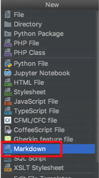

### IntelliJ에서 원하는 파일 템플릿 추가하기
안녕하세요 이번시간에는 IntelliJ에서 지원하지 않는 파일 타입을 기본 파일 템플릿에 추가하는 방법을 소개하려고 합니다.   
(공부한 내용을 정리하는 [Github](https://github.com/jojoldu/blog-code)와 세미나+책 후기를 정리하는 [Github](https://github.com/jojoldu/review), 이 모든 내용을 담고 있는 [블로그](http://jojoldu.tistory.com/)가 있습니다. )<br/>

예를 들어 저같은 경우 마크다운 파일에는 항상 제 Github주소와 블로그 주소를 상단에 작성하고 있습니다.  
헌데 마크다운 파일을 생성할때마다 **매번 이 텍스트를 복사**하는게 너무나 귀찮다고 느끼게 되었습니다.  
또, 파일 생성시에 **마크다운 형식이 없어** File -> 이름.md로 생성하다보니 md가 오타가 나서 재생성하는것도 불편하게 느껴졌습니다.  
그래서 이 귀찮음을 한번 해결해보겠습니다.  

### 설정
방법은 아주 간단합니다.  
IntelliJ에는 커스텀 파일 확장자와 템플릿을 추가할 수 있도록 지원하고 있어 이를 이용할 계획입니다.  
File -> Other Settings -> Default Settings -> 검색창에 **file template**을 입력 -> File and Code Templates -> + 버튼을 눌러 원하는 파일 확장자와 파일 생성 리스트에 노출할 이름을 지정합니다.  
이 모든 내용은 아래 사진과 함께 보시면 이해하기 쉽습니다.  

  

저 같은 경우 마크다운 파일을 추가할 것이기에
* Name은 Markdown
* Extension은 md
* 파일 헤더에는 ```#프로젝트이름```, 매번생성하던 텍스트를 추가하였습니다.

이렇게만 하면 이젠 IntelliJ에서 마크다운 파일을 파일리스트에서 사용가능하고, 생성시 위 템플릿대로 생성됩니다.  
잘 적용되었는지 확인하기 위해 ```Alt + n``` 혹은 File -> new를 클릭해보겠습니다.  

  

Markdown 파일이 리스트에 포함된 것이 보이시나요?  
자 그리고 실제 생성까지 하게되면!  

  

짠 이렇게 등록된 템플릿대로 텍스트가 포함되어 생성된 것을 확인할 수 있습니다.  
이외에도 필요한 파일 확장자와 템플릿 코드가 있을 경우 동일한 방식으로 언제든지 **반복적인 행위를 제거**할 수 있습니다.  
오늘의 아주 짧은 IntelliJ 팁이였습니다!  
다음에도 작은 팁으로 뵙겠습니다.  
감사합니다^^
