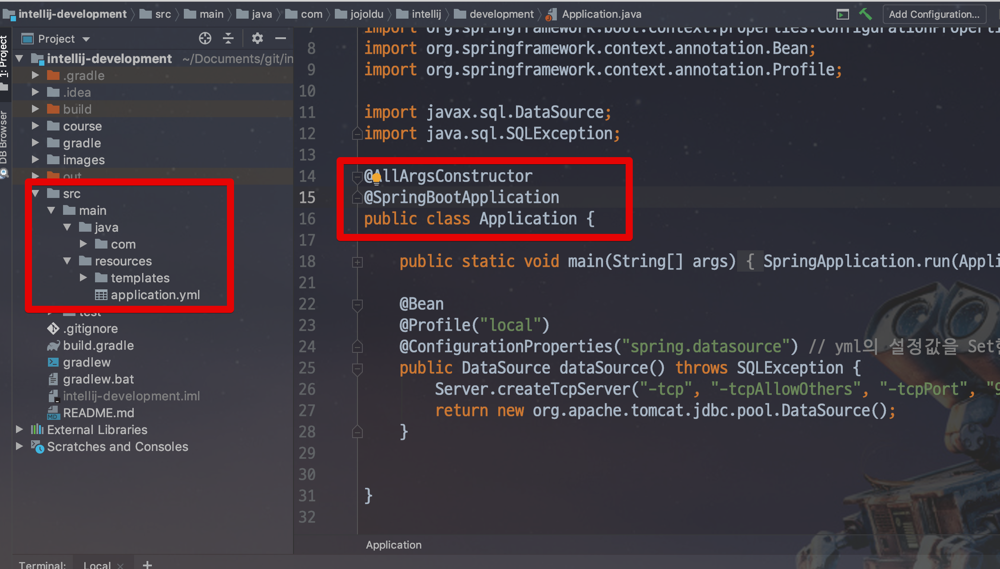
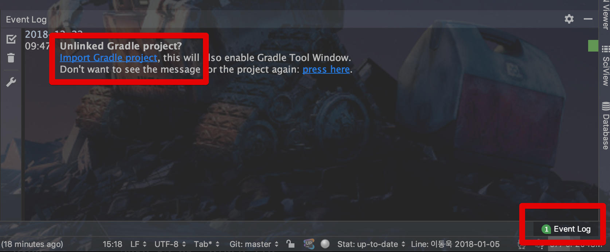
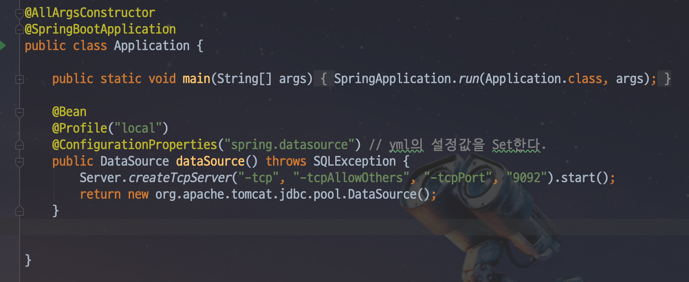
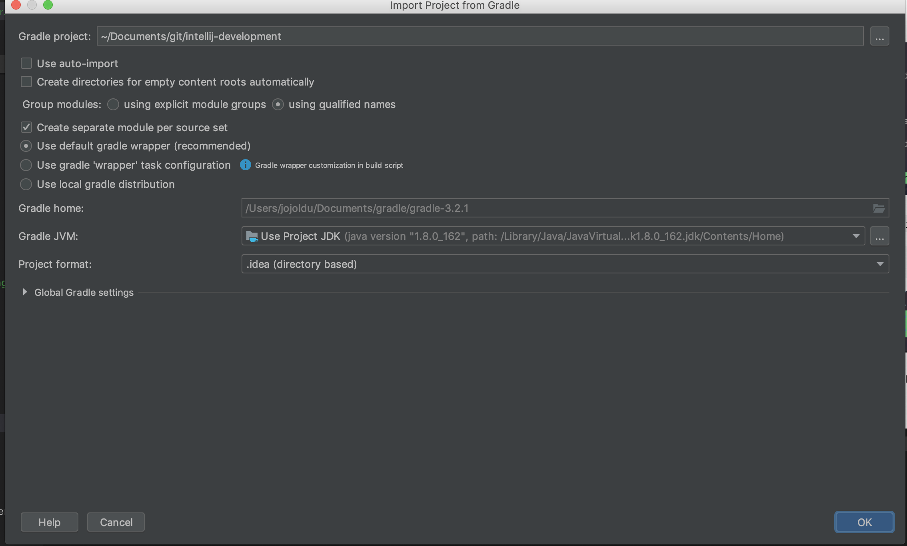

# IntelliJ에서 Gradle 프로젝트 작동안될때

간혹 Gradle 프로젝트를 IntelliJ에서 불러올때 Gradle이 정상작동하지 않을때가 있습니다.



전혀 코드가 작동하지 않는데요.  
이럴때 2가지 해결방법이 있습니다.

## 1. Import Gradle Project

먼저 IntelliJ 우측 하단의 **Event Log** 탭을 클릭해서 아래와 같이 **Import Gradle Project**가 메세지가 보인다면 바로 해당 메세지를 클릭하면 됩니다.



그럼 아래와 같이 Import 프로젝트 화면이 등장합니다.  
마찬가지로 여기서도 **OK** 버튼을 클릭합니다.


Import가 모두 끝나면!  
아래와 같이 정상적으로 Gradle 프로젝트로 변환된것을 확인할 수 있습니다.



## 2. Re Import

만약에 1과 같이 **Import Gradle Project** 메세지가 나오지 않을 경우가 있습니다.  
이럴 경우엔 다음과 같은 방법을 사용하면 됩니다.  
먼저 해당 프로젝트로의 디렉토리로 이동합니다.  


해당 디렉토리에서 IntelliJ의 프로젝트 설정을 담고 있는 ```.idea``` 디렉토리를 삭제합니다.

```bash
rm -rf ./.idea
```


이렇게 삭제하고나면 해당 프로젝트엔 IntelliJ 설정이 없어 다시 시작할 때 Import가 시작됩니다.



Gradle 데몬 작업이 끝나면


이렇게 아래와 같이 정상적으로 Gradle 프로젝트로 되었음을 확인할 수 있습니다.


