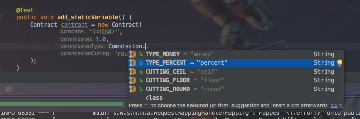

# Java Enum 활용하기
이번 시간엔 실제 업무에서 enum을 활용할 수 있는 방법을 소개해보려고 합니다.  
(공부한 내용을 정리하는 [Github](https://github.com/jojoldu/blog-code)와 세미나+책 후기를 정리하는 [Github](https://github.com/jojoldu/review), 이걸 모두 정리하는 [블로그](http://jojoldu.tistory.com/)가 있습니다.)<br/>  
여러 스터디를 하다보면 많은 분들이 domain의 컬럼 타입을 ```String```만 사용하는 경우를 많이 봤습니다.  
그래서 ```String``` 외에 ```enum```이 필요한 경우를 한번 가정해보고 직접 적용하는 과정을 진행해보려 합니다.  
혹시나 틀린 내용이 있다면 댓글 혹은 Pull Request를 부탁드리겠습니다.  
  
### 기본설정
예를 들어 **중개료 계약서 관리** 라는 시스템을 만든다고 하겠습니다.  
계약서의 항목은 다음과 같습니다.
* 회사명
* 수수료
* 수수료타입
  - 기록된 수수료를 %로 볼지, 실제 원단위의 금액으로 볼지를 나타냅니다.
* 수수료절삭
  - 수수료의 일정 자리수를 **반올림/올림/버림**할 것인지를 나타냅니다. 
   
가장 쉽게 domain 클래스를 작성해보면 아래와 같습니다.  
  
**Contract.java**  
  
```
@Entity
public class Contract {

    @Id
    @GeneratedValue
    private Long id;

    @Column(nullable = false)
    private String company;

    @Column(nullable = false)
    private double commission; // 수수료

    @Column(nullable = false)
    private String commissionType; // 수수료 타입 (예: 퍼센테이지, 금액)

    @Column(nullable = false)
    private String commissionCutting; // 수수료 절삭 (예: 반올림, 올림, 버림)

    public Contract() {}

    public Contract(String company, double commission, String commissionType, String commissionCutting) {
        this.company = company;
        this.commission = commission;
        this.commissionType = commissionType;
        this.commissionCutting = commissionCutting;
    }

    public Long getId() {
        return id;
    }

    public String getCompany() {
        return company;
    }

    public double getCommission() {
        return commission;
    }

    public String getCommissionType() {
        return commissionType;
    }

    public String getCommissionCutting() {
        return commissionCutting;
    }
}
```
  
대부분이 String으로 이루어진 간단한 domain입니다.  
(company의 경우 이번 시간에 주요 항목이 아니기 때문에 별도의 테이블 분리 없이 문자열로 다루겠습니다. 원래는 테이블로 분리해야할 대상입니다^^)  
  
domain클래스를 보시면 setter가 없습니다. 이는 의도한 것인데, getter와 달리 **setter는 무조건 생성하지 않습니다**.  
해당 domain 인스턴스에 변경이 필요한 이벤트가 있을 경우 **그 이벤트를 나타낼 수 있는 메소드**를 만들어야하며, 무분별하게 값을 변경하는 setter는 최대한 멀리하시는게 좋습니다.  
(예를 들어, 주문취소 같은 경우 ```setOrderStatus()```가 아니라 ```cancelOrder()```를 만들어서 사용하는 것입니다.  
똑같이 orderStatus를 변경할지라도, 그 의도와 사용범위가 명확한 메소드를 만드는것이 중요합니다.)  

그리고 이 domain을 관리할 repository를 생성하겠습니다.  
  
**OldCompanyContractRepository.java**  
  
```
public interface OldCompanyContractRepository extends JpaRepository<OldCompanyContract, Long>{}
```

domain클래스와 repository클래스가 생성되었으니 간단한 테스트 클래스를 생성하겠습니다.  

**ApplicationTests.java**  
  
```
import static org.hamcrest.CoreMatchers.is;
import static org.hamcrest.MatcherAssert.assertThat;

@RunWith(SpringRunner.class)
@SpringBootTest
public class ApplicationTests {

	@Autowired
	private ContractRepository repository;

	@Test
	public void add() {
		Contract contract = new Contract(
				"우아한짐카",
				1.0,
				"percent",
				"round"
		);
		repository.save(contract);
		Contract saved = repository.findAll().get(0);
		assertThat(saved.getCommission(), is(1.0));
	}
}

```

save & find가 잘되는 것을 확인할 수 있습니다.  
자 여기서부터 본격적으로 시작해보겠습니다.

### 문제 파악
위 코드를 토대로 시스템을 만든다고 생각해보시면 어떠실까요?  
몇가지 문제점이 보이시나요?  
생각하시는것과 다를수는 있지만, 제가 생각하기엔 다음과 같은 문제가 있어 보입니다.  
  
* commissionType과 commissionCutting에 잘못된 값이 할당되도 **검증하기가 어렵다**.
  - percent, money가 아닌 값이 할당되는 경우를 방지하기 위해 검증 메소드가 필요합니다.
* commissionType과 commissionCutting은 **IDE 지원을 받을 수 없다**.
  - 자동완성, 오타검증 등등
* commissionType과 commissionCutting의 **변경 범위가 너무 크다**.
  - 예를 들어, commissionType의 ```money```를 ```mount```로 변경해야 한다면 프로젝트 전체에서 ```money```를 찾아 변경해야 합니다.
  - 추가로 commissionType의 ```money``` 인지, 다른 domain의 ```money```인지 확인하는 과정도 추가되어 비용이 배로 들어가게 됩니다.
* commissionType과 commissionCutting의 허용된 **값 범위를 파악하기 힘들다**.
  - 예를 들어, commissionType과 commissionCutting을 select box로 표기해야 한다고 생각해보겠습니다.
  - 이들의 가능한 값 리스트가 필요한데, 현재 형태로는 하드코딩할 수 밖에 없습니다.
  
더 있을 수 있지만 위 4가지 문제가 바로 생각나는것 같습니다.  
그럼 이 문제들을 해결하기 위해서는 어떻게 코드를 수정하면 좋을까요?  
제일 먼저 떠오르는 방식은 **static 상수**입니다.  

### 문제해결 - 1
보통 이렇게 고정된 값들이 필요한 경우 static 상수를 많이들 사용하십니다.  
그래서 static 상수로 먼저 문제해결을 시도해보겠습니다.  
  
**Commission.java**  
  
```
public interface Commission {
    String TYPE_PERCENT = "percent";
    String TYPE_MONEY = "money";

    String CUTTING_ROUND = "round";
    String CUTTING_CEIL = "ceil";
    String CUTTING_FLOOR = "floor";
}
```
  
(인터페이스는 상수, 추상메소드만 허용가능하며 접근제한자는 public만 되므로 이런 상수모음에 적합한 형태입니다.)  
Commission 인터페이스를 통해서 테스트 코드를 작성해보겠습니다.  
  

  
(코드 작성중에 확인해보시면 이렇게 자동완성이 지원되는 것을 확인하실 수 있습니다.)      
  
```
	@Test
	public void add_staticVariable() {
		Contract contract = new Contract(
				"우아한짐카",
				1.0,
				Commission.TYPE_PERCENT,
				Commission.CUTTING_ROUND
		);

		repository.save(contract);
		Contract saved = repository.findAll().get(0);
		assertThat(saved.getCommission(), is(1.0));
	}
```

자 이렇게 ```static 상수``` 선언을 함으로써 IDE
### 문제해결 - 2
### 첨언
변경이 잦은 데이터일 경우 데이터베이스의 테이블로 관리하는 것이 좀 더 좋은 방법일 수 있습니다.  
다만, 변경이 거의 없는 데이터 그룹의 경우 enum은 좋은 방법이 될 수 있습니다.  
만약 위 기준만으로 결정하기가 힘들다면 2가지 방식의 장/단점을 보시고 결정하셔도 될것 같습니다.
* DB로 관리하게 될 경우, 변경에 용이하다는 장점을 얻지만 반면에 개발자가 개발/운영시에 전체 데이터를 한눈에 볼 수 없다는 단점이 있습니다.  
* enum으로 관리하게 될 경우, 변경에는 DB때보다 어렵지만 (변경이 필요할 경우 배포가 필요하게 됨) 개발자가 개발/운영시에 한눈에 전체 데이터를 확인하고, 컴파일러에서 직접 체크가 가능하기 떄문에 실수할 여지가 사라집니다.  
