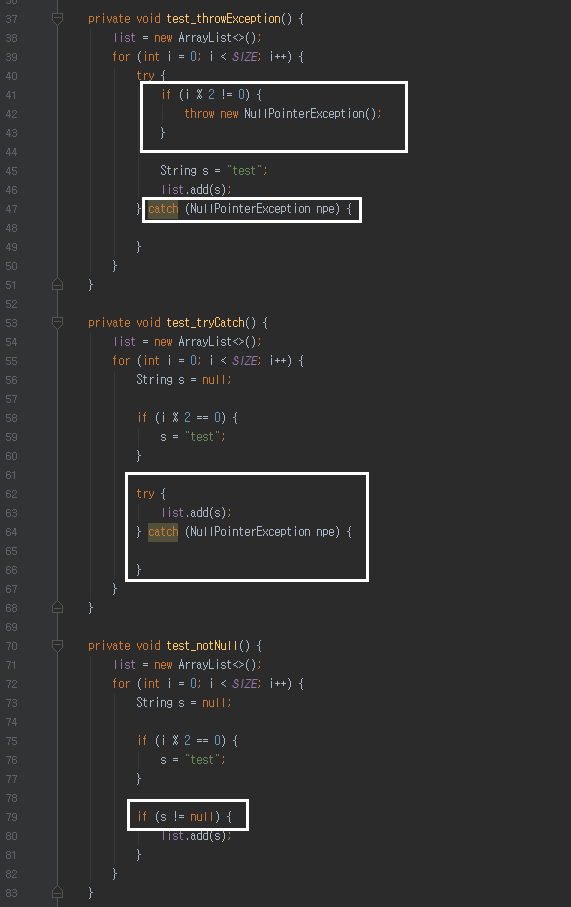
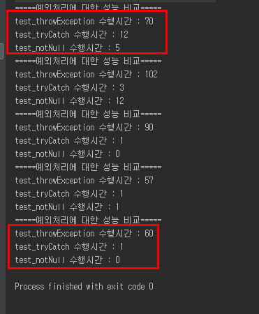
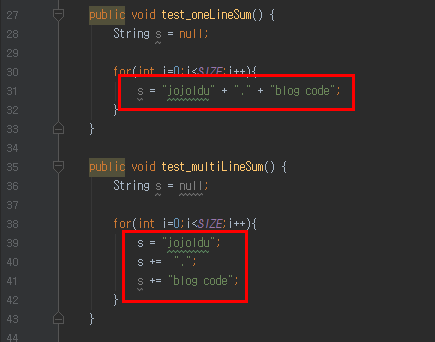
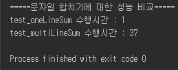

# Java SE 성능 비교
Spring환경에서 개발을 하고 있지만, Java 공부를 안할수는 없다. <br/>
여러 선택의 순간에 어떤 코드가 더 좋은지 안좋은지는 개인의 취향 혹은 팀의 코딩 컨벤션이 가장 중요하겠지만, <br/>
그럼에도 불구하고 동일한 조건이라면 더 좋은 코드는 분명히 존재한다고 생각한다. <br/>
그래서 큰 이슈는 아니지만 성능상 더 좋은 코드가 어떤 것인지 직접 테스트해보고 기록하기로 하였다. <br/>

아래 테스트들은 모두 **성능만** 고려하였다. <br/>
사내 규약 혹은 사수의 조언이 있다면 그걸 우선시 하는게 맞다. <br/>
그런게 없다면 아래 기준에 따라 코드 선택을 하는것도 나쁘지 않을것 같다. <br/>  

모든 테스트는 Java 8을 기준으로 진행하였다. <br/>
사내 신규 프로젝트가 전부 8로 진행되기도 하였고, 조금 있으면 9가 나오는 상황에서 6,7을 기준으로 작성하는 것이 곧 의미가 없어질 수 있다는 생각이였다. <br/>
그래서 6,7에서는 조금 다른 결과가 나올지도 모른다는 것을 미리 얘기한다. <br/>

### Exception (예외처리)
우리가 예외처리를 하는 방법은 다양하다. <br/>




첫번째 메소드의 경우 i가 홀수일 경우 null pointer exception을 throw 하여 바깥부분에서 catch하도록 하였다. <br/>
두번째 메소드의 경우 null pointer exception이 발생할 부분인 list.add() 를 try catch로 감싸도록 하였다. <br/>
마지막 메소드의 경우 null pointer exception이 발생하지 않도록 방어 코딩을 하였다. <br/>




위 결과를 보면 흥미로운 사실이 몇가지 보인다. <br/>
코드에서 직접 NullPointerException을 보내는것(첫번째 예제)과 JVM에서 NullPointerException을 보내는 것(두번째 예제)에는 큰 차이가 난다. <br/>
즉, JVM은 필요할때마다 새로 생성하지 않고, 동일한 Exception 객체를 재사용 한다는 것이다. <br/>

하지만 예외처리의 방법에 따른 성능상 이슈는 생각보다 크지 않다. <br/>
결과에서 보다시피 10만번을 수행하는데 들어간 시간은 100ms 이상 소모되지 않는다. <br/>
그렇다 하더라도 불필요한 예외처리는 비용이 발생하므로, 적절하게 사용하며 방어코드를 사용하는 것이 좀더 비용이 덜드는 방식임을 확인할 수 있다. <br/>

### String (문자열) 처리
문자열 처리의 경우 JDK 1.5부터 Java Compiler에서 내부적으로 StringBuilder와 StringBuffer로 변환시켜 연산한다는 것을 많은 개발자들이 알고 있다. <br/>
그래서 최근들어 "StringBuffer를 사용하나, + 연산자를 사용하나 내부 연산이 같다" 라는 이유로 + 연산자를 막쓰는 분들을 보게 된다. <br/>
그래서 정확히 어떻게 차이가 나는지 보여주기 위한 예제이다. <br/>
<br/>

**코드**



자주 발생할 수 있는 상황이라 생각한다. <br/>
첫번째 코드는 한줄에 문자열 합치기를 전부 작성한 케이스이며, <br/>
두번째 코드는 여러 줄에 나눠서 문자열 합치기를 작성한 케이스이다. <br/>
이 코드의 결과에 대해 한번 예상해보자. <br/>
과연 이게 다른 결과물이 나올수가 있는지도 한번 생각해보면 좋다. <br/>
<br/>

**결과**



1회만 수행해도 차이가 확연히 보이기 때문에 1회만 수행하였다. <br/>
똑같은 + 연산자를 사용한 문자열 합치기인데도 **1줄에 다 쓴 경우가 여러줄로 나눠 쓴 경우보다 훨씬 더 성능이 좋다는** 것을 확인할 수 있다.<br/>
이는 Compiler가 코드를 해석하는데 있어 두 코드가 차이 나기 때문이다. <br/>
<br/>
첫번째 코드의 경우 <br/>
```
String s = new StringBuilder("jojoldu").append(".").append("blog code").toString();
```
로 변환이 된다. <br/><br/>
반면에 두번째 코드의 경우 <br/>
```
String s = new StringBuilder("jojoldu").toString();
s = new StringBuilder(s).append(".").toString();
s = new StringBuilder(s).append("blog code").toString();
```
로 변환이 된다. <br/>
즉, **코드라인이 늘어나는 것에 맞춰 StringBuilder 인스턴스 생성과 toString 메소드 실행** 으로 성능차이가 크게 발생하게 된 것이다. <br/>
<br/>
**결론**

> 문자열 합치기는 웬만하면 1줄에 쓰는것이 좋다. <br/>
  여러 줄로 나눠 써야하는 경우 StringBuilder로 직접 처리하는 것이 좋다. <br/>
  회사 컨벤션에 따라 한줄 합치기도 StringBuilder로 직접 처리할 수도 있다.
