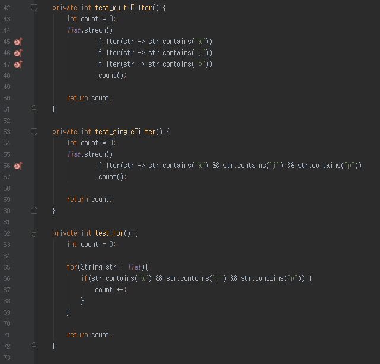
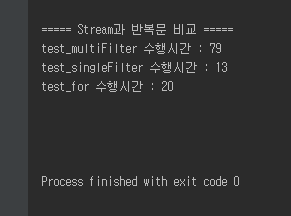

# Java SE 성능 비교
Spring환경에서 개발을 하고 있지만, Java 공부를 안할수는 없다. <br/>
여러 선택의 순간에 어떤 코드가 더 좋은지 안좋은지는 개인의 취향 혹은 팀의 코딩 컨벤션이 가장 중요하겠지만, <br/>
그럼에도 불구하고 동일한 조건이라면 더 좋은 코드는 분명히 존재한다고 생각한다. <br/>
그래서 큰 이슈는 아니지만 성능상 더 좋은 코드가 어떤 것인지 직접 테스트해보고 기록하기로 하였다. <br/>


(뭐든 기본이 중요하다!!!)<br/>

아래 테스트들은 모두 **성능만** 고려하였다. <br/>
사내 규약 혹은 사수의 조언이 있다면 그걸 우선시 하는게 맞다. <br/>
그런게 없다면 아래 기준에 따라 코드 선택을 하는것도 나쁘지 않을것 같다. <br/>  

모든 테스트는 Java 8을 기준으로 진행하였다. <br/>
사내 신규 프로젝트가 전부 8로 진행되기도 하였고, 조금 있으면 9가 나오는 상황에서 6,7을 기준으로 작성하는 것이 곧 의미가 없어질 수 있다는 생각이였다. <br/>
그래서 6,7에서는 조금 다른 결과가 나올지도 모른다는 것을 미리 얘기한다. <br/>
<br/>
모든 코드는 [Github](https://github.com/jojoldu/blog-code/tree/master/java/performance)에 등록하였다. <br/>
실제로 본인의 PC에서 확인해보는 것도 좋을것 같다. <br/>
그럼 하나하나 비교를 시작해보겠다.

### Exception (예외처리)
회사 혹은 팀이 얼마나 Java를 잘 다루는지는 **Exception처리를 어떻게 하고 있는지를 보면 된다** 라는 말이 있을 정도로 Exception 처리는 모든 Java 개발자에게 중요한 이야기라고 생각한다. <br/>
<br/>
우리가 예외처리를 하는 방법은 다양하다. <br/>
모든 것을 throw만 할 수도 있고, <br/>
발생할 지점에서 하나하나 try catch 할 수도 있고, <br/>
애초에 발생할만한 여지가 있는 경우를 전부 방어코드로 사전방지를 할 수도 있다. <br/>
<br/>
어떤 방식이든 본인만의 혹은 팀만의 규칙이 있을것이다. <br/>
다만 각 방식들 간의 성능은 조금씩 차이가 있다. <br/>
아래 코드가 모든 것을 결정하는 기준이 될 순 없지만, 추가적으로 고려해볼만한 기준은 될것같다. <br/>
예제코드를 보며 각각의 코드를 비교해보겠다. <br/>
<br/>

**코드** <br/>


첫번째 코드의 경우 i가 홀수일 경우 null pointer exception을 throw 하여 바깥부분에서 catch하도록 하였다. <br/>
두번째 코드의 경우 null pointer exception이 발생할 부분인 list.add() 를 try catch로 감싸도록 하였다. <br/>
마지막 코드의 경우 null pointer exception이 발생하지 않도록 방어 코딩을 하였다. <br/>


위 결과를 보면 흥미로운 사실이 몇가지 보인다. <br/>
코드에서 직접 NullPointerException을 보내는것(첫번째 예제)과 JVM에서 NullPointerException을 보내는 것(두번째 예제)에는 큰 차이가 난다. <br/>
즉, **JVM은 필요할때마다 새로 생성하지 않고, 동일한 Exception 객체를 재사용** 한다는 것이다. <br/>
코드에서 직접 생성하는 경우 생성에 대한 비용이 계속 발생하지만 JVM에게 이를 맡기는 경우엔 예외객체를 재사용함으로써 이 비용이 줄어든다. <br/>
하지만 개발자가 직접 예외/메세지/status 코드등을 지정할 수 없기에 추천할수는 없는 방법이다. <br/>
<br/>
**결론**

> 예외처리의 방법에 따른 **성능상 이슈는 생각보다 크지 않다**. <br/>
결과에서 보다시피 10만번을 수행하는데 들어간 시간은 100ms를 넘지 않는다. <br/>
그렇다 하더라도 불필요한 예외처리는 비용이 발생하므로, 적절하게 사용하되 방어코드를 사용하는 것이 좀더 비용이 덜 소모되는 방식임을 확인할 수 있다.

### String (문자열) 처리
JDK 1.5부터 Java Compiler에서 "+"연산자 처리는 내부적으로 StringBuilder로 변환시켜 연산한다는 것을 많은 개발자들이 알고 있다. <br/>
그래서 최근들어 "StringBuilder를 사용하나, + 연산자를 사용하나 내부 연산이 같다" 라는 이유로 + 연산자를 막쓰는 분들을 보게 된다. <br/>
그래서 정확히 어떻게 차이가 나는지 보여주기 위한 예제이다. <br/>
<br/>

**코드**


자주 발생할 수 있는 상황이라 생각한다. <br/>
첫번째 코드는 한줄에 문자열 합치기를 전부 작성한 케이스이며, <br/>
두번째 코드는 여러 줄에 나눠서 문자열 합치기를 작성한 케이스이다. <br/>
이 코드의 결과에 대해 한번 예상해보자. <br/>
과연 이게 다른 결과물이 나올수가 있는지도 한번 생각해보면 좋다. <br/>
<br/>

**결과**


굳이 10만회를 수행할 필요가 없을정도의 차이라 1회만 수행하였다. <br/>
똑같은 + 연산자를 사용한 문자열 합치기인데도 **1줄에 다 쓴 경우가 여러줄로 나눠 쓴 경우보다 훨씬 더 성능이 좋다는** 것을 확인할 수 있다.<br/>
이는 Compiler가 두 코드를 다르게 해석하기 때문이다. <br/>
<br/>
첫번째 코드의 경우 <br/>
```
String s = new StringBuilder("jojoldu").append(".").append("blog code").toString();
```
로 변환이 된다. <br/><br/>
반면에 두번째 코드의 경우 <br/>
```
String s = new StringBuilder("jojoldu").toString();
s = new StringBuilder(s).append(".").toString();
s = new StringBuilder(s).append("blog code").toString();
```
로 변환이 된다. <br/>
즉, **코드라인이 늘어나는 것에 맞춰 StringBuilder 인스턴스 생성** , **toString 메소드 실행** 으로 성능차이가 크게 발생하게 된 것이다. <br/>
<br/>

**결론**

> 문자열 합치기는 웬만하면 1줄에 쓰는것이 좋다. <br/>
  여러 줄로 나눠 써야하는 경우 StringBuilder로 직접 처리하는 것이 좋다. <br/>
  회사 컨벤션에 따라 한줄 합치기도 StringBuilder로 직접 처리할 수도 있다.


### Stream filter와 반복문
Java 8을 도입하면서 가장 많이 사용하는 것이 Stream과 filter인듯하다.<br/>
Java 7 이하에서는 향상된 for를 주로 사용하며 처리하였지만, stream이 도입된 이후부터는 잘 사용하지 않게 된다. <br/>
근데 의견이 stream이 성능이 안좋다 라는 이야기가 자주 거론되었다. <br/>
그래서 실제로 그런지 확인해보았다. <br/>


(제가한번 먹... 해보겠습니다!) <br/>

**코드**



코드자체는 간단하다. <br/>
3가지 메소드가 모두 약 60만개의 문자열(이미지상엔 없지만 초기 생성시에 60만개의 문자열을 생성한다.)을 가진 list를 순회하면서 a, j, s 문자를 가지고 있는 문자열의 갯수를 전달하는 기능을 한다. <br/>
첫번째 메소드는 stream과 filter를 사용하되, filter를 여러번 거치도록 하였다. <br/>
두번째 메소드는 첫번째 메소드와 마찬가지로 stream과 filter를 사용하되 단일 filter로 처리하였다. <br/>
마지막 메소드는 기존 방식으로 for(반복문)을 사용하여 처리하였다. <br/>
위 3가지 코드의 성능을 비교하면!



보는것처럼 확연한 결과 차이가 보인다. <br/>
특이한 것은 동일한 stream & filter & count를 사용한 1과 2번째 메소드의 성능차이가 난다는 것이다. <br/>
이는 filter의 처리방식때문이다. <br/>
1번째 filter에서 "a"가 포함된 문자열을 찾는다. 그리고 이를 2번째 filter로 전달한다.<br/>
2번째 filter에서는 1번째 filter에서 받은 문자열에서 "j"가 있는지 확인한다. 없을 경우 1번째 filter로 다시 콜백을 요청하고, 있으면 3번째 filter로 전달한다. <br/>
3번째 filter에서는 2번째 filter에서 받은 문자열에 "p"가 있는지 확인한다. 없을 경우 2번째 filter로 콜백요청을 한다. <br/>
즉, 이 과정자체가 비효율을 안고 있기 때문에 성능의 차이가 발생한 것이다. <br/>
다만 두번째 메소드와 마지막 메소드는 성능차이가 거의 나지 않으며, 코드에 따라 2번째 메소드가 더 성능이 좋을 수도 있다.<br/>
<br/>

**결론**
> 여러개의 filter는 성능상 불이익이 있다. filter를 최소화하기 위해 어느정도 고민이 필요하다 <br/>
잘 사용한 filter는 향상된 반복문보다 더 성능이 좋을수도 있으니 stream과 filter에 대한 공부가 필요하다. <br/>

### 마무리
내가 작성한 테스트 메소드가 틀릴 수도 있고, 오류가 있을 수도 있다. <br/>
(이렇게 간단한 코드도 제대로 작성하지 못하는 나란 녀석..) <br/>
하지만 "이것보다 더 좋은 코드 혹은 방법이 없을까?" <br/>
"그 방법이 정말 더 좋은건가?" <br/>
등의 생각과 실천은 꼭 필요한것 같다. <br/>
이외에도 추가적으로 비교가 필요한 코드는 계속해서 테스트해보며 기록해야겠다. <br/>
**끝!!**
