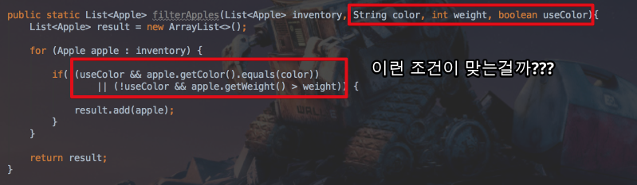
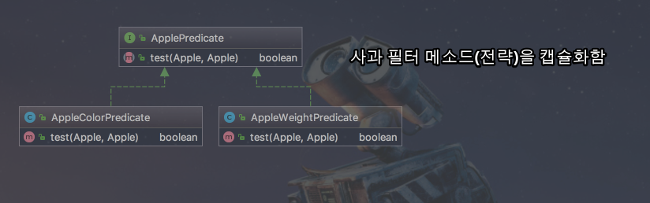
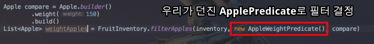
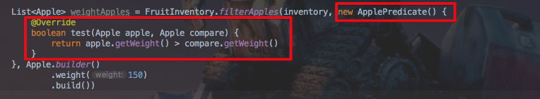
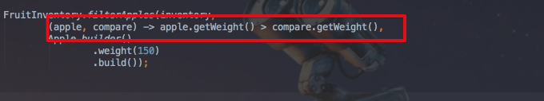

# Java8 연습 - 메소드 파라미터

안녕하세요? 이번 시간엔 java8에 새로 추가된 기능 중 **메소드 파라미터**에 대해 다시 정리해볼 예정입니다.  
모든 코드는 [Github](https://github.com/jojoldu/blog-code/tree/master/java8-in-action)에 있기 때문에 함께 보시면 더 이해하기 쉬우실 것 같습니다.  
(공부한 내용을 정리하는 [Github](https://github.com/jojoldu/blog-code)와 세미나+책 후기를 정리하는 [Github](https://github.com/jojoldu/review), 이 모든 내용을 담고 있는 [블로그](http://jojoldu.tistory.com/)가 있습니다. )<br/>

## 예제

여기에서는 간단한 프로그램을 기존 자바 코드로 해결하면서 발생하는 문제를 자바8에서 어떻게 개선할 수 있는지 비교해볼 예정입니다.  
단, 람다식/스트림 등등의 자세한 내용은 다음 포스팅에 포함될 예정입니다.  
여기선 자바8의 변화로 메소드를 파라미터로 넘기는 이유와 장점에 대해 소개할 예정입니다.

### 과일 재고 프로그램 

예를 들어 과일 재고 목록을 관리하는 어플리케이션을 만든다고 가정하겠습니다.  
처음 요구사항은 "녹색사과를 모두 찾고 싶다" 입니다.  
간단하게 코드로 구현하면 아래와 같습니다.  

 

헌데 여기서 "빨간사과도 모두 찾고 싶다" 란 요구사항이 추가되었습니다.  
색깔만 다른 사과를 구분하는 조건이 된것이므로 코드를 좀 더 리팩토링하겠습니다.


여기서 불행하게도 **"특정 무게와 관계없이 빨간 사과를 찾고 싶다" or "특정색깔과 관계없이 150g이 넘는 사과를 찾고 싶다" 등등의 조건으로 확장**될 수도 있다고 하면 어떻게 해야할까요?  
필터 조건을 무게로 할지, 색깔로 할지도 정하고, 그에 따라 파라미터값들도 각각 필요할 것입니다.  
가장 쉬운 방법은 이 또한 조건문에 포함시키는 것입니다.  



이 코드를 한번 보시죠  
이게 정말 좋은 코드일까요?  
앞으로 **요구사항이 바뀔때마다 유연하게 대처**할 수 있을까요?  
종국엔 똑같은 일을 하는 메소드가 계속해서 복사 & 붙여넣기 할지도 모릅니다.  
예를 들어 사과의 크기, 모양, 가격 등등 얼마나 많은 조건들이 추가될지도 모르는데 이런식으로만 필터를 하면 처리할 수 있을까요?  
  
  
### 자바 7 이하에서 해결하기 - 전략패턴

자 다시한번 문제와 코드를 살펴보겠습니다.  
결국 이 코드에서 변경가능 대상은 어디인가요?  
조건절(```if()```) 입니다.  
결국 **이 조건절 안의 내용들을 파라미터로 받아서 처리**할 수 있다면 이 같은 변경 사항에 모두 유연하게 대처할 수 있습니다.  
  
원하는 것은 동적으로 boolean을 반환하는 함수입니다.  

> 이렇게 boolean을 반환하는 함수를 **Predicate** (프레디케이트) 라고 합니다.

그래서 이 부분을 인터페이스로 추상화하여 처리해보겠습니다.  
(즉, 자바 7이하 버전에서의 처리 방법을 얘기합니다.)  

```java

public interface ApplePredicate {
    boolean test(Apple apple, Apple compare);
}

public class AppleColorPredicate implements ApplePredicate {
    @Override
    public boolean test(Apple apple, Apple compare) {
        return apple.getColor().equals(compare.getColor());
    }
}

public class AppleWeightPredicate implements ApplePredicate {
    @Override
    public boolean test(Apple apple, Apple compare) {
        return apple.getWeight() > compare.getWeight(); // compare에 150g이 포함
    }
}
```

이를 다이어그램으로 표현하면 아래와 같습니다.



이와 같이 특정 메소드 코드 (알고리즘 혹은 전략)을 캡슐화하여 런타임에 원하는 전략을 선택하도록 하는 것을 **전략패턴**이라고 합니다.  
  
그럼 이 코드를 실제 사용하는 코드에 적용하면!



사용자가 원하는 기준에 따라 ```ApplePredicate``` 객체를 넘겨 필터 조건에 사용할 수 있게 되었습니다!  
이젠 어떤 조건이 오더라도 ```ApplePredicate``` 구현체를 생성해서 필터 조건을 만들어 넘겨주기만 하면 됩니다.  
기존에 문제가 되었던 **유연하지 못한 필터 조건의 문제가 해결**된 것입니다.  
  
하지만 이 코드도 뭔가 아쉽습니다.  
매번 조건이 추가될때마다 일반 클래스를 계속해서 구현해야만 합니다.  
사실은 **단순히 if 조건문만 있으면 되는데 너무나 많은 불필요한 코드(행사코드)가 필요**합니다.  

### 자바 7 이하에서 해결하기 - 익명클래스

이런 불필요한 코드를 해결하기 위해 익명 클래스를 사용해보겠습니다.  



일반 클래스를 생성할 필요없이 ```ApplePredicate``` 구현체를 바로 구현한 익명클래스를 파라미터로 넘겨주었습니다.  
  
일반클래스를 생성하는것보다는 코드가 줄었지만, 그래도 아직 불필요한 코드가 너무 많아보이지 않으신가요?  
**빨간색 테두리속 코드들은 비지니스 로직에선 전혀 불필요한 코드**입니다.  
저희에게 필요한 코드는 사실상 ```apple.getWeight() > compare.getWeight()``` 뿐입니다.  
  
요구사항이 변경될때마다 이 코드들만 계속해서 추가/변경 하고싶다면 어떻게 해야할까요?  
자바8에선 이 문제를 아주 깔끔하게 해결해줍니다.

[[ad]]

### 자바8에서 해결하기 - 람다식

이 프로그램에서 결국 변경되는 코드는 단 한줄입니다.  

```java
apple.getWeight() > compare.getWeight()
```

그럼 이 한줄의 코드만 메소드의 파라미터로 넘기고 싶습니다.  
람다식을 사용하면 원하는대로 할 수 있습니다.  



**apple과 compare를 파라미터로 사용하여 비교하는 코드가 파라미터로 전달**되었습니다.  
(여기서 ```->```는 메소드의 body 부분을 뒷 부분의 코드로 사용하겠다 정도로 이해하시면 됩니다.)  

> 자세한 람다식의 사용법은 다음 포스팅에 소개드리겠습니다.

놀라운것은 자바8의 도입으로 여기서 한번더 개선할 수 있습니다.

### 자바8에서 해결하기 - 스트림 API

이번에 좀 더 개선해볼 코드는 기존에 ```ApplePredicate```를 호출했던 코드입니다.

```java
List<Apple> result = new ArrayList<>();

for (Apple apple : inventory) {
    if(predicate.test(apple)) {
        result.add(apple);
    }
}

return result;
```

위 코드도 마찬가지로 불필요한 코드가 정말 많습니다.  
1) 빈 List (```result```)를 생성하고, 2) 조건에 맞는 값을 ```result.add``` 하고, 3) ```result```를 반환하고 있습니다.  
  
사실 ```inventory```에서 필터를 걸어 값을 걸러내기만 하면 되는 일 아닐까요?  
  
자바8에선 이런 코드를 Stream 을 통해 아주 쉽게 해결할 수 있습니다.

```java
return inventory.stream()
        .filter(apple -> apple.getWeight() > compare.getWeight())
        .collect(Collectors.toList());
```

별도로 ```List```를 다시 생성할 필요도 없고, 이 ```List```에 결과값을 다시 추가할 필요도 없습니다.  
코드가 정말 간결하게 해결되었죠?

> 스트림 API도 다음 포스팅에 상세하게 사용법을 설명드리겠습니다.

## 마무리

어떠세요? 자바8을 좀 더 적극적으로 공부해야겠다는 생각이 드셨나요?  
자바8을 써야한다고 주변에 얘기하면 항상 듣는 답변이 **그걸 하면 뭐가 좋으냐?** 였습니다.  
그래서 적절한 사례가 있으면 좋겠다는 생각을 하다가 최근에 Java8 In Action을 보고 이거다 싶어 소개드리게 되었습니다.  
  
조금씩 자바8의 문법들과 새 기능에 대해 적절한 예제로 소개드리겠습니다.  
읽어주셔서 감사합니다^^
