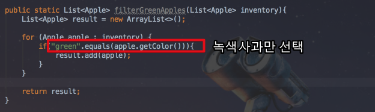
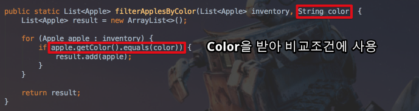

# Java8 연습

안녕하세요? 이번 시간엔 java8에 새로 추가된 기능을 다시 정리해볼 예정입니다.  
모든 코드는 [Github](https://github.com/jojoldu/blog-code/tree/master/java8-in-action)에 있기 때문에 함께 보시면 더 이해하기 쉬우실 것 같습니다.  
(공부한 내용을 정리하는 [Github](https://github.com/jojoldu/blog-code)와 세미나+책 후기를 정리하는 [Github](https://github.com/jojoldu/review), 이 모든 내용을 담고 있는 [블로그](http://jojoldu.tistory.com/)가 있습니다. )<br/>


## 1. 스트림 API

기존에는 한번에 한 항목만을 처리했지만, 스트림 API를 통해 일련의 스트림으로 만들어 처리할 수 있게 되었습니다.


## 2. 메소드 파라미터

기존에는 메소드를 다른 메소드의 파라미터로 전달할 수 없었습니다.  
이를 위해서는 넘겨주고자 하는 메소드를 감싼 객체를 하나 만들어야만 보낼수 있었습니다.  
자바8에서는 메소드를 다른 메소드의 인수로 넘겨주는 기능을 제공합니다.

> 물론 내부적으로는 Function 인터페이스의 구현체를 넘기는 것이나, 코드상으로는 다른 함수형 언어와 마찬가지로 메소드만 넘기는 것처럼 보입니다.

```java
new File(".").listFiles(new FileFilter() {
    public boolean accept(File file){
        return file.isHidden();
    }
});
```

위 코드는 불필요한 코드 (이하 행사코드)가 너무나 많습니다.  
실제로 ```File```에 있는 ```isHidden()```을 사용한다만 표기하면 될일에 너무나 많은 코드가 포함되어 있습니다.  
Java8에서는 이를 아주 간단하게 표기할수 있게 되었습니다.

```java
new File(".").listFiles(File::isHidden);
```

위에서 표기된 ```::```를 **메서드 레퍼런스**라고 합니다.  
이 메서드를 값으로 사용하라는 의미이며, 여기선 ```File```의 ```isHidden```을 ```listFiles```에 직접 전달한 것입니다.  
  
### 2-1. 과일 재고 프로그램 

예를 들어 과일 재고 목록을 관리하는 어플리케이션을 만든다고 가정하겠습니다.  
처음 요구사항은 "녹색사과를 모두 찾고 싶다" 입니다.  
간단하게 코드로 구현하면 아래와 같습니다.  

 

헌데 여기서 "빨간사과도 모두 찾고 싶다" 란 요구사항이 추가되었습니다.  
색깔만 다른 사과를 구분하는 조건이 된것이므로 코드를 좀 더 리팩토링하겠습니다.



여기서 불행하게도 "150g이 넘는 빨간 사과를 찾고 싶다" 로 조건이 또다시 추가된다면 어떻게 해야할까요?

## 3. 병렬성과 공유 가변 데이터

코드의 병렬성을 쉽게 얻을 수 있게 되었습니다.  
단, 코드 작성 방법에 많은 변화가 필요합니다.  
**공유된 가변 데이터를 사용하면 안됩니다**.  
변경되지 않으며, 공유되지 않는 데이터만을 메소드에서 사용해야 합니다.  

## 4. 디폴트메소드
