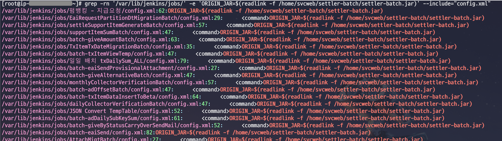
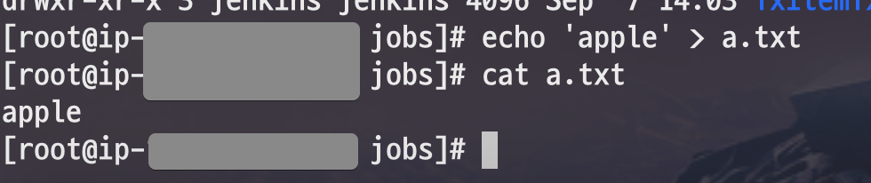
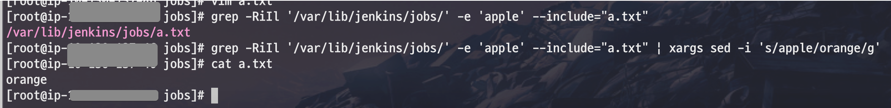

# Jenkins에서 Execute shell 명령어 일괄 조회하기

Jenkins에서 

```bash
grep -rn '/var/lib/jenkins/jobs/' -e 'ORIGIN_JAR=$(readlink -f /home/svcweb/settler-batch/settler-batch.jar)' --include="config.xml"
```

* ```--include="config.xml"```



```bash
find /var/lib/jenkins/jobs/ -type f -exec sed -i -e 's/orange/apple/g' config.xml {} \;
```



```bash
echo 'apple' > a.txt
```



```bash
grep -RiIl '/var/lib/jenkins/jobs/' -e 'apple' --include="a.txt"
```

```bash
grep -RiIl '/var/lib/jenkins/jobs/' -e 'apple' --include="a.txt" | xargs sed -i 's/apple/orange/g'
```


```bash
grep -RiIl '/var/lib/jenkins/jobs/' -e 'apple' --include="a.txt" | xargs sed -i 's/ORIGIN_JAR\=\$\(readlink \-f \/home\/svcweb\/settler-batch\/settler\-batch\.jar\)//g'
```

