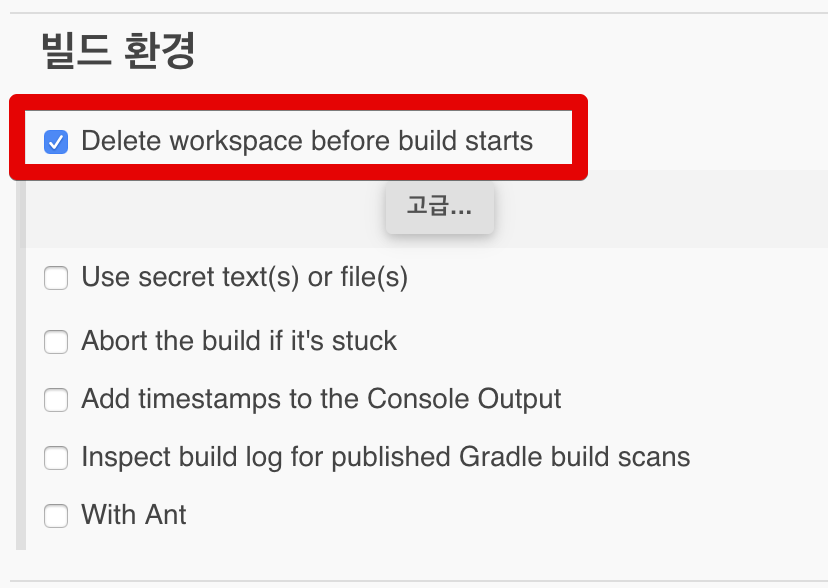
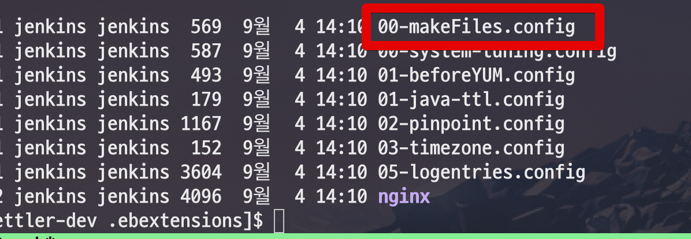
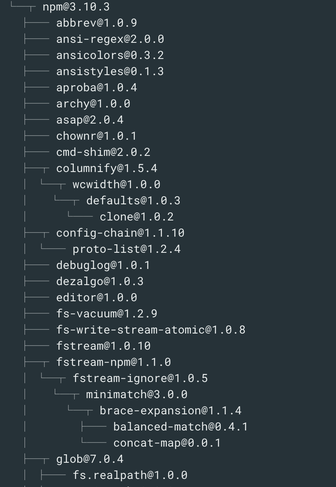
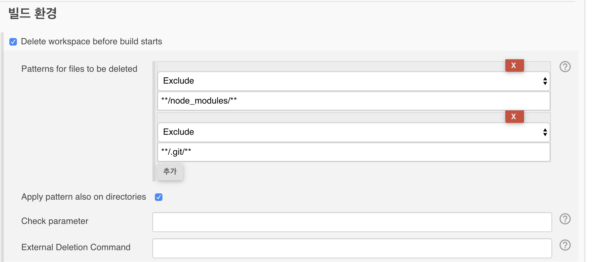

# 젠킨스 빌드 파일 캐시 문제

젠킨스를 통해 Github Clone -> Build를 하다보면 다음과 같이 **이름이 변경된 파일의 이전 파일**이 그대로 남아 있는 경우를 종종 보게 됩니다.  
  
아래 사진은 01-makeFiles.config였던 파일을 00-makeFiles.config로 변경했는데 그대로 00도 남아있는 경우입니다.


(실제 프로젝트에서는 이미 01-makeFiles.config 파일이 존재하지 않습니다.)  
  
이는 젠킨스의 workspace가 **완전히 초기화 되지 않기 때문**입니다.  
  
젠킨스의 경우 ```npm install``` 등 패키지 다운로드가 매번 build때마다 발생하는 것을 막기 위해 workspace를 삭제하지 않고 **덮어 쓰기** 방식으로 진행됩니다.  

이런 문제를 해결하기 위해 젠킨스에서는 **빌드 환경**에서 한가지 옵션을 제공 합니다.  
  
아래와 같이 **Delete workspace before build starts** 를 체크하시면 **Job 시작 전에 workspace를 무조건 비우고** Job이 시작됩니다.



체크 하신 후, 다시 Build를 수행해보시면!  
아래와 같이 더이상 예전에 있던 01 파일이 존재하지 않음을 알 수 있습니다.  



깔끔하게 새 파일들로 Build가 수행됩니다!  

## 번외

다만 이 방식에는 단점이 있습니다.  
  
이전에 다운 받은 라이브러리들이 삭제되어 **매번 받아야만** 합니다.  



매번 전체 workspace를 날릴순 없으니 **예외 패턴**을 넣을 수 있습니다.  
Delete workspace before build starts 에는 **Exclude** 기능이 있습니다.  
  
해당 기능을 이용해 **굳이 매번 삭제 할 필요가 없는 디렉토리나 파일은 제외** 하시면 됩니다.  
  
저 같은 경우 ```node_modules```와 ```.git``` 디렉토리는 남겨놓고 나머지만 모두 삭제하도록 구성합니다.



이렇게 구성하시면 해당 디렉토리들만 남겨두고 나머지 디렉토리들과 파일은 모두 삭제후 build가 수행됩니다.
