# Jenkins에 Github 로그인 연동하기

안녕하세요?  
이번 시간에는 Jenkins와 Github 로그인을 연동해보겠습니다.  
보통 Jenkins를 사용하면 대부분 **Github의 프로젝트를 빌드 & 배포** 하는 용도로 많이들 사용하시는데요.  
그럴 경우 별도의 회원 가입없이 Github OAuth 로그인을 이용하면 회원가입 절차가 편리합니다.  
  
> Jenkins가 이미 설치되어있고, Github 가입이 되어있다는 가정하에 진행합니다.

## 1. Github APP 등록

먼저 할 일은 Github APP을 하나 만들어 그 clientId와 clientSecret를 발급받아야만 합니다.  
본인 계정의 **Settings**을 클릭합니다.

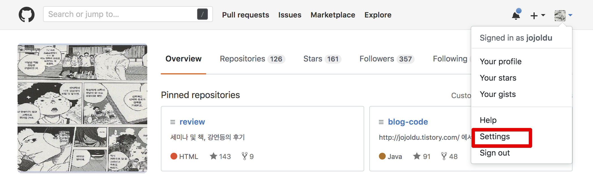

Setting 화면의 사이드바 하단을 보시면 **Developer settings** 을 클릭합니다.

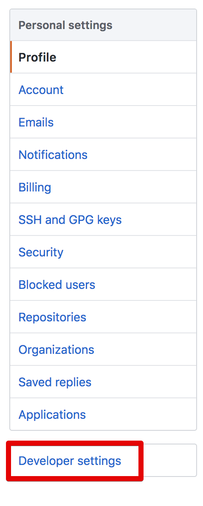

OAuth Apps에서 우측의 **New OAuth App**을 클릭합니다.

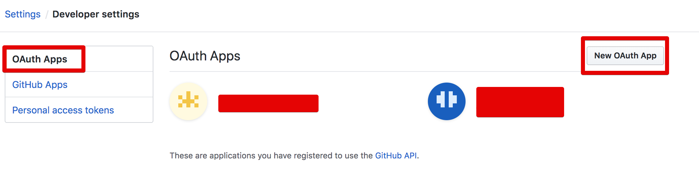

아래 항목을 차례로 입력해주시면 됩니다.

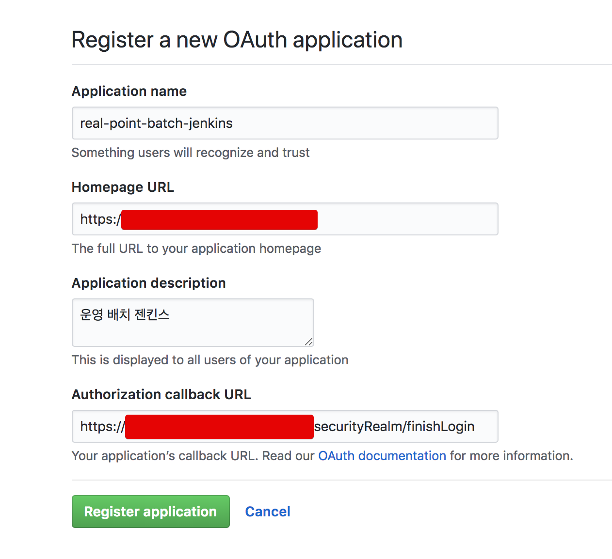

* Homepage URL
    * ```젠킨스URL```
* Authorization callback URL
    * ```젠킨스URL/securityRealm/finishLogin```
    * URL주소 뒤에 ```/securityRealm/finishLogin```를 꼭 붙여주셔야 합니다.

이렇게 등록하신 후 생성하시면! 아래처럼 OAuth 로그인에 사용할 ClientId 와 ClientSecret가 발급 됩니다.  

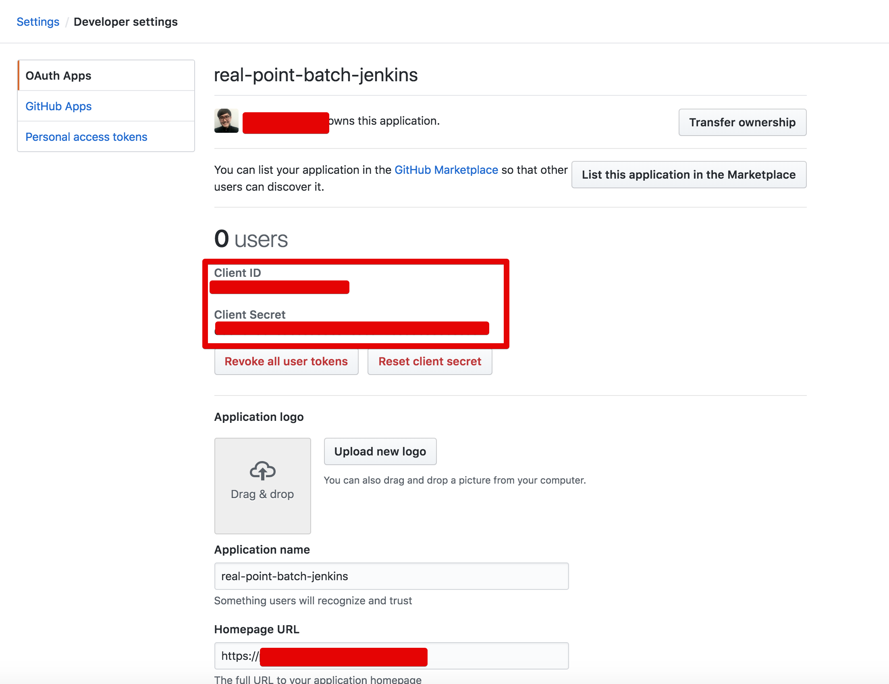

2개 키를 잘 기록하신뒤 Jenkins로 이동합니다.


## 2. Jenkins 설정 변경

가장 먼저 할일은 Github OAuth Plugin을 설치하는 것입니다.  
  
Jenkins 메인 화면의 좌측의 **Manage Jenkins** 버튼을 클릭합니다.  
그리고 중앙의 여러 버튼 중, Manage Plugins를 클릭합니다.

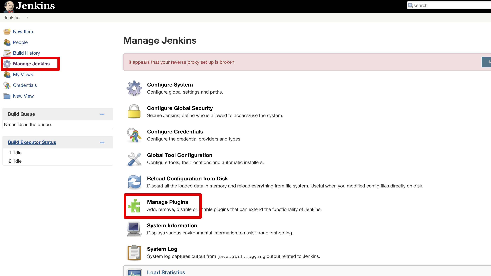

여기서 **Available** 탭에서 **Github Authentication** 플러그인을 찾아서 설치합니다.  
(이미 설치되어있으시면 생략하셔도 됩니다.)

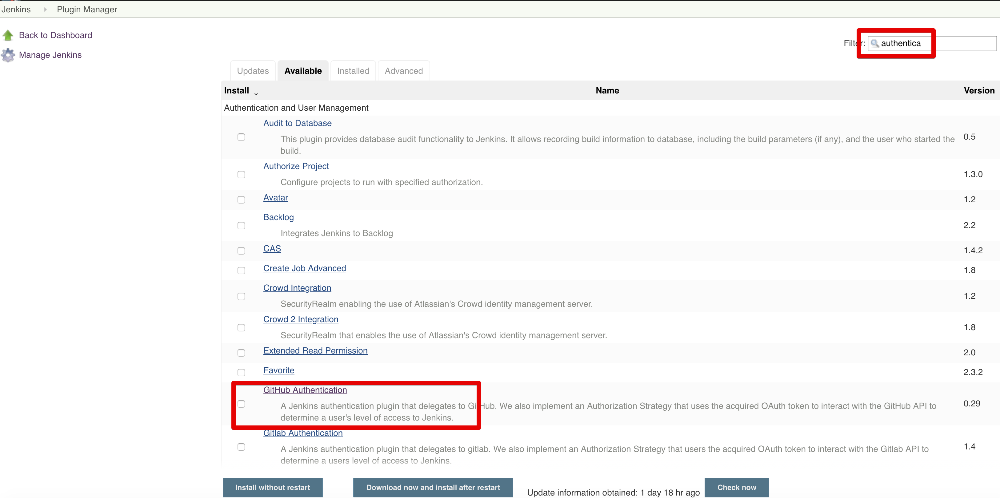

설치가 다 되셨으면, 같은 목록의 **Configure Global Security** 을 클릭합니다.

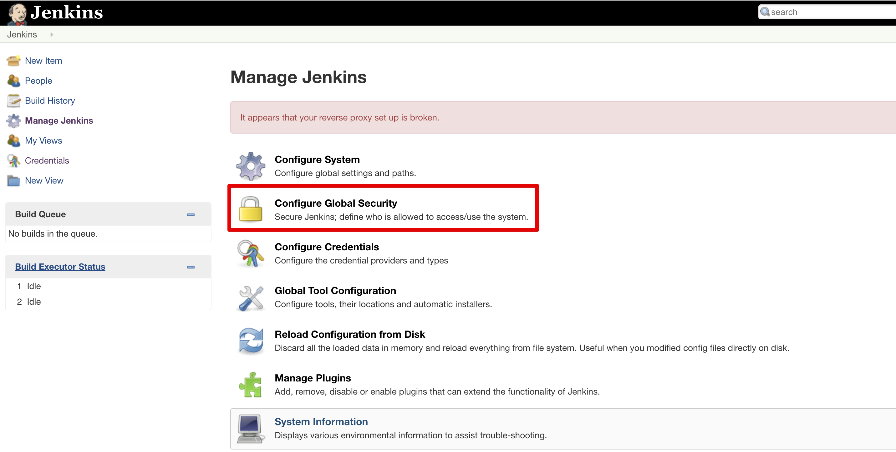

설정 창이 나오면 아래 항목들을 하나씩 채웁니다.

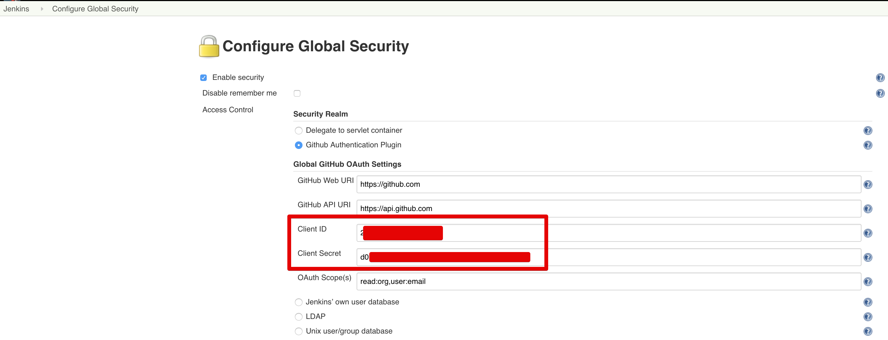

* **Github Authentication Plugin**을 체크합니다.
* Github OAuth APP의 ClientID와 Client Secret을 등록합니다.

좀 더 아래로 가보시면 Authorization 항목이 있는데요.  
여기서는 본인의 계정을 마스터로 먼저 등록합니다.

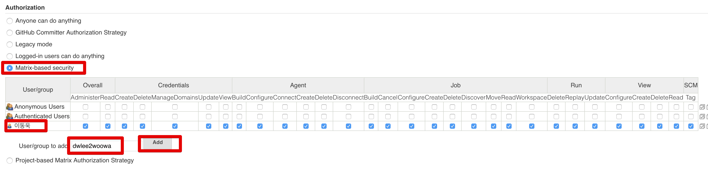

* **Matrix-base security** 를 체크합니다.
* 본인의 Github 계정명 Add 합니다.
* 등록이 되시면 모든 권한을 체크합니다.

등록이 다 되시면 바로 로그아웃 될텐데요.  
다시 로그인 하시면!

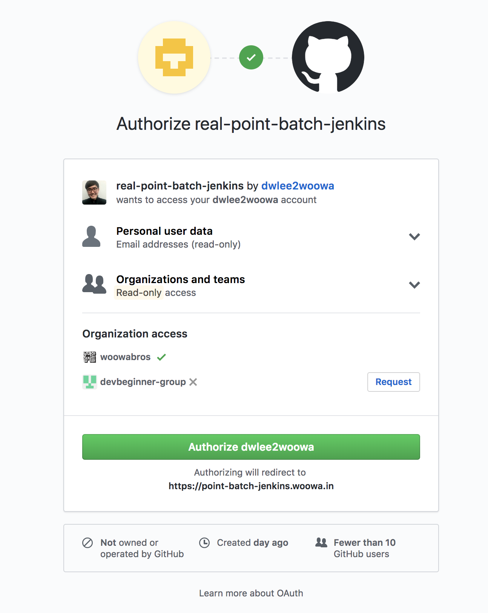

이렇게 Github OAuth 로그인이 진행됩니다.  
  
그럼 로그인이 성공하고!

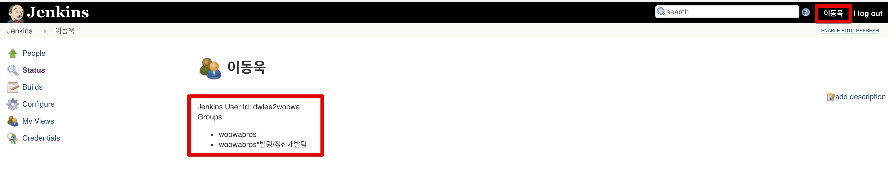

계정 정보를 보시면 Github 계정 정보를 확인할 수 있습니다.  


여기서 끝나면 본인의 계정만 되는데요.  
본인의 팀 사람들만 로그인 하실수 있도록 그룹을 등록하겠습니다.  
아까 보셨던 계정 정보에서 Groups를 보시면 2개 항목이 나오는데요.  
그 중 아래 팀명을 등록하겠습니다.

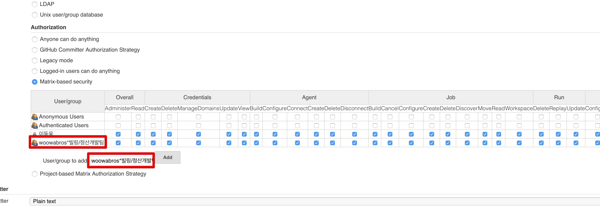

이렇게 등록 하신뒤 최종 저장히시면, 해당 팀의 모든 인원들은 로그인 할 수 있습니다!

