# 젠킨스와 Github ssh 연동하기

젠킨스와 Github 연동시에 **사용자명과 비밀번호** 인증방식은 보안상 추천하지 않는 방식입니다.  
  
물론 테스트 용도로만 사용하는건 문제 없지만, 실제 서비스에서 그렇게 사용하는 회사는 없습니다.  
  
그래서 젠킨스와 Github 간 SSH 연동 방식을 어떻게 하는지 간단하게 소개합니다.

## 1. 키 생성

현재 실행중인 젠킨스 사용자를 확인합니다.

```bash
ps aux | grep jenkins
```

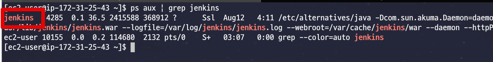

> 특별히 설정하지 않으면 jenkins 사용자로 실행중입니다.

젠킨스가 ```jenkins``` 사용자로 실행중인게 확인되었다면 **현재 사용자를 jenkins로 전환**합니다.  

> chown 명령어로 파일들을 변경해도 되지만 편하게 jenkins 사용자로 변경하고 모든 명령어를 수행하겠습니다.

```bash
sudo -u jenkins /bin/bash
```

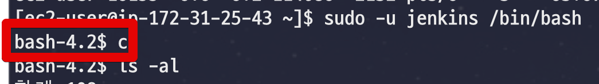

> jenkins 사용자는 일반적으로 서버에 등록된 사용자는 아닙니다.  
그러다보니 ```sudo su - u jenkins``` 등으로 전환은 안됩니다.


전환이 되셨다면 ```.ssh``` 디렉토리를 하나 생성하고 이동합니다.

```bash
mkdir /var/lib/jenkins/.ssh
cd /var/lib/jenkins/.ssh
```

여기서 ssh 키를 생성합니다.  

```bash
ssh-keygen -t rsa -f /var/lib/jenkins/.ssh/github_ansible-in-action
```

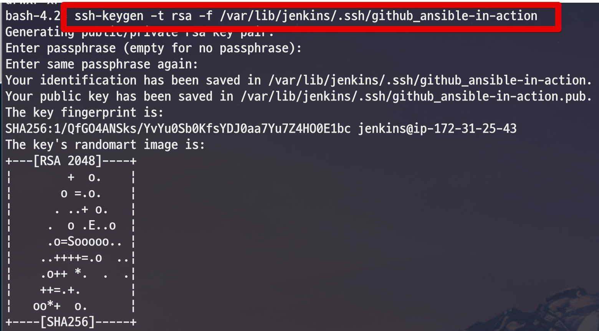

* 비밀 번호는 모두 입력하지 않고 바로 Enter로 넘어갑니다.

다 생성이 되셨다면 ```ls -al```로 아래와 같이 비밀키/공개키가 잘 생성되었는지 확인합니다.

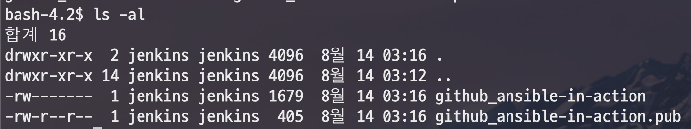

잘 생성되셨다면 Github으로 이동합니다.

## 2. Github

젠킨스로 연동하고 싶은 Github의 Setting 페이지로 이돌합니다.

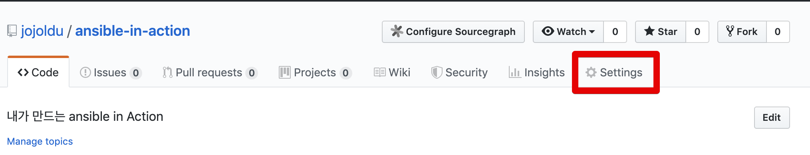

좌측 사이드바의 Deploy keys -> Add deploy key 버튼을 차례로 클릭합니다.

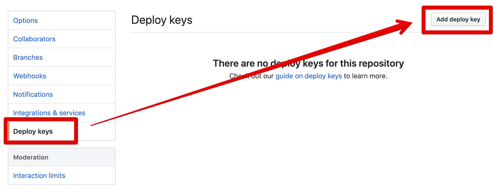

공개키를 등록해야합니다.  
그래서 방금 생성한 공개키 코드를 복사하겠습니다.

```bash
cat /var/lib/jenkins/.ssh/github_ansible-in-action.pub
```

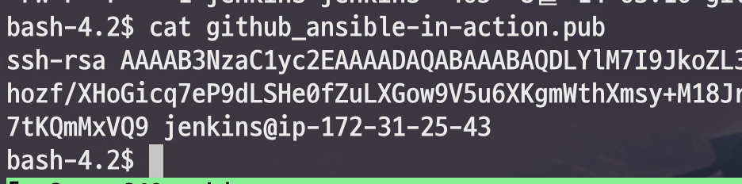

출력된 코드를 복사하여 Key 항목에 붙여넣습니다.

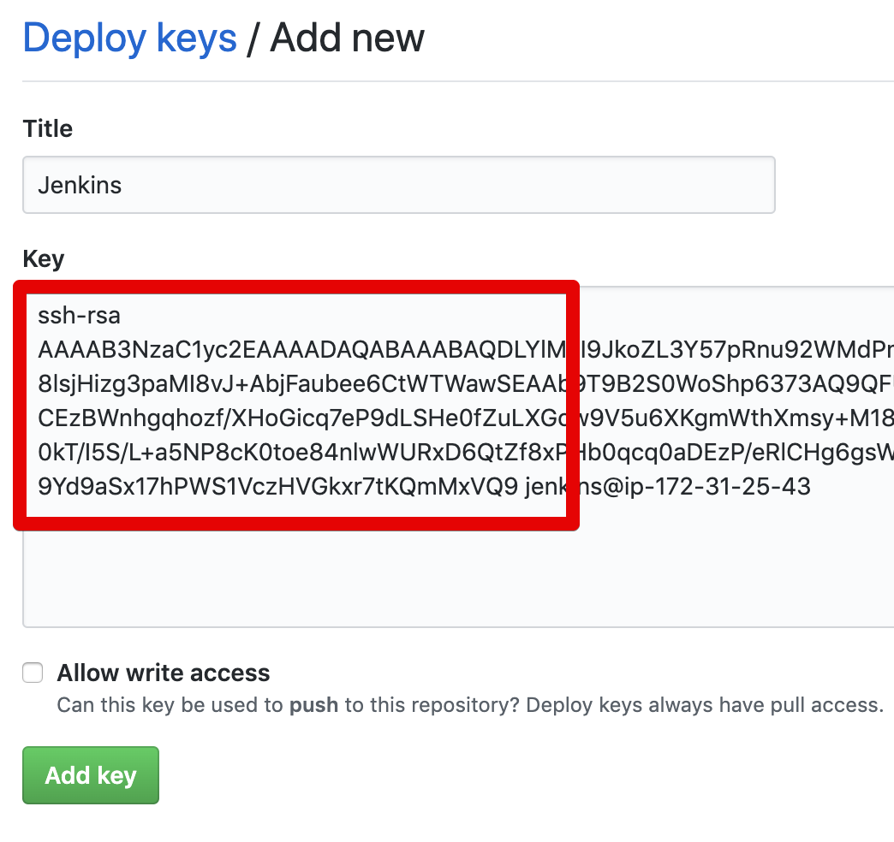

생성 완료를 확인합니다.

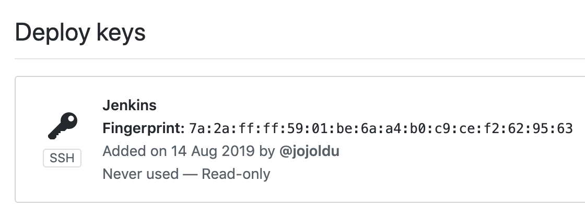

공개키 등록이 되었으니 다시 젠킨스로 이동하여 비밀키 등록을 합니다.

## 3. 젠킨스

젠킨스 메인 화면에서 Credentials -> System -> Global credentials로 차례로 이동합니다.

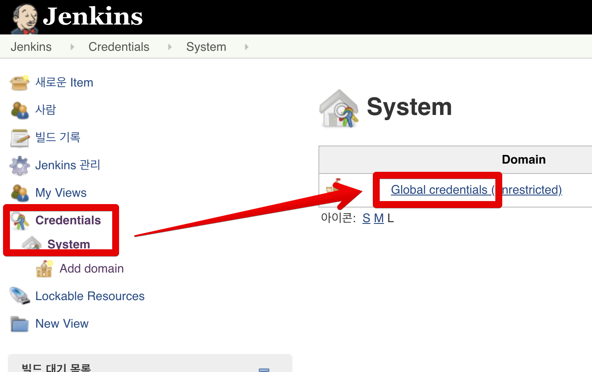

Add Credentials 버튼을 클릭합니다.

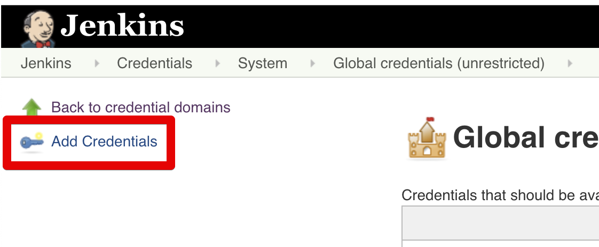

비밀키를 등록하기 위해 젠킨스 서버에 있는 비밀키를 복사합니다.

```bash
cat /var/lib/jenkins/.ssh/github_ansible-in-action
```

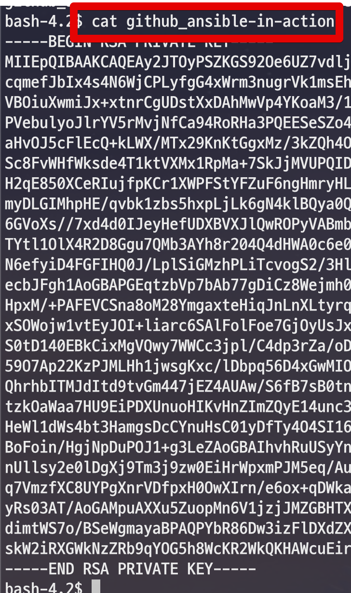

복사가 되셨다면 아래와 같이 항목을 등록합니다.

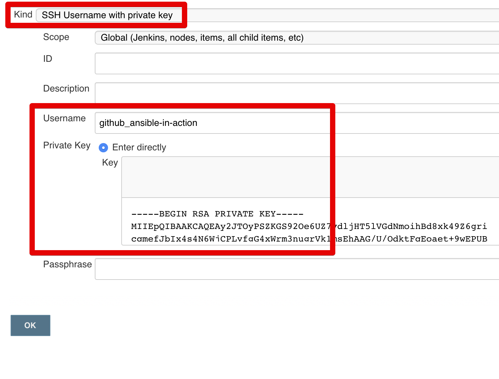

* Kind
  * 인증 방식을 선택합니다.
  * 여기선 비밀키 방식을 선택해야 Github과 공개키/비밀키로 인증이 가능합니다.
* Username
  * 각 젠킨스 Job에서 보여줄 인증키 이름 입니다.
  * 전 키 이름 그대로 사용했습니다.
* Private Key
  * 좀전에 복사한 비밀키를 그대로 붙여넣습니다.

젠킨스 설정도 다 끝났습니다.  
실제로 ssh 연동이 잘 되는지 확인해보겠습니다.

## 4. 테스트

만약 젠킨스에 Git이 설치 안되어있다면 Git 먼저 설치합니다.

```bash
sudo yum install git
```

젠킨스의 새로운 Item을 선택합니다.


FreeStyle 프로젝트를 생성합니다.

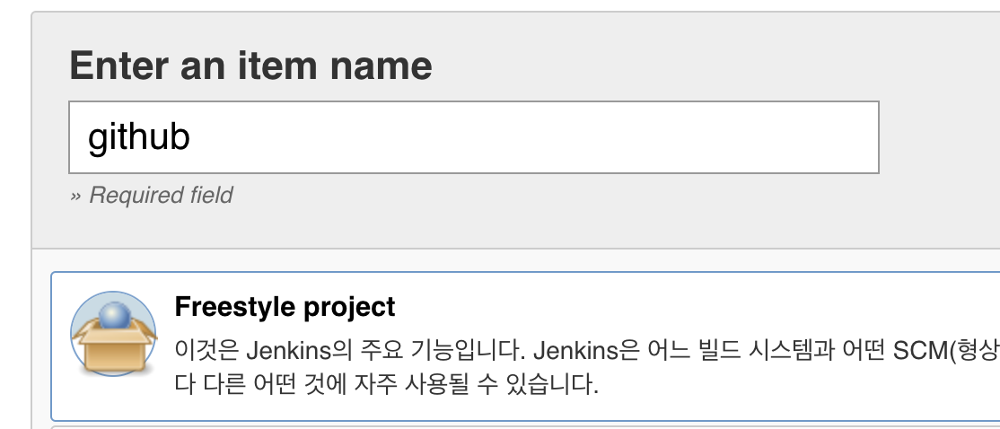

Github의 코드를 가져올 수 있는지 **소스 코드 관리**에 입력해봅니다.

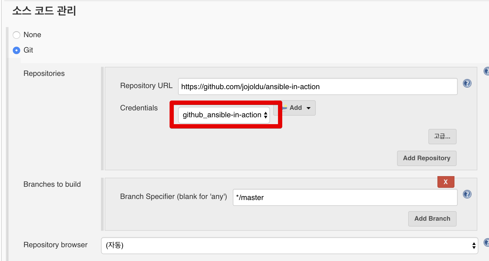

* Repository URL에는 공개키를 등록한 저장소 URL을 등록합니다.
* Credentials에 좀전에 등록한 젠킨스 인증 Username을 선택합니다.
* Branch는 기본 Branch인 master를 등록합니다. 

다 설정이 되셨다면 저장후 Build를 해봅니다.  
  
아래와 같이 Github 에서 코드를 가져오는 로그가 출력된다면 연동 성공입니다.

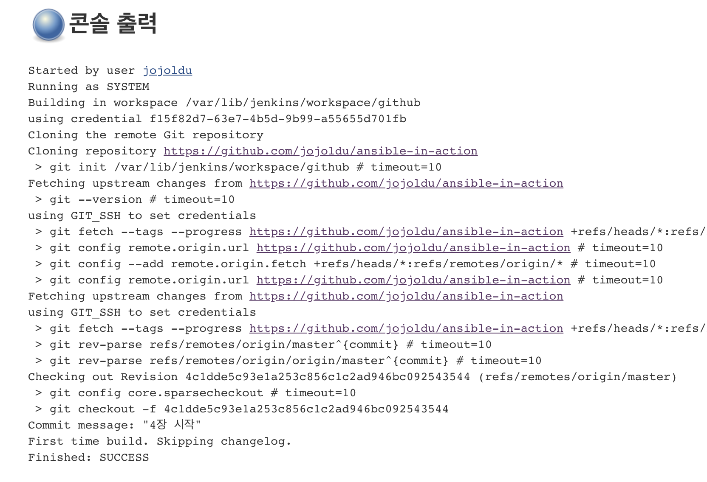