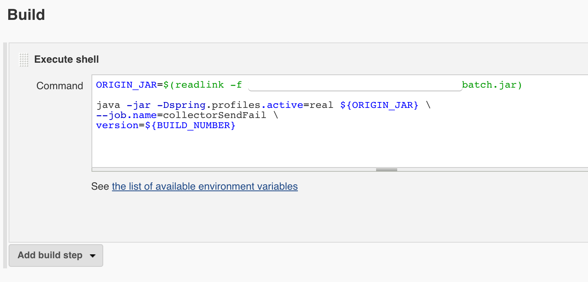
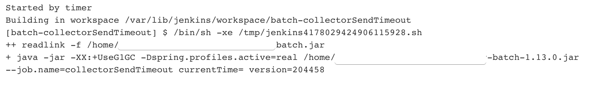

# Spring Batch 공통 설정 관리하기 (feat. 젠킨스 Environment variables)

젠킨스의 경우 스프링 배치의 스케줄러로 많이 사용 됩니다.  
다만, **공통 설정**을 어떻게 해야할지 고민될 때가 많습니다.  
이럴 경우 젠킨스의 Environment variables (**환경 변수**) 가 아주 유용합니다.  
이번 시간에는 젠킨스의 Environment variables를 통해 스프링 배치의 공통 설정들을 관리해보겠습니다.  

> 본문을 보시고 좀 더 좋은 방법이 있으시면 댓글 부탁드리겠습니다!

## 1. 기존 상황

젠킨스에서 스프링 배치를 사용하다보면 다음과 같은 상황을 자주 목격합니다.


```bash
java -jar \
-XX:+UseG1GC \
-Dspring.profiles.active=real \
배치jar \
--job.name=스프링배치Job이름 \
파라미터1=파라미터값1 \
파라미터2=파라미터값2
```

* ```-XX:+UseG1GC```
  * 자바 8 까지는 기본 GC 가 G1GC가 아니기 때문에 설정이 필요합니다.
  * 스프링 배치 역시 자바로 실행되기 때문에 실행 시점에 G1GC 설정을 합니다.
* ```-Dspring.profiles.active=real```
  * 스프링 배치를 실행할 Profile을 결정합니다.
  * 보통 환경에 따라 local, dev, real (or production) 등등으로 해서 로컬/개발/운영 환경 중 어느 환경에서 스프링 배치를 실행하는지를 결정합니다.
  * 여기서는 예시로 real를 선택했습니다.
* ```배치jar```
  * 스프링 배치가 수행될 jar 입니다.
  * 스프링 부트 웹 애플리케이션이 실행되듯 배치 역시 jar 기반으로 실행된다고 보시면 됩니다.

지금 이 젠킨스 Job을 봤을때 크게 이상한게 보이진 않습니다.  
실행시 필요한 설정이 하나라도 추가되거나 수정되어야 한다면 어떨까요?  
더군다나 이런 **Job이 50개, 100개 이상** 있다면 어떻게 해야할까요?  
한땀 한땀 Job 실행 스크립트를 수정해야만 합니다.  
  
불편함이 많겠죠?  
그래서 이런 부분을 개선해보겠습니다.

## 2. 젠킨스 Environment variables 설정하기

여기서 공통화 할 수 있는 부분과 아닌 부분을 분리해보겠습니다.  
공통할 수 없는 부분은 아래와 같습니다.  

```bash
--job.name=스프링배치Job이름 \
파라미터1=파라미터값1 \
파라미터2=파라미터값2
```

실행할 배치 job name이나 그에 따른 파라미터 등은 당연히 모든 Job 마다 다르니 공통설정으로 뺼 순 없습니다.  
대신!  
아래와 같이 배치 jar 환경에 관한 설정은 **모든 Job마다 공통으로 들어가야할 부분**입니다.  

```bash
-XX:+UseG1GC \
-Dspring.profiles.active=real \
배치jar \
```

이 부분들을 옮기겠습니다.  

Jenkins 관리 페이지로 이동 후


시스템 설정 페이지로 이동합니다.


시스템 설정 페이지는 젠킨스 전체 설정을 관리하는 곳입니다.  
메이븐 레파지토리를 비롯해서 앤서블 플러그인을 설치했다면 앤서블 설정까지 다루는 곳이라 보시면 됩니다.  
  
여기서 Global properties -> Environment variables 항목으로 가보시면 아래와 같이 Key/Value 방식으로 **환경 변수**를 선언할 수 있습니다.  
  


* ```JAR_NAME```
  * 실행할 Jar 위치가 저장된 변수입니다.
  * ex) /home/jojoldu/spring-batch/batch.jar 등
* ```JVM_OPTS```
  * G1GC 등의 JVM 옵션 항목이 저장된 변수입니다.
  * xmx, xms 등의 옵션도 필요에 따라 추가하시면 됩니다.
* ```PROFILES_ACTIVE```
  * 스프링 배치의 Profile 항목이 저장된 변수입니다.
  * real이라는 값만 저장하지 않고, **시스템 변수 설정까지** (```-Dspring.profiles.active```) 저장합니다.
* ```JAR_OPTS```
  * 위에서 언급한 설정들을 모두 모아 저장된 변수입니다.
  * 젠킨스 **환경 설정들간에 참조가 가능**합니다.

자 설정이 다 되셨다면 다시 좀 전의 젠킨스 Job으로 이동합니다.  
그리고 이제 기존 설정들을 모두 **환경 변수**로 전환합니다.


```bash
java -jar ${JAR_OPTS} ${JAR_NAME} \
--job.name=스프링배치Job이름 \
파라미터1=파라미터값1 \
파라미터2=파라미터값2
```

* 젠킨스 Environment variables는 ```${키}``` 로 사용할 수 있습니다.
  * 젠킨스 Job 파라미터 호출 방법과 동일합니다.
  * 여기서는 2개의 변수 ```${JAR_OPTS}```, ```${JAR_NAME}``` 를 호출했습니다.
* ```java -jar ${JAR_OPTS} ${JAR_NAME}```
  * ```java -jar``` 외에 나머지 설정들이 모두 환경 변수로 변경 되었습니다.

자 이렇게 설정 후 다시 Job을 실행해보시면!


환경 변수가 정상적으로 작동하는 것을 확인할 수 있습니다.  
  
기본적인 사용 방법은 이걸로 확인이 되셨을것 같습니다.  
한가지 더 나아가보겠습니다.

## 3. readlink 사용하기

스프링 배치를 무중단 배포하기 위해서 자주 사용하는 방식이 readlink입니다.  

> readlink란 **심볼릭 링크가 연결되어 있는 원본의 파일명**을 가져오는 명령어 입니다.
참고 : [readlink란?](https://www.joinc.co.kr/w/man/2/readlink)
어떻게 사용되는지 궁금하신 분들은 [이전에 작성된 포스팅](https://jojoldu.tistory.com/315)을 참고해보세요.

그래서 배치 Job을 실행하는 명령어는 다음과 같이 작성되는 경우가 많습니다.



```bash
ORIGIN_JAR=$(readlink -f 배치jar)

java -jar \
-XX:+UseG1GC \
-Dspring.profiles.active=real \
${ORIGIN_JAR} \
--job.name=스프링배치Job이름 \
파라미터1=파라미터값1 \
파라미터2=파라미터값2
```

이 부분 역시 Environment variables 로 공통화 시켜보겠습니다.  
  
챕터2에서 진행한 부분에서 **JAR_NAME**만 변경합니다.


여기서 ```$(readlink -f 배치jar)``` 이 부분을 통째로 환경 변수에 넣으면 안되나 싶으실텐데요.  
환경 변수에는 function 실행 기능이 없어, readlink 가 정상 작동 하지 않습니다.  
  
그래서 ```readlink -f 배치jar``` 까지만 환경변수로 등록하고, ```$()``` 는 실제 Job 에서 수행합니다.
  
이렇게 환경 변수 등록 후, 젠킨스 Job 쉘은 아래와 같이 변경합니다.

```bash
java -jar ${JAR_OPTS} $(${JAR_NAME}) \
--job.name=스프링배치Job이름 \
파라미터1=파라미터값1 \
파라미터2=파라미터값2
```

챕터 2에 비해 달라진 점은 한가지입니다.  

* ```${JAR_NAME}``` -> ```$(${JAR_NAME})```

주소를 직접 쓰는 방식에서 readlink로 원본 파일를 가져와서 실행하는 방식으로 변경된 것입니다.  

* ```$(${JAR_NAME})``` 는 실제로는 환경 변수 ```${JAR_NAME}``` (readlink -f 배치jar) 라는 명령어를 ```$()```를 통해 실행 결과를 가져온것이라 생각하시면 됩니다.

이렇게 변경 후 실행해보시면!



정상적으로 잘 수행되는 것을 확인할 수 있습니다.  
  
이렇게 개선하고 나니, 앞으로 모든 젠킨스의 스프링 배치 Job은 ```java -jar ${JAR_OPTS} $(${JAR_NAME})``` 로 실행할 수 있습니다.  
  
환경 변수로 Jar 옵션과 Jar 위치를 모두 한곳에 모아두었기 때문에 이후에 옵션 추가, 옵션 변경, Jar 위치 변경 등이 있을때 언제든 편하게 변경 가능합니다.  

## 참고

* [Jenkins environment variables](https://medium.com/@mukeshsingal/access-jenkins-global-environment-variables-using-groovy-or-java-b5c1e6b53685)