# EC2 (Amazon Linux 1) 에 Jenkins 설치하기


아마존 리눅스 1에서 Jenkins 설치 하는 방법이 여기저기 퍼져있어, 하나의 글로 정리합니다.

## 1. 버전 확인

먼저 현재 자신의 서버가 아마존 리눅스 1이 맞는지 확인합니다.  

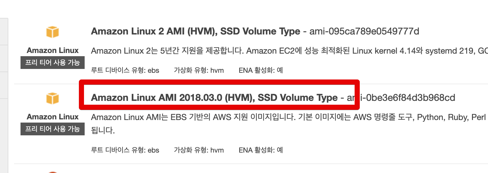

기억이 안나신다면 서버에서 아래 명령어로 버전을 확인합니다.

```bash
cat /etc/*release
```


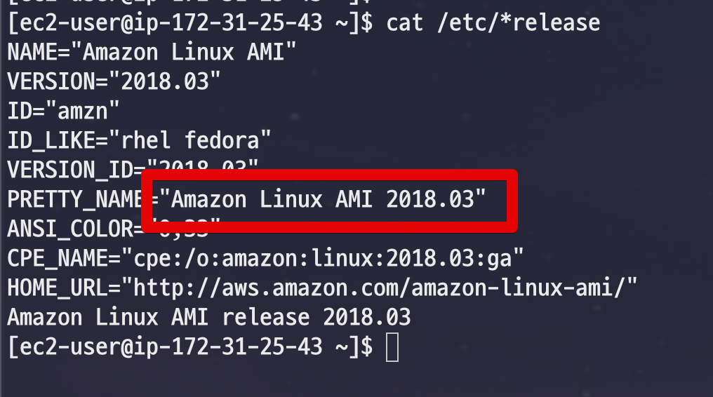


Linux2가 적혀있지 않다면 1이 맞으니 그대로 진행하시면 됩니다.  
Linux1의 경우 실제로 Centos 6.x 버전이라 Centos 6을 쓰시는 분들도 동일하게 쓰시면 됩니다.

## 2. Jenkins 설치

먼저 ```yum update```로 최신화 합니다.

```bash
sudo yum update
```

그리고 Jenkins를 설치해보겠습니다.  
여기서 다른 서비스들 처럼 ```yum```으로 Jenkins를 설치하려고 하실텐데요.  
기본 패키지에는 Jenkins가 포함되어 있지 않습니다.  
  
실제로 현재 상태에서 설치를 시도해보면 패키지가 없다고 나옵니다.

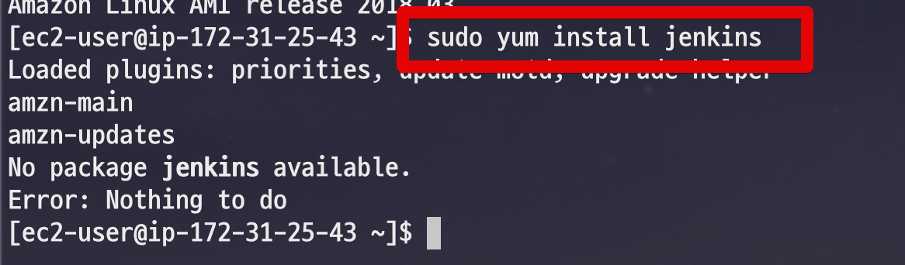

그래서 ```yum``` 패키지 저장소에 Jenkins를 수동으로 등록합니다.  
  
아래 명령어들을 차례로 등록합니다.  
먼저 ```wget```으로 Jenkins 저장소를 yum 저장소에 다운받습니다.

```bash
sudo wget -O /etc/yum.repos.d/jenkins.repo https://pkg.jenkins.io/redhat-stable/jenkins.repo
```

그리고 Jenkins 저장소 키를 등록합니다.

```bash
sudo rpm --import https://pkg.jenkins.io/redhat-stable/jenkins.io.key
```

이제 패키지가 수동으로 저장소에 등록되었으니 ```yum install```을 진행하면 됩니다.

```bash
sudo yum install jenkins
```

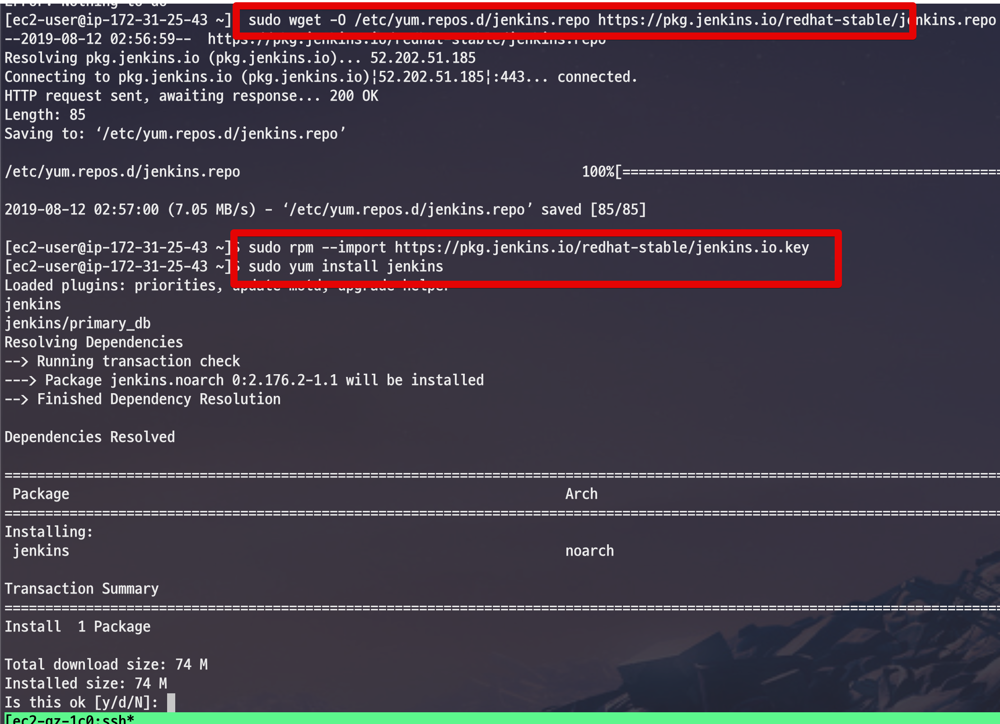

다 설치가 되셨다면 Jenkins를 실행해봅니다.

```bash
sudo service jenkins start
```

### 2-1. Exception

만약 실행을 했는데, 아래와 같이 ```java.lang.UnsupportedClassVersionError```이 발생한다면 현재 Jenkins 버전과 설치된 **자바 버전간 호환이 되지 않는다**는 이야기입니다.

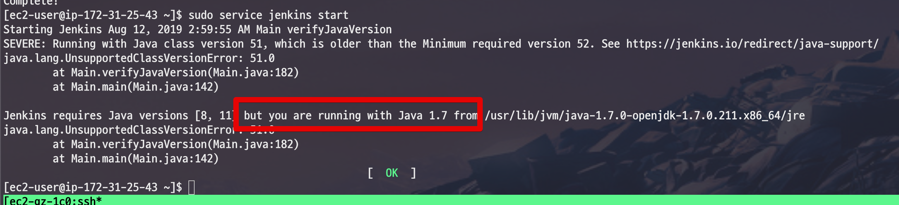

아래 링크를 참고하여 Java 8 버전을 설치합니다.

* [자바8 설치](https://jojoldu.tistory.com/261)

## 3. Nginx 설치

보통 Jenkins만 설치해서 사용하진 않고, Nginx를 통해 프록시까지는 같이 진행합니다.  
그래서 여기서도 함께 설정하겠습니다.  
  
Nginx의 경우 yum의 기본 패키지에 등록되어있어 ```yum install```로 설치 가능합니다.

```bash
sudo yum install nginx
```

설치가 다 되셨다면 프록시 설정을 진행합니다.  
이 프록시는 80 포트 (Nginx) 로 들어온 접근을 8080 (Jenkins) 로 프록시 패스해줍니다.
  
설정 파일 (```/etc/nginx/nginx.conf```) 을 열어서

```bash
sudo vim /etc/nginx/nginx.conf
```

아래 코드를 등록합니다.

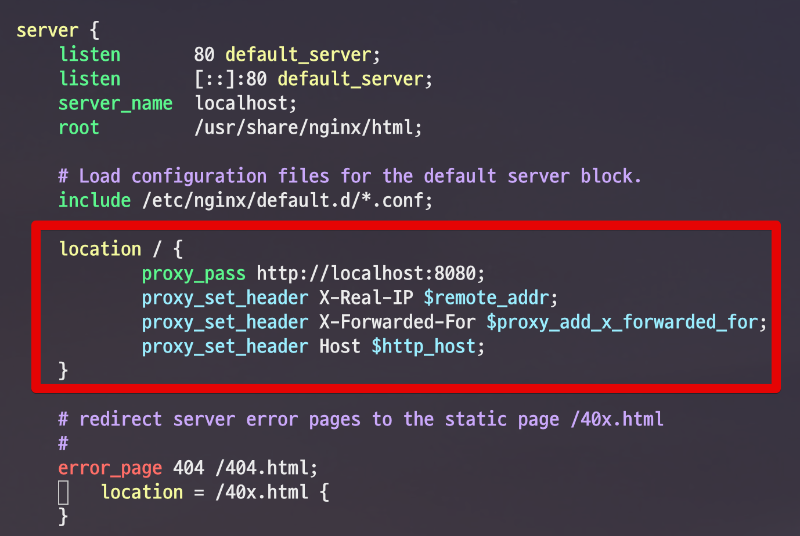

```bash
proxy_pass http://localhost:8080;
proxy_set_header X-Real-IP $remote_addr;
proxy_set_header X-Forwarded-For $proxy_add_x_forwarded_for;
proxy_set_header Host $http_host;
```

설정이 다 되셨다면 Nginx를 실행해봅니다.

```bash
sudo service nginx start
```

### 3-1. EC2 보안그룹
  
해당 EC2 서버로 80 포트가 열려 있어야 하니, EC2 보안 그룹에서 80포트가 열려있는지 확인해봅니다.

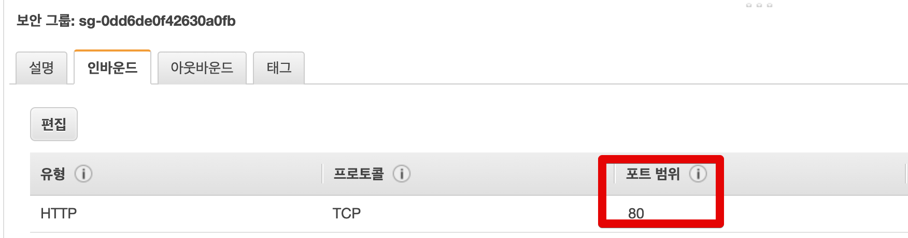

## 4. Jenkins 설정

브라우저를 열어 EC2 서버로 접근해보시면 아래와 같이 Jenkins 설치 화면이 나옵니다.  
화면에 나오는 위치의 Password 코드를 입력창에 등록해야 합니다.

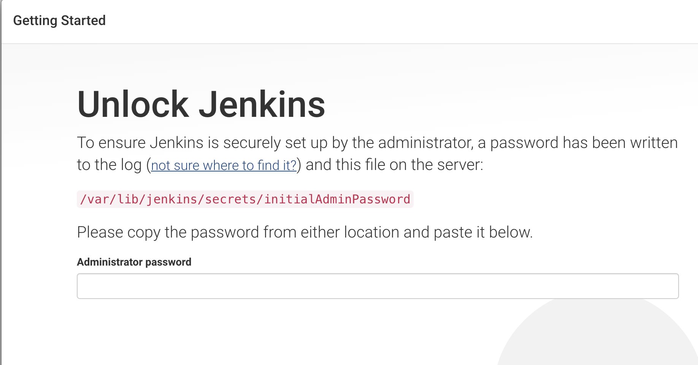

cat으로 해당 코드를 확인하여

```bash
sudo cat /var/lib/jenkins/secrets/initialAdminPassword
```

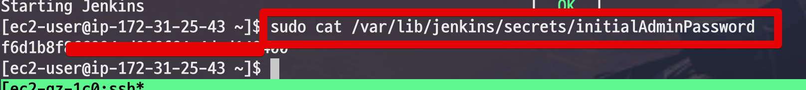

입력 화면에 붙여넣습니다.  
  
다음 화면에서는 플러그인 설치 화면인데, **Jenkins가 추천하는 플러그인**들을 설치합니다.

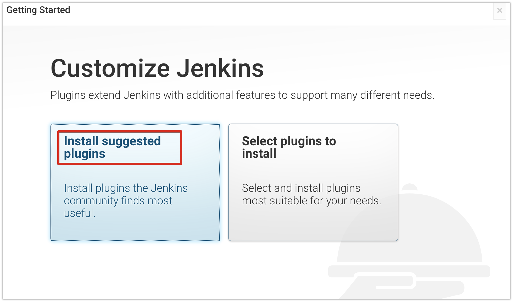

첫 로그인을 진행할 계정도 하나 생성합니다.

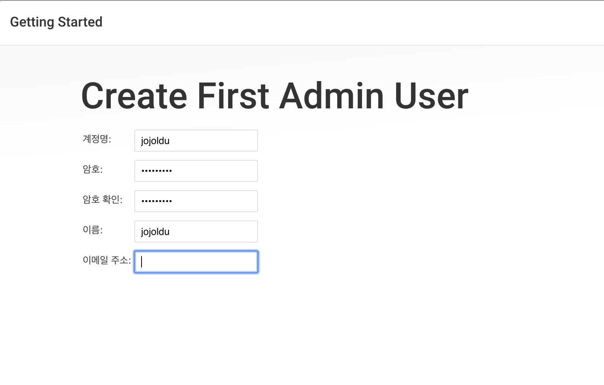

그럼 아래와 같이 설치가 완료된 것을 확인할 수 있습니다.

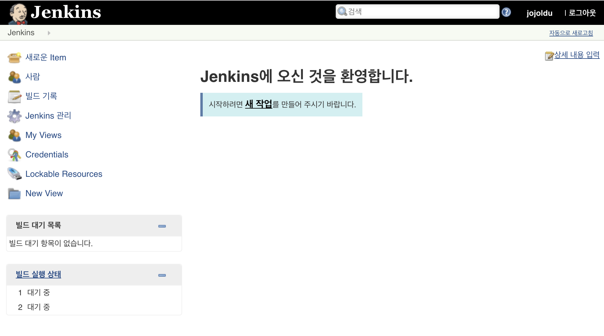

## 5. Jenkins 꾸미기

설치가 다 되셨다면 이후에 깃헙 로그인으로 교체하시거나 머티리얼 테마로 변경하는 등 본인만의 Jenkins로 꾸미시면 됩니다.

* [Github 로그인](https://jojoldu.tistory.com/310)
* [머티리얼 테마 적용하기](https://jojoldu.tistory.com/343)
* [CI구축 연습하기](https://jojoldu.tistory.com/139)

