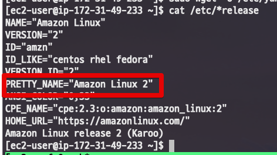
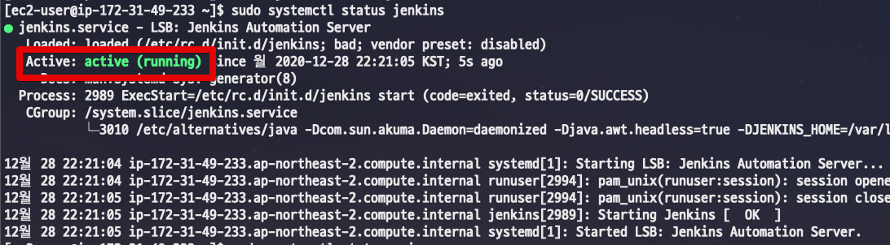
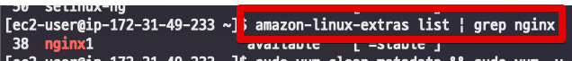

# Amazon Linux2 에 Jenkins 설치하기

기존에 작성된 [EC2 (Amazon Linux 1) 에 Jenkins 설치하기](https://jojoldu.tistory.com/441) 이 있지만, 현재 AWS에서 Amazon Linux2가 메인 이미지가 되었기에 해당 버전으로 설치하는 법을 진행하겠습니다.

## 1. 버전 확인

먼저 현재 자신의 서버가 Amazon Linux2가 맞는지 확인합니다.  
기억이 안나신다면 서버에서 아래 명령어로 버전을 확인합니다.

```bash
cat /etc/*release
```



## 2. Jenkins 설치

Jenkins 설치에는 크게 달라진 점은 없습니다.  
다만, Jenkins 설치에 필요한 Java가 **기본 설치되어 있지 않습니다**.  

> Amazon Linux 1에서는 Java7이 기본 설치되어 있었습니다.

Jenkins 설치를 위해서는 Java가 필수이니 [Java를 설치](https://jojoldu.tistory.com/261)합니다.  
(설치법은 Linux1과 동일합니다.)  
  

```bash
sudo wget -O /etc/yum.repos.d/jenkins.repo https://pkg.jenkins.io/redhat-stable/jenkins.repo
```

Key Import를 위한 [URL 주소에 변경](https://issues.jenkins.io/browse/WEBSITE-741)이 있었습니다.  
  
아래와 같이 에러 메세지가 뜬다면 ```rpm --import``` 코드를 변경하시면 됩니다.

```bash
Public key for jenkins-2.272-1.1.noarch.rpm is not installed
```

정상적으로 import 하시려면 아래 코드를 사용하시면 됩니다.

```bash
sudo rpm --import https://pkg.jenkins.io/redhat/jenkins.io.key
```

```bash
sudo systemctl start jenkins
```

```bash
sudo systemctl status jenkins
```



## 3. Nginx 설치

Amazon Linux2에서는 더이상 Nginx가 기본 yum 패키지로 지원되지 않습니다.  

```bash
amazon-linux-extras list | grep nginx
```



```bash
sudo yum clean metadata && sudo amazon-linux-extras install nginx1
```

```bash
sudo systemctl start nginx
```

```bash
sudo systemctl status nginx
```