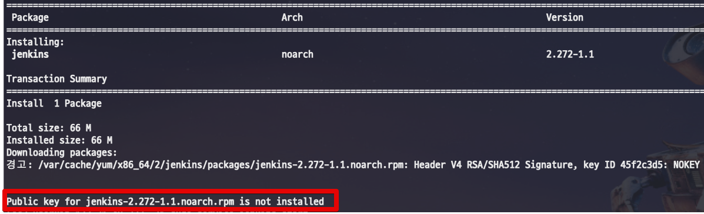
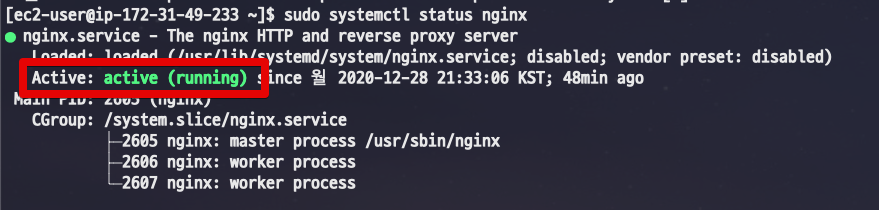

# Amazon Linux2 에 Jenkins 설치하기

기존에 작성된 [EC2 (Amazon Linux 1) 에 Jenkins 설치하기](https://jojoldu.tistory.com/441) 이 있지만, 현재 AWS에서 Amazon Linux2가 메인 이미지가 되었기에 해당 버전으로 설치하는 법을 진행하겠습니다.

> 아시다시피 Amazon Linux 2는 CentOS 7.x 호환입니다.

## 1. 버전 확인

먼저 현재 자신의 서버가 Amazon Linux2가 맞는지 확인합니다.  
기억이 안나신다면 서버에서 아래 명령어로 버전을 확인합니다.

```bash
cat /etc/*release
```


## 2. Jenkins 설치

Jenkins 설치는 크게 달라진 점은 없습니다.  
다만, Jenkins 설치에 필요한 **Java가 기본 설치되어 있지 않습니다**.  

> Amazon Linux 1에서는 Java7이 기본 설치되어 있었습니다.

그래서 기존처럼 Java7을 삭제할 필요는 없고, 빠르게 [Java 8](https://jojoldu.tistory.com/261)을 설치만 하면 됩니다.  
(설치법은 Linux1과 동일합니다.)  
  
Java가 설치되셨으면 Jenkins 설치로 갑니다.  

```bash
sudo wget -O /etc/yum.repos.d/jenkins.repo https://pkg.jenkins.io/redhat-stable/jenkins.repo
```

기존처럼 설치하시다가, 아래와 같이 에러 메세지가 나올 수 있습니다.



```bash
Public key for jenkins-2.272-1.1.noarch.rpm is not installed
```

Key Import를 위한 [URL 주소에 변경](https://issues.jenkins.io/browse/WEBSITE-741)이 있었습니다.  
그래서 정상적으로 import 하시려면 아래 코드를 사용하시면 됩니다.

```bash
sudo rpm --import https://pkg.jenkins.io/redhat/jenkins.io.key
```

설치가 다 되셨으면 아래 명령어로 Jenkins를 실행해봅니다.

```bash
sudo systemctl start jenkins
```

정상적으로 Jenkins가 실행되었는지는 아래 명령어로 확인합니다.

```bash
sudo systemctl status jenkins
```


## 3. Nginx 설치

Nginx를 통해 프록시까지 같이 진행하시는 분들은 Nginx도 같이 설치해봅니다.  
  
Amazon Linux2에서는 더이상 Nginx가 **기본 yum 패키지로 지원되지 않습니다**.  
  
대신, amazon-linux-extras repository에서 지원하니, 해당 repository를 통해 설치합니다.  
  
먼저 Nginx가 amazon-linux-extras repository에서 지원하는게 맞는지 확인을 해봅니다.

```bash
amazon-linux-extras list | grep nginx
```


패키지가 검색이 되면, 설치가 가능한 것이니 아래 명령어로 설치를 진행합니다.

> nginx가 아닌 nginx1로 되어있음을 확인할 수 있습니다.

```bash
sudo yum clean metadata && sudo amazon-linux-extras install nginx1
```

설치가 다 되셨으면 프록시 설정을 합니다.  
Amazon Linux1 때와 마찬가지로 80 포트 (Nginx) 로 들어온 접근을 8080 (Jenkins) 로 프록시 패스해줍니다.  
  
설정 파일 (```/etc/nginx/nginx.conf```) 을 열어서

```bash
sudo vim /etc/nginx/nginx.conf
```

아래 코드를 등록합니다.


```bash
proxy_pass          http://localhost:8080;
proxy_http_version  1.1;
proxy_set_header X-Real-IP $remote_addr;
proxy_set_header X-Forwarded-For $proxy_add_x_forwarded_for;
proxy_set_header Host $http_host;
```

설정이 다 되셨다면 Nginx를 실행해봅니다.

```bash
sudo systemctl start nginx
```

Nginx가 잘 수행되었는지는 아래 명령어로 확인합니다.

```bash
sudo systemctl status nginx
```



이후 남은 설치법은 [기존 Jenkins 설치 방법](https://jojoldu.tistory.com/441) (보안그룹 등록 + 젠킨스 설치 마법사 실행등) 과 동일하니 그대로 이어서 진행하시면 됩니다.