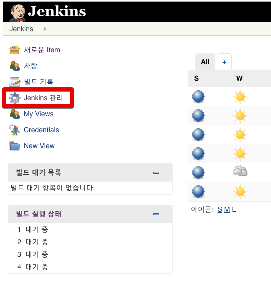
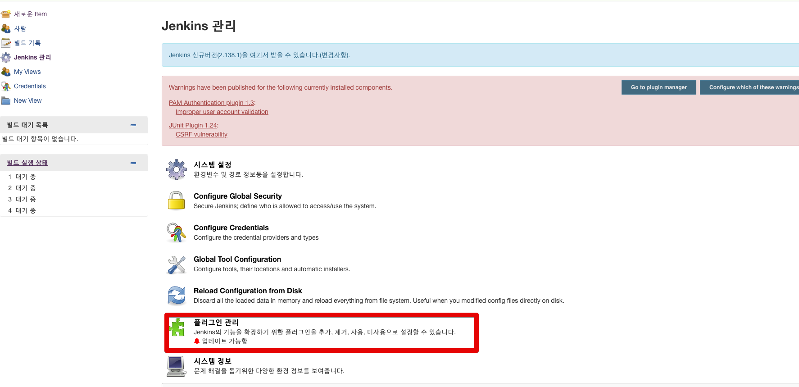
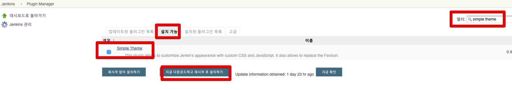
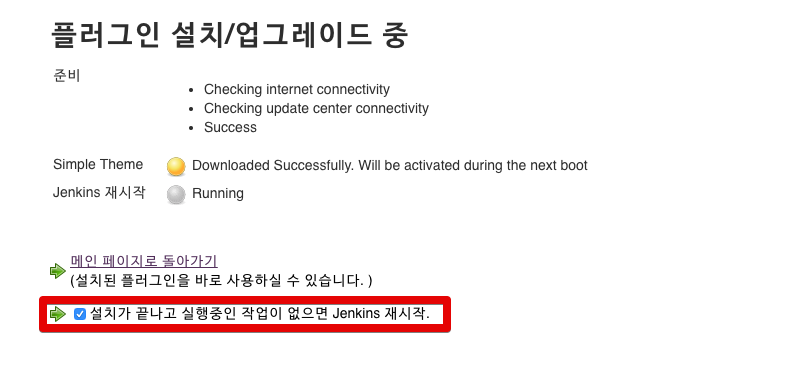
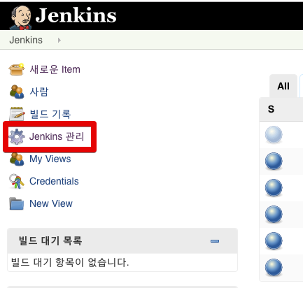
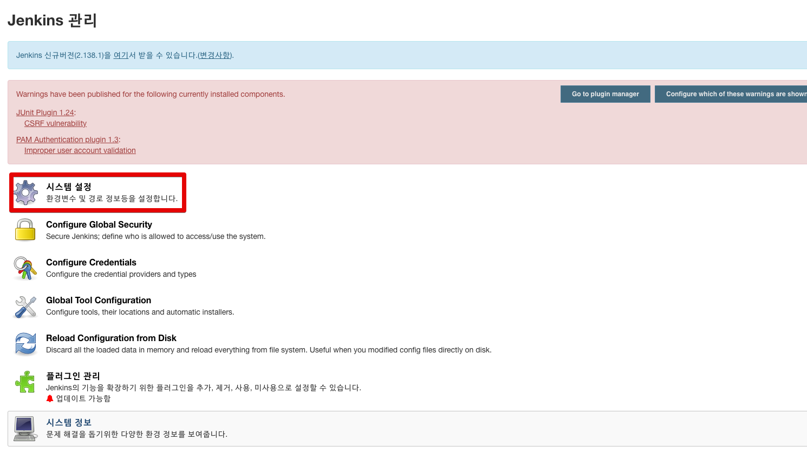
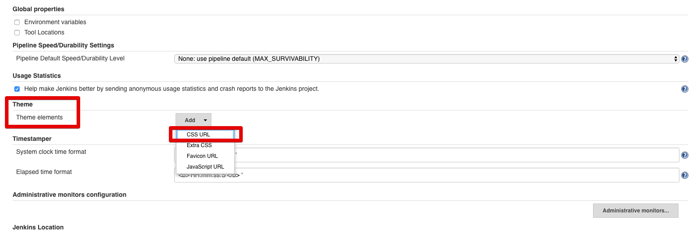
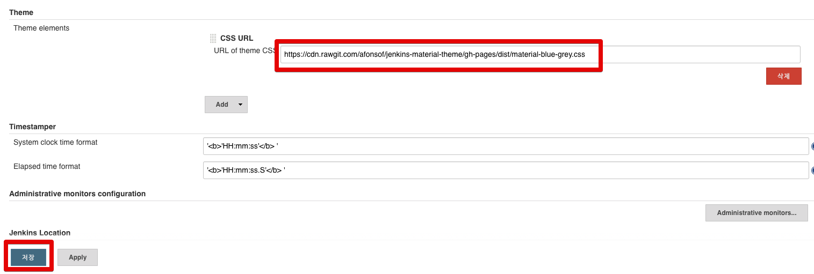
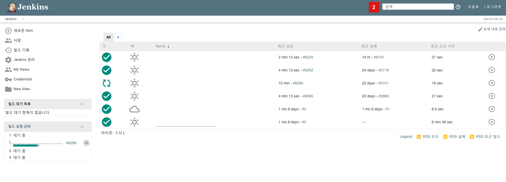

# Jenkins에 머티리얼 테마 적용하기

Jenkins를 사용하다보면 이쁜 테마를 사용하고 싶을 때가 있습니다.  
그럴때 [Simple Theme Plugin plugin](https://wiki.jenkins.io/display/JENKINS/Simple+Theme+Plugin)을 사용하시면 원하는 색의 머티리얼 테마가 적용된 젠킨스를 볼 수 있습니다.  

적용이 아주 쉽기 때문에 빠르게 진행하겠습니다.  
  
먼저 자신의 Jenkins로 접속해 **Jenkins 관리**를 클릭합니다.



관리 페이지에서 플러그인 관리로 이동합니다.



**설치 가능** -> ```simple theme```를 검색 -> 플러그인 체크 -> **지금 다운로드하고 재시작 후 설치하기** 클릭



플러그인 설치/업그레이드 페이지로 자동으로 이동이 됩니다.  
여기서는 **설치가 끝나고 실행중인 작업이 없으면 Jenkins 재시작**을 체크합니다.



2~3분정도 기다리시면 설치가 끝나고 자동으로 Jenkins가 재시작됩니다.  
  
Jenkins가 재시작 되셨으면 다시 **Jenkins 관리**로 이동합니다.



**시스템 설정**으로 이동합니다.



설정 화면에서 **Theme** 항목으로 가셔서 **Add** 버튼을 클릭합니다.  
여기서 **CSS URL** 항목을 선택합니다.



CSS URL 입력 화면에서 테마 URL 을 입력하시면 되는데, URL 주소는 아래 링크에서 확인 가능합니다.

* [jenkins-material-theme](https://github.com/afonsof/jenkins-material-theme)

해당 Github으로 가보시면 여러 테마색이 나옵니다.


원하는 테마색의 컬러명을 아래 URL 주소에서 ```{{your-color-name}}``` 텍스트와 교체합니다.

```
https://cdn.rawgit.com/afonsof/jenkins-material-theme/gh-pages/dist/material-{{your-color-name}}.css
```

즉, blue 색을 원하시면 다음과 같은 주소가 됩니다.

```
https://cdn.rawgit.com/afonsof/jenkins-material-theme/gh-pages/dist/material-blue.css
```

만드신 주소를 입력 화면에 등록합니다.



저장하신뒤 새로고침 해보시면!



이렇게 머티리얼 테마가 적용된 Jenkins로 변경됩니다.