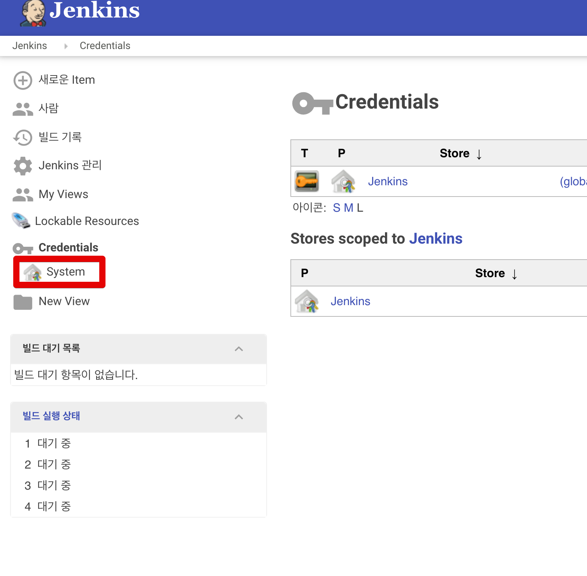
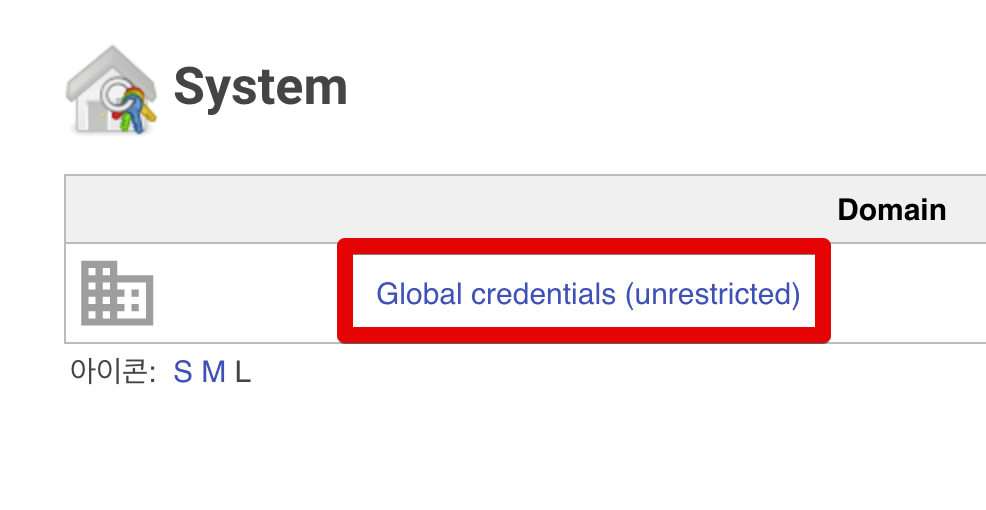
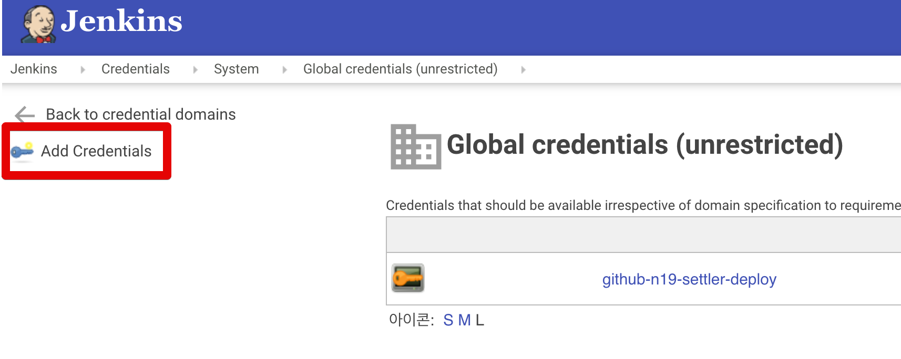
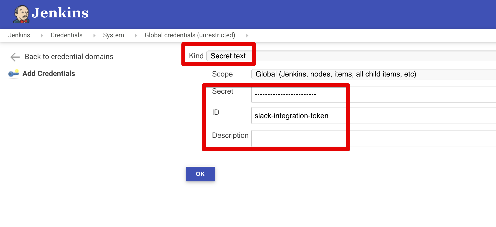
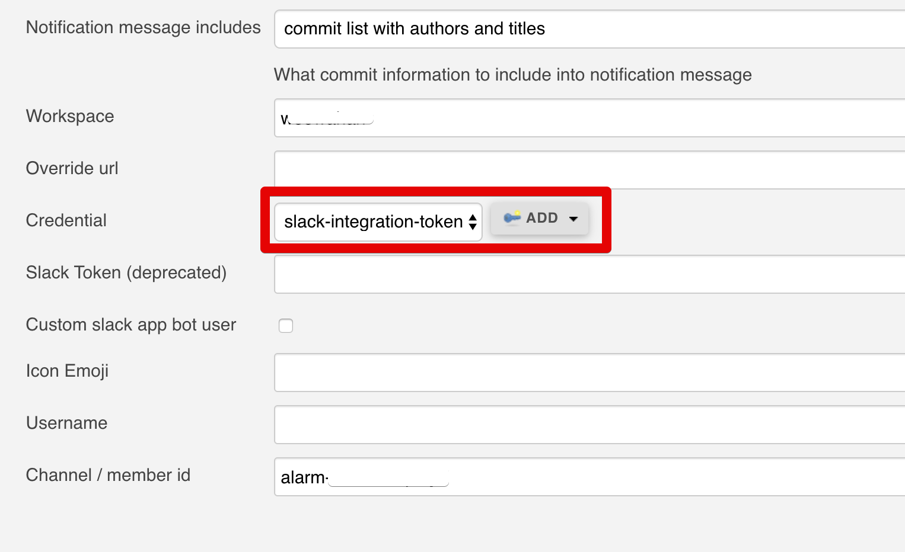
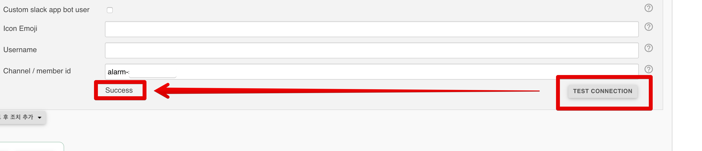

# 젠킨스 Slack 알람 변경된 토큰 등록 방식

젠킨스 Slack Notification 플러그인이 버전업 되면서 더이상 Integration Token을 Job Config에서 바로 설정할 수 없게 되었습니다.  
  
기존 플러그인을 사용한다면 문제 없지만, 최근에 젠킨스를 설치하면 플러그인 역시 최신 버전으로 받게되니 참고하시면 될것 같습니다.  
  
기존의 [Github ssh 연동](https://jojoldu.tistory.com/442)과 동일한 방식으로 진행합니다.  
  
좌측 사이드의 Credentials -> System로 차례로 이동합니다.

Grlobal credentials를 클릭합니다

화면 좌측에 있는 Add Credentials를 클릭해 Credentials 등록 화면으로 이동합니다.

Kind 항목에서 Secret text를 선택하고 아래와 같이 항목을 등록합니다.

* Secret: 기존에 사용하시던 Slack Integration Token을 등록합니다
* ID: Jenkins Job Config에서 보여줄 이름을 등록합니다.

다 등록하셨으면 기존에 있는 혹은 새로 만든 Jenkins Job 설정으로 갑니다.  
설정에서 Slack 관련 항목에 있는 Credential에서 방금 등록한 Token을 선택합니다.

이제 테스트를 해보면?

정상적으로 인증이 되어 메세지가 발송하는 것을 확인할 수 있습니다.