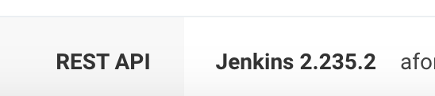

# Jenkins 버전 업데이트하기



```bash
ps -ef | grep jenkins
```


```bash
service jenkins stop
```


가장 최신 버전

```bash
http://mirrors.jenkins-ci.org/war/latest/jenkins.war
```

LTS 버전

```bash
http://mirrors.jenkins-ci.org/war-stable/latest/jenkins.war
```


```bash
wget http://mirrors.jenkins-ci.org/war/latest/jenkins.war
```

```bash
wget http://mirrors.jenkins-ci.org/war-stable/latest/jenkins.war
```


```bash
mv 다운받은war경로 /usr/lib/jenkins/jenkins.war
```