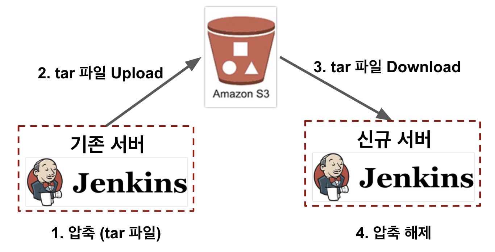
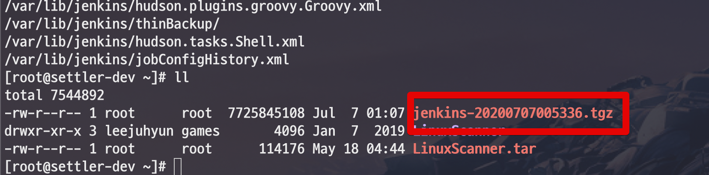
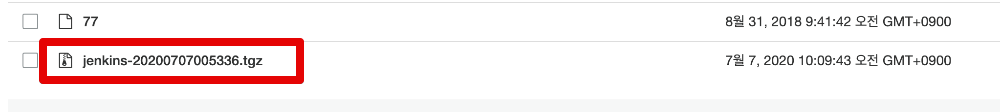
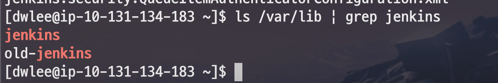
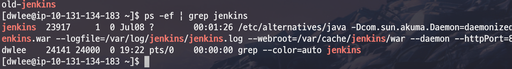
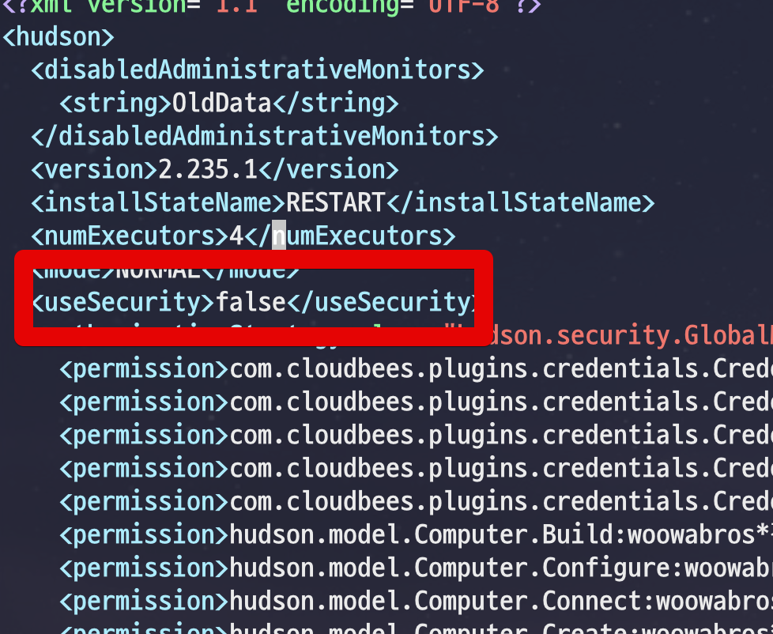
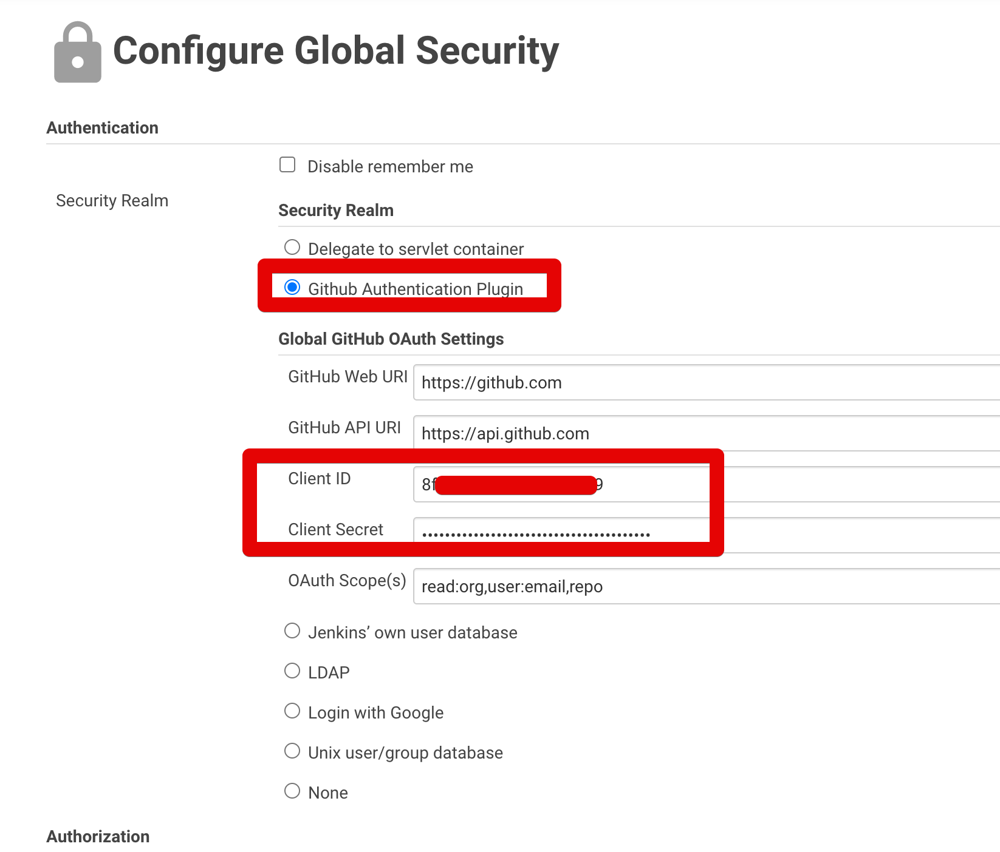
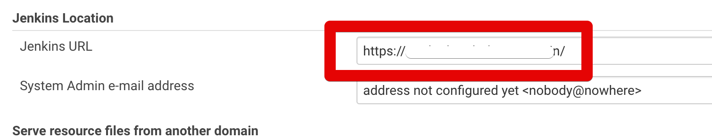

# AWS S3를 이용한 Jenkins 마이그레이션

기존 Jenkins 환경을 다른 서버로 마이그레이션을 해야할 때가 있습니다.  

> 일반적으로는 잘 없지만, 계열사 혹은 서비스 분리로 AWS 환경 자체가 변경될 경우가 있습니다.

그럴때를 대비해서 EC2에 설치된 Jenkins를 다른 EC2로 마이그레이션 하는 방법을 진행해보겠습니다.  
  
전체 구조는 아래와 같습니다.



Jenkins는 모든 설정과 Job 내용이 **파일**로 관리가 됩니다.  
그래서 Jenkins가 설치된 디렉토리 전체를 타 서버로 이관만 하면 마이그레이션은 끝입니다.  

그럼 하나씩 진행해보겠습니다.

## 1. 기존 서버

먼저 기존에 운영되던 Jenkins EC2 서버에서 root 계정으로 전환합니다.

```bash
sudo su - root
```

안전하게 이관하기 위해 실행중인 Jenkins를 정지합니다.

```bash
service jenkins stop
```

혹시나 압축하는 동안 신규 로그가 쌓일 수 있으니 정지하고 진행합니다.

> 물론 무중단으로 백업하고 싶으시다면 디렉토리 복사한 뒤에 압축하여도 무방합니다.

Jenkins 설정이 있는 디렉토리 위치는 ```/var/lib/jenkins``` 입니다.  
아래 명령어로 해당 디렉토리를 ```tar```로 압축하겠습니다.

```bash
cd /var/lib
tar cvzf jenkins-`date +"%Y%m%d%H%M%S"`.tgz jenkins
```

압축이 다 되셨다면 ```jenkins-xxxxx.tgz``` 와 같이 압축시간이 포함된 tgz 파일이 생성 됩니다.  



압축이 끝나면 다시 ```service jenkins start``` 로 실행하시면 됩니다.  
  
해당 파일을 S3로 업로드 합니다.

```bash
aws s3 cp jenkins-20200707005336.tgz s3://버킷명/
```

지정된 버킷으로 잘 업로드 된 것을 확인합니다.



여기까지 되셨으면, 기존 서버에서 할 일은 끝입니다.  
바로 신규 서버로 넘어가겠습니다.

## 2. 신규 서버

신규 서버에서도 Jenkins가 설치되어 있어야만 합니다.  
신규 서버에 아직 Jenkins를 설치 안했다면, [이전 포스팅](https://jojoldu.tistory.com/441)을 참고하셔서 Jenkins를 설치합니다.  
  
설치가 다 되셨다면 신규 서버에서도 root 계정으로 전환 후 작업을 진행합니다.
  
```java
sudo su - root
```

기존 서버에서 S3로 올린 tar 파일을 다운 받습니다.  

```bash
aws s3 cp s3://버킷명/jenkins-20200707005336.tar /var/lib/
```

다운로드가 끝나면, 방금 설치되어 기본 설정만 되어있는 Jenkins의 디렉토리를 옮겨놓습니다.

```bash
service jenkins stop
mv /var/lib/jenkins /var/lib/old-jenkins
```

> ```mv /var/lib/jenkins /var/lib/old-jenkins``` 를 하는 이유는, 혹시나 마이그레이션 과정에서 이슈가 발생할 경우 바로 원복하기 위함입니다.

디렉토리가 옮겨졌다면, tar 파일을 압축 해제하여 기존 디렉토리를 교체합니다.

```bash
cd /var/lib
tar xvzf ./jenkins-20200707005336.tar
```

압축이 풀리면 ```/var/lib/jenkins``` 디렉토리가 다시 생성되어있는 것을 확인할 수 있습니다.  
  
```bash
ls /var/lib | grep jenkins
```



확인이 되셨다면 다시 Jenkins를 실행해보고 정상적으로 작동되는지 확인해봅니다.

```bash
service jenkins start
```

실행 후, 다음과 같이 정상적으로 프로세스가 올라간다면 마이그레이션은 성공입니다.

```bash
ps -ef | grep jenkins
```



## 3. Github 로그인 인증키 교체

만약 기존 젠킨스가 Github 로그인을 사용한다면, 아마도 여러분은 신규 서버로 접근 하여도 **예전 서버로 계속 리다이렉트**될텐데요.  
이는 등록된 OAuth 정보도 그대로 사용되었기 때문입니다.  
  
이럴 경우 신규 서버의 주소로 리다이렉트 되도록 OAuth 키를 새로 발급 받고 등록 해야만 합니다.  
  
먼저 Github OAuth 인증키를 [이전 포스팅](https://jojoldu.tistory.com/310)을 참고하여 다시 발급 받습니다. 
  
그리고 잠깐 Github 로그인을 중지한 뒤, 새 인증키를 등록해보겠습니다.  
  
아래 명령어로 설정 파일을 열어서

```bash
vim /var/lib/jenkins/config.xml
```

그림 처럼 ```useSecurity``` 값을 ```false```로 변경하여 저장합니다.



그리고 다시 Jenkins 웹으로 접근하시면 Jenkins 관리 -> Configure Global Security 로 이동합니다.  
아래와 같이 신규 발급된 인증키 값과 기존 사용자 접근 권한을 등록하면 인증은 끝입니다. 



마지막으로 Jenkins 관리 -> 시스템 설정에서 Jenkins Host 까지 신규 서버 주소로 변경하면 정상적으로 신규 인증이 되는 것을 확인할 수 있습니다.



