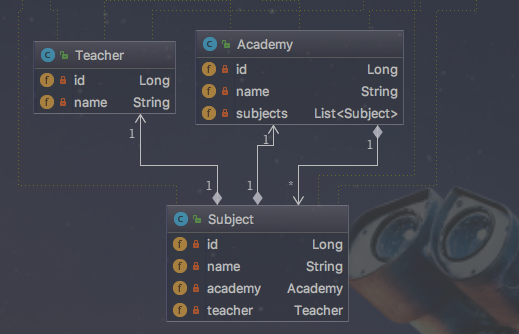
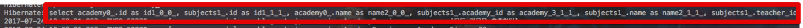
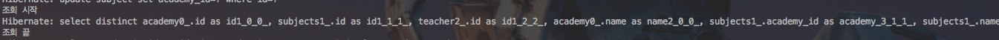

# JPA N+1 문제

안녕하세요? 이번 시간엔 JPA의 N+1 문제에 대해 이야기 해보려고 합니다.  
모든 코드는 [Github](https://github.com/jojoldu/blog-code/tree/master/jpa-entity-graph)에 있기 때문에 함께 보시면 더 이해하기 쉬우실 것 같습니다.  
(공부한 내용을 정리하는 [Github](https://github.com/jojoldu/blog-code)와 세미나+책 후기를 정리하는 [Github](https://github.com/jojoldu/review), 이 모든 내용을 담고 있는 [블로그](http://jojoldu.tistory.com/)가 있습니다. )<br/>
 
## 본문

JPA를 사용하면 자주 만나게 되는 것이 N+1 문제입니다.  
예를 들어, 아래와 같은 구조에서 Academy를 호출하여 그 안에 속한 Subject를 사용한다고 가정해보겠습니다.  



간단하게 이들의 관계를 코드로 표현하겠습니다.  
(lombok을 사용하였습니다.)

```java
@Entity
@Getter
@NoArgsConstructor
public class Academy {

    @Id
    @GeneratedValue
    private Long id;

    private String name;

    @OneToMany(cascade = CascadeType.ALL)
    @JoinColumn(name="academy_id")
    private List<Subject> subjects = new ArrayList<>();

    @Builder
    public Academy(String name, List<Subject> subjects) {
        this.name = name;
        if(subjects != null){
            this.subjects = subjects;
        }
    }

    public void addSubject(Subject subject){
        this.subjects.add(subject);
        subject.updateAcademy(this);
    }
}
```

```java
@Entity
@Getter
@NoArgsConstructor
public class Subject {

    @Id
    @GeneratedValue
    private Long id;

    private String name;

    @ManyToOne(fetch = FetchType.LAZY)
    @JoinColumn(name = "academy_id", foreignKey = @ForeignKey(name = "FK_SUBJECT_ACADEMY"))
    private Academy academy;

    @ManyToOne(fetch = FetchType.LAZY)
    @JoinColumn(name = "teacher_id", foreignKey = @ForeignKey(name = "FK_SUBJECT_TEACHER"))
    private Teacher teacher;

    @Builder
    public Subject(String name, Academy academy, Teacher teacher) {
        this.name = name;
        this.academy = academy;
        this.teacher = teacher;
    }

    public void updateAcademy(Academy academy){
        this.academy = academy;
    }
}
```

```java
@Entity
@Getter
@NoArgsConstructor
public class Teacher {

    @Id
    @GeneratedValue
    private Long id;

    private String name;

    public Teacher(String name) {
        this.name = name;
    }
}
```

```java
@Service
@Slf4j
public class AcademyService {

    private AcademyRepository academyRepository;

    public AcademyService(AcademyRepository academyRepository) {
        this.academyRepository = academyRepository;
    }

    @Transactional(readOnly = true)
    public List<String> findAllSubjectNames(){
        return extractSubjectNames(academyRepository.findAll());
    }

    /**
     * Lazy Load를 수행하기 위해 메소드를 별도로 생성
     */
    private List<String> extractSubjectNames(List<Academy> academies){
        log.info(">>>>>>>>[모든 과목을 추출한다]<<<<<<<<<");
        log.info("Academy Size : {}", academies.size());

        return academies.stream()
                .map(a -> a.getSubjects().get(0).getName())
                .collect(Collectors.toList());
    }
}
```

여기서 서비스의 ```findAllSubjectNames```를 호출하면 어떤일이 발생할까요?  
간단한 테스트 코드를 작성하여 쿼리가 어떻게 생성되는지 확인해보겠습니다.  

```java
@RunWith(SpringRunner.class)
@SpringBootTest
public class AcademyServiceTest {

    @Autowired
    private AcademyRepository academyRepository;

    @Autowired
    private AcademyService academyService;

    @After
    public void cleanAll() {
        academyRepository.deleteAll();
    }

    @Before
    public void setup() {
        List<Academy> academies = new ArrayList<>();

        for(int i=0;i<10;i++){
            Academy academy = Academy.builder()
                    .name("강남스쿨"+i)
                    .build();

            academy.addSubject(Subject.builder().name("자바웹개발" + i).build());
            academies.add(academy);
        }

        academyRepository.save(academies);
    }

    @Test
    public void Academy여러개를_조회시_Subject가_N1_쿼리가발생한다() throws Exception {
        //given
        List<String> subjectNames = academyService.findAllSubjectNames();

        //then
        assertThat(subjectNames.size(), is(10));
    }
}
```

위 테스트 코드를 실행해보면! 아래와 같이 academy **전체 조회하는 쿼리**와 각각의 Academy가 본인들의 subject를 조회하는 쿼리 10개가 발생한 것을 확인할 수 있습니다.  


(N + 1 쿼리!)  
  
이렇게 하위 엔티티들을 첫 쿼리 실행시 한번에 가져오지 않고, Lazy Loading으로 필요한 곳에서 사용될때 쿼리가 실행될때 발생하는 문제가 N+1 쿼리 문제입니다.  
지금은 Academy가 10개이니 첫조회(1) + 10개의 Academy의 subject 조회(10) = 11 밖에 발생하지 않았지만, 만약 Academy 조회 결과가 10만개면 어떻게 될까요?  
**한번의 서비스 로직 실행에서 DB 조회가 10만번** 일어난다는건 말이 안되지 않을까요?  
그래서 이렇게 연관관계가 맺어진 Entity를 한번에 가져오기 위해 몇가지 방법들이 있습니다.  

### 1. Join Fetch

1번째는 ```join fetch```를 사용하는 것입니다.  

```java
/**
* 1. join fetch를 통한 조회
*/
@Query("select a from Academy a join fetch a.subjects")
List<Academy> findAllJoinFetch();
```

조회시 바로 가져오고 싶은 Entity 필드를 지정 (```join fetch a.subjects```)하는 것입니다.  
이렇게 바꾼후 테스트 코드를 실행해보겠습니다.  



이렇게 **1줄만 발생**한 것을 확인할 수 있습니다.  
추가로 만약 **Subject의 하위 Entity까지 한번에** 가져와야 할때도 아주 쉽게 해결할 수 있습니다.

```java
/**
* 5. Academy+Subject+Teacher를 join fetch로 조회
*/
@Query("select a from Academy a join fetch a.subjects s join fetch s.teacher")
List<Academy> findAllWithTeacher();
```

```a.subjects```를 ```s```로 alias하여 s의 ```teacher```를 ```join fetch``` 하면 한번에 가져오는 것을 확인할 수 있습니다.



하위의 하위 Entity 까지 아주 쉽게 가져오게 되었습니다!  
단, 이 방법은 **불필요한 쿼리문이 추가되는 단점**이 있습니다.  
이 필드는 Eager 조회, 저 필드는 Lazy 조회를 해야한다까지 **쿼리에서 표현하는 것은 불필요**하다라고 생각하실 분들이 계실것 같습니다.  
그런 분들은 다음의 방법을 사용해보시면 좋을것 같습니다.

### 2. @EntityGraph

2번째 방법은 ```@EntityGraph```을 사용하는 것입니다.  

```java

/**
* 2. @EntityGraph
*/
@EntityGraph(attributePaths = "subjects")
@Query("select a from Academy a")
List<Academy> findAllEntityGraph();
```

```@EntityGraph```의 ```attributePaths```에 쿼리 수행시 바로 가져올 필드명을 지정하면 Lazy가 아닌 Eager 조회로 가져오게 됩니다.  

보시는 것처럼 원본 쿼리의 손상 없이 (```select a from Academy a```) Eager/Lazy 필드를 정의하고 사용할 수 있게 되었습니다.  
추가로 Teacher까지 한번에 가져오는 쿼리도 아래와 같이 표현할 수 있습니다.

```java
/**
* 6. Academy+Subject+Teacher를 @EntityGraph 로 조회
*/
@EntityGraph(attributePaths = {"subjects", "subjects.teacher"})
@Query("select a from Academy a")
List<Academy> findAllEntityGraphWithTeacher();
```

### 사용시 주의사항?

```join fetch```와 ```@EntityGraph``` 사용시 출력되는 쿼리를 한번 확인해보겠습니다.  
  
**Join Fetch**

```sql
SELECT academy0_.id          AS id1_0_0_, 
       subjects1_.id         AS id1_1_1_, 
       academy0_.name        AS name2_0_0_, 
       subjects1_.academy_id AS academy_3_1_1_, 
       subjects1_.name       AS name2_1_1_, 
       subjects1_.teacher_id AS teacher_4_1_1_, 
       subjects1_.academy_id AS academy_3_1_0__, 
       subjects1_.id         AS id1_1_0__ 
FROM   academy academy0_ 
       INNER JOIN subject subjects1_ 
               ON academy0_.id = subjects1_.academy_id 
```


**@Entity Graph**

```sql
SELECT academy0_.id          AS id1_0_0_, 
       subjects1_.id         AS id1_1_1_, 
       academy0_.name        AS name2_0_0_, 
       subjects1_.academy_id AS academy_3_1_1_, 
       subjects1_.name       AS name2_1_1_, 
       subjects1_.teacher_id AS teacher_4_1_1_, 
       subjects1_.academy_id AS academy_3_1_0__, 
       subjects1_.id         AS id1_1_0__ 
FROM   academy academy0_ 
       LEFT OUTER JOIN subject subjects1_ 
                    ON academy0_.id = subjects1_.academy_id 
```

쿼리를 보시면 아시겠지만, 이렇게 조인이 발생할 경우 **카테시안 곱(Cartesian Product)이 발생하여 Subject의 수만큼 Academy가 중복 발생**하게 됩니다.  
확인을 위해 테스트 코드를 추가해보겠습니다.

```java

    @Before
    public void setup() {
        List<Academy> academies = new ArrayList<>();

        for(int i=0;i<10;i++){
            Academy academy = Academy.builder()
                    .name("강남스쿨"+i)
                    .build();

            academy.addSubject(Subject.builder().name("자바웹개발" + i).build());
            academy.addSubject(Subject.builder().name("파이썬자동화" + i).build()); // Subject를 추가
            academies.add(academy);
        }

        academyRepository.save(academies);
    }

    @Test
    public void Academy여러개를_joinFetch로_가져온다() throws Exception {
        //given
        List<Academy> academies = academyRepository.findAllJoinFetch();
        List<String> subjectNames = academyService.findAllSubjectNamesByJoinFetch();

        //then
        assertThat(academies.size(), is(20)); // 20개가 조회!?
        assertThat(subjectNames.size(), is(20)); // 20개가 조회!?
    }
```

subject를 추가한 뒤, 테스트 결과를 확인해보면!


10개의 Academy가 아닌, 20개의 Academy가 생성된 것을 확인할 수 있습니다.  

### 해결방안

2가지 방법이 있습니다.  
하나는 일대다 필드의 타입을 ```Set```으로 선언하는 것입니다.  
(Set은 중복을 허용하지 않는 자료구조이기 때문에 중복등록이 되지 않습니다.)  

```java

    @OneToMany(cascade = CascadeType.ALL)
    @JoinColumn(name="academy_id")
    private Set<Subject> subjects = new LinkedHashSet<>();
```

(Set이 순서가 보장되지 않기에 LinkedHashSet을 사용하여 순서를 보장합니다.)  
  
2번째 방법은 ```distinct```를 사용하여 중복을 제거하는 것입니다.  
(Set보다는 List가 더 적합하다고 판단되신다면)  

이 부분은 ```@Query```에서 적용하는 것이니 ```join fetch```, ```@EntityGraph``` 모두 동일합니다.

```java
@Query("select DISTINCT a from Academy a join fetch a.subjects s join fetch s.teacher")
List<Academy> findAllWithTeacher();
```

```java
@EntityGraph(attributePaths = {"subjects", "subjects.teacher"})
@Query("select DISTINCT a from Academy a")
List<Academy> findAllEntityGraphWithTeacher();
```

2방법 중 현재 프로젝트 상황에 맞춰 골라 사용하시면 될것 같습니다.

### @NamedEntityGraphs?

보통 N+1 문제 해결을 얘기할때 ```@NamedEntityGraphs```가 예시로 많이 등장합니다.  

```@NamedEntityGraphs```의 경우 Entity에 관련해서 모든 설정 코드를 추가해야하는데, **개인적으론 Entity가 해야하는 책임에 포함되지 않는다**고 생각합니다.  
  
A 로직에서는 Fetch전략을 어떻게 가져가야 한다는 것은 **해당 로직의 책임이지, Entity의 책임이 아니라고 생각**합니다.  
Entity에선 실제 도메인에 관련 된 코드만 작성하고, **상황에 따라 유동적인 Fetch 전략**을 가져가는 것은 전적으로 **서비스/레파지토리에서 결정해야하는 일**이라고 생각됩니다.  

## 마무리

JPA의 N+1 문제에 대해 간단하게나마 설명드렸습니다.  
아직까지는 위에서 소개한 내용에서 크게 벗어난 문제를 만나지 못했지만, 혹시나 다른 문제와 해결방안이 발견될 경우 추가 포스팅을 하겠습니다!  
부족한 글 끝까지 읽어주셔서 감사합니다^^
