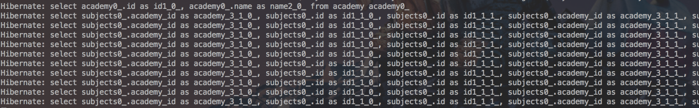
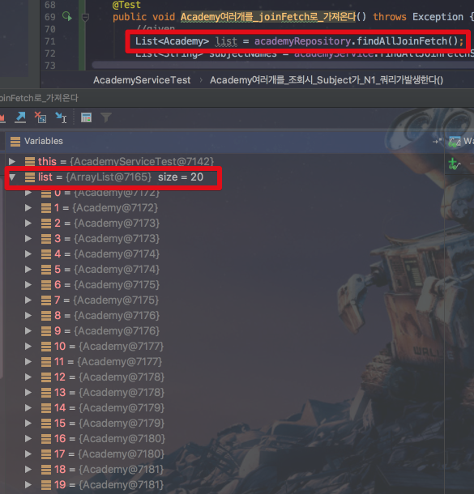

# JPA N+1 문제

안녕하세요? 이번 시간엔 JPA의 N+1 문제에 대해 이야기 해보려고 합니다.  
모든 코드는 [Github](https://github.com/jojoldu/blog-code/tree/master/jpa-entity-graph)에 있기 때문에 함께 보시면 더 이해하기 쉬우실 것 같습니다.  
(공부한 내용을 정리하는 [Github](https://github.com/jojoldu/blog-code)와 세미나+책 후기를 정리하는 [Github](https://github.com/jojoldu/review), 이 모든 내용을 담고 있는 [블로그](http://jojoldu.tistory.com/)가 있습니다. )<br/>
 
 





```join fetch```의 경우 일대다 조인을 실행시 중복된 결과가 나타날 수 있습니다.  

### Join Fetch

```sql
SELECT academy0_.id          AS id1_0_0_, 
       subjects1_.id         AS id1_1_1_, 
       academy0_.name        AS name2_0_0_, 
       subjects1_.academy_id AS academy_3_1_1_, 
       subjects1_.name       AS name2_1_1_, 
       subjects1_.teacher_id AS teacher_4_1_1_, 
       subjects1_.academy_id AS academy_3_1_0__, 
       subjects1_.id         AS id1_1_0__ 
FROM   academy academy0_ 
       INNER JOIN subject subjects1_ 
               ON academy0_.id = subjects1_.academy_id 
```


### @Entity Graph

```sql
SELECT academy0_.id          AS id1_0_0_, 
       subjects1_.id         AS id1_1_1_, 
       academy0_.name        AS name2_0_0_, 
       subjects1_.academy_id AS academy_3_1_1_, 
       subjects1_.name       AS name2_1_1_, 
       subjects1_.teacher_id AS teacher_4_1_1_, 
       subjects1_.academy_id AS academy_3_1_0__, 
       subjects1_.id         AS id1_1_0__ 
FROM   academy academy0_ 
       LEFT OUTER JOIN subject subjects1_ 
                    ON academy0_.id = subjects1_.academy_id 
```


```@NamedEntityGraphs```의 경우 Entity에 관련해서 모든 설정 코드를 추가해야하는데, 개인적으론 Entity가 해야하는 책임에 포함되지 않는다고 생각합니다.  
어떤 로직에서는 어떤 Fetch전략을 가져가야 한다는 **해당 로직의 책임이지, Entity의 책임이 아니라고 생각**합니다.  