# JPA에서 대량의 데이터를 삭제할때 주의해야할 점

안녕하세요? 이번 시간엔 JPA에서 대량의 데이터를 삭제할때 주의해야할 점을 샘플예제로 소개드리려고 합니다.  
모든 코드는 [Github](https://github.com/jojoldu/blog-code/tree/master/jpa-massive-delete)에 있기 때문에 함께 보시면 더 이해하기 쉬우실 것 같습니다.  
(공부한 내용을 정리하는 [Github](https://github.com/jojoldu/blog-code)와 세미나+책 후기를 정리하는 [Github](https://github.com/jojoldu/review), 이 모든 내용을 담고 있는 [블로그](http://jojoldu.tistory.com/)가 있습니다. )<br/>
 
## 발단

업무중에 배치로 일괄 데이터 삭제 기능을 작업하였습니다.  
테스트를 진행하는데 **삭제 성능이 너무나 안나오는 것**이였습니다.  
단순 삭제에서 왜이렇게 성능이 안나오나 slow query를 확인해보는데 이상한 점을 발견하였습니다.  
새로 알게된 내용이 있어 샘플 예제로 소개드리려고 합니다.

## 예제

샘플 코드 작성을 위해 다음과 같은 의존성들을 사용할 예정입니다.  
Gradle을 사용할 예정이며, 테스트 프레임워크로 Spock을, 코드 간결성을 위해 lombok을 사용하겠습니다.  
  
build.gradle

```gradle
apply plugin: 'java'
apply plugin: 'groovy'
apply plugin: 'eclipse'
apply plugin: 'org.springframework.boot'

dependencies {
	compile('org.springframework.boot:spring-boot-starter-data-jpa')
	compile('org.springframework.boot:spring-boot-starter-web')
	runtime('com.h2database:h2')
	compileOnly('org.projectlombok:lombok')
	testCompile('org.springframework.boot:spring-boot-starter-test')
	testCompile('org.spockframework:spock-core:1.1-groovy-2.4')
	testCompile('org.spockframework:spock-spring:1.1-groovy-2.4')
}
```

쿼리 확인을 위해 src/**test**/resources/application.yml에 설정값을 추가합니다.

```yml
spring:
  jpa:
    show-sql: true
```

사용할 엔티티 클래스는 ```Customer```, ```Shop```, ```Item```입니다.

```java
@Entity
@Getter
@NoArgsConstructor
public class Customer {

    @Id
    @GeneratedValue
    private Long id;

    private String name;

    public Customer(String name) {
        this.name = name;
    }
}

@Getter
@NoArgsConstructor
@Entity
public class Shop {

    @Id
    @GeneratedValue
    private Long id;

    private String name;
    private String address;

    @OneToMany(mappedBy = "shop", cascade = CascadeType.ALL, orphanRemoval = true)
    private List<Item> items = new ArrayList<>();

    public Shop(String name, String address) {
        this.name = name;
        this.address = address;
    }

    public void addItem(Item item){
        if(this.items == null){
            this.items = new ArrayList<>();
        }

        this.items.add(item);
        item.updateShop(this);
    }
}

@Getter
@NoArgsConstructor
@Entity
public class Item {

    @Id
    @GeneratedValue
    private Long id;

    private String name;
    private long price;

    @ManyToOne
    private Shop shop;

    public Item(String name, long price) {
        this.name = name;
        this.price = price;
    }

    public void updateShop(Shop shop){
        this.shop = shop;
    }
}

```

이 엔티티 클래스들을 다룰 ```JpaRepository```를 생성하겠습니다.

```java
public interface CustomerRepository extends JpaRepository<Customer, Long>{

    @Modifying
    @Transactional
    long deleteByIdIn(List<Long> ids);

    @Transactional
    @Modifying
    @Query("delete from Customer c where c.id in :ids")
    void deleteAllByIdInQuery(@Param("ids") List<Long> ids);
}

public interface ShopRepository extends JpaRepository<Shop, Long> {

    @Transactional
    @Modifying
    long deleteAllByIdIn(List<Long> ids);

    @Transactional
    @Modifying
    @Query("delete from Shop s where s.id in :ids")
    void deleteAllByIdInQuery(@Param("ids") List<Long> ids);
}

public interface ItemRepository extends JpaRepository<Item, Long> {

    @Transactional
    @Modifying
    @Query("delete from Item i where i.shop.id in :ids")
    void deleteAllByIdInQuery(@Param("ids") List<Long> ids);
}

```

위에서 눈여겨 보실것은 삭제 기능의 메소드가 2종류로 나누어져있는 것입니다.  
첫번째 메소드인 ```deleteAllByIdIn```는 ```JpaRepository```에서 제공하는 delete메소드를 사용한 것이며, 두번째 메소드인 ```deleteAllByIdInQuery```는 ```@Query```를 사용하여 직접 delete 쿼리를 사용한 것입니다.  
  
자 테스트해볼 환경은 모두 구축되었습니다.  
하나씩 실험해보겠습니다.

### 1-1. 관계가 없는 Entity 삭제

**다른 엔티티와 관계가 전혀 없는** ```Customer``` 엔티티 삭제 기능을 테스트해보겠습니다.  
Spock으로 짠 테스트 코드는 아래와 같습니다.

```groovy
@SpringBootTest
class CustomerRepositoryTest extends Specification {

    @Autowired
    private CustomerRepository customerRepository;

    def "Customer in 삭제" () {
        given:
        for(int i=0;i<100;i++){
            customerRepository.save(new Customer(i+"님"))
        }
        when:
        customerRepository.deleteByIdIn(Arrays.asList(1L,2L,3L))

        then:
        println "======= Then ======="
        customerRepository.findAll().size() == 97
    }
}
```

100개의 데이터를 DB에 insert한 후에 JpaRepository 예약어로 만든```deleteByIdIn```를 사용하여 **3개의 Id**를 조건으로 삭제하였습니다.  
이를 실행하면 콘솔에 다음과 같이 출력됩니다.

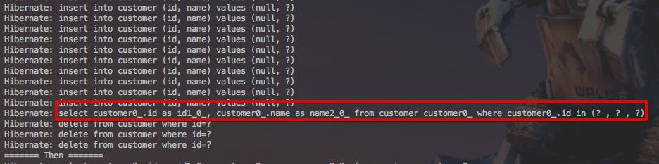

예상과는 다른 결과가 나왔습니다.

* ```in```쿼리로 조회하는 쿼리가 처음 실행됩니다.
* id별로 하나씩 delete됩니다.

처음엔 당연히 ```in```을 조건으로 한 delete쿼리가 발생할것이라고 예상했지만 단건으로 삭제되고 있습니다.  
왜 이런것인지 한번 JpaRepository 코드를 살펴보겠습니다.

### 1-2. delete 메소드 쫓아가기

제일 먼저 찾아본 클래스는 ```RepositoryQuery```입니다.  

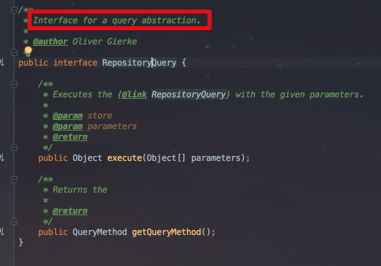

해당 인터페이스에는 별다른 단서가 보이지 않습니다.  
이를 구현한 다른 클래스를 한번 찾아보겠습니다.  

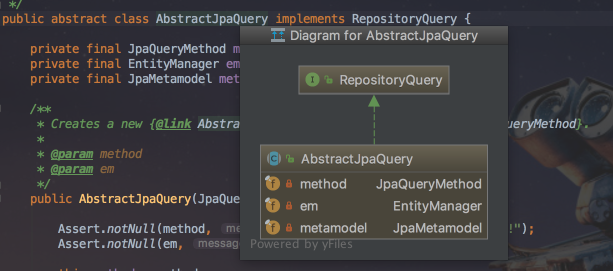

 ```AbstractJpaQuery``` 추상 클래스의 코드들을 보면 쿼리를 실행하는 듯한? 메소드를 볼 수 있습니다.  

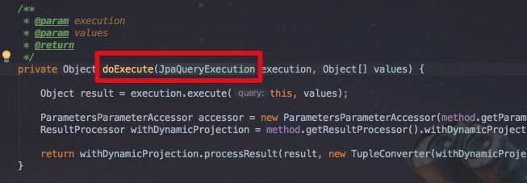

삭제 쿼리가 담겨져있을것 같은!? ```JpaQueryExecution``` 타입이 보입니다.  
해당 클래스로 이동해보겠습니다.  
해당 클래스는 예상대로 수많은 타입의 쿼리 실행 타입들이 존재했습니다.  
여기서 알아볼 타입은 삭제형이기 때문에 delete로 찾아보시면!

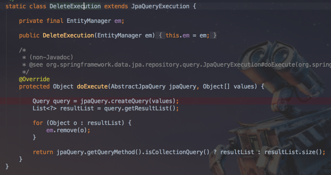

실제 JpaRepository에서 delete 메소드가 실행될때 어떤 일이 벌어지는지 명확히 확인할 수 있습니다.  
딱 코드만 봐도 쉽게 추측할 수 있지만, 확실한 확인을 위해 Break Point를 걸어 테스트 코드를 실행해보겠습니다.  

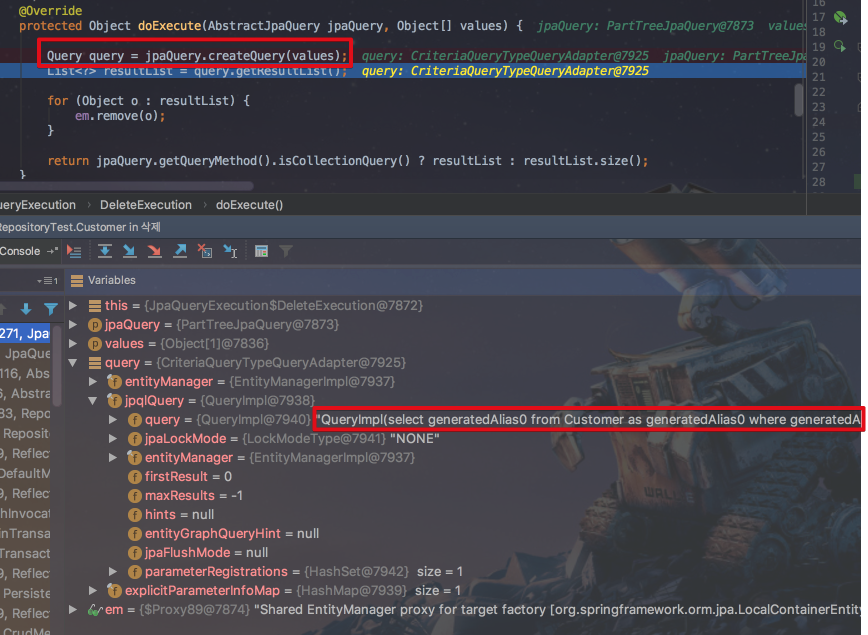

 ```jpaQuery.createQuery(values)```의 결과로 ```select ~~~~ from Customer where ~~```가 생성되었습니다.  
콘솔에 실행된 쿼리들을 확인해보겠습니다.

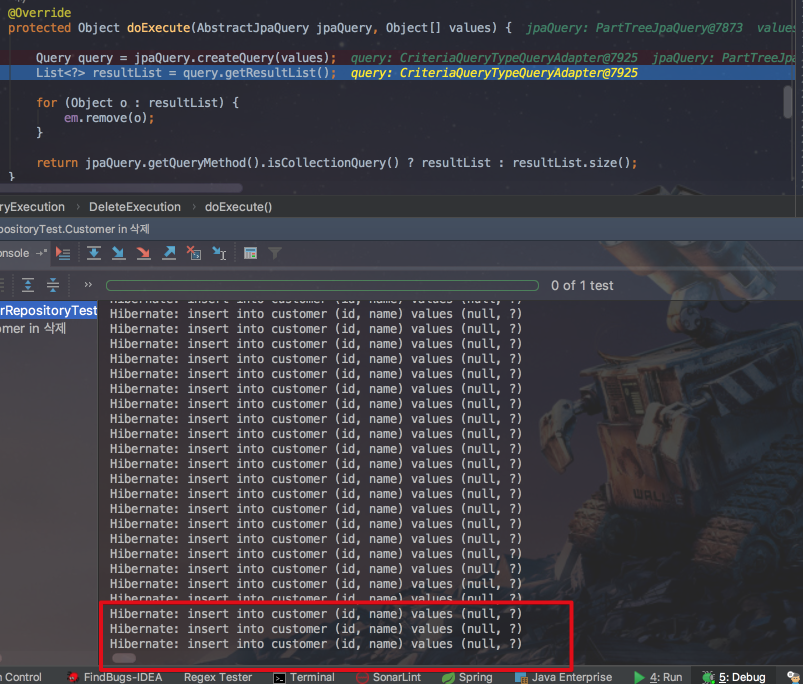

아직까지는 insert 쿼리만 실행된 상태 그대로입니다.  
여기서 다음줄로 이동하면

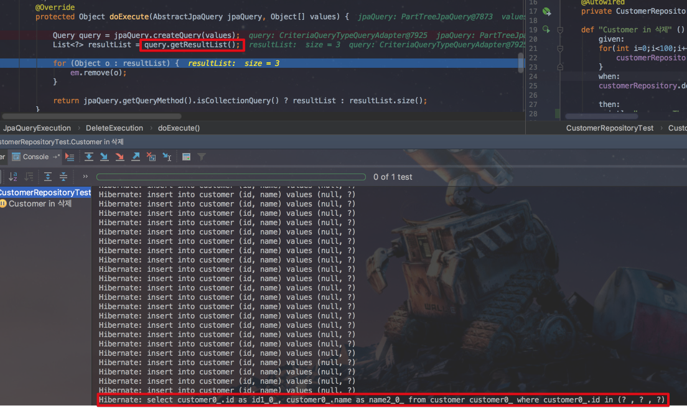

이렇게 select 쿼리가 실행된 것을 확인할 수 있습니다.  
실제로 이 쿼리의 실행결과는 조회 결과인 ```Customer```를 갖고 있습니다.

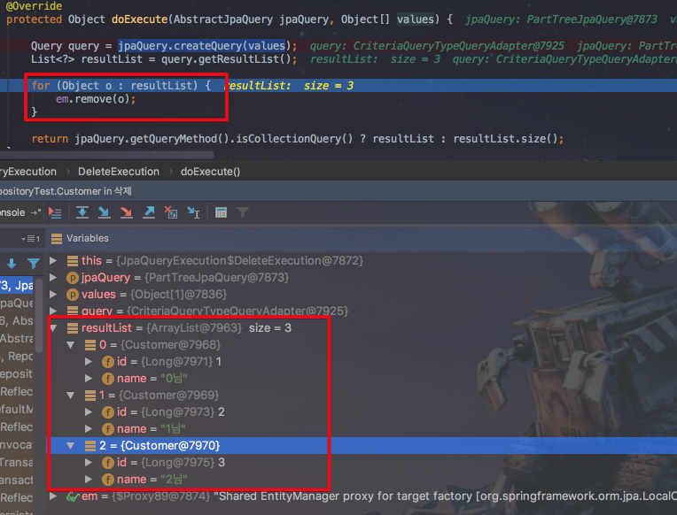

여기까지 결과로 알 수 있는 것은,  
 ```JpaRepository```에서 제공하는 ```deleteByXXX``` 등의 메소드를 이용하는 삭제는 단건이 아닌 여러건을 삭제하더라도 **먼저 조회를 하고 그 결과로 얻은 엔티티 데이터를 1건씩 삭제**한다는 것입니다.

### 2. Shop 엔티티 삭제


 ```Shop``` 클래스를 조건절 범위로 삭제해보는 것입니다.  
Spock을 이용해서 간단한 테스트 코드를 작성하겠습니다.

```groovy
@SpringBootTest
class ShopRepositoryTest extends Specification {

    @Autowired
    private ShopRepository shopRepository

    @Autowired
    private ItemRepository itemRepository

    private final List<Long> SHOP_ID_LIST = new ArrayList<>() //삭제할 ID List

    def setup() {
        //삭제할 ID List 생성
        for (long i = 100; i < 200; i++) {
            SHOP_ID_LIST.add(i)
        }
    }

    def cleanup() {
        println "======== Clean All ========="
        itemRepository.deleteAll()
        shopRepository.deleteAll()
    }

    def "SpringDataJPA에서 제공하는 예약어를 통해 삭제한다 - 부모만" () {
        given:
        createShop()

        when:
        shopRepository.deleteAllByIdIn(SHOP_ID_LIST)

        then:
        shopRepository.findAll().size() == 900
    }

    private void createShop() {
        for (int i = 0; i < 1000; i++) {
            shopRepository.save(new Shop("우아한서점" + i, "우아한 동네" + i))
        }
    }

    private void createShopAndItem() {
        for (int i = 0; i < 1000; i++) {
            Shop shop = new Shop("우아한서점" + i, "우아한 동네" + i)

            for (int j = 0; j < 10; j++) {
                shop.addItem(new Item("IT책" + j, j * 10000))
            }

            shopRepository.save(shop)
        }
    }
}
```

테스트 기능은 간단합니다.

1. shop 테이블 데이터를 1000개 생성합니다.
2. 100~200 사이의 id list를 파라미터로 하여 ```deleteAllByIdIn``` 메소드로 삭제합니다.
3. 900개가 남았는지 검증합니다.

자 여기서 저희가 사용한 삭제 메소드는 ```deleteAllByIdIn```입니다.  

```java
    @Transactional
    @Modifying
    long deleteAllByIdIn(List<Long> ids);
```

그럼 이 테스트 코드를 실행해보겠습니다.  
테스트 코드는 성공적으로 실행되지만, 콘솔에 찍힌 쿼리 로그가 너무 많지 않으신가요?  
좀 더 로그를 자세히 살펴보겠습니다.

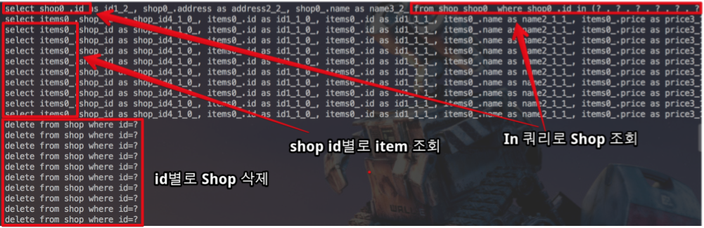

예상치 못한 select 쿼리가 다수 발생하였습니다.  
쿼리를 보면 저희가 조건절로 넘긴 id들을 매건마다 조회하는 것임을 추측할 수 있습니다.  
그리고 그 아래에는

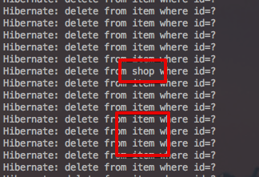

이렇게 id로 **매건마다 삭제하는 쿼리가 발생**합니다.  
  


```groovy
    def "@Query로 Id 리스트를 조건으로 삭제한다 - 부모만" () {
        given:
        createShop()

        when:
        shopRepository.deleteAllByIdInQuery(SHOP_ID_LIST)

        then:
        shopRepository.findAll().size() == 900
    }
```


```java
@Entity
@Getter
@NoArgsConstructor
public class Customer {

    @Id
    @GeneratedValue
    private Long id;

    private String name;

    public Customer(String name) {
        this.name = name;
    }
}

public interface CustomerRepository extends JpaRepository<Customer, Long>{

    @Modifying
    @Transactional
    long deleteByIdIn(List<Long> ids);
}
```

다른 엔티티와 관계가 전혀 없는 ```Customer``` 엔티티를 생성해서 삭제 기능을 테스트해보겠습니다.  

```groovy
@SpringBootTest
class CustomerRepositoryTest extends Specification {

    @Autowired
    private CustomerRepository customerRepository;

    def "Customer in 삭제" () {
        given:
        for(int i=0;i<100;i++){
            customerRepository.save(new Customer(i+"님"))
        }
        when:
        customerRepository.deleteByIdIn(Arrays.asList(1L,2L,3L))

        then:
        customerRepository.findAll().size() == 97
    }
}
```

위 테스트를 실행해 콘솔을 확인해보시면!

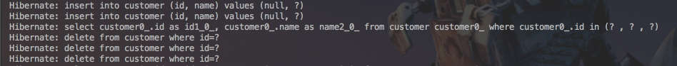

 ```in```쿼리로 조회하는 1개의 쿼리와 id별로 삭제하는 쿼리가 발생합니다.  
여기서 재밌는 것은 처음 사례처럼 **1건씩 조회하는 쿼리는 발생하지 않았다**는 것입니다.  
자 그럼 확인해야할 내용들을 정리해보겠습니다.
 ```deleteByXXXIn```로 된 JpaRepository 메소드를 사용하면

1. ```In```으로 이루어진 조회쿼리가 1회 무조건 발생한다.
2. 삭제가 **in조건별로 1건씩** 진행된다.
3. ```@OneToMany```와 같은 관계가 맺어졌다면 **in조건별로 1회씩 조회가 무조건 발생**한다.

### 트레이스

자 그럼 JpaRepository 코드를 쫓아가보겠습니다.

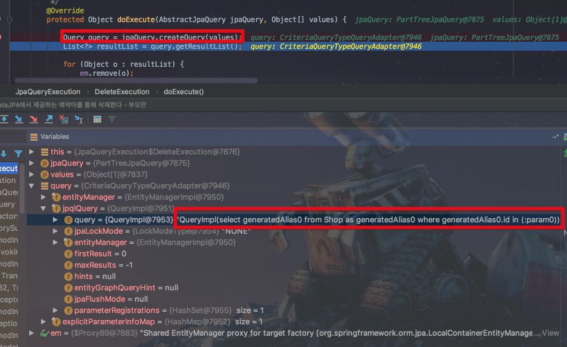

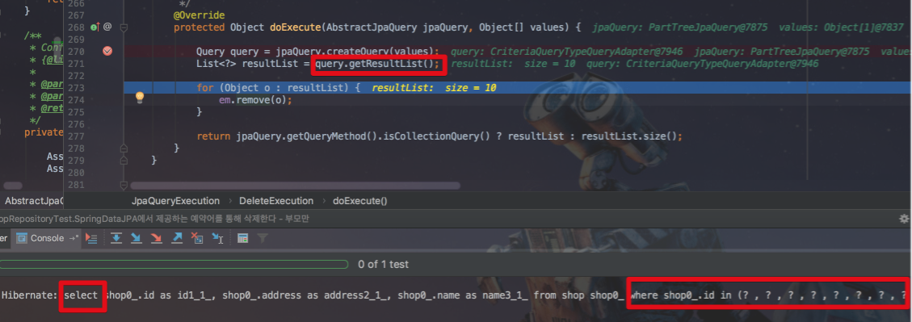


 ```DefaultDeleteEventListener```

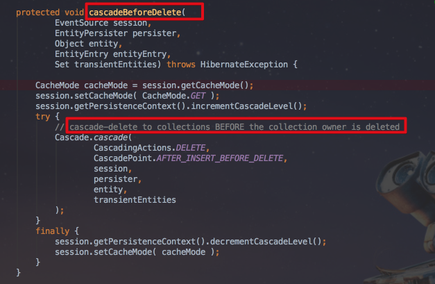


### 해결책

```groovy
    def "Customer in 삭제-@Query" () {
        given:
        for(int i=0;i<100;i++){
            customerRepository.save(new Customer(i+"님"))
        }
        when:
        customerRepository.deleteAllByIdInQuery(Arrays.asList(1L,2L,3L))

        then:
        println "======= Then ======="
        customerRepository.findAll().size() == 97
    }
```


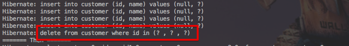

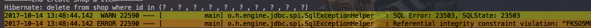

