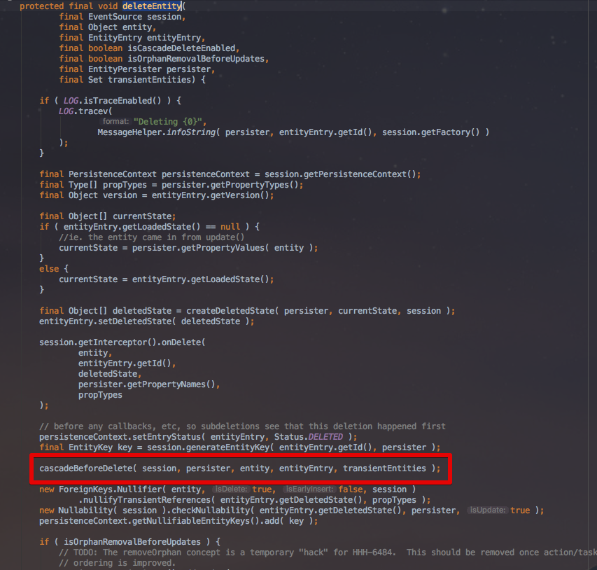
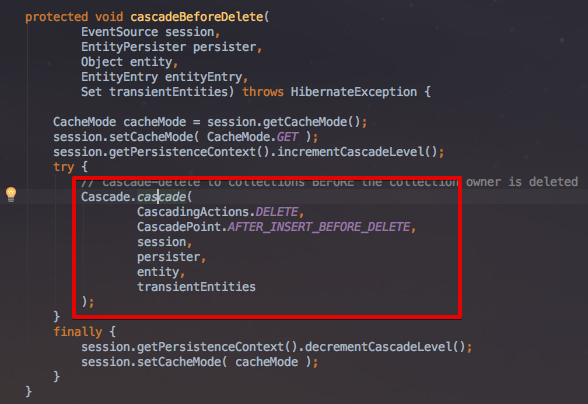
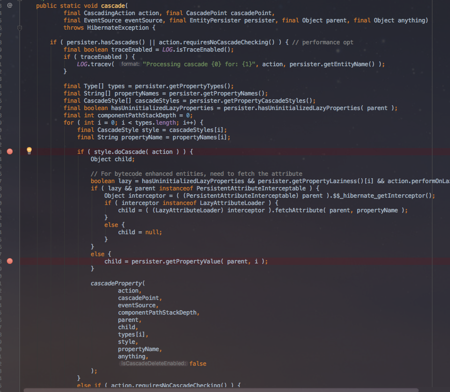
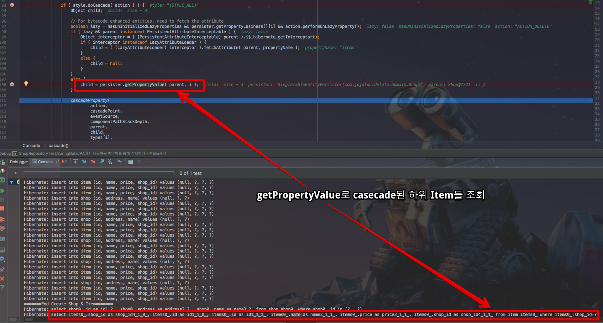
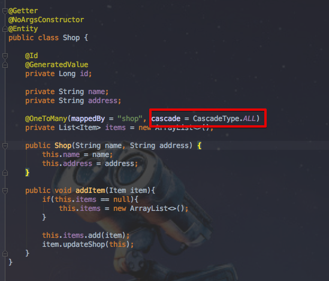
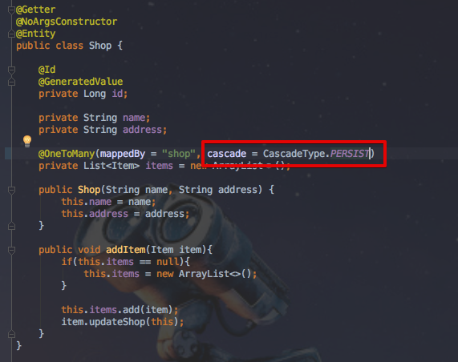
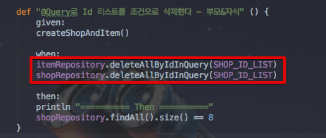
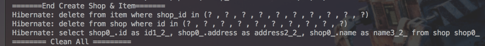

# JPA에서 대량의 데이터를 삭제할때 주의해야할 점

안녕하세요? 이번 시간엔 JPA에서 대량의 데이터를 삭제할때 주의해야할 점을 샘플예제로 소개드리려고 합니다.  
모든 코드는 [Github](https://github.com/jojoldu/blog-code/tree/master/jpa-massive-delete)에 있기 때문에 함께 보시면 더 이해하기 쉬우실 것 같습니다.  
(공부한 내용을 정리하는 [Github](https://github.com/jojoldu/blog-code)와 세미나+책 후기를 정리하는 [Github](https://github.com/jojoldu/review), 이 모든 내용을 담고 있는 [블로그](http://jojoldu.tistory.com/)가 있습니다. )<br/>
 
## 발단

업무중에 배치로 일괄 데이터 삭제 기능을 작업하였습니다.  
테스트를 진행하는데 **삭제 성능이 너무나 안나오는 것**이였습니다.  
단순 삭제에서 왜이렇게 성능이 안나오나 slow query를 확인해보는데 이상한 점을 발견하였습니다.  
이를 샘플예제로 소개드리겠습니다.

## 예제

샘플 코드 작성을 위해 다음과 같은 의존성들을 사용할 예정입니다.  
Gradle을 사용할 예정이며, 테스트 프레임워크로 Spock을, 코드 간결성을 위해 lombok을 사용하겠습니다.  
  
build.gradle

```gradle
apply plugin: 'java'
apply plugin: 'groovy'
apply plugin: 'eclipse'
apply plugin: 'org.springframework.boot'

dependencies {
	compile('org.springframework.boot:spring-boot-starter-data-jpa')
	compile('org.springframework.boot:spring-boot-starter-web')
	runtime('com.h2database:h2')
	compileOnly('org.projectlombok:lombok')
	testCompile('org.springframework.boot:spring-boot-starter-test')
	testCompile('org.spockframework:spock-core:1.1-groovy-2.4')
	testCompile('org.spockframework:spock-spring:1.1-groovy-2.4')
}
```

쿼리 확인을 위해 src/**test**/resources/application.yml에 설정값을 추가합니다.

```yml
spring:
  jpa:
    show-sql: true
```

사용할 엔티티 클래스는 ```Customer```, ```Shop```, ```Item```입니다.

```java
@Entity
@Getter
@NoArgsConstructor
public class Customer {

    @Id
    @GeneratedValue
    private Long id;

    private String name;

    public Customer(String name) {
        this.name = name;
    }
}

@Getter
@NoArgsConstructor
@Entity
public class Shop {

    @Id
    @GeneratedValue
    private Long id;

    private String name;
    private String address;

    @OneToMany(mappedBy = "shop", cascade = CascadeType.ALL, orphanRemoval = true)
    private List<Item> items = new ArrayList<>();

    public Shop(String name, String address) {
        this.name = name;
        this.address = address;
    }

    public void addItem(Item item){
        if(this.items == null){
            this.items = new ArrayList<>();
        }

        this.items.add(item);
        item.updateShop(this);
    }
}

@Getter
@NoArgsConstructor
@Entity
public class Item {

    @Id
    @GeneratedValue
    private Long id;

    private String name;
    private long price;

    @ManyToOne
    private Shop shop;

    public Item(String name, long price) {
        this.name = name;
        this.price = price;
    }

    public void updateShop(Shop shop){
        this.shop = shop;
    }
}

```

이 엔티티 클래스들을 다룰 ```JpaRepository```를 생성하겠습니다.

```java
public interface CustomerRepository extends JpaRepository<Customer, Long>{

    @Modifying
    @Transactional
    long deleteByIdIn(List<Long> ids);

    @Transactional
    @Modifying
    @Query("delete from Customer c where c.id in :ids")
    void deleteAllByIdInQuery(@Param("ids") List<Long> ids);
}

public interface ShopRepository extends JpaRepository<Shop, Long> {

    @Transactional
    @Modifying
    long deleteAllByIdIn(List<Long> ids);

    @Transactional
    @Modifying
    @Query("delete from Shop s where s.id in :ids")
    void deleteAllByIdInQuery(@Param("ids") List<Long> ids);
}

public interface ItemRepository extends JpaRepository<Item, Long> {

    @Transactional
    @Modifying
    @Query("delete from Item i where i.shop.id in :ids")
    void deleteAllByIdInQuery(@Param("ids") List<Long> ids);
}

```

위에서 눈여겨 보실것은 삭제 기능의 메소드가 2종류로 나누어져있는 것입니다.  
첫번째 메소드인 ```deleteAllByIdIn```는 ```JpaRepository```에서 제공하는 delete메소드를 사용한 것이며, 두번째 메소드인 ```deleteAllByIdInQuery```는 ```@Query```를 사용하여 직접 delete 쿼리를 사용한 것입니다.  
  
자 테스트해볼 환경은 모두 구축되었습니다.  
하나씩 실험해보겠습니다.

### 1-1. 관계가 없는 Entity 삭제

**다른 엔티티와 관계가 전혀 없는** ```Customer``` 엔티티 삭제 기능을 테스트해보겠습니다.  
Spock으로 짠 테스트 코드는 아래와 같습니다.

```groovy
@SpringBootTest
class CustomerRepositoryTest extends Specification {

    @Autowired
    private CustomerRepository customerRepository;

    def "Customer in 삭제" () {
        given:
        for(int i=0;i<100;i++){
            customerRepository.save(new Customer(i+"님"))
        }
        when:
        customerRepository.deleteByIdIn(Arrays.asList(1L,2L,3L))

        then:
        println "======= Then ======="
        customerRepository.findAll().size() == 97
    }
}
```

100개의 데이터를 DB에 insert한 후에 JpaRepository 예약어로 만든 ```deleteByIdIn```를 사용하여 **3개의 Id**를 조건으로 삭제하였습니다.  
이를 실행하면 콘솔에 다음과 같이 출력됩니다.


음..?  
예상과는 다른 결과가 나왔습니다.

* ```in```쿼리로 조회하는 쿼리가 처음 실행됩니다.
* id별로 하나씩 delete됩니다.

처음엔 당연히 ```in```을 조건으로 한 delete쿼리가 발생할것이라고 예상했지만 단건으로 삭제되고 있습니다.  
왜 이런것인지 한번 JpaRepository 코드를 살펴보겠습니다.

### 1-2. delete 메소드 쫓아가기

제일 먼저 찾아본 클래스는 ```RepositoryQuery```입니다.  


해당 인터페이스에는 별다른 단서가 보이지 않습니다.  
이를 구현한 다른 클래스를 한번 찾아보겠습니다.  


 ```AbstractJpaQuery``` 추상 클래스의 코드들을 보면 쿼리를 실행하는 듯한? 메소드를 볼 수 있습니다.  


삭제 쿼리가 담겨져있을것 같은!? ```JpaQueryExecution``` 타입이 보입니다.  
해당 클래스로 이동해보겠습니다.  
해당 클래스는 예상대로 수많은 타입의 쿼리 실행 타입들이 존재했습니다.  
여기서 알아볼 타입은 삭제형이기 때문에 delete로 찾아보시면!


실제 JpaRepository에서 delete 메소드가 실행될때 어떤 일이 벌어지는지 명확히 확인할 수 있습니다.  
딱 코드만 봐도 쉽게 추측할 수 있지만, 확실한 확인을 위해 Break Point를 걸어 테스트 코드를 실행해보겠습니다.  


 ```jpaQuery.createQuery(values)```의 결과로 ```select ~~~~ from Customer where ~~```가 생성되었습니다.  
콘솔에 실행된 쿼리들을 확인해보겠습니다.


아직까지는 insert 쿼리만 실행된 상태 그대로입니다.  
여기서 다음줄로 이동하면


이렇게 select 쿼리가 실행된 것을 확인할 수 있습니다.  
실제로 이 쿼리의 실행결과는 조회 결과인 ```Customer```를 갖고 있습니다.


여기까지 결과로 알 수 있는 것은 ```JpaRepository```에서 제공하는 ```deleteByXXX``` 등의 메소드를 이용하는 삭제는 단건이 아닌 여러건을 삭제하더라도 **먼저 조회를 하고 그 결과로 얻은 엔티티 데이터를 1건씩 삭제**한다는 것입니다.  
즉, 제가 만약 1억건 중 50만건을 삭제한다고 하면 **50만건을 먼저 조회후 건건으로 삭제**한다는 것입니다.

[[ad]]

### 2-1. 관계가 있는 Entity 삭제

자 이번엔 다른 엔티티 클래스와 관계가 맺어진 엔티티를 삭제하는 테스트를 해보겠습니다.  
테스트 코드는 아래와 같습니다.

```groovy
@SpringBootTest
class ShopRepositoryTest extends Specification {

    @Autowired
    private ShopRepository shopRepository

    @Autowired
    private ItemRepository itemRepository

    private final List<Long> SHOP_ID_LIST = new ArrayList<>()

    def setup() {
        for (long i = 1; i <= 2; i++) {
            SHOP_ID_LIST.add(i)
        }
    }

    def cleanup() {
        println "======== Clean All ========="
        itemRepository.deleteAll()
        shopRepository.deleteAll()
    }

    def "SpringDataJPA에서 제공하는 예약어를 통해 삭제한다 - 부모&자식" () {
        given:
        createShopAndItem()

        when:
        shopRepository.deleteAllByIdIn(SHOP_ID_LIST)

        then:
        shopRepository.findAll().size() == 8
    }

    private void createShop() {
        for (int i = 0; i < 10; i++) {
            shopRepository.save(new Shop("우아한서점" + i, "우아한 동네" + i))
        }

        println "=======End Create Shop======="
    }

    private void createShopAndItem() {
        for (int i = 0; i < 10; i++) {
            Shop shop = new Shop("우아한서점" + i, "우아한 동네" + i)

            for (int j = 0; j < 3; j++) {
                shop.addItem(new Item("IT책" + j, j * 10000))
            }

            shopRepository.save(shop)
        }

        println "=======End Create Shop & Item======="
    }
}
```

테스트 기능은 간단합니다.

1. shop 테이블 데이터를 10개 생성합니다.
2. 1,2 id list를 파라미터로 하여 ```deleteAllByIdIn``` 메소드로 삭제합니다.
3. 8개가 남았는지 검증합니다.

처음 테스트와 마찬가지로 여기서 사용할 메소드는 ```deleteAllByIdIn```입니다.  

```java
    @Transactional
    @Modifying
    long deleteAllByIdIn(List<Long> ids);
```

그럼 이 테스트 코드를 실행해보겠습니다.  
테스트 코드는 성공적으로 실행되지만, 콘솔에 찍힌 쿼리 로그가 너무 많지 않으신가요?  
좀 더 로그를 자세히 살펴보겠습니다.


Customer 때와는 또 다른 예상치 못한 select 쿼리가 다수 발생하였습니다.  

* ```in```쿼리로 조회하는 쿼리가 처음 실행됩니다.
* ```Shop``` Id별로 ```Item```을 조회한다.
* 조회된 ```Item```을 1건씩 삭제한다.
* 조회된 ```Shop```을 1건씩 삭제한다.

왜 **Customer를 지울때는 발생하지 않았던 Shop조회가 여기서는 발생했는지** ```em.remove```메소드를 좀 더 파고들어 확인해보겠습니다.  
  
 ```em.remove```를 파고들어보면 ```DefaultDeleteEventListener```의 ```deleteEntity``` 메소드를 만나게 됩니다.  



Break Point를 걸어 하나씩 쫓아가다보면 ```cascadeBeforeDelete``` 메소드를 다시 파고들어야함을 알수 있습니다.  
그리고 그 안에선 다시 ```Cascade.cascade```가 수행됩니다.



슬슬 냄새가 나기 시작합니다.  
 ```Cascade.cascade```코드를 확인하고 의심스러운 부분에 Break Point를 걸어 다시 테스트 메소드를 실행해보겠습니다.



Break Point를 지나 ```persister.getPropertyValue( parent, i )``` 메소드가 수행되면!



이렇게 ```~~~ from item items0_ where items0_.shop_id=?```쿼리가 한줄 수행되었음을 확인할 수 있습니다.  
이 코드와 결과로 쉽게 추측할 수 있는 것은 ```cascade = CascadeType.ALL```로 인해 (ALL은 Delete까지 포함된 상태입니다.) **부모인 Shop을 지울때, 자식인 Shop도 같이 지워야하니 Shop 키를 기준으로 Item을 모두 가져와서 1건씩 삭제**하는 것이였습니다.



그럼 ```cascade = CascadeType.ALL```이나 ```cascade = CascadeType.DELETE```가 아니면 부모 조회 쿼리가 발생하지 않는지 확인해볼까요?



이렇게 ```cascade = CascadeType.PERSIST```로 변경후에 다시 테스트 코드를 실행해보겠습니다.


삭제 대상인 ```Shop```을 전체 조회하는 1번의 쿼리 이후 **```Shop``` Id별로 ```Item```을 조회하는것 없이 바로 ```Shop```을 삭제하는 쿼리**로 넘어갑니다.  
(에러는 FK를 맺고 있는 Item들로 인해 Shop 삭제가 안되는 것을 보여줍니다.)  
  
자! 그렇다면 결론은 간단합니다.  
SpringDataJpa에서 ```deleteByXXX``` 등의 메소드 사용시 

* 삭제 대상들을 전부 조회하는 쿼리가 1번 발생한다.
* 삭제 대상들은 1건씩 삭제 된다.
* ```cascade = CascadeType.DELETE```으로 하위 엔티티와 관계가 맺어진 경우 하위 엔티티들도 1건씩 삭제가 진행된다.

단순히 코드 작성하기가 편해서 만든 삭제 메소드이지만 성능 저하 요소가 굉장히 많은 것을 알 수 있습니다.  
이 문제점을 해결하려면 어떻게 해야할까요?

### 해결책

이 문제의 해결책은 간단합니다.  
**직접 범위 조건의 삭제 쿼리를 생성**하면 됩니다.  
예를 들어 ```Customer```의 경우입니다.  

```java
    @Transactional
    @Modifying
    @Query("delete from Customer c where c.id in :ids")
    void deleteAllByIdInQuery(@Param("ids") List<Long> ids);
```

이렇게 직접 범위조건의 삭제 쿼리를 생성하여 사용하는 것입니다.  
테스트 코드를 작성합니다.

```groovy
    def "Customer in 삭제-@Query" () {
        given:
        for(int i=0;i<100;i++){
            customerRepository.save(new Customer(i+"님"))
        }
        when:
        customerRepository.deleteAllByIdInQuery(Arrays.asList(1L,2L,3L))

        then:
        println "======= Then ======="
        customerRepository.findAll().size() == 97
    }
```

그리고 이를 실행해보면!


삭제쿼리만 발생하는 것을 확인할 수 있습니다.  
  
만약 ```Shop```과 ```Item``` 같이 서로 연관관계가 있는 경우에는 ```Shop```만 삭제시 에러가 발생할 수 있습니다.  


그럴땐 ```Item```을 먼저 삭제후, ```Shop```을 삭제하시면 됩니다.



테스트 코드를 실행해보시면!



깔끔하게 ```delete from item ~~```, ```delete from shop ~~``` 2건의 쿼리 수행만 이루어진 것을 확인할 수 있습니다.  
(마지막 select는 ```then``` 비교를 위해 날린 검증 쿼리입니다.)  
  
  
## 마무리

제가 쫓아간 방법이나 해석한 코드가 잘못된 것일 수도 있습니다.  
보시면서 이상하다 싶은 내용이 있으면 언제든지 댓글 부탁드리겠습니다.  
블로그에 글 남기는 것이 지식을 뽐내기 위함이 아니라, 개인공간에만 남겨놓으면 실제로 틀린 지식인데 고치지 못하고 계속 그렇게 알고 있는 것이 무섭기 때문입니다.  
오픈된 공간에 올려놓고 틀린건 틀렸다고 지적 받아 고치기 위함이니 가감없이 댓글 부탁드리겠습니다.  
  
긴 글 끝까지 읽어주셔서 고맙습니다.

