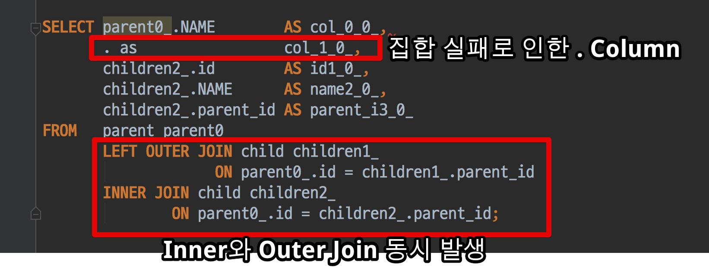
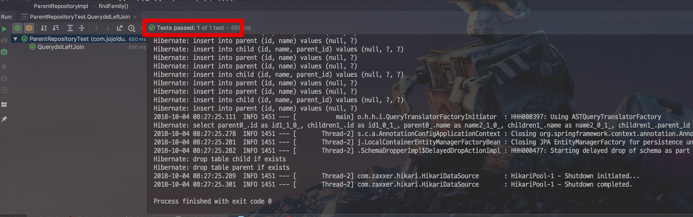
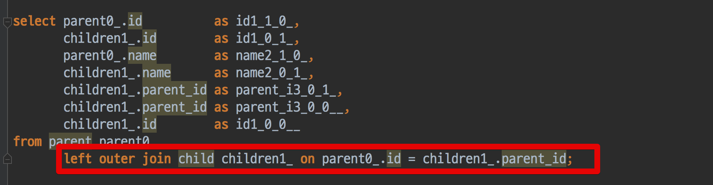
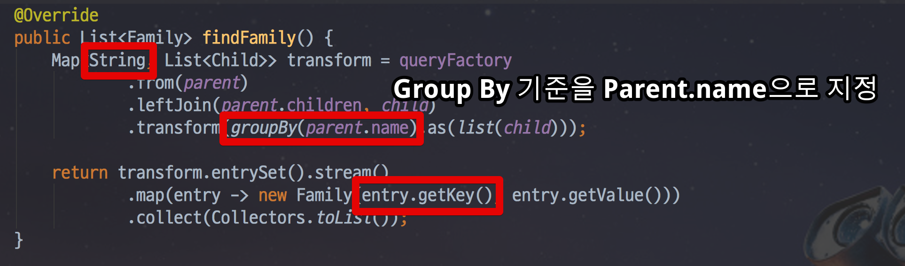
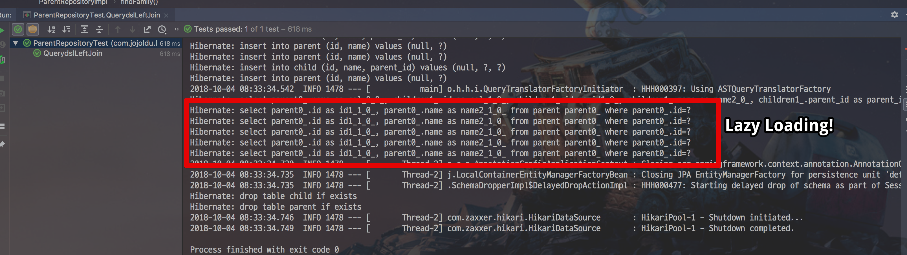
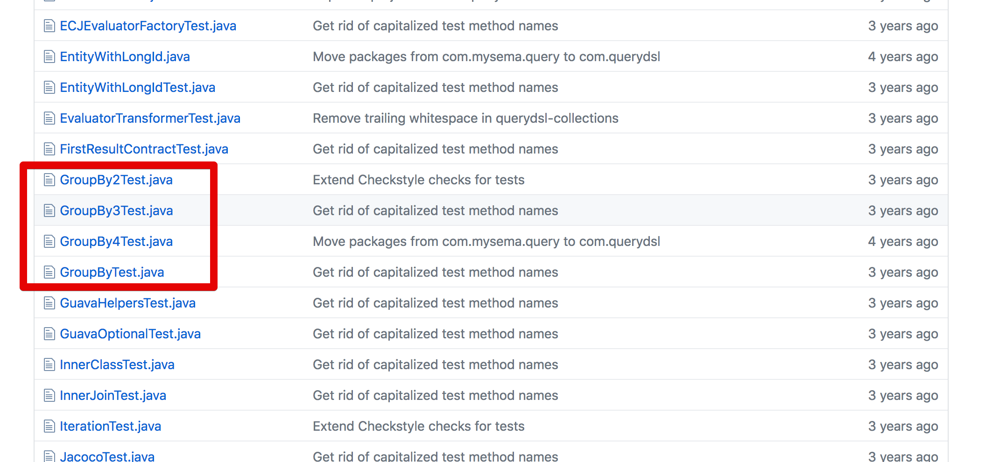

# OneToMany 관계에서 Left Outer Join 이 필요할 경우

안녕하세요?  
이번 시간에는 **JPA와 Querydsl을 사용하실때 OneToMany 관계에서 Left Join (Outer Join) 이 필요할 경우** 어떻게 하면 될지에 대해서 
소개 드리겠습니다.  
  
모든 코드는 [Github](https://github.com/jojoldu/blog-code/tree/master/jpa-querydsl)에 있으니 필요시 참고하시면 됩니다.  

Querydsl의 버전은 **4.1.4** 로 진행합니다.  
(2018.10.04 기준)

## 문제 상황


아래 코드와 같이 1:N 관계의 Entity들이 있다고 가정하겠습니다.  
  
  
**Parent.java**

```java
@Getter
@NoArgsConstructor(access = AccessLevel.PROTECTED)
@Entity
public class Parent {

    @Id
    @GeneratedValue(strategy = GenerationType.IDENTITY)
    private Long id;

    private String name;

    @OneToMany(mappedBy = "parent", cascade = CascadeType.ALL)
    private List<Child> children = new ArrayList<>();

    public Parent(String name) {
        this.name = name;
    }

    public void addChild(Child child) {
        children.add(child);
        child.setParent(this);
    }
}
```

**Child.java**

```java
@Getter
@NoArgsConstructor(access = AccessLevel.PROTECTED)
@Entity
public class Child {

    @Id
    @GeneratedValue(strategy = GenerationType.IDENTITY)
    private Long id;

    private String name;

    @ManyToOne
    @JoinColumn(name = "parent_id", foreignKey = @ForeignKey(name = "fk_child_parent_id"))
    private Parent parent;

    public Child(String name) {
        this.name = name;
    }

    public void setParent(Parent parent) {
        this.parent = parent;
    }
}

```

(Parent와 Child는 **1:N** 관계입니다.)  
  
자 이 관계에서 Parent와 Child List가 묶인 DTO 클래스 ```Family.java```가 필요하다고 가정하겠습니다.  
  
```java
@AllArgsConstructor
public class Family {

    private String parentName;
    private List<Child> children = new ArrayList<>();
}
```

조건은 **Child가 없어도 Parent가 있다면 Family DTO는 생성**되어야 합니다.  
이렇게 되면 단순히 Parent Entity를 조회해서는 문제가 해결되지 않습니다.  
**OneToMany 에서 기본 Join은 Inner Join**이기 때문입니다.  
  
그래서 Parent를 조회하되, Child는 Left Outer Join을 진행해야만 하는데요.  
단순히 생각해보면 아래와 같이 작성해볼 수 있을것 같습니다.


```java
    public List<Family> findFamily() {
        return queryFactory
                .select(Projections.fields(Family.class,
                        parent.name,
                        parent.children
                ))
                .from(parent)
                .leftJoin(parent.children, child)
                .fetch();
    }
```

위처럼 코드를 작성한 후 실행해보면!




2가지 이유로 실패하게 됩니다.  

* List로 조회되는 Child를 Aggregation 하지 못해서 ```.``` 라는 불문명한 컬럼 사용 
* ```parent.children```과 ```.leftJoin(parent.children, child)```이 각각 적용되어 Child에 대한 Inner Join과 Outer Join이 모두 발생했습니다.

그럼 이상황에선 어떻게 하면 될까요?

## 해결책

문제를 해결할 수 있는 방법은 크게 2가지입니다.

### 1. Entity 직접 조회 + Left Join

첫번째는 Parent Entity 를 직접 조회 하되, Child는 Left Join을 하고, 조회된 결과로 Family를 생성하는 것입니다.

```java
    public List<Family> findFamily() {
        List<Parent> parents = queryFactory
                .selectFrom(parent)
                .leftJoin(parent.children, child).fetchJoin()
                .fetch();

        return parents.stream()
                .map(p -> new Family(p.getName(), p.getChildren()))
                .collect(Collectors.toList());
    }
```

Parent와 Child의 관계를 ```leftJoin```으로 맺고, 그외 다른 코드 없이 Parent Entity 그대로 조회하면 Left Outer Join으로 조회됩니다.





실패했을때처럼 ```parent.child```를 Projection에서 사용하지 않고 Entity 그대로 사용할 경우에는 위와 같은 문제가 발생하지 않습니다.

### 2. Result Aggregation

두번째 방법은 Querydsl에서 제공하는 Result Aggregation (결과 집합) 을 사용하는 것입니다.
Result Aggregation이란 **Querydsl의 결과를 특정 키를 기준 삼아 그룹화** 하는 것을 얘기합니다.
 
> 자세한 내용은 [3.2.4. 결과 집합(aggregation)](http://www.querydsl.com/static/querydsl/3.7.2/reference/ko-KR/html/ch03s02.html)를 참고해보세요.

위 예제를 Aggregation으로 해결해보면 다음과 같이 할 수 있습니다.

```java
import static com.querydsl.core.group.GroupBy.groupBy;
import static com.querydsl.core.group.GroupBy.list;

    public List<Family> findFamily() {
        Map<Parent, List<Child>> transform = queryFactory
                .from(parent)
                .leftJoin(parent.children, child)
                .transform(groupBy(parent).as(list(child)));

        return transform.entrySet().stream()
                .map(entry -> new Family(entry.getKey().getName(), entry.getValue()))
                .collect(Collectors.toList());
    }
```

 ```transform```을 사용하면 ```groupBy```를 기준 Key로, ```list```를 통해 모으고 싶은 대상을 지정할 수 있습니다.  
여기서는 Key를 Parent Entity로, List를 Child Entity로 지정했습니다.  
 ```transform```의 반환값은 ```Map``` 이라는 것입니다.  
특정 DTO로 변환이 필요한 경우 Set -> Stream 의 과정이 필요합니다.  
  
꼭 Entity만 Key로 사용할 수 있는것은 아니며, 특정 컬럼을 Key로 사용할 수도 있습니다.  
다만 이럴경우 **Lazy Loading이 발생**합니다.  



   


[Aggregation 예제](https://github.com/querydsl/querydsl/tree/master/querydsl-collections/src/test/java/com/querydsl/collections)

  


  
   
