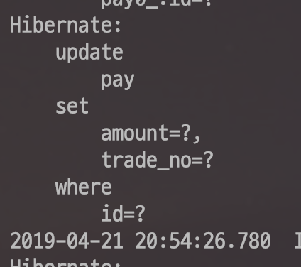

# 더티 체킹이란?

Spring Data Jpa와 같은 ORM 구현체를 사용하다보면 **더티 체킹이란 단어를 종종 듣게 됩니다**.  

> 모든 코드는 [Github](https://github.com/jojoldu/blog-code/tree/master/jpa-theory)에 있습니다.

```java
@Slf4j
@RequiredArgsConstructor
@Service
public class PayService {

    public void updateNative(Long id, String tradeNo) {
        EntityManager em = entityManagerFactory.createEntityManager();
        EntityTransaction tx = em.getTransaction();
        Pay pay = em.find(Pay.class, id);
        tx.begin();
        pay.changeTradeNo(tradeNo);
        tx.commit();
    }
}
```

테스트 코드는 아래와 같습니다.

```java
RunWith(SpringRunner.class)
@SpringBootTest
public class PayServiceTest {

    @Autowired
    PayRepository payRepository;

    @Autowired
    PayService payService;

    @After
    public void tearDown() throws Exception {
        payRepository.deleteAll();
    }

    @Test
    public void 엔티티매니저로_확인() {
        //given
        Pay pay = payRepository.save(new Pay("test1",  100));

        //when
        String updateTradeNo = "test2";
        payService.updateNative(pay.getId(), updateTradeNo);

        //then
        Pay saved = payRepository.findAll().get(0);
        assertThat(saved.getTradeNo()).isEqualTo(updateTradeNo);
    }
}

```



**save** 메소드로 변경 사항을 저장하지 않았음에도 update 쿼리가 실행되었습니다.  
이유는 **Auto Dirty Checking** 때문입니다.  

> 여기에서 Dirty란 "상태의 변화가 생긴" 정도로 이해하시면 됩니다.  
즉, Auto Dirty Checking이란 자동 상태 변경 검사 정도로 이해하시면 됩니다.

Hibernate는 트랜잭션이 끝나는 시점에 **변화가 있는 모든 엔티티 객체**를 데이터베이스에 자동으로 반영해줍니다.  

모든 트랜잭션이 끝날 때, Hibernate는이 트랜잭션에서 변경된 모든 객체를 데이터베이스에 유지시키기 위해 그 자체를 취한다 . Hibernate는 변경되거나 더러운 모든 객체를 탐지 할 수있다 . 이것은 PersistenceContext 의 도움으로 수행 됩니다. PersistenceContext 내에서 Hibernate는 데이터베이스로부터로드 된 모든 영속 객체들의 복사본을 가지고 있다. 영구 오브젝트와이 오브젝트를 비교하여 수정 된 오브젝트를 감지합니다 . 이것은 기본 구현입니다. 


트랜잭션이 끝날 때, Hibernate는 적절한 테이블 잠금을 획득하고 테이블의 레코드를 업데이트하며 획득 된 모든 잠금을 해제하여 트랜잭션을 완료한다.
Hibernate는 우리 자신의 커스텀 dirty checking 알고리즘의 구현을 허용한다. 이것은 세션을위한 org.hibernate.Interceptor 인터페이스 의 findDirty () 메소드를 구현함으로써 이루어진다 .

class DirtyChecker 는 인터셉터 {

```java

class DirtyChecker implements Interceptor {
    
    @Override
    public int[] findDirty(Object entity, Serializable id, Object[] currentState, Object[] previousState, String[] propertyNames, Type[] types) {

         // 반환 값은 엔티티가 갱신되었는지 여부를 판단한다 
        // 그것은 배열을 반환 엔티티를 나타내는 속성 인덱스 더럽 
        // 또는 빈 어레이 - 엔티티가 깨끗한 지   
        return null;
    }
//more methods ...

}

```

Spring Data Jpa와 ```@Transactional```이 함께 할 경우엔 다음과 같습니다.

```java
@Slf4j
@RequiredArgsConstructor
@Service
public class PayService {

    private final PayRepository payRepository;
    private final EntityManagerFactory entityManagerFactory;

    @Transactional
    public void update(Long id, String tradeNo) {
        Pay pay = payRepository.getOne(id);
        pay.changeTradeNo(tradeNo);
    }
}
```

```java
@Test
public void SpringDataJpa로_확인() {
    //given
    Pay pay = payRepository.save(new Pay("test1",  100));

    //when
    String updateTradeNo = "test2";
    payService.update(pay.getId(), updateTradeNo);

    //then
    Pay saved = payRepository.findAll().get(0);
    assertThat(saved.getTradeNo()).isEqualTo(updateTradeNo);
}
```