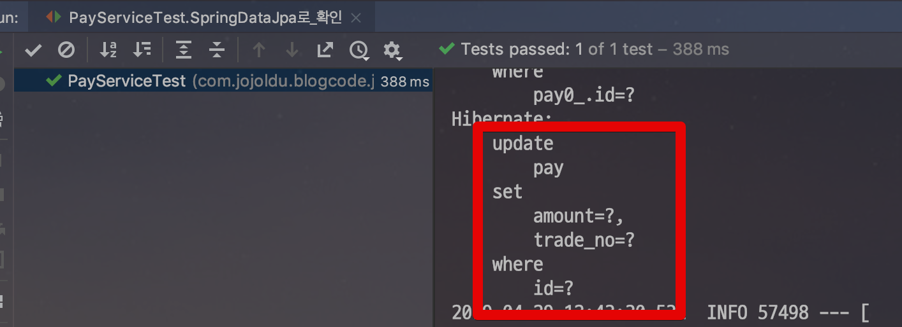
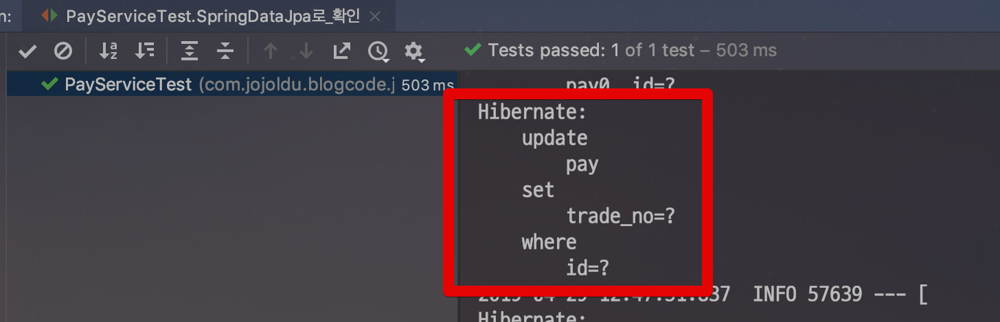

# 더티 체킹이란?

Spring Data Jpa와 같은 ORM 구현체를 사용하다보면 **더티 체킹이란 단어를 종종 듣게 됩니다**.  
  
더티 체킹이란 단어를 처음 듣는분들을 몇번 만나게 되어 이번 시간엔 더티 체킹이 무엇인지 알아보겠습니다.

> 모든 코드는 [Github](https://github.com/jojoldu/blog-code/tree/master/jpa-theory)에 있습니다.

예를 들어 다음과 같은 코드가 있습니다.  
(Spring Data Jpa가 익숙하시겠지만, 네이티브한 코드 먼저 보고 가겠습니다.)

```java
@Slf4j
@RequiredArgsConstructor
@Service
public class PayService {

    public void updateNative(Long id, String tradeNo) {
        EntityManager em = entityManagerFactory.createEntityManager();
        EntityTransaction tx = em.getTransaction();
        tx.begin(); //트랜잭션 시작
        Pay pay = em.find(Pay.class, id);
        pay.changeTradeNo(tradeNo); // 엔티티만 변경
        tx.commit(); //트랜잭션 커밋
    }
}
```

코드를 보시면 **별도로 데이터베이스에 save 하지 않습니다**.  

1. 트랜잭션이 시작되고
2. 엔티티를 조회하고
3. **엔티티의 값을 변경**하고
4. 트랜잭션을 커밋합니다.

여기서 **데이터베이스에 update 쿼리에 관한 코드는 어디에도 없습니다**.  
  
자 그리고 이 코드가 어떻게 작동하는지 테스트 코드를 작성해보겠습니다.

```java
RunWith(SpringRunner.class)
@SpringBootTest
public class PayServiceTest {

    @Autowired
    PayRepository payRepository;

    @Autowired
    PayService payService;

    @After
    public void tearDown() throws Exception {
        payRepository.deleteAll();
    }

    @Test
    public void 엔티티매니저로_확인() {
        //given
        Pay pay = payRepository.save(new Pay("test1",  100));

        //when
        String updateTradeNo = "test2";
        payService.updateNative(pay.getId(), updateTradeNo);

        //then
        Pay saved = payRepository.findAll().get(0);
        assertThat(saved.getTradeNo()).isEqualTo(updateTradeNo);
    }
}
```

이 테스트 코드를 수행보시면, 아래와 같은 로그를 확인할 수 있습니다.


**save** 메소드로 변경 사항을 저장하지 않았음에도 update 쿼리가 실행되었습니다.  
이유는 **Dirty Checking** 덕분인데요.  

> 여기에서 Dirty란 **상태의 변화가 생긴** 정도로 이해하시면 됩니다.  
즉, Dirty Checking이란 **상태 변경 검사** 입니다.

JPA에서는 트랜잭션이 끝나는 시점에 **변화가 있는 모든 엔티티 객체**를 데이터베이스에 자동으로 반영해줍니다.  
  
이때 변화가 있다의 기준은 **최초 조회 상태**입니다.  
  
JPA에서는 엔티티를 조회하면 해당 엔티티의 조회 상태 그대로 **스냅샷**을 만들어놓습니다.  
그리고 트랜잭션이 끝나는 시점에는 이 **스냅샷과 비교해서 다른점이 있다면 Update Query를 데이터베이스**로 전달합니다.  
  
당연히 이런 상태 변경 검사의 대상은 **영속성 컨텍스트가 관리하는 엔티티에만**적용 됩니다.  

* detach된 엔티티 (준영속)
* DB에 반영되기 전 처음 생성된 엔티티 (비영속)

등 준영속/비영속 상태의 엔티티는 Dirty Checking 대상에 포함되지 않습니다.  
즉, **값을 변경해도 데이터베이스에 반영되지 않는다**는 것이죠.  
Spring Data Jpa와 ```@Transactional```이 함께 할 경우엔 다음과 같습니다.

```java
@Slf4j
@RequiredArgsConstructor
@Service
public class PayService {

    private final PayRepository payRepository;

    @Transactional
    public void update(Long id, String tradeNo) {
        Pay pay = payRepository.getOne(id);
        pay.changeTradeNo(tradeNo);
    }
}
```

그리고 테스트 코드를 작성해서 실행해보면!

```java
@Test
public void SpringDataJpa로_확인() {
    //given
    Pay pay = payRepository.save(new Pay("test1",  100));

    //when
    String updateTradeNo = "test2";
    payService.update(pay.getId(), updateTradeNo);

    //then
    Pay saved = payRepository.findAll().get(0);
    assertThat(saved.getTradeNo()).isEqualTo(updateTradeNo);
}
```

아래와 같이 정상적으로 update 쿼리가 수행됨을 확인할 수 있습니다.



## 변경 부분만 update하고 싶을땐?

Dirty Checking으로 생성되는 update 쿼리는 기본적으로 **모든 필드**를 업데이트합니다.  
  
JPA에서는 **전체 필드를 업데이트하는 방식을 기본값**으로 사용합니다.  
전체 필드를 업데이트하는 방식의 장점은 다음과 같습니다.

* 생성되는 쿼리가 같아 **부트 실행시점에 미리 만들어서 재사용**가능합니다.
* 데이터베이스 입장에서 쿼리 재사용이 가능하다
    * 동일한 쿼리를 받으면 이전에 파싱된 쿼리를 재사용한다.
 
> 출처: [김영한님의 자바 ORM 표준 JPA 프로그래밍](https://coupa.ng/bg5M4j)  

다만, 필드가 20~30개 이상인 경우엔 이런 전체 필드 Update 쿼리가 부담스러울 수 있습니다.

> 사실 이런 경우 정규화가 잘못된 경우일 확률이 높습니다.  
한 테이블에 필드 30개는 확실히 많습니다.  
현재 운영중인 정산 서비스에는 데이터양이나 복잡도가 국내에서 손꼽히지만 15개 넘는 필드를 가진 테이블은 없습니다.

그래서 이런 경우엔 ```@DynamicUpdate```로 **변경 필드만 반영**되도록 할 수 있습니다.  
  
엔티티 최상단에 아래와 같이 ```@DynamicUpdate``` 를 선언해주시면 됩니다.

```java
@Getter
@NoArgsConstructor
@Entity
@DynamicUpdate // 변경한 필드만 대응
public class Pay {

    @Id
    @GeneratedValue(strategy = GenerationType.IDENTITY)
    private Long id;

    private String tradeNo;
    private long amount;

```

그리고 다시 테스트 코드를 수행해서 로그를 확인해보면!



변경분 (```trade_no```)만 Update 쿼리에 반영된 것을 확인할 수 있습니다.