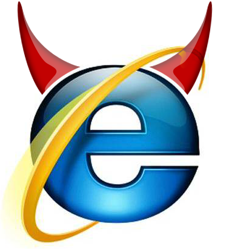

# IE 7,8에서 JS 프레임워크 조합하기
Angular나 React + @ 조합같은 경우 정말 매력적인 JS 프레임워크임은 분명하나 IE 7,8 에서는 사용할 수 없다는 치명적인 단점? 이 있다.  
국내에선 아직까지 IE 7,8의 점유율이 높은 편이라 회사 사정에 따라 IE 7,8을 지원해야하는 경우가 있다.

하지만 우리도 JS Framework를 쓰고싶다! 모던하게 개발해보고 싶다! jquery만 사용하고 싶지 않다!  
이런 분들이 꽤 계실것 같아 이런 환경에서 개발할 수 있는 방법을 소개하려 한다.  
본인의 회사가 IE9부터 지원한다면 뒤로가기 버튼을 살포시 누르면 된다  

전체적인 방향은 이렇다. **서버단 작업을 최신**으로 하자는 것이다.  

### 사용할 JS 프레임워크
* [backbone](http://backbonejs.org/)
  - Javascript를 MV* 구조로 개발할 수 있게 지원하는 프레임워크
  - [backbone.js 사용시 주의사항](http://huns.me/development/1212)

* jquery
  
* underscore
  - Javascript를 함수형으로 사용할 수 있게 지원
  - map, filter 등과 같은 기능들이 포함되어 있음
  
* require

* handlebars
  - client-side template engine
  - 서버 통신 없이 화면을 다시 그려야할 경우 사용
  
* grunt

개발 진행
----------
### Grunt 진행

