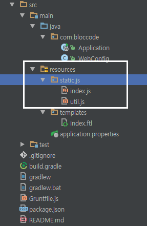
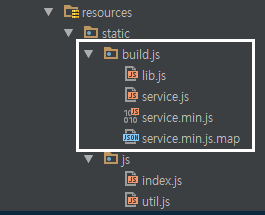
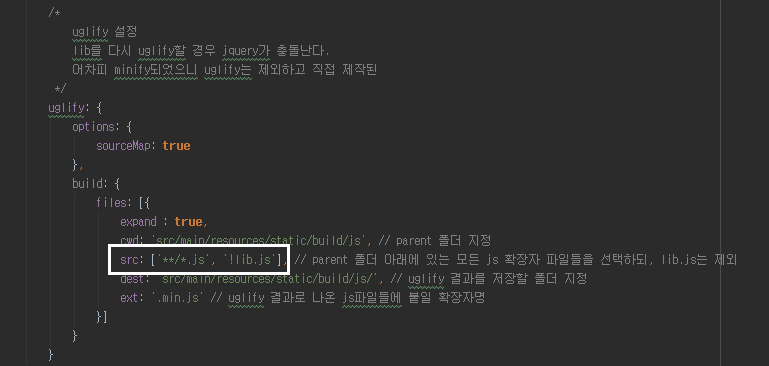
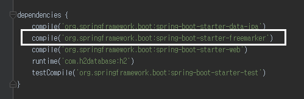
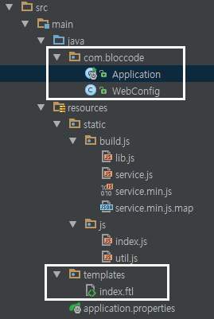
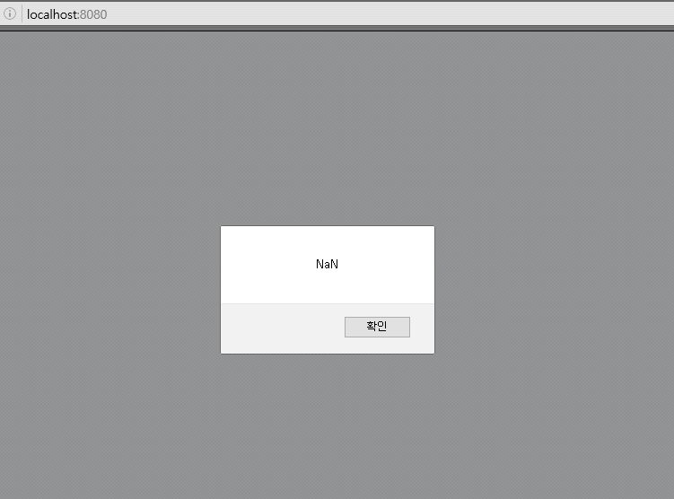

IE 7,8에서 JS 프레임워크 조합하기
---------------------------------
Angular나 React + @ 조합같은 경우 정말 매력적인 JS 프레임워크임은 분명하나 IE 7, 8에서는 사용할 수 없다는 치명적인 단점이 있다. 
국내에선 아직까지 IE 7,8의 점유율이 높은 편이라 회사 사정에 따라 IE 7,8을 지원해야하는 경우가 있다.


하지만 생각보다 많은 분들이 모던하게 Javascript를 개발하고 싶어한다. React/Angular/ES2015 스터디를 보면 **회사에서는 못쓰지만 이직을 위해** 라는 이유로 스터디에 참석하는 것을 정말 정말 많이 보았다.
그래서 최대한 이런 환경에서 모던하게 개발할 수 있는 방법을 소개하려 한다. 본인의 회사가 IE9부터 지원한다면 뒤로가기 버튼을 살포시 누르면 된다 <br/>
모든 코드는 [Github](https://github.com/jojoldu/blog-code/tree/master/js-framework-ie78) 에 있으니 참고하면 될것 같다.

### 사용할 JS
프로젝트 구성은 SpringBoot+Freemarker+Gradle을 기본으로 하여 아래 JS 라이브러리들을 조합할 예정이다.

* nodejs
  - 4.5.0 LTS 버전 사용 예정 (2016.09.20 기준)
  - grunt를 사용하기 위해 먼저 설치되어 있어야함
  - Javascript 패키지 관리를 bower가 아닌 npm 으로 관리하기 위해 사용
  - bower는 버그가 좀 있다. 웬만하면 npm으로 패키지 관리를 추천
  
* [backbone.js](http://backbonejs.org/)
  - Javascript를 MV* 구조로 개발할 수 있게 지원하는 프레임워크
  - [backbone.js 사용시 주의사항](http://huns.me/development/1212)

* jquery
  - 설명이 필요없는 Javascript 라이브러리
  - 여기선 Dom select와 이벤트 바인딩용으로 사용
  
* underscore.js
  - Javascript를 함수형으로 사용할 수 있게 지원
  - map, filter 등과 같은 함수형 기능들이 포함
  - backbone을 사용하려면 필수로 의존하게 되는데, 여기선 backbone 의존성을 위해서도 있지만, 좀 더 함수형으로 코드 작성하기 위해 사용
  - lodash라는 업그레이드 버전이 있지만 공식 사이트에서 IE 11까지만 확인되었다고해서 제외
  - underscore/lodash 모두 **ECMA2015** 때문에 포지션이 애매해졌다.
  
* require.js
  - Javascript 의존성 관리 및 동적로딩
  - [네이버의 Requirejs 이해](http://d2.naver.com/helloworld/591319) 참고
  
* handlebars.js
  - client-side template engine
  - 서버 통신 없이 화면을 다시 그려야할 경우 사용
  - 기본적인 소개와 문법/기능은 [티몬의 개발 블로그](http://blog.naver.com/PostView.nhn?blogId=tmondev&logNo=220398995882)를 참고
  - 부끄럽지만.. 추가적으로 실제 배포환경에서 사용법은 [내 블로그](http://jojoldu.tistory.com/23) 내용을 참고

* grunt
  - Javascript build 및 task 관리
  - 예를 들면 Javascript들을 압축/난독화 등을 할때 이를 task로 지정하여 명령어 한번에 사용이 가능할 수 있게 지원
  - [널리 블로그에서 소개하는 Grunt](http://nuli.navercorp.com/sharing/blog/post/1132682) 참고

개발 진행
----------
### package.json 작성
모든 Javascript 프로젝트들의 시작은 package.json 생성부터 시작이다. <br/>
package.json 작성방법은 [outsider님의 글](https://blog.outsider.ne.kr/674)을 참고하면 아주 좋다. <br/>
본인 프로젝트 폴더에서 터미널 혹은 CMD를 열어 아래와 같이 명령어를 입력해보자.

```
//package.json 초기화
npm init

//npm init 과정이 끝났다면 필요한 의존성들 설치 (package.json에도 작성하기 위해 -save 옵션을 추가)
npm install -save backbone

npm install -save handlebar

npm install -save jquery.1

npm install -save json2

npm install -save requirejs

```
위 과정이 끝나면 원하는 형태의 package.json과 라이브러리들이 받아져있을 것이다.

### Grunt 진행
두번째 내용은 grunt 설정이다. <br/>
grunt 설정에 들어가기전에 테스트할 javascript 파일들을 2개 만들어보겠다. <br/>
src/main/resoureces/static/js 폴더 하위에 index.js / util.js 라는 이름으로 2개의 파일을 만들자 <br/>



```
//index.js
$(function() {
   var sum = util.add(1+2);
   alert(sum);
});


//util.js
var util = {
  add : function(a,b){
      return a+b;
  }
};

```

2개의 파일 작성이 완료 되면 grunt 설정을 시작하자. <br/>

grunt에 대한 기본적인 사용법은 [널리 블로그](http://nuli.navercorp.com/sharing/blog/post/1132682)를 꼭꼭 참고하길 바란다.
grunt에 대해 어느정도 익숙하다면 아래를 참고하여 GruntFile.js를 작성한다.

```
'use strict';
module.exports = function(grunt) {

    grunt.initConfig({
        pkg : grunt.file.readJSON('package.json'),

        // build시 기존 resource들 정리
        clean: [
            'src/main/resources/static/build/*',
            'src/main/resources/static/js/templates.js'
        ],
        //concat 설정
        concat: {
            /*
                외부 라이브러리 통합 
                단, handlebar의 경우 pre-compile 해서 사용하니 굳이 concat할 필요 없다.
              */
            lib : {
                //concat 타겟 설정(앞에서부터 순서대로 합쳐진다.)
                src : [ 
                    // IE 하위버전 호환을 위해 jquery는 1.x 버전을 사용
                    'node_modules/jquery.1/node_modules/jquery/dist/jquery.min.js', 
                    'node_modules/backbone/backbone-min.js',
                    'node_modules/backbone/node_modules/underscore-min.js',
                    'node_modules/json2/lib/JSON2/static/json2.js',
                    'node_modules/requirejs/require.js'
                ],
                dest : 'src/main/resources/static/build/js/lib.js' //concat 결과 파일
            },
            //직접 작성한 javascript 통합
            service : {
                src : 'src/main/resources/static/js/*',
                dest : 'src/main/resources/static/build/js/service.js'
            }
        },
        /*
            uglify 설정
            lib.js를 다시 uglify할 경우 jquery가 충돌난다.
            어차피 minify되었으니 uglify는 제외하고 직접 제작된 service.js만 uglify한다.
         */
        uglify: {
            options: {
                sourceMap: true
            },
            build: {
                files: [{
                    expand : true,
                    // parent 폴더 지정
                    cwd: 'src/main/resources/static/build/js', 

                    // parent 폴더 아래에 있는 모든 js 확장자 파일들을 선택하되, lib.js는 제외
                    src: ['**/*.js', '!lib.js'], 

                    // uglify 결과를 저장할 폴더 지정
                    dest: 'src/main/resources/static/build/js/', 

                    // uglify 결과로 나온 js파일들에 붙일 확장자명
                    ext: '.min.js' 
                }]
            }
        }
    });

    // 플러그인 load
    grunt.loadNpmTasks('grunt-contrib-clean');
    grunt.loadNpmTasks('grunt-contrib-concat');
    grunt.loadNpmTasks('grunt-contrib-uglify');
    
    // Default task(s) : 즉, grunt 명령어로 실행할 작업
    grunt.registerTask('default', ['clean', 'concat', 'uglify']);
};

```

GruntFile 생성후에는 grunt 명령어를 실행시킬수 있도록 grunt를 Global로 설치하자 <br/>
```
현재 프로젝트 폴더로 이동후 터미널 혹은 CMD를 열어
npm install -g grunt
```

이러면 전역 설치가 되어 어디에서든 ```grunt``` 명령어를 사용할 수 있다. <br/>
어찌됐든 해당 폴더에서 grunt 명령어를 실행시켜보자
```
열려있는 터미널 혹은 CMD에서 아래 명령어 입력
grunt
```
이렇게 하면 요란한 텍스트와 함께 뭔가 실행되는 것을 볼 수 있는데 이게 끝나면 본인 프로젝트 폴더에 build 폴더와 js들이 생긴것을 확인할 수 있다.



방금한것이 GruntFile.js를 기반으로하여 grunt task를 실행시킨 것이다. <br/>
(확실히 느낀건 webpack가 비교했을때 build 속도가 무지 차이난다) <br/>

참고로
* uglify에서 src옵션은 라이브러리들을 통합한 lib.js를 제외한 직접 작성한 Javascript 파일들만 한다
  - 이미 min.js로 된 라이브러리들을 uglify하게 되면 jquery 의존성에 문제가 발생한다.




### 서버 코드 작업
자 그럼 여기까지 grunt 설정 및 build까지 완료했으니 이를 사이트에서 사용할 수 있도록 간단한 Java와 Freemarker 코드를 작성하겠다.

* build.gradle에 freemarker 의존성 추가



* Application 및 config, index.ftl



```
//Application.java
@SpringBootApplication
@Controller
public class Application {

	public static void main(String[] args) {
		SpringApplication.run(Application.class, args);
	}

    //@RequestMapping(value = "/", method = RequestMethod.GET)가 GetMapping("/") 가 됨
	@GetMapping("/")
	public String index(){
		return "index";
	}
}

//WebConfig.java
@Configuration
@EnableWebMvc
public class WebConfig extends WebMvcConfigurerAdapter {

    @Override
    public void addResourceHandlers(ResourceHandlerRegistry registry) {
        registry.addResourceHandler("/**").addResourceLocations("classpath:/static/");
    }
}


// index.ftl
<!DOCTYPE html>
<html lang="ko">
<head>
    <meta charset="UTF-8">
    <title>IE에서도 모던하게 개발하자</title>
</head>
<body>
    <script type="text/javascript" src="/build/js/lib.js"></script>
    <script type="text/javascript" src="/build/js/service.min.js"></script>
</body>
</html>
```

기본적인 환경은 다 구축되었다. 이제 이 프로젝트를 구동시켜 브라우저에 localhost:8080으로 접속해보자 <br/>
그러면! 



이렇게 alert이 발생하는 것을 볼 수 있다. 우리가 작성했던 index.js의 alert이 정상작동한것을 확인한 것이다. <br/>

### requirejs 사용
NaN이 나오던 alert의 내용을 수정해보자
