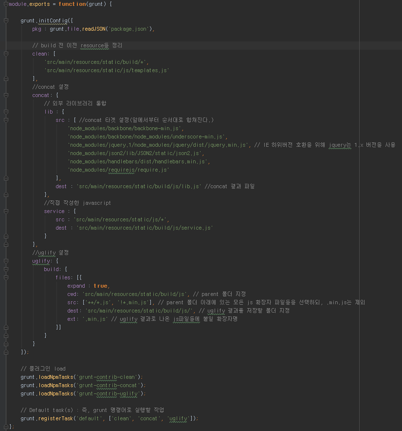

IE 7,8에서 JS 프레임워크 조합하기
---------------------------------
Angular나 React + @ 조합같은 경우 정말 매력적인 JS 프레임워크임은 분명하나 IE 7, 8에서는 사용할 수 없다는 치명적인 단점? 이 있다. <br/>
국내에선 아직까지 IE 7,8의 점유율이 높은 편이라 회사 사정에 따라 IE 7,8을 지원해야하는 경우가 있다.


하지만 생각보다 많은 분들이 모던하게 Javascript를 개발하고 싶어한다. <br/>
React/Angular/ES2015 에 대해 **회사에서는 못쓰지만 이직을 위해** 라는 이유로 스터디에 참석하는 것을 정말 정말 많이 보았다.
그래서 최대한 이런 환경에서 모던하게 개발할 수 있는 방법을 소개하려 한다. <br/>
본인의 회사가 IE9부터 지원한다면 뒤로가기 버튼을 살포시 누르면 된다 <br/>

전체적인 방향은 이렇다. **서버단 작업을 최신**으로 하자는 것이다. <br/>

### 사용할 JS 프레임워크
* nodejs
  - 4.5.0 LTS 버전 사용 예정 (2016.09.20 기준)
  - Javascript 패키지 관리를 bower가 아닌 npm 으로 관리하기 위해 사용
  - bower는 버그가 좀 있다. 웬만하면 npm으로 패키지 관리를 추천
  
* [backbone](http://backbonejs.org/)
  - Javascript를 MV* 구조로 개발할 수 있게 지원하는 프레임워크
  - [backbone.js 사용시 주의사항](http://huns.me/development/1212)

* jquery
  - 설명이 필요없는 Javascript 라이브러리
  - 여기선 Dom select와 이벤트 바인딩용으로 사용
  
* underscore
  - Javascript를 함수형으로 사용할 수 있게 지원
  - map, filter 등과 같은 기능들이 포함되어 있음
  
* require
  - Javascript 의존성 관리 및 동적로딩
  - Java에서 class들을 사용할때 import 하듯이 필요한 순간에 해당 스크립트를 사용
  - [네이버의 Requirejs 이해](http://d2.naver.com/helloworld/591319) 참고
  
* handlebars
  - client-side template engine
  - 서버 통신 없이 화면을 다시 그려야할 경우 사용
  - 부끄럽지만.. handlebars.js에 대한 예제는 [내 블로그](http://jojoldu.tistory.com/23) 내용이 꽤 반응이 좋아서.. 추천! 

* grunt
  - Javascript build 및 task 관리
  - 예를들면 실서버 배포시에 Javascript들을 압축/난독화 등을 할때 이를 task로 지정하여 명령어 한번에 사용이 가능할 수 있게 지원
  - [널리 블로그에서 소개하는 Grunt](http://nuli.navercorp.com/sharing/blog/post/1132682) 참고

개발 진행
----------
### Grunt 진행
[널리 블로그](http://nuli.navercorp.com/sharing/blog/post/1132682)를 참고하여 GruntFile을 작성한다.<br/>


GruntFile 생성후에는 grunt 명령어를 실행시킬수 있도록 grunt를 Global로 설치하자 <br/>
현재 프로젝트 폴더로 이동후 터미널 혹은 CMD를 열어 <br/>
```
npm install -g grunt
```

이러면 전역 설치가 되어 어디에서든 ```grunt``` 명령어를 사용할 수 있다. <br/>
어찌됐든 해당 폴더에서 grunt 명령어를 실행시켜보자
```
열려있는 터미널 혹은 CMD에서 아래 명령어 입력
grunt
```
이렇게 하면 요란한 텍스트와 함께 뭔가 실행되는 것을 볼 수 있는데 이게 끝나면 본인 프로젝트 폴더에 build/lib.js 라는 파일이 생긴것을 확인할 수 있다.


방금한것이 GruntFile.js를 기반으로하여 grunt를 실행시킨 것이다. <br/>