IE 7,8에서 JS 프레임워크 조합하기
---------------------------------
Angular나 React @ 조합같은 경우 정말 매력적인 JS 프레임워크임은 분명하나 IE 7, 8에서는 사용할 수 없다는 치명적인 단점이 있다.
국내에선 아직까지 IE 7,8의 점유율이 높은 편이라 회사 사정에 따라 IE 7,8을 지원해야하는 경우가 있다.


하지만 생각보다 많은 분들이 모던하게 Javascript를 개발하고 싶어한다. React/Angular/ECMA2015 스터디를 보면 **회사에서는 못쓰지만 이직을 위해** 라는 이유로 스터디에 참석하는 것을 정말 정말 많이 보았다.
그래서 최대한 이런 환경에서 모던하게 개발할 수 있는 방법을 소개하려 한다. 본인의 회사가 IE9부터 지원한다면 뒤로가기 버튼을 살포시 누르면 된다 <br/>
모든 코드는 [Github](https://github.com/jojoldu/blog-code/tree/master/js-framework-ie78) 에 있으니 참고하면 될것 같다.

### 사용할 JS
프로젝트 구성은 SpringBoot+Freemarker+Gradle을 기본으로 하여 아래 JS 라이브러리들을 조합할 예정이다.

* nodejs
  - 4.5.0 LTS 버전 사용 예정 (2016.09.20 기준)
  - grunt를 사용하기 위해 먼저 설치되어 있어야함
  - Javascript 패키지 관리를 bower가 아닌 npm 으로 관리하기 위해 사용
  - bower는 버그가 좀 있다. 웬만하면 npm으로 패키지 관리를 추천

* [backbone.js](http://backbonejs.org/)
  - Javascript를 MV* 구조로 개발할 수 있게 지원하는 프레임워크
  - [조규태님의 backbone.js 가이드](http://webframeworks.kr/getstarted/backbonejs/)
  - [backbone.js 사용시 주의사항](http://huns.me/development/1212)

* jquery
  - 설명이 필요없는 Javascript 라이브러리
  - 여기선 Dom select와 이벤트 바인딩용으로 사용

* underscore.js
  - Javascript를 함수형으로 사용할 수 있게 지원 (client-side template engine용이 아니다.)
  - map, filter 등과 같은 함수형 기능들이 포함
  - backbone을 사용하려면 필수로 의존하게 되는데, 여기선 backbone 의존성을 위해서도 있지만, 좀 더 함수형으로 코드 작성하기 위해 사용
  - lodash라는 업그레이드 버전이 있지만 공식 사이트에서 IE 11까지만 확인되었다고해서 제외
  - underscore/lodash 모두 **ECMA2015** 때문에 포지션이 애매해졌다. (즉, ECMA2015 쓸수있는 환경이면 이거 다 몰라도 된다.)

* require.js
  - Javascript 의존성 관리 및 동적로딩
  - [네이버의 Requirejs 이해](http://d2.naver.com/helloworld/591319) 참고

* handlebars.js
  - client-side template engine
  - 서버 통신 없이 화면을 다시 그려야할 경우 사용
  - 기본적인 소개와 문법/기능은 [티몬의 개발 블로그](http://blog.naver.com/PostView.nhn?blogId=tmondev&logNo=220398995882)를 참고
  - 부끄럽지만.. 추가적으로 실제 배포환경에서 사용법은 [내 블로그](http://jojoldu.tistory.com/23) 내용을 참고

* grunt
  - Javascript build 및 task 관리
  - 예를 들면 Javascript들을 압축/난독화 등을 할때 이를 task로 지정하여 명령어 한번에 사용이 가능할 수 있게 지원
  - [널리 블로그에서 소개하는 Grunt](http://nuli.navercorp.com/sharing/blog/post/1132682) 참고하자 개인적으로 grunt 설명중 최고다

개발 진행
-----
### 기본 프로젝트 생성
여기선 SpringBoot Gradle 기준으로 코드를 작성중이니 그대로하면 좋고, 아니라도 크게 차이는 없으니 본인이 사용할 프로젝트 스펙에 맞춰 프로젝트를 생성하면 된다. <br/>
View 템플릿은 JSP 대신에 Freemarker를 사용할 예정이다. JSP도 크게 상관은 없는데 Boot에서는 Freemarker/thymleaf와 같은 ViewTemplateEngine을 밀어주고 있으니 이참에 한번 사용해보는걸 추천한다. <br/>

* build.gradle에 freemarker 의존성 추가


* Application 및 config, index.ftl


```
//Application.java
@SpringBootApplication
@Controller
public class Application {

	public static void main(String[] args) {
		SpringApplication.run(Application.class, args);
	}

    //@RequestMapping(value = "/", method = RequestMethod.GET)가 GetMapping("/") 가 됨
	@GetMapping("/")
	public String index(){
		return "index";
	}
}

//WebConfig.java
@Configuration
@EnableWebMvc
public class WebConfig extends WebMvcConfigurerAdapter {

    @Override
    public void addResourceHandlers(ResourceHandlerRegistry registry) {
        registry.addResourceHandler("/**").addResourceLocations("classpath:/static/");
    }
}


// index.ftl
<!DOCTYPE html>
<html lang="ko">
<head>
    <meta charset="UTF-8">
    <title>모던 IE78</title>
</head>
<body>
    <h1>모던하게 개발하는 IE 7/8</h1>
</body>
</html>
```

기본적인 환경은 다 구축되었다. 이제 이 프로젝트를 구동시켜 브라우저에 localhost:8080으로 접속해보자 <br/>
그러면!


이렇게 기본적인 정상적으로 프로젝트가 생성되었음을 확인할 수 있다. <br/>
여기서부터 시작이다. 이제 하나씩 Javascript 라이브러리들을 붙여나가겠다.

### package.json 작성
모든 Javascript 프로젝트들의 시작은 package.json 생성부터 시작이다. <br/>
이를 위해선 node.js 설치가 필수이다. <br/>
[공식사이트](https://nodejs.org/ko/)를 방문하여 **LTS 버전**을 다운받아 설치하자. 이 글을 작성할 당시에는 4.5.0이였는데, 아마 보시는 분들은 그보다 높은 버전을 설치할 수도 있다. <br/>
(package.json 작성방법은 [outsider님의 글](https://blog.outsider.ne.kr/674)을 참고하면 아주 좋다.) <br/>
본인 프로젝트 폴더에서 터미널 혹은 CMD를 열어 아래와 같이 명령어를 입력해보자.

```
//package.json 초기화
npm init

//npm init 과정이 끝났다면 필요한 의존성들 설치 (package.json에도 작성하기 위해 -save 옵션을 추가)
npm install -save backbone

npm install -save handlebar

npm install -save jquery.1

npm install -save json2

npm install -save requirejs

```
위 과정이 끝나면 원하는 형태의 package.json과 라이브러리들이 받아져 있을 것이다.


자 그러면 간단하게 jquery를 이용하여 alert을 보여주는 기능을 작성해보겠다. <br/>
src/main/resources/static 폴더 아래에 js 라는 폴더를 생성하고, index.js 파일을 생성하자 <br/>


이렇게 생성은 했는데 이걸 쓰려면 jquery가 필요하다. <br/>
앞에 서버코드를 설정한것을 보면 ```registry.addResourceHandler("/**").addResourceLocations("classpath:/static/"); ``` 이렇게 되어있는데,
이 말은 src/main/resources/static 폴더에 있는 static 파일들을 지원하겠다는 의미이다.  <br/>

그래서 귀찮지만 jquery 라이브러리를 src/main/resources/static/js/lib 폴더에 복사하자<br/>
(계속 이렇게 하지 않으니 조금만 참아달라) <br/>
jquery 라이브러리의 위치는 node_modules/jquery.1/node_modules/jquery/dist/에 있는 jquery.min.js 이다


파일을 복사했으면 freemarker에서 호출할 수 있도록 코드를 작성하자.

```
<!DOCTYPE html>
<html lang="ko">
<head>
    <meta charset="UTF-8">
    <title>모던 IE78</title>
</head>
<body>
    <h1>모던하게 개발하는 IE 7/8</h1>
    <script type="text/javascript" src="/js/lib/jquery.min.js"></script>
    <script type="text/javascript" src="/js/index.js"></script>
</body>
</html>
```
작성 후 프로젝트를 다시 실행시켜 localhost:8080에 접속하면 아래와 같이 jquery 기능과 index.js가 정상작동한 것을 확이할 수 있다.


npm과 jquery를 이용하여 간단한 기능을 구현해보았다. 다음은 require.js를 사용해보겠다.

### require.js 소개
index.js를 보면 2가지 기능을 하고 있다. <br/>
sum과 alert 기능인데, index.js가 한가지 기능만 하도록 sum 기능은 분리하고, alert만 남기자. <br/>
index.js가 있는 폴더에 Calculator.js 를 만들자


고쳐야할 코드는 아래와 같다.
```
//Calculator.js
var Calculator = {
  add : function(a,b){
      return a+b;
  }
};

//index.js
$(function() {
   var a=1, b=2;
   var sum = Calculator.add(a,b);
   alert(sum);
});

//index.ftl
<!DOCTYPE html>
<html lang="ko">
<head>
    <meta charset="UTF-8">
    <title>모던 IE78</title>
</head>
<body>

    <h1>모던하게 개발하는 IE 7/8</h1>
    <script type="text/javascript" src="/js/lib/jquery.min.js"></script>
    <script type="text/javascript" src="/js/Calculator.js"></script>
    <script type="text/javascript" src="/js/index.js"></script>
</body>
</html>
```

이렇게 구성후 프로젝트를 재시동하여 localhost:8080을 접속하면 정상적으로 코드가 분리된 것을 확인할 수 있다. <br/>
자 이 간단한 구성에서 조차 문제가 있다. <br/>
index.js는 항상 Calculator.js가 필요하다. 이를 index.js가 Calculator.js에 **의존한다** 라고 한다. <br/>
즉, index.js를 사용하기 위해선 Calculator.js를 항상 먼저 호출해야한다. <br/>
<br/>
헌데 1~2개의 파일이면 문제 없지만 사이트의 규모가 커지면 커질수록 어떤 js를 호출하기 위해선 어떤 js가 먼저 호출되어야 한다는 것을 인지하고 개발하는것이 매우 어렵다. <br/>
Java와 같은 서버사이드 언어에서 이런 문제를 의식하지 못하는 이유는 기본적으로 **import 기능** 이 내장되어 있어 이를 통해 필요한 Class들이 무엇인지 지정할 수 있기 때문이다. <br/>
<br/>
Javascript는 이와 같은 기능이 기본적으로 내장되어 있지 않아 외부 라이브러리의 도움을 받아야 한다. <br/>
우리가 사용할 라이브러리는 require.js 라고 한다. <br/>

require.js를 사용하기 위해 node_modules에서 파일을 옮기자. 근데 또 수동으로 옮기지말고 이번엔 이런 **복사 작업을 자동화** 해보자.

### Grunt - 기본
앞에서 얘기한대로 node_modules에 받은 라이브러리들을 복사하는것이 매우 귀찮은 행위이므로 이를 자동화 하기 위해 grunt를 사용할 것이다 <br/>
grunt의 경우 워낙 [널리 블로그](http://nuli.navercorp.com/sharing/blog/post/1132682)에서 잘 설명하고 있어 참고하면 될 것같다. <br/>
<br/>
자 그럼 grunt 작업을 진행해보자. <br/>
grunt를 사용하기 위해 grunt 라이브러리를 npm으로 받자.
```
//터미널 혹은 cmd를 프로젝트 폴더에서 open하여 아래 명령어 입력
npm install --save-dev grunt
```
(grunt를 받으면서 package.json에 반영 및 dev용으로 사용하기 위해 --save-dev 옵션 사용하였다.) <br/>
grunt를 전역으로 설치하면 여러 프로젝트간에 grunt 버전이 꼬일 경우 문제가 발생할 수 있으니 이 프로젝트에서만 쓸 수 있도록 grunt를 설치하였다.<br/>
설치가 끝나면 아래와 같이 package.json과 node_modules 폴더가 변경된 것을 확인할 수 있다.


정상적으로 설치된 것을 확인하였으면 grunt를 사용하기 위해 설정파일을 생성해보자 <br/>
package.json과 동일한 위치에 Gruntfile.js 파일을 생성해서 아래 코드를 붙여넣자

```
'use strict';
module.exports = function(grunt) {

    grunt.initConfig({
        pkg : grunt.file.readJSON('package.json'),

        //jquery와 requirejs를 copy하도록 지정
        copy : {
            jquery : {
                src : 'node_modules/jquery.1/node_modules/jquery/dist/jquery.min.js',
                dest : 'src/main/resources/static/js/lib/jquery.min.js'
            },
            require : {
                src : 'node_modules/requirejs/require.js',
                dest : 'src/main/resources/static/js/lib/require.js'
            }
        }
    });

    // 플러그인 load
    grunt.loadNpmTasks('grunt-contrib-copy');

    // Default task(s) : 즉, grunt 명령어로 실행할 작업
    grunt.registerTask('default', ['copy']);
};
```
코드 작성이 끝나면 아래와 같이 파일이 위치하면 된다.


grunt는 grunt를 위한 플러그인들이 존재하는데, 우린 copy 기능을 위해 copy관련 플러그인을 설치해야한다. <br/>
해당 플러그인 이름은 Gruntfile.js에도 명시되어있다. **grunt-contrib-copy**이다.

```
//열려있는 터미널 혹은 cmd에 아래와 같이 설치 명령어를 입력하자
npm install --save-dev grunt-contrib-copy
```

방금전 grunt 설치명령어와 유사하기 때문에 설치가 끝나면 확인 역시 똑같이 하면 된다. <br/>
플러그인 설치가 끝이났다면 한번 실행을 해보자


정상적으로 done 확인후 프로젝트 폴더를 다시 확인해보자


require.js가 정상적으로 복사된것을 확인할 수 있다 <br/>
근데 매번 이렇게 터미널에서 .bin 폴더까지 이동후에 grunt 명령어를 사용해야하나? 귀찮지 않을까? <br/>
이런 귀찮은 명령어를 미리 지정해서 할 수 있다. <br/>

package.json을 열어 scripts에 아래 코드를 추가하자
```
  "scripts": {
    "test": "echo \"Error: no test specified\" && exit 1",
    "start": "node_modules/.bin/grunt"
  }
```


이렇게 등록하게 되면 프로젝트 폴더 내 어디서든 ```npm start``` 라는 명령어를 실행하면 node_modules/.bin/grunt 명령어를 실행시키게 된다. <br/>
정상적으로 작동되는지 확인하기 위해 lib폴더 아래에 있는 jquery.min.js와 require.js를 지우고 터미널 혹은 cmd에서 ```npm start```를 입력해보자


자! 이제야 require.js를 사용할 수 있게 되었다!!


(삼천포로 느껴진다면 착각이 아닌.....) <br/>

여튼 다음시간엔 grunt를 통해 옮긴 require.js를 사용해보자!

### require.js 사용
전반적인 사용법은 [Nonblock님의 글](http://blog.javarouka.me/2013/04/requirejs-javascript.html)이 큰 도움이 되니 꼭 참고하길 바란다. <br/>
여기서는 간단하게 사용해보려 한다. <br/>
requirejs는 각 js간의 의존성 관리 및 동적로딩을 지원하는 js 라이브러리이다.<br/>
a.js가 b.js가 필요한 경우 requirejs를 이용하여 의존성 관계를 적용할 수 있고, 미리 호출할 필요없이 필요한 경우에만 b.js가 호출되도록 하여 성능상으로도 이점이 생긴다. <br/>
백분이 불여일타! 이전 코드를 requirejs로 리팩토링 해보자. <br/>

requirejs는 js파일을 각자 모듈로 지정하여 사용하는것을 권장한다. <br/>
모듈로 지정하지 않고 사용할 경우 전역스페이스 오염이나 scope 침범등의 문제가 발생할 확률이 높아 웬만하면 모듈로 지정하여 사용하는것을 권장하는 것이다.<br/>
그래서 Calculator.js를 requirejs의 모듈로 되도록 아래와 같이 수정한다.

```
//Calculator.js

define([], function() {
   return {
       add : function(a,b){
           return a+b;
       }
   };
});

```

requirejs는 모듈 선언을 **define** 이란 지시어로 한다. <br/>
define의 인자는 아래와 같은 역할을 한다.
* 1번째 인자는 필요한 의존성들을 선언할 수 있다
* 2번째 인자인 function은 해당 js파일을 호출했을때 실행할 코드와 return될 값 혹은 객체를 생성한다

즉, Calculator.js를 호출하게 되면 return된 {} 객체를 사용 할 수 있게 된다. <br/>
이제 Calculator.js를 사용하는 index.js를 수정해보겠다.

```
//index.js
require(["/js/Calculator.js"], function(Calculator) {
   var a=1, b=2;
   var sum = Calculator.add(a,b);
   alert(sum);
});
```

index.js는 Calculator.js와 다른 지시어인 **require**를 사용하였다. <br/>
require 지시어는 선언된 모듈들을 사용할 수 있게 해주는 지시어이다. <br/>
define과 비슷하게 첫번째 인자로 의존성, 두번째 인자로 실행 코드 함수가 위치한다.<br/>
1번째 인자를 보면 **/js/Calculator.js라는 의존성을 사용하고, 이를 2번째 인자에서 Calculator 라는 이름으로 사용**하겠다는 의미이다. <br/>
js 관련 수정내용은 여기까지이고 마지막으로 requirejs를 사용할 수 있도록 index.ftl도 수정한다.

```
<!DOCTYPE html>
<html lang="ko">
<head>
    <meta charset="UTF-8">
    <title>모던 IE78</title>
</head>
<body>
    <h1>모던하게 개발하는 IE 7/8</h1>
    <script type="text/javascript" src="/js/lib/require.js"></script>
    <script type="text/javascript" src="/js/lib/jquery.min.js"></script>
    <script type="text/javascript" src="/js/index.js"></script>
</body>
</html>
```

여기서 index.ftl에 보면 2가지 변경 사항이 있다.
* require.js를 호출하는 코드가 추가되었다.
* Calculator.js를 호출하는 코드가 **삭제**되었다.

자 이상태에서 한번 프로젝트를 다시 구동시켜보자. 그리고 개발자 도구로 network를 보자

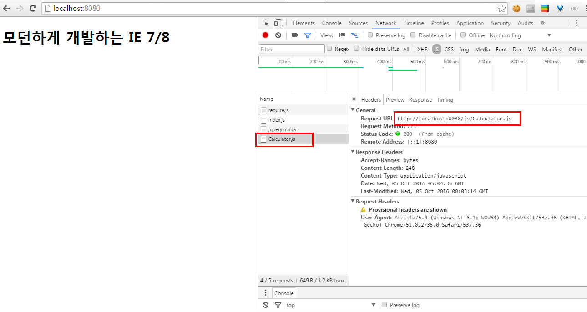

보는것처럼 정상적으로 Calculator.js를 호출하고 있다.<br/>
그렇다면 index.ftl에서 삭제한 이 Calculator.js는 누가 호출해주는 것일까? <br/>
예상한대로 index.js에서 선언한 ```require(["/js/Calculator.js"])``` 에서 호출해주는 것이다. <br/>
여기서 알 수 있는 것은 requirejs는 html/jsp/freemarker등에서 직접 호출을 선언하지 않아도, 필요한 js파일이 있을 경우 의존성에 따라 직접 호출한다는 것이다. <br/>
<br/>

index.js를 보면 html에서 js파일을 호출하듯이 **절대주소**로 js를 호출하고 있다. <br/>
requirejs는 **상대주소**로 호출할 경우 .js를 생략할 수 있다.

```
require(["js/Calculator"], function(Calculator) {
   var a=1, b=2;
   var sum = Calculator.add(a,b);
   alert(sum);
});

```

여기서 보면 중복될만한 코드가 보인다 <br/>
바로 js/Calculator의 **js/**이다. 어차피 모든 js파일이 js폴더 아래에 있을텐데 코드를 작성할때는 js폴더를 지정하지 않아도 자동으로 js폴더내에서 해당 js파일을 찾았으면 한다. <br/>
이런 요구사항을 위해 requirejs에서는 requirejs 설정을 지원한다. <br/>

js 폴더 아래에 main.js 파일을 만들어 아래의 코드를 추가하자

```
//main.js
// 이 코드를 require.js가 로딩된 뒤 기타 모듈을 로딩하기 전에 둔다.
require.config({
    baseUrl: "js", // 모듈을 로딩할 기본 패스를 지정한다.
    waitSeconds: 15 // 모듈의 로딩 시간을 지정한다. 이 시간을 초과하면 Timeout Error 가 throw 된다
});
```

위 main.js를 require.js 호출된 다음에 바로 호출할 수 있도록 index.ftl을 수정하자

```
//index.ftl
<!DOCTYPE html>
<html lang="ko">
<head>
    <meta charset="UTF-8">
    <title>모던 IE78</title>
</head>
<body>
    <h1>모던하게 개발하는 IE 7/8</h1>
    <script type="text/javascript" src="/js/lib/require.js"></script>
    <script type="text/javascript" src="/js/lib/jquery.min.js"></script>
    <script type="text/javascript" src="/js/main.js"></script>
    <script type="text/javascript" src="/js/index.js"></script>
</body>
</html>
```

그리고 해당 설정이 잘 적용되는지 확인하기 위해 index.js를 수정하자

```
require(["Calculator"], function(Calculator) {
   var a=1, b=2;
   var sum = Calculator.add(a,b);
   alert(sum);
});
```

보는 것처럼 Calculator호출시에 **js/**를 생략해서 호출하고 있다. <br/>
이대로 프로젝트를 재시작해서 localhost:8080에 접속하면!

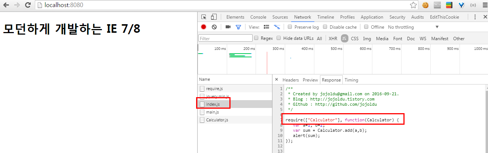

js폴더 지정이 생략되어도 정상적으로 Calculator.js를 호출하는것을 확인할 수 있다.<br/>

자 이제 require.js까지 적용해보았다. 다음은 backbone.js를 적용하자!

### backbone.js 사용 (1)
backbone.js는 Model/Collection/View 라는 3가지 요소로 구성된 Javascript 프레임워크이다<br/>
(Controller가 아니다 오해하시는분들이 꽤 많으신데 Collection이다)<br/>
몇줄의 코드만으로 Model의 변경에 자동으로 view가 반응하도록 할 수 있다. <br/>

backbone을 시작하기전, 현재 시스템을 조금 더 고도화!? 해보자. <br/>
1+2를 2개의 input box에서 입력 받아 sum을 출력하는 방식으로 변경한다.

```
//index.ftl
<!DOCTYPE html>
<html lang="ko">
<head>
    <meta charset="UTF-8">
    <title>모던 IE78</title>
</head>
<body>
    <h1>모던하게 개발하는 IE 7/8</h1>
    <div id="userInput" class="row">
        입력 1: <input type="text" class="inputs" id="input1" value="0"><br/>
        입력 2: <input type="text" class="inputs" id="input2" value="0">
        <div id="addResult" class="row">
            : <input type="text" id="result">
        </div>
    </div>
    <br/>
    <script type="text/javascript" src="/js/lib/jquery.min.js"></script>
    <script type="text/javascript" src="/js/lib/require.js"></script>
    <script type="text/javascript" src="/js/main.js"></script>
    <script type="text/javascript" src="/js/index.js"></script>
</body>
</html>

//index.js
require(["Calculator"], function(Calculator) {
   var a = $('#input1').val(),
       b = $('#input2').val();

   var sum = Calculator.add(parseInt(a), parseInt(b));
   $('#result').val(sum);

});
```

index.ftl과 index.js를 수정 후 프로젝트를 재시작해보자. 그러면 바뀐 UI를 확인할 수 있다.

자 여기서 기능을 좀더 확장시켜보자. 현재는 input1,input2의 값이 변경될 경우 결과값이 반영되지 않는다. <br/>
그래서 값이 변경되면 결과에 바로 반영되도록 index.js 코드를 조금 수정해보겠다.

```

//index.js
require(["Calculator"], function(Calculator) {
   var $inputs = $('.inputs'),
       $result = $('#result');

   var getResult = function() {
      var a = $('#input1').val(),
          b = $('#input2').val();
      var sum = Calculator.add(parseInt(a), parseInt(b));
      $result.val(sum);
   };

   $inputs.on('keyup', getResult);

   getResult();
});

```

이렇게 코드를 작성후 프로젝트를 다시 실행시켜보자 <br/>
그럼 실시간으로 sum값이 반영되는 프로젝트가 보일 것이다.

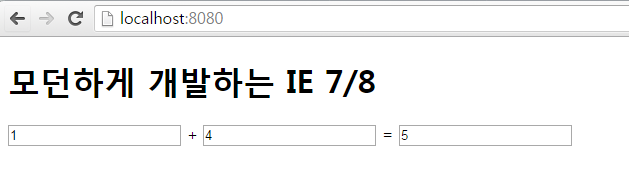

기능 확인이 끝났다면 작성한 코드를 다시보자 <br/>
이 코드에서는 문제가 없을까? 이렇게 간단한 코드에서도 문제가 있는걸까? <br/>
<br/>
index.js는 너무 많은 일을 하고 있다. 아래는 index.js가 하고 있는 일이다.
* index.ftl이 호출되었을때 어떤 일을 해야하는지 지시하고 있다
* input1, input2의 값을 가지고 Calculator를 통해 합을 구한다
* inputs class를 가지고 있는 dom에 keyup 이벤트가 발생하면 getResult 함수를 호출한다
* 페이지 처음 로딩시 getResult를 통해 합계를 구한다

index.js가 과연 저 많은 일들을 할 필요가 있을까? <br/>
index.js는 index.ftl이 불렸을 때 어떤 js들을 통해 어떤 일을 지시하는지만 하면 되지 않을까? <br/>
Java는 MVC 모델로 각 Layer를 분리하면서 Javascript는 왜 분리하지 않을까? <br/>
이런 고민을 갖고 있다면 Backbone.js가 좋은 방법이 될 수 있다 <br/>
(물론 angular.js도 가능하다. but! 우린 IE 7,8에서 개발해야 하니 pass.....)


서론이 너무 길었던것 같다. 이제 이 코드를 backbone 기반으로 변경을 시작해보자.<br/>
기본적인 개념과 사용법은 [조규태님의 backbone.js 가이드](http://webframeworks.kr/getstarted/backbonejs/)를 참고하면 될것같다. <br/>

backbonejs를 정상적으로 사용하기 위해서는 underscore.js와 jquery가 필요하다 <br/>
이를 위해서 이전에 작업한 grunt를 이용하여 node_modules에 있는 js파일들을 복사하자 <br/>
jquery는 이미 있으니 underscore.js와 backbone.js만 진행하면 된다 <br/>
Gruntfile.js를 아래와 같이 수정하자

```
//Gruntfile.js

'use strict';
module.exports = function(grunt) {

    grunt.initConfig({
        pkg : grunt.file.readJSON('package.json'),

        //jquery와 requirejs, underscorejs, backbonejs를 copy하도록 지정
        copy : {
            jquery : {
                src : 'node_modules/jquery.1/node_modules/jquery/dist/jquery.min.js',
                dest : 'src/main/resources/static/js/lib/jquery.min.js'
            },
            require : {
                src : 'node_modules/requirejs/require.js',
                dest : 'src/main/resources/static/js/lib/require.js'
            },
            underscore : {
                src : 'node_modules/backbone/node_modules/underscore/underscore-min.js',
                dest : 'src/main/resources/static/js/lib/underscore-min.js'
            },
            backbone : {
                src : 'node_modules/backbone/backbone-min.js',
                dest : 'src/main/resources/static/js/lib/backbone-min.js'
            }
        }
    });

    // 플러그인 load
    grunt.loadNpmTasks('grunt-contrib-copy');

    // Default task(s) : 즉, grunt 명령어로 실행할 작업
    grunt.registerTask('default', ['copy']);
};
```

작성후, 터미널 혹은 CMD에서 **npm start**를 입력하면 grunt가 진행되어 copy가 진행될 것이다

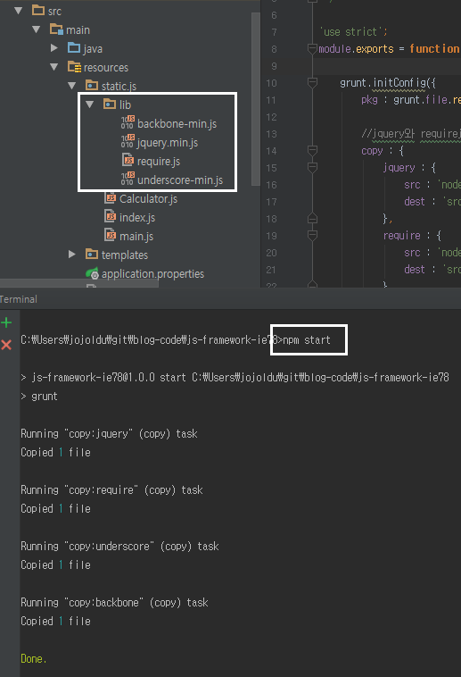

이전과 마찬가지로 index.ftl에 underscore.js와 backbone.js를 추가하자

```
//index.ftl

<!DOCTYPE html>
<html lang="ko">
<head>
    <meta charset="UTF-8">
    <title>모던 IE78</title>
</head>
<body>
    <h1>모던하게 개발하는 IE 7/8</h1>
    <div id="userInput" class="row">
        입력 1: <input type="text" class="inputs" id="input1" value="0"><br/>
        입력 2: <input type="text" class="inputs" id="input2" value="0">
        <div id="addResult" class="row">
            : <input type="text" id="result">
        </div>
    </div>
    <br/>
    <script type="text/javascript" src="/js/lib/jquery.min.js"></script>
    <script type="text/javascript" src="/js/lib/underscore-min.js"></script>
    <script type="text/javascript" src="/js/lib/backbone-min.js"></script>
    <script type="text/javascript" src="/js/lib/require.js"></script>
    <script type="text/javascript" src="/js/main.js"></script>
    <script type="text/javascript" src="/js/index.js"></script>
</body>
</html>
```

backbone의 경우 View와 Model이라는 2가지 타입이 있다. (Collection은 나중에 소개하겠다) <br/>
보통의 경우 데이터 관리는 Model이, 데이터의 변경에 따라 화면변경 혹은 이벤트처리 등은 View에서 담당하고 있기 때문에 View가 Controller역할까지 한다고 보면 될것 같다. <br/>
<br/>
위 코드를 View만으로 수정해보자.<br/>
js 폴더 아래에 add라는 폴더를 생성하여 AddView.js 파일을 추가하자


추가 및 수정할 코드는 아래와 같다.

```
//AddView.js
define(["Calculator"], //require->define으로 변경했다. 즉시실행할 필요가 없어져서.
function(Calculator) {
    return Backbone.View.extend({

        // view 객체 생성시 진행할 코드들
        initialize: function () {
            $('.inputs').on('keyup', this.render);
        },

        render : function() {
            var a = $('#input1').val(),
                b = $('#input2').val();
            var sum = Calculator.add(parseInt(a), parseInt(b));

            $('#result').val(sum);
        }
    });
});

//index.js
require(['Calculator', 'add/AddView'], function(Calculator, AddView) {
   var addView = new AddView();
   addView.render();
});
```

backbone.js는 View 객체를 **Backbone.View.extend({})** 로 선언한다. <br/>
requirejs 사용에 대해 다시 한번 기억을 떠올려 보면서 코드를 보자 <br/>
define의 2번째 인자인 function에서 return 되는 객체는 해당 js파일을 호출할때 전달되는 값이라는 것이 기억 날 것이다. <br/>
즉, AddView.js를 누군가 requirejs를 통해 호출할 경우 전달되는 값은 **Backbone.view.extend({...})** 인것이다. <br/>
<br/>
AddView.js는 index.js의 역할 중, add에 관한 모든 책임을 받았다 <br/>
즉, **inputs 클래스를 가진 dom element들에 keyup이벤트를 할당**하고,<br/>
**keyup 이벤트가 발생하면 Calculator.js를 이용하여 계산된 결과를 result에 할당**한다.<br/>
<br/>
index.js는 add 기능에 관한 모든 책임을 AddView.js에 이관했기 때문에 남은건 AddView.js를 호출하는것 뿐이다. <br/>
자 그럼 여기까지 한 결과가 정상적으로 작동하는지 확인을 해보자

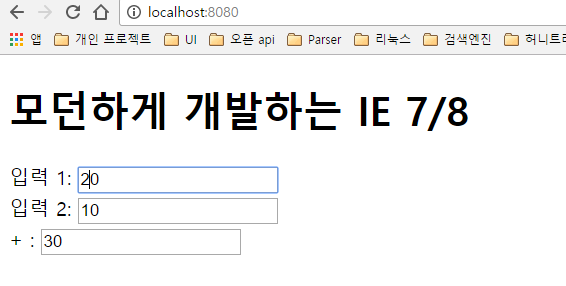

잘 되는 것이 확인 되었다. <br/>

자 근데 여기서 AddView 역시 가지고 있는 역할이 너무 많다. <br/>
**화면 변화에 필요한 일만 AddView**가 담당하고 **데이터는 다른 곳이 책임**을 지는게 좀 더 역할 분리가 된것 아닐까? <br/>
backbone.js의 Model이 바로 이때 사용된다. <br/>
지정한 데이터만 순수하게 관리하는 역할을 하는 객체를 backbone.js에선 Model 객체라고 한다. <br/>
AddView.js 객체와 동일한 위치에 AddModel.js를 생성하자

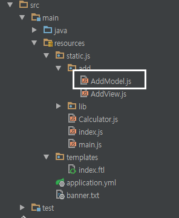

코드는 아래와 같다.

```
// AddModel.js
define(["Calculator"],
function(Calculator) {

    return Backbone.Model.extend({
        // Model 객체 생성시 defaults를 기준으로 관리해야될 데이터(attributes)를 생성
        defaults: {
            input1: 0,
            input2: 0,
            result: 0
        },

        setInputs : function (obj) {
            var input1 = parseInt(obj.input1),
                input2 = parseInt(obj.input2),
                result = Calculator.add(input1, input2);

            // Model 객체의 attributes에 입력 받은 새로운 값을 set
            this.set({input1: input1, input2: input2, result:result});
        }
    });
});
```

defaults는 Model 객체가 관리해야할 데이터로 생각할 수 있지만, 정확히 그렇지는 않다. <br/>
다만 Model이 **관리해야 할 데이터의 초기 데이터 형태가 defaults를 기준으로 생성**된다는 것을 알고 가자<br/>
<br/>
AddModel.js에서는 setInputs 함수가 있다.<br/>
이 함수를 통해서 View영역에서 Model에 데이터 변경을 요청하게 된다. <br/>
전달 받은 값으로 관리되는 데이터를 변경하고, result를 Calculator를 통해 전달 받아 result값도 변경해준다. <br/>
<br/>
input1/2, result등 데이터 관련된 부분을 모두 AddModel에 넘겨주었으니 AddView.js의 코드도 그에 맞춰 변경하자.<br/>
AddView.js 코드 변경사항의 핵심은 **1) Dom이 변경되면, Model에 변경된 내역을 전달, 2) Model의 값에 따라 화면을 변경**하는 것이다.

```
//AddView.js
//require->define으로 변경, View객체를 전달하기 위해
define(["add/AddModel"], //사용할 AddModel.js를 requirejs를 통해 load
function(AddModel) {
    return Backbone.View.extend({
        model : null,

        /*  el로 지정한 dom 하위 element중 inputs 클래스를 가진 element에
         keyup이벤트가 발생하면 set함수 호출되도록 지정  */
        events: {
            'keyup .inputs' : 'set'
        },

        // view 객체 생성시 진행할 코드들
        initialize: function () {
            //아래에서 사용하는 this는 현재 객체 즉, AddView객체를 얘기한다.
            this.model = new AddModel();

            //model의 값이 변경되는(change) 이벤트가 발생하면 view의 render 함수 호출되도록 지정
            this.listenTo(this.model, 'change', this.render);
        },

        set : function() {
            var input1 = $('#input1').val(),
                input2 = $('#input2').val();

            this.model.setInputs({'input1': input1, 'input2': input2});
        },

        render : function() {
            $('#result').val(this.model.get('result'));
        }
    });
});

//index.js
require(['Calculator', 'add/AddView'], function(Calculator, AddView) {

   //생성자 인자로 el을 넣어주면 AddView영역은 el에 할당된 dom 영역을 본인의 영역으로 지정하게 된다.
   var addView = new AddView({
      el : $('#userInput')
   });
   addView.render();
});
```

코드의 역할은 대부분 주석이 있어 이해하는데 크게 어려움은 없을 것 같다. <br/>
전체 Flow는
* 화면상 input1, input2 값이 변경
* ```events: {'keyup .inputs' : 'set'}``` 로 AddView.js의 set 함수 호출
* set함수가 AddModel의 데이터 변경 (AddModel의 setInputs함수 호출)
* ```this.listenTo(this.model, 'change', this.render)``` 코드로 인해 AddModel데이터 변경시 AddView.js의 render함수 호출
* render함수가 AddModel의 result를 가져와 화면의 result 변경

index.js에서 new AddView에서 인자로 el을 추가하게 된 이유는 **backbone.js의 event binding** 때문이다.

backbone.js에서 event binding을 할때 주의해야 할 점은, 해당 View 객체의 Dom 영역이 지정되어 있어야만 된다는 것이다. <br/>
AddView.js를 new 로 생성할 때 **{el : $('#userInput')}** 처럼 어떤 dom을 해당 View객체의 영역으로 지정할 것인지 입력되지 않으면 .inputs 클래스가 어디 영역인지 알 수 없어 event bingind이 안된다. <br/>
왜 이렇게 번거롭게 했냐하면, backbone.js는 SPA(Single Page Application)에 초점을 맞춰 나온 프레임워크로, <br/>
한 페이지 내에 분리된 Dom 영역은 각각에 맞는 Backbone객체들로 이루어지도록 하기 위함이다. <br/>
하나의 js가 여러 Dom을 모두 관리하는게 아니라 A div 영역은 AView.js와 AModel.js가 전담하고, B div 영역은 BView.js와 BModel.js 가 전담하게 되는 것이다.
여기에서도 ```<div id="userInput"></div>``` 영역은 AddView.js와 AddModel.js가 전담하게 된 것이다. <br/>

한가지 더 주의사항이 있다면,<br/>
backbone.js에서 model의 change 이벤트는 model의 defaults 속성에 반응하는 것이 아니라, attributes에 반응한다.

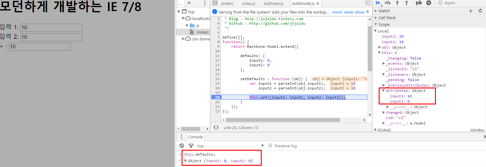

위 그림처럼 set으로 변경하여도 defaults 값은 변경되지 않는다.<br/>
만약 model.defaults로 직접 값을 변경할 경우 change 체크가 안되서 이벤트가 발생하지 않는다. <br/>
model.set() 으로 attributes를 변경해야만 하는 것을 잊지 말자 <br/>

겨우 1+2 하는데 왜 이난리를 쳐야하는지 생각할 수도 있을것 같다.

                             

아직 backbone.js 파트의 전부를 다룬것이 아니니... 조금만 더 참고 따라가보자 <br/>
현재 예제는 backbone.js의 진짜 장점을 나타내기에는 조금 부족한 예제이니 backbone.js가 이상하기 보다는 작성자 예제가 구리다고 판단하는게 좀더 옳은 판단임을 얘기하고 싶다.<br/>
다음은 backbone.js의 진짜 강점인 Ajax를 진행하겠다.

### backbone.js 사용 (2)
이번 시간에는 Ajax를 진행하기 앞서 backbone예제를 좀 더 다듬어 볼 예정이다. <br/>
backbone의 view는 값을 셋팅하는것이 주 목적이 아니라 Model에 따라 Rendering 하는것이 주 목적이다. <br/>
Freemarker에서 result를 input 박스가 아니라 ```<span><strong>``` 으로 조합해서 다시 만들어보자 <br/>
여기서 좀 더 난이도를 높이자면 result의 합이 100이하 일 경우에는 기존과 동일하게 ```<input>```로, <br/>
100 초과일 경우에는 ```<span><strong>``` 로 표기하는 것이다. <br/>
이럴 경우 freemarker 혹은 JSP/Html 에서는 실시간으로 화면을 변경할 수 없으므로, 클라이언트 사이드에서 화면 변경이 이루어져야 한다. <br/>
즉, Javascript로 동적으로 Html을 그려야 (이하 렌더링) 한다는 것이다. <br/>
아래의 코드를 보자.
```
//AddView.js에 추가

render : function() {
    var result = this.model.get('result');
    var template = this.getTemplate(result);

    /*
     AddView를 생성할때 el 인자를 주입하였다.
     this.el : 순수한 dom element
     this.$el : jquery로 wrapping 된 dom element
     즉, $(this.el) == this.$el 이다.
     */
    this.$el.find('#addResult').html(template);
},

getTemplate : function (result) {

    if(result > 100){
        return '<span>+ : '+'<strong>'+result+'</strong></span>';
    }

    return '<input type="text" id="result" value="'+result+'">';
}
```

코드에서 얘기하는 것은 간단하다.
* render 함수는 AddModel을 통해 result 값을 가져온다.
* getTemplate 함수로 result를 전달하여 원하는 형태의 html을 만들어 전달 받는다.
* getTemplate 함수에서 전달받은 html 코드를 addResult의 innerHtml에 작성한다.

여기까지 진행하고 다시 확인해보면!

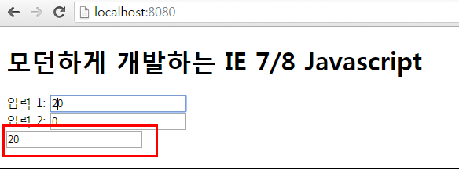
(result가 100미만일 경우의 화면)

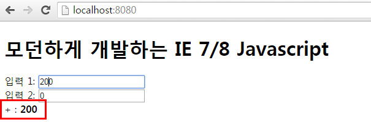
(result가 100이상일 경우의 화면)

input에 따라 실시간으로 화면이 변하는 것을 확인할 수 있다. <br/>
<br/>
위 코드의 문제점은 무엇일까?
* 결국 저 코드는 문자열이다.```</span>``` 이 누락되어도 에디터에서는 체크가 되지 않아 오류가 발생할 여지가 많다.
* 어떤 Dom형태가 될지 예측이 안된다. 이렇게 될 경우 이후 수정이 필요할 때 많은 실수와 시간이 필요하게 된다.

이런 단점으로 인해 backbone.js는 underscore의 template 함수를 사용하여 렌더링 하는것을 기본 가이드로 제공하고 있다. <br/>
```
// index.ftl
<!DOCTYPE html>
<html lang="ko">
<head>
    <meta charset="UTF-8">
    <title>모던 IE78</title>
</head>
<body>
    <h1>모던하게 개발하는 IE 7/8 Javascript</h1>
    <div id="userInput" class="row">
        입력 1: <input type="text" class="inputs" id="input1" value="0"><br/>
        입력 2: <input type="text" class="inputs" id="input2" value="0">
        <div id="addResult" class="row">
        </div>
        <!--
            1. userInput div 안에 있어야만 AddView.js에서 찾을 수 있다.
            2. type은 text/template 이다. javascript가 아니다.
        -->
        <script id="underTemplate" type="text/template">
            <input type="text" id="result" value="<%= result %>">
        </script>

        <script id="overTemplate" type="text/template">
            <span>+ : <strong><%= result %></strong></span>
        </script>
    </div>
    <br/>

    <script type="text/javascript" src="/js/lib/jquery.min.js"></script>
    <script type="text/javascript" src="/js/lib/underscore-min.js"></script>
    <script type="text/javascript" src="/js/lib/backbone-min.js"></script>
    <script type="text/javascript" src="/js/lib/require.js"></script>
    <script type="text/javascript" src="/js/main.js"></script>
    <script type="text/javascript" src="/js/index.js"></script>
</body>
</html>
```

index.ftl에 2개의 script가 추가되었다. <br/>
text/template 타입의 경우 ```<%= %>``` 에 있는 요소들을 기준으로 전달받은 데이터로 치환하여 html문서로 만들수 있게 지원한다. <br/>
우리가 사용할 underscore.template 함수는 이를 사용한 것이다. <br/>
AddView.js 역시 아래와 같이 변경하자.
```
//require->define으로 변경, View객체를 전달하기 위해
define(["add/AddModel"], //사용할 AddModel.js를 requirejs를 통해 load
function(AddModel) {
    return Backbone.View.extend({
        model : null,

        /*  el로 지정한 dom 하위 element중 inputs 클래스를 가진 element에
         keyup이벤트가 발생하면 set함수 호출되도록 지정  */
        events: {
            'keyup .inputs' : 'set'
        },

        underTemplate : $('#underTemplate').html(),
        overTemplate : $('#overTemplate').html(),

        // view 객체 생성시 진행할 코드들
        initialize: function () {
            //아래에서 사용하는 this는 현재 객체 즉, AddView객체를 얘기한다.
            this.model = new AddModel();

            //model의 값이 변경되는(change) 이벤트가 발생하면 view의 render 함수 호출되도록 지정
            this.listenTo(this.model, 'change', this.render);
        },

        set : function() {
            var input1 = $('#input1').val(),
                input2 = $('#input2').val();

            this.model.setInputs({'input1': input1, 'input2': input2});
        },

        render : function() {
            var result = this.model.get('result');
            var template = this.getTemplate(result);

            /*
             AddView를 생성할때 el 인자를 주입하였다.
             this.el : 순수한 dom element
             this.$el : jquery로 wrapping 된 dom element
             즉, $(this.el) == this.$el 이다.
             */
            this.$el.find('#addResult').html(template);
        },

        getTemplate : function (result) {
            var template;

            if(result > 100){
                template = _.template(this.overTemplate);
            }else{
                template = _.template(this.underTemplate);
            }

            return template(this.model.toJSON());
        }
    });
});
```

변경된 템플릿 과정은 아래와 같다.
* text/template 타입의 script를 호출한다
* _.template 함수에 호출한 script의 html을 인자로 넣어 결과를 리턴 받는다.
* 위 리턴된 결과는 JSON 데이터를 ```<%= %>``` 의 요소로 치환시켜줄 수 있는 **템플릿 함수**이다.
* Model의 데이터를 JSON 으로 변환시켜 템플릿 함수에 인자로 넣어 최종 템플릿된 html을 전달 받는다.
* addResult의 innerHtml에 템플릿된 html을 덮어쓴다.

다시 화면을 확인해보면 정상적으로 기능이 작동 되는 것을 확인할 수 있다.<br/>
이번 시간에 진행한 template 과정은 많은 회사가 사용하는 방식이지만 여전히 다른 문제들이 남아있다.<br/>
이후 handlebars.js를 통해 이를 해결하려고 한다. (handlebars.js는 backbone.js 과정이 끝나면 진행할 예정이다.) <br/>
다음 과정은 backbone.js를 통한 Ajax이다


(이번엔 진짜로!)

### backbone.js 사용 (3)
이번 시간은 backbone의 꽃! rest api와의 연동을 진행할 예정이다.<br/>
backbone의 경우 특히나 구분 없이, 중복적으로 사용하는 Ajax 처리에 큰 강점을 가지고 있기에 ([조규태님의 발표자료](http://www.slideshare.net/gyutaejo/backbonejs-m-v) 참고) jquery만으로 프론트엔드를 진행하고 있다면 아주 좋은 시간이 될 것 같다. <br/>
<br/>
자 그럼 본격적으로 내용을 진행하자.<br/>
오늘의 예제는 회원 관리 리스트이다. 기본적인 회원 전체 리스트를 조회하고, 추가를 할 수 있다. <br/>
해당 회원 정보는 실시간으로 서버와 통신하며 반영되어야 한다는 조건이 있다. <br/>
실제 DB까지 구축할 필요는 없으니 내부 변수로 회원 리스트를 선언하는 방식으로 진행하겠다. <br/>
<br/>
제일 먼저 서버 코드를 수정해보자.

```
// Application.java
@SpringBootApplication
@Controller
public class Application {

	private static List<Member> members = new ArrayList<>();

	public static void main(String[] args) {
    //DB를 대신해서 사용
		members.add(new Member(0, "jojoldu", "jojoldu@gmail.com"));
		members.add(new Member(1, "github", "github@github.com"));
		members.add(new Member(2, "okky", "okky@okky.com"));

		SpringApplication.run(Application.class, args);
	}

	//@RequestMapping(value = "/", method = RequestMethod.GET)가 GetMapping("/") 가 됨
	@GetMapping("/")
	public String index(){
		return "index";
	}

	@GetMapping("/member")
	@ResponseBody
	public List<Member> getMembers() {
		return members;
	}

	@PostMapping("/member")
	@ResponseBody
	public boolean addMember(@RequestBody Member member) {
		member.setIdx(members.size());
		members.add(member);
		return true;
	}

}

// Member.java 생성
// lombok을 사용하였다. 참고 : https://blogs.idincu.com/dev/?p=17
@NoArgsConstructor
@AllArgsConstructor
@ToString
public class Member {

    @Getter @Setter
    private long idx;

    @Getter @Setter
    private String name;

    @Getter @Setter
    private String email;
}

```

Application.java에 Rest API 2개를 추가, DB를 대신할 members라는 ArrayList를 추가하였다. <br/>
여기서 사용하는 Member type는 앞으로 backbone에서 넘겨줄 데이터 타입으로 봐도 무방하다. <br/>
2개 코드가 추가되었으니 간단하게 기능 확인을 먼저 해보겠다.<br/>
프로젝트를 재실행하여 localhost:8080/member를 호출해보자

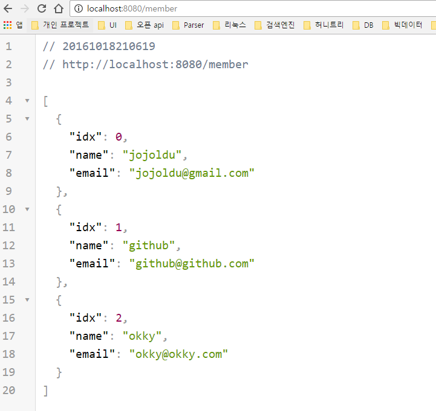

main 메소드에서 저장한 3개의 객체가 올바르게 출력되는 것을 확인할 수 있다.<br/> 자 그럼 간단하게 서버코드 작업은 끝이 났으니 프론트로 넘어가보자. <br/> 프론트는 크게 3가지를 수정할 예정이다.
* json2.js 라이브러리 추가
  - IE7에서는 JSON 객체가 기본으로 포함되어 있지 않다. JSON.parse, JSON.stringify등을 사용해야 하므로 등록하자
* 회원 리스트를 보여줄 수 있도록 index.ftl 수정
* Member와 관련된 처리를 담당할 MemberView.js, MemberModel.js, MemberCollection.js 을 추가

먼저 json2.js를 사용하도록 설정해보자. <br/> json2 모듈을 받아야하므로 ```npm install json2 --save```를 입력하자.<br/> 그러면 package.json에 json2가 추가된 것을 확인할 수 있다.

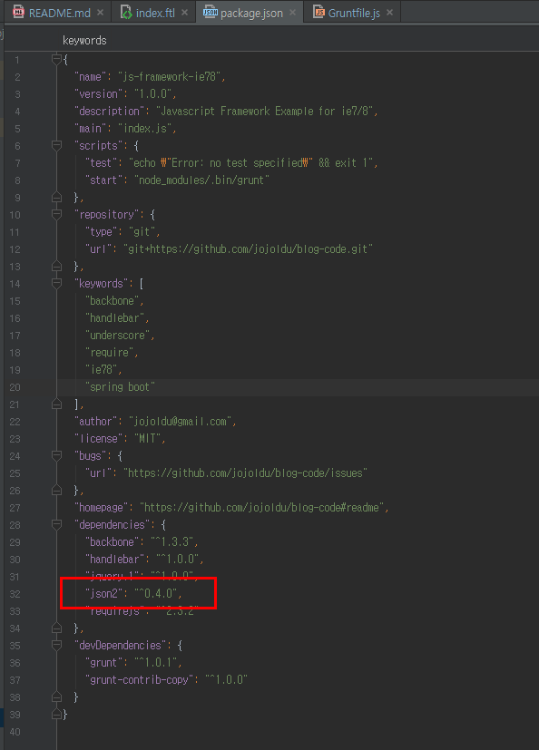

받은 json2 모듈을 grunt의 copy 대상으로 추가하자.

```
// Gruntfile.js
'use strict';
module.exports = function(grunt) {

    grunt.initConfig({
        pkg : grunt.file.readJSON('package.json'),

        //jquery와 requirejs, underscorejs, backbonejs, json2를 copy하도록 지정
        copy : {
            jquery : {
                src : 'node_modules/jquery.1/node_modules/jquery/dist/jquery.min.js',
                dest : 'src/main/resources/static/js/lib/jquery.min.js'
            },
            require : {
                src : 'node_modules/requirejs/require.js',
                dest : 'src/main/resources/static/js/lib/require.js'
            },
            underscore : {
                src : 'node_modules/backbone/node_modules/underscore/underscore-min.js',
                dest : 'src/main/resources/static/js/lib/underscore-min.js'
            },
            backbone : {
                src : 'node_modules/backbone/backbone-min.js',
                dest : 'src/main/resources/static/js/lib/backbone-min.js'
            },
            //json2 추가
            json2 : {
                src : 'node_modules/json2/lib/jSON2/static/json2.js',
                dest : 'src/main/resources/static/js/lib/json2.js'
            }
        }
  });

    // 플러그인 load
    grunt.loadNpmTasks('grunt-contrib-copy');

    // Default task(s) : 즉, grunt 명령어로 실행할 작업
     grunt.registerTask('default', ['copy']);
 };

 ```

정상적으로 copy가 되는지 확인을 위해 터미널 혹은 CMD에서 `npm start`를 입력하자.

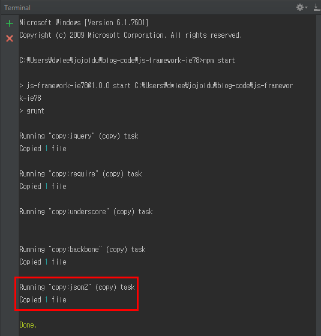

/js/lib 폴더에 옮겨진 것을 확인하였다. 이후에는 index.ftl에 json2.js를 추가해주기만 하면 된다. <br/><br/> 이제 index.ftl을 수정하자.

```
//index.ftl에 아래 코드 추가
<h1>Member List</h1>
<div id="member">

    <div class="inputs">
        이름 : <input type="text" id="name">
        email : <input type="text" id="email">
        <button name="button" type="button" id="addMember">회원 추가 </button>
    </div>

    <h5>회원 Collection 리스트</h5>
    <ul id="memberList" class="list">
    </ul>

    <script id="collectionTemplate" type="text/template">
        <li><span><%= name %> : <%= email %> </span></li>
    </script>
</div>
```

위 코드의 위치를 모르겠다면, [Github](https://github.com/jojoldu/blog-code/blob/master/js-framework-ie78/src/main/resources/templates/index.ftl) 코드를 참고하자. <br/>
index.ftl에는 크게 어려운 것이 없다. 이전시간에 진행했던 것처럼 화면 템플릿용으로 text/template type의 코드가 추가 되고, 입력화면이 구성되었다. <br/>
자 다음으로는 Member와 관련된 backbone 모듈 생성이다.

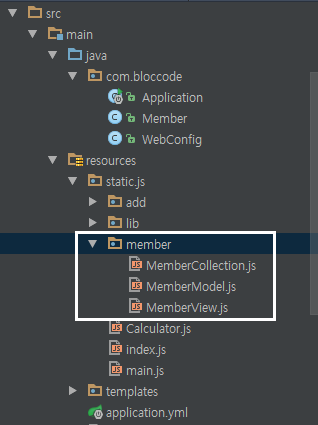

각각의 코드는 아래와 같다. <br/>
**MemberModel.js**

```
define([],
function () {
    return Backbone.Model.extend({
        defaults: {
            idx : null,
            name : null,
            email : null
        }
    });
});
```
MemberModel.js는 회원 하나하나를 나타내는 모듈이 된다. <br/>
이전 시간에는 Model이 데이터를 전부 담당하였지만, 여기서는 Model을 **데이터를 다루는 단위**로서 사용하고 있다. <br/>
이유는 backbone에서는 단일 단위들의 집합체를 나타내기 위해 Collection이라는 타입을 지원하기 때문이다. <br/>
우리가 Java에서 Member class로 만들어진 인스턴스들의 집합을 관리하기 위해 List, Map 등의 Collection을 사용하는 것과 유사하다고 보면 된다. <br/>
backbone은 단일 객체는 Model로, Model의 집합은 Collection으로 관리한다고 생각하면 편할 것이다. <br/>
다음은 MemberCollection.js를 생성해보자 <br/><br/>
**MemberCollection.js**

```
define(['member/MemberModel'],
function (MemberModel) {
    return Backbone.Collection.extend({
        model : MemberModel,
        url : '/member'
    });
});
```

위 코드를 보면 MemberCollection.js는 자신이 어떤 타입을 관리할지 선언해야 한다. <br/>
여기선 MemberModel을 관리해야하므로 MemberModel을 model에 지정하였다. <br/>
그리고 추가로 url을 지정하였는데, 이게 collection의 코드를 간소화하는 핵심이다. <br/>
backbone의 collection은 기본적으로 RESTFul API를 기준으로 한다. 그래서 서버쪽이 RESTFul API를 지원한다는 가정하에 url 속성에 지정한 값 (여기서는 /member)으로 RequestMethod에 따라 아래와 같은 기능을 **자동 지원**한다.
* 전체리스트 조회 : GET, "/member"
* 단일 조회 : GET, "/member/key값"
* 등록 : POST, "/member"
* 수정 : PUT, "/member"
* 삭제 : DELETE, "/member/key값"

RequestMethod가 용도에 맞게 지정되면 동일 url로 CRUD (Create, Read, Update, Delete)가 가능하기 때문에 backbone에서는 url을 단일값으로 지정하도록 되어있다. 우리도 그래서 Application.java의 2개 메소드가 동일한 url에 mapping되도록 하였다. <br/><br/>
다음은 MemberView.js이다.

**MemberView.js**

```
define(['member/MemberCollection'],
function(MemberCollection){
    return Backbone.View.extend({
        collection : null,
        template : null,
        $memberList : null,
        events : {
            'click #addMember' : 'save'
        },

        initialize: function () {
            this.collection = new MemberCollection();
            var html = this.$el.find('#collectionTemplate').html();
            this.template = _.template(html);
            this.$memberList = this.$el.find('#memberList');

            this.collection.fetch();

            //collection.reset 이벤트 발생시 view.rednerAll 이벤트 실행
            this.listenTo(this.collection, 'reset', this.renderAll);

            //collection.add 이벤트 발생시 view.render 이벤트 실행
            this.listenTo(this.collection, 'add', this.render);
        },

        render : function(member){
            this.$memberList.append(this.template(member.toJSON()));
        },

        renderAll : function() {
            /*
             forEach의 내부 function에서는 this가 MemberView가 아니다.
             MemberView를 사용하기 위해 this를 self로 변수할당 후 사용한다.
             */
            var self = this;
            self.collection.forEach(function(member){ //member는 MemberModel 객체이다.
                self.render(member);
            });
        },

        save : function() {
            var name = this.$el.find('#name').val(),
                email = this.$el.find('#email').val();

            this.collection.create({name : name, email: email});
        }
    });
});
```

MemberView.js는 AddView.js와 크게 다른건 없지만 몇가지 차이점이 존재한다.
* Model 대신에 Collection (MemberCollection)에 의존성을 두고 있다.
  - Model 관리는 Collection에게 위임하였다.
  - 대신 Collection에 Model이 추가되는 경우 반응하도록 Listener를 등록하였다.
* 1가지 렌더링 타입을 확장해서 사용한다.
  - render : Model하나만을 대상으로 진행한다.
  - renderAll : collection 내부에 있는 모든 Model을 대상으로 진행한다.
  - 즉, 이전처럼 전체를 위한 렌더링 하나, 단일 대상을 위한 렌더링 하나 이렇게 구현하는 것이 아니라, 전체라는 것이 결국은 단일 대상이 모여서 구성된 것이므로 단일 대상만을 위한 렌더링만 구현하여 이를 확장해서 사용하도록 하였다.
* 이벤트 대상에 **change는 없다**.
  - collection은 이벤트 대상에 change가 없다.
  - 대신 reset (전체 초기화 혹은 갱신), add(단일 대상 추가), remove(단일 대상 제거)등이 있다.
  - 해당 이벤트에 맞춰 렌더링이 발생하도록 지정하였다.
  - 즉, fetch를 통해 전체 대상 갱신을 하여 renderAll이 발생하고, 회원 추가 버튼으로 회원이 추가되면 collection에 model이 추가되어 render 이벤트가 자동으로 발생하도록 지정한 것이다.

자 그럼 여기까지 진행후 전체 기능 확인을 진행해보자.<br/>
처음 로딩을 하게 될 경우 collection.fetch가 발생하여 빈 화면에 서버에서 받은 회원 리스트가 출력된다.


위 화면처럼 네트워크상에 member가 호출되어 값을 전달 받고 화면에 출력되는 것을 확인할 수 있다. <br/>
여기서 input box를 통해 회원을 추가해보겠다.

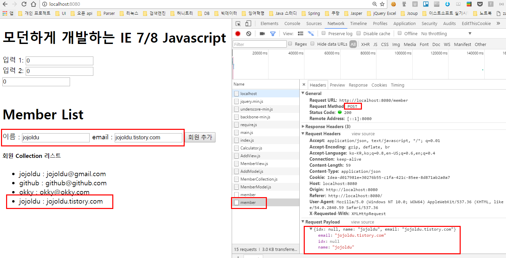

화면상에 신규 회원이 추가되고, 네트워크상으로 post로 회원정보가 전송된 것을 확인할 수 있다. <br/>
실제로 서버에서 잘 전달 받았는지 확인하기 위해 브라우저의 주소를 localhost:8080/member로 변경해보자

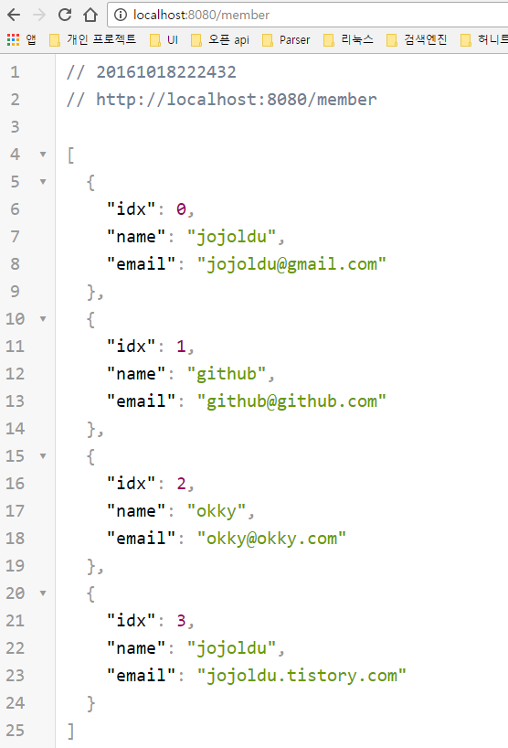

짜잔!<br/>
3개였던 서버 회원 정보가 4개가 된 것을 확인할 수 있다.<br/>
<br/>
드디어 길고 길었던 backbone 시간이 끝이 났다!! <br/>
backbone만으로 3챕터를 진행할것이라 생각못했지만... 그래도 기본적인 backbone의 기능은 볼수 있었던것 같다.<br/>
예제는 get/post만 진행하였지만 좀 더 backbone을 공부하고 싶다면 put/delete도 직접 구현하여 수정/삭제 기능을 완성해보는 것도 좋은 경험이 될 것 같다. <br/>
국내에는 backbone의 한국교재가 하나밖에 없는걸로 알고 있다. <br/>
그래도 처음 튜토리얼로 진행하기에 굉장히 좋은 책이니 backbone을 시작해봐야겠다는 마음이 있으면 큰맘먹고 진행해보는 것도 좋을것 같다. <br/>
다음 시간은 grunt를 사용하여 배포용 프로젝트 전환을 진행해보겠다.


(다음에 또 만나요!)

### Product 배포환경 구축
길고 길었던 Backbone의 시간을 지나 이번엔 실제 배포환경에서 Javascript들을 어떻게 관리해야하는지 진행하려고 한다. <br/>
localhost:8080으로 본인 혼자서 사용할때는 상관없지만, 실제로 서비스되는 환경에서는 이대로 배포할 경우 굉장히 느린 사이트를 보게 될 것이다. <br/>
일반적으로 웹 사이트의 속도는 다음의 요소에 의해 좌지우지된다. (서버의 요소는 제외하고 순수하게 프론트엔드에 한해서만)
<br/><br/>
* HTTP Request(요청) 수
  - 즉, 한번 페이지가 로딩되는데 HTTP Request가 많으면 많을수록 사이트의 성능은 떨어진다.

* 호출하는 정적 파일들의 용량
  - 정적파일이라 함은 css, js, image 등을 얘기한다. 즉, 이러한 파일들의 용량이 적을 수록 사이트의 성능은 좋아진다.

물론 이것보다 훨씬 많은 요소가 존재한다. 좀 더 자세한 내용을 알고 싶다면 [웹사이트 최적화 기법](http://book.naver.com/bookdb/book_detail.nhn?bid=4587095) 을 참고하길 바란다. <br/>
여튼 우리는 위 2가지 요소를 놓치지 않고 배포해야만 한다. <br/>
그래서 다음의 2가지 작업을 진행할 예정이다.
<br/><br/>

* HTTP Request(요청) 수를 줄일 것이다.
  - 외부 라이브러리들을 합친 js파일 1개와 직접 개발한 js파일들을 모두 합친 js파일 1개를 만들어 사용할 것이다.
  - 기존에 10개 이상 호출되던 js파일들이 단 2개로 줄어드는 것이다.
  - 회사 기준에 따라 외부라이브러리들과 개발한 js파일들도 다합치는 경우도 있다. 하지만 여기에선 2개를 분리해서 나갈 예정이다.

* 정적 파일들의 용량을 줄일 것이다.
  - css는 현재 없으니 js들을 전부 uglify할 예정이다
  - 즉, 엔터/스페이스 등은 모두 제거
  - 긴 변수명은 짧은 변수명으로 교체

하나하나 진행해보자!

#### 외부 라이브러리 합치기 (concat)
첫번째로 진행할 내용은 js파일들을 합치는 것이다. <br/>
기본적으로 이렇게 배포전에 하는 자동화된 행동들은 모두 task라고 불리며 이를 실행시키는 도구를 task runner라고 부른다. <br/>
(프론트엔드에는 grunt와 gulp가 있고, 백엔드에는 gradle 등이 있다.)<br/>

우리의 task runner는 grunt이기 때문에 grunt를 이용할 예정이다. <br/>
grunt에는 정적파일(js, css등)을 합치는 것을 지원하는 플러그인으로 **grunt-contrib-concat** 이 있다. <br/>
해당 플러그인을 통해 우리의 js파일들을 합쳐보자. <br/>
npm install을 통해 플러그인을 받고 이를 load할 수 있도록 Gruntfile.js에 등록하자.

```
npm install grunt-contrib-concat --save-dev
```

위 처럼 npm install 커맨드를 입력하면

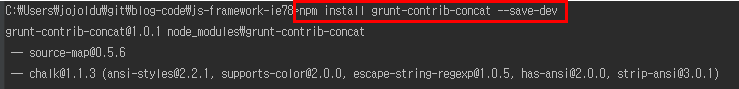

정상적으로 인스톨 되는 것을 확인할 수 있다. 이후

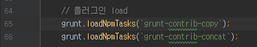

Gruntfile.js에 위 코드를 추가하자. <br/>
처음 concat할 파일들은 외부 라이브러리들이다. <br/>
backbone, jquery, require 등등 외부 라이브러리들이 많아 이를 하나하나 호출하는게 부담이 된다.

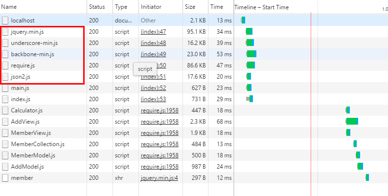

(접속하면 5개의 라이브러리를 받아야만 한다... 대형포털은 이것보다 배는 받을 수도 있다.) <br/>
이 5개를 하나로 합치기 위해 아래와 같이 Gruntfile.js를 수정해보자.

```
'use strict';
module.exports = function(grunt) {

    grunt.initConfig({
        pkg : grunt.file.readJSON('package.json'),

        //jquery와 requirejs, underscorejs, backbonejs, json2를 copy하도록 지정
        copy : {
            jquery : {
                src : 'node_modules/jquery.1/node_modules/jquery/dist/jquery.min.js',
                dest : 'src/main/resources/static/js/lib/jquery.min.js'
            },
            require : {
                src : 'node_modules/requirejs/require.js',
                dest : 'src/main/resources/static/js/lib/require.js'
            },
            underscore : {
                src : 'node_modules/backbone/node_modules/underscore/underscore-min.js',
                dest : 'src/main/resources/static/js/lib/underscore-min.js'
            },
            backbone : {
                src : 'node_modules/backbone/backbone-min.js',
                dest : 'src/main/resources/static/js/lib/backbone-min.js'
            },
            json2 : {
                src : 'node_modules/json2/lib/jSON2/static/json2.js',
                dest : 'src/main/resources/static/js/lib/json2.js'
            }
        },

        // concat task 설정
        concat: {
            lib: {
                //순서가 중요하다. 꼭 라이브러리 순서를 지켜서 작성하자.
                src:[
                    'src/main/resources/static/js/lib/jquery.min.js',
                    'src/main/resources/static/js/lib/underscore-min.js',
                    'src/main/resources/static/js/lib/backbone-min.js',
                    'src/main/resources/static/js/lib/require.js',
                    'src/main/resources/static/js/lib/json2.js'
                ],
                dest: 'src/main/resources/static/build/js/lib.js' //concat 결과 파일
            }
        }
    });

    // 플러그인 load
    grunt.loadNpmTasks('grunt-contrib-copy');
    grunt.loadNpmTasks('grunt-contrib-concat'); //concat load

    /*
        Default task(s) : 즉, grunt 명령어로 실행할 작업
        copy -> concat 진행
    */
    grunt.registerTask('default', ['copy', 'concat']);
};

```
concat 옵션의 lib라는 이름은 상관이 없다. 다른 이름으로 지어도 무방하나 여기선 라이브러리들을 합치는 task이니 lib라고 지었을 뿐이다. <br/>
concat은 src에 작성된 순서대로 js파일들을 합치는데, 저 순서가 어긋나면 **각자가 맺고 있는 의존성이 겹치게 되어** 정상적으로 각 라이브러리들이 작동하지 않는 현상이 발생한다. <br/>
dest 옵션은 src에 포함된 라이브러리들을 합친 결과 js파일을 지정하는 것이다. 난 lib.js 라는 파일에 다 합쳐지도록 지정한 것이다. <br/>
마지막 registerTask에 copy task 다음으로 concat task가 실행되도록 등록하였다. 이렇게 되면 grunt 실행시 copy -> concat 순으로 실행된다. <br/>
잘 설정 되었는지 확인을 해보자.

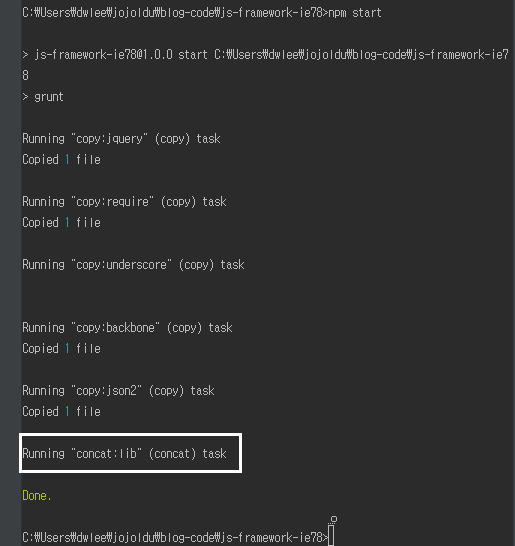

그리고 lib.js를 사용할 수 있도록 index.ftl을 수정해보자. <br/>
(기존의 라이브러리들을 주석처리하고 lib.js를 추가할 것이다.)

```
<!--
<script type="text/javascript" src="/js/lib/jquery.min.js"></script>
<script type="text/javascript" src="/js/lib/underscore-min.js"></script>
<script type="text/javascript" src="/js/lib/backbone-min.js"></script>
<script type="text/javascript" src="/js/lib/require.js"></script>
<script type="text/javascript" src="/js/lib/json2.js"></script>
-->
<script type="text/javascript" src="/build/js/lib.js"></script>
<script type="text/javascript" src="/js/main.js"></script>
<script type="text/javascript" src="/js/index.js"></script>
```

작업이 완료되었으니 프로젝트를 재실행시켜보자.

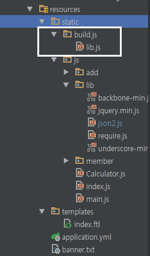

짜잔! <br/>
모든 라이브러리들이 사라지고 lib.js만 호출되면서도 오류가 발생하지 않는것을 확인할 수 있다. <br/>
기존의 5번의 호출이 1번의 호출로 변경된 것이다! <br/>
다음은 우리가 직접 만든 js파일들을 합쳐보겠다. <br/>

#### 개발한 js파일들 합치기 (requirejs)
외부 라이브러리들을 합치는 것과 달리 우리가 개발한 js 파일들을 합치는 것은 조금 고민해봐야 한다. <br/>
왜그러냐하면 우리가 작성한 파일들은 단독으로 돌아가는게 아니라 서로가 서로를 requirejs를 통해 호출하고 있는 형태이기 때문이다. 그래서 무작정 concat을 할수는 없다. <br/>
grunt에서도 이런 문제를 알고 있기에 **grunt-contrib-requirejs** 라는 플러그인을 통해 requirejs로 호출되는 js파일들을 합치는것 뿐만 아니라 압축까지 옵션에 따라 시켜준다. <br/>
<br/>

설치법은 concat과 동일하다.

```
npm install grunt-contrib-requirejs --save-dev
```

마찬가지로 Gruntfile.js에 등록하자.

```
'use strict';
module.exports = function(grunt) {

    grunt.initConfig({
        pkg : grunt.file.readJSON('package.json'),

        //jquery와 requirejs, underscorejs, backbonejs, json2를 copy하도록 지정
        copy : {
            jquery : {
                src : 'node_modules/jquery.1/node_modules/jquery/dist/jquery.min.js',
                dest : 'src/main/resources/static/js/lib/jquery.min.js'
            },
            require : {
                src : 'node_modules/requirejs/require.js',
                dest : 'src/main/resources/static/js/lib/require.js'
            },
            underscore : {
                src : 'node_modules/backbone/node_modules/underscore/underscore-min.js',
                dest : 'src/main/resources/static/js/lib/underscore-min.js'
            },
            backbone : {
                src : 'node_modules/backbone/backbone-min.js',
                dest : 'src/main/resources/static/js/lib/backbone-min.js'
            },
            json2 : {
                src : 'node_modules/json2/lib/jSON2/static/json2.js',
                dest : 'src/main/resources/static/js/lib/json2.js'
            }
        },

        // concat task 설정
        concat: {
            lib: {
                //순서가 중요하다. 꼭 라이브러리 순서를 지켜서 작성하자.
                src:[
                    'src/main/resources/static/js/lib/jquery.min.js',
                    'src/main/resources/static/js/lib/underscore-min.js',
                    'src/main/resources/static/js/lib/backbone-min.js',
                    'src/main/resources/static/js/lib/require.js',
                    'src/main/resources/static/js/lib/json2.js'
                ],
                dest: 'src/main/resources/static/build/js/lib.js' //concat 결과 파일
            }
        },

        // requirejs task 설정
        requirejs: {
            build: {
                options: {
                    baseUrl : 'src/main/resources/static/js',
                    name : 'index',
                    mainConfigFile : 'src/main/resources/static/js/main.js',
                    optimize : 'none',
                    out : 'src/main/resources/static/build/js/service.js'
                }
            }
        }
    });

    // 플러그인 load
    grunt.loadNpmTasks('grunt-contrib-copy');
    grunt.loadNpmTasks('grunt-contrib-concat'); //concat load
    grunt.loadNpmTasks('grunt-contrib-requirejs'); //requirejs load

    /*
        Default task(s) : 즉, grunt 명령어로 실행할 작업
        copy -> concat 진행
    */
    grunt.registerTask('default', ['copy', 'concat', 'requirejs']);
};
```

requirejs task의 옵션에 대한 소개는 아래와 같다. <br/>

* build : requirejs task를 여러개 사용하고 싶을 경우 각각의 설정들을 나타내는 이름
* options : 실제 build 라는 이름의 requirejs task에 적용될 옵션들을 나타낸다.
* baseUrl : 아래 name을 호출할때 기본이 되는 base 주소를 나타낸다.
* name : 기준이 될 js 파일을 지정한다.
  - 우리는 index.js에서 사이트가 시작되니 index.js를 등록하였다.
  - index.js에서 빠진 js의 경우 task 대상에 포함되지 않는다.
  - index.js에서 ModelView 의존성을 제거해보고 실행시키면 바로 알 수 있다.
* mainConfigFile : requirejs를 적용할때 사용하는 설정 파일. 이전에 만들어두었던 main.js를 등록하였다.
* optimize : 최적화 옵션. none / uglify 등이 있다.
* out : 위 옵션들을 통해 생성되는 결과물

자 그럼 다시 한번 ```npm start``` 명령어로 grunt를 실행시켜보자.

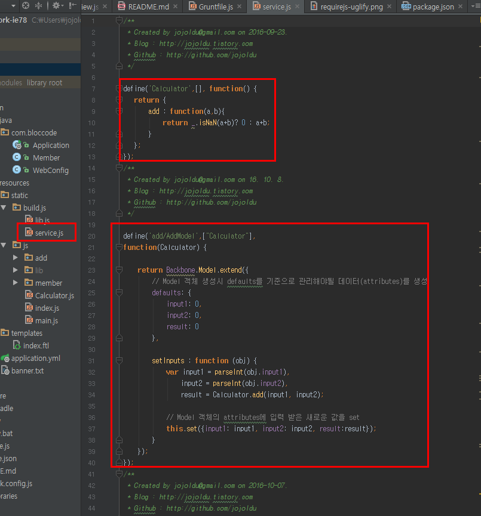

보는 것처럼 아주 이쁘게 service.js 파일에 모든 js파일들이 모여 있는것을 확인할 수 있다. <br/>
코드를 보면 이상함을 느낄 수 있는데, index.js에서 부르는 view파일들 외에도 model, collection 파일들까지 모여있는 것을 볼 수 있다. <br/>
이건 grunt-contrib-requirejs에서 **의존성의 마지막까지 쫓아가서 합쳐준 결과** 이다. <br/>
options에서 지정한 index.js에서 포함된 AddView.js와 MemberView.js가 각각 Model.js, Collection.js를 필요로 하기 때문에 모두 가져와 합치게 된 것이다. <br/>
즉, service.js는 **필요한 모든 의존성을 가지고 있는 단일 파일** 이 된 것이다.


(MemberView.js를 **제외** 하고 grunt를 실행시킨 결과: MemberModel이 없다.)

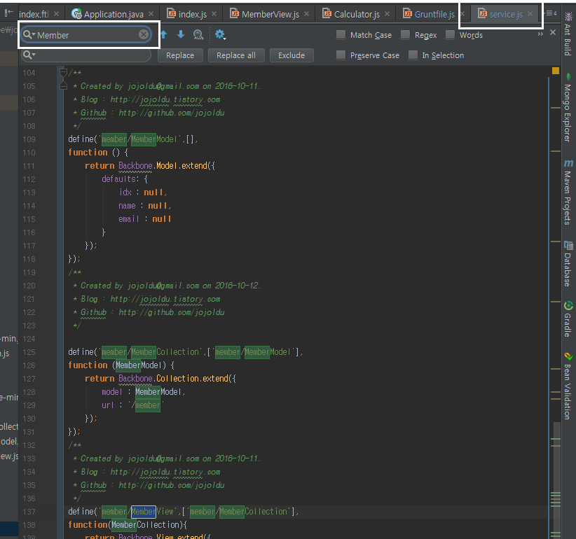

(MemberView.js를 **추가** 하여 grunt를 실행시킨 결과: MemberModel이 있다.) <br/>
<br/>
파일 확인은 끝났으니 기능확인을 진행하자. index.ftl을 수정하고 프로젝트를 재실행 시켜보자.

```
<!--
<script type="text/javascript" src="/js/lib/jquery.min.js"></script>
<script type="text/javascript" src="/js/lib/underscore-min.js"></script>
<script type="text/javascript" src="/js/lib/backbone-min.js"></script>
<script type="text/javascript" src="/js/lib/require.js"></script>
<script type="text/javascript" src="/js/lib/json2.js"></script>

<script type="text/javascript" src="/js/main.js"></script>
<script type="text/javascript" src="/js/index.js"></script>
-->

<script type="text/javascript" src="/build/js/lib.js"></script>
<script type="text/javascript" src="/build/js/service.js"></script>
```

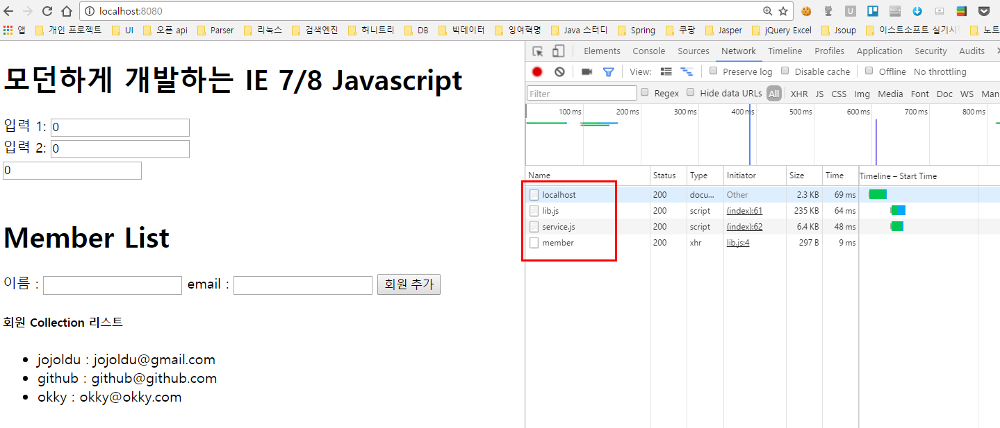

와우! 아주 이쁘게 딱 2개의 js 파일만 호출하는 것을 볼 수 있다! <br/>
자 그럼 다음 단계로 가보자!

#### 파일 최적화 (uglify)
service.js 파일을 보면 코드 그대로 합친것이라 수많은 enter와 space들이 존재하며, 아주 긴 변수/함수명들이 있는것을 확인할 수 있다. <br/>
이럴 경우 불필요한 용량을 차지하게 된다. (enter와 space도 결국은 문자라 용량을 차지한다.) <br/>
그리고 변수/함수명도 결국은 코드의 의도를 확인하기 위함이지, 실제 배포에서는 변수명이 a이나 addMember이나 별 상관없다. 정확히 그 함수 혹은 변수만 호출할 수 있으면 되기 때문이다. <br/>
그래서 변수/함수명을 줄이고 공백 제거를 진행할 예정이다. <br/>
조금전에 작성했던 grunt-contrib-requirejs의 optimize 옵션을 사용하면 아주 쉽게 적용할 수 있다. <br/>
optimize옵션 값을 **uglify** 로 변경해보자. <br/>
그리고 다시 ```npm start```를 실행해보자. 그러면 service.js가 완전 달라져있을 것이다.

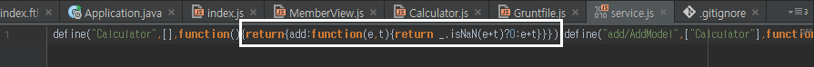

보는것처럼 변수명들이 아주 단순하게 변경되고 모든 공백들이 사라진 것을 확인할 수 있다. <br/>
실제로 모든 웹서비스는 이렇게 js파일들을 uglify하여 나간다. (네이버,다음,줌,네이트 모두 확인해봐도 좋다.)<br/>
그럼 이렇게만 하면 실제 서비스에 배포할 수 있는 프로젝트가 된걸까? <br/>
No No! <br/>
한단계가 더 남았다.

#### 개발/배포 환경 분리하기 (Spring profile)
타이틀을 보면 짐작하시는 분도 계실테고, 아닌 분들도 계실것 같다. <br/>
최근 react가 확산되면서 webpack dev server가 많이 얘기가 되서 개발/배포 환경은 대부분 알고 계신것 같다.<br/>
<br/>
방금전까지 우리는 **배포 환경** 위주의 작업을 진행하였다. <br/>
즉, lib.js와 service.js만 index.ftl에 포함시켜서 배포하면 되는 것으로 진행하였지만, 이럴 경우 다시 수정 및 개발을 해야할 때는 어떻게 할 것인가? <br/>
개발할때는 기존 js들의 주석을 풀고, 배포할때는 다시 주석을 추가하는 식으로 관리할까? <br/>
절대 아니다. 실수할 여지도 많을 뿐더러, 갑작스럽게 기존 개발자가 퇴사하게 될 경우 프로젝트의 히스토리를 모르는 후임자라면 사고날 확률이 너무나 높다.<br/>
그래서 개발할때와 배포할때 사용할 js파일들을 주석이 아닌 자동으로 관리하도록 수정을 해보자. <br/>
<br/>
우리가 사용할 방법은 Spring의 profile 이다. <br/>
Spring의 경우 해당 jar 혹은 war를 실행시킬때 active profile을 지정할수가 있다. <br/>
실제 많은 서비스 회사에서는 dev/QA/Stage/Product 환경을 분리해서 사용하고 있다. <br/>
여기서는 간단하게 로컬에서 IDE로 실행시킬때는 dev환경으로, 나머지는 배포환경으로 진행을 하겠다. <br/>
Application.java 파일을 열어 기존의 index 메소드를 아래와 같이 수정하자

```
@Autowired
Environment env;

//@RequestMapping(value = "/", method = RequestMethod.GET)가 GetMapping("/") 가 됨
@GetMapping("/")
public String index(Model model){
  //activeProfiles는 profile이 없을 경우 size가 0이 되므로, 이를 보정하는 삼항연산자
  String profile = env.getActiveProfiles().length > 0? env.getActiveProfiles()[0] : "default";
  model.addAttribute("profile", profile);
  return "index";
}
```

Environment는 현재 실행중인 application의 환경변수들을 포함하고 있다.

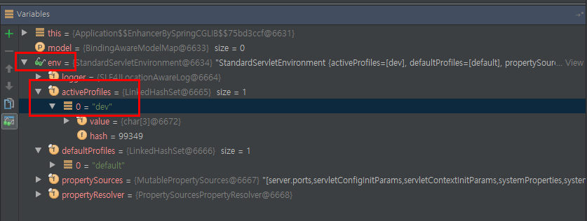

보는것처럼 여러 속성중, 우리가 사용할 것은 activeProfiles이다. dev 옵션을 주고 프로젝트를 실행시키면 이때 **activeProfiles 에는 dev값이** 할당되고, dev옵션 없이 실행시킬 경우
default 값이 할당된다. <br/>
이렇게 되면 index.ftl에서는 model에 담긴 profile 값을 보고 dev일 경우에는 기존 js파일들을 호출하도록, 그외에 다른 값일 경우엔 lib.js와 service.js를 사용하도록 분기문을 추가만 해주면
개발/배포 환경에 대한 처리가 끝이 난다.

```
<#if profile == "dev">
    <script type="text/javascript" src="/js/lib/jquery.min.js"></script>
    <script type="text/javascript" src="/js/lib/underscore-min.js"></script>
    <script type="text/javascript" src="/js/lib/backbone-min.js"></script>
    <script type="text/javascript" src="/js/lib/require.js"></script>
    <script type="text/javascript" src="/js/lib/json2.js"></script>
    <script type="text/javascript" src="/js/main.js"></script>
    <script type="text/javascript" src="/js/index.js"></script>
<#else>
    <script type="text/javascript" src="/build/js/lib.js"></script>
    <script type="text/javascript" src="/build/js/service.js"></script>
</#if>
```

자 그럼 실제로 IDE에서 한번 dev환경으로 구동시켜보자. <br/>
IntelliJ를 기준으로 run 옵션에 ```-Dspring.profiles.active=dev``` 만 추가하면 끝이다.

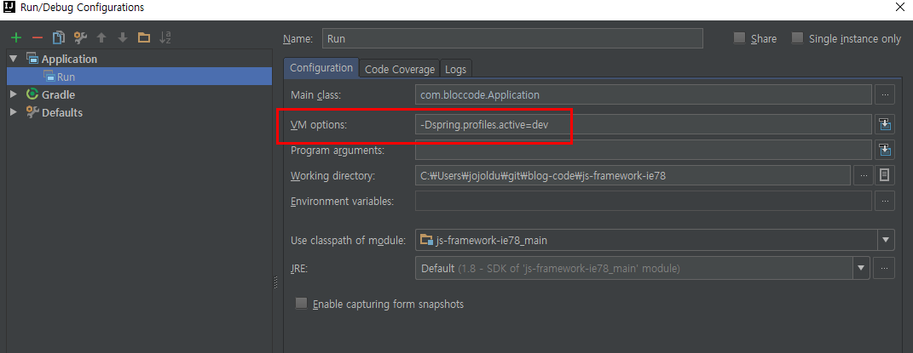

실행후 확인을 하게 되면

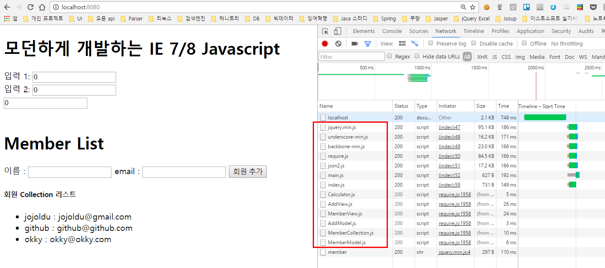

이렇게 모든 js파일을 호출하는 것을 볼 수 있다. <br/>
자 그럼 배포할 경우엔 어떻게 되는지 보자. <br/>
gradle을 이용해서 jar 파일로 build 후 이 jar파일을 직접 실행시켜보자. (Spring Boot의 대부분은 이런식으로 배포를 하게 된다.)

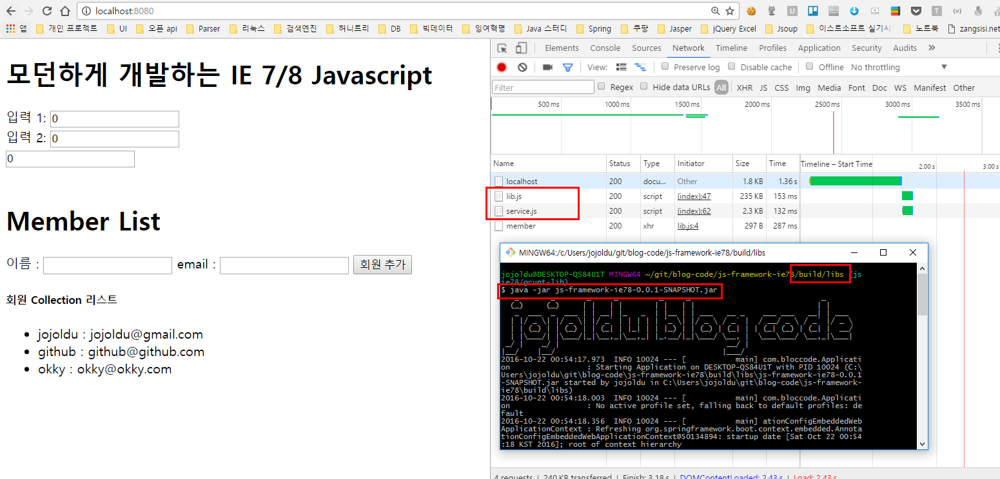

이렇게! build된 jar를 배포한 경우에는 lib.js와 service.js만 사용하는 것을 확인할 수 있다.<br/>
조금은 우려스러운 것은 현재 내가 소개한 방법은 **프론트엔드와 백엔드가 분리되지 않은 프로젝트** 에서 사용법이다. <br/>
프론트와 백이 분리되어 있는 회사를 다녀본적이 없어 ㅠㅠ 어떻게 하고 있는지 잘 모르겠지만, 두 영역이 한 프로젝트에서 진행하고 있다면 이 방법으로 해도 괜찮다고 얘기해주고 싶다. <br/>
이 시리즈도 서서히 마지막을 향해 가는것 같다. <br/>
끝까지 잘 마무리 해야겠다!

### Handlebars 적용하기
IE 7/8에서 모던하게 개발하기 시리즈의 마지막 챕터인 Handlebars 적용이다.


[공식사이트](http://handlebarsjs.com/) <br/>

Handlebars의 경우 많은 회사에서 클라이언트 템플릿 엔진으로 사용중에 있다. <br/>
Handlebars에 대한 자세한 내용들은 여러 블로그에서 소개가 되어있지만 최근 [티몬의 개발 블로그](http://tmondev.blog.me/220398995882?Redirect=Log&from=postView)에 올라온 글이 잘 설명되어있으니 Handlebars를 처음 접한다면 꼭 읽어봤으면 한다. <br/>
<br/>
오늘 진행할 Handlebars는 Handlebars의 기능 자체에 초점이 잡혀있지 않고, Backbone에서 underscore로 템플릿하던것을 Handlebars로 교체하는 것에 초점이 잡혀있다. <br/>
이전 블로그에 포스팅된 [Handlebars를 사용하여 배포까지](http://jojoldu.tistory.com/23) 내용의 재탕이긴 해서 이전 포스팅을 안봤다면 한번 보고 가면 다음 내용을 이해하기 쉬울것 같다. <br/>
그럼 이제 시작하겠다. <br/>
<br/>
Backbone은 기본적으로 underscorejs의 template()를 사용한다. <br/>
헌데 이 underscore의 template은 기본적으로 Html 파일에서 type="text/template" 인 script를 호출하여 사용하기 때문에 몇가지 문제가 있다. <br/>
(생각하기에 따라 큰 문제가 아닐수도 있다. underscore로 계속 사용중인 회사도 있는걸로 알고 있다.) <br/>
index.ftl을 열어 collectionTemplate를 확인해보자.

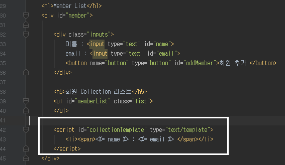

* backbone의 view 영역이 오염된다.
  - view.el 영역에 handlebar script가 계속 추가됨으로써 실제 view영역이 너무 비대해진다.
  - 다른 view영역에서 동일하게 사용되는 템플릿이 있으면 재활용 없이 똑같이 handlebar script를 만들어야 한다.
  - 다른 view영역의 dom을 선택하는 것이 가능은 하나, 기본적인 backbone이 바라보는 방향과는 많이 다르다.

* 후처리로 template하기 때문에 순수 js로 html을 그리는것보다 **느리다.**
  - text/template로 html dom을 만드려면 결국 javascipt 코드가 되어야만 한다. 그래서 다음과 같은 과정이 필요하다.
  - text/template 호출 -> text/template 코드를 Javascript코드로 전환 -> 전환된 Javascript코드 (이하 템플릿된 코드)에 JSON 데이터를 넣어 HTML로 전환
  - 페이지가 reload 될때마다 저 과정이 필수로 1번은 꼭 필요하여 첫 로딩시 속도가 느릴수 밖에 없다.
  - reload 이후에는 view에 template된 코드가 캐시되고 있어 큰 문제가 되진 않는다.

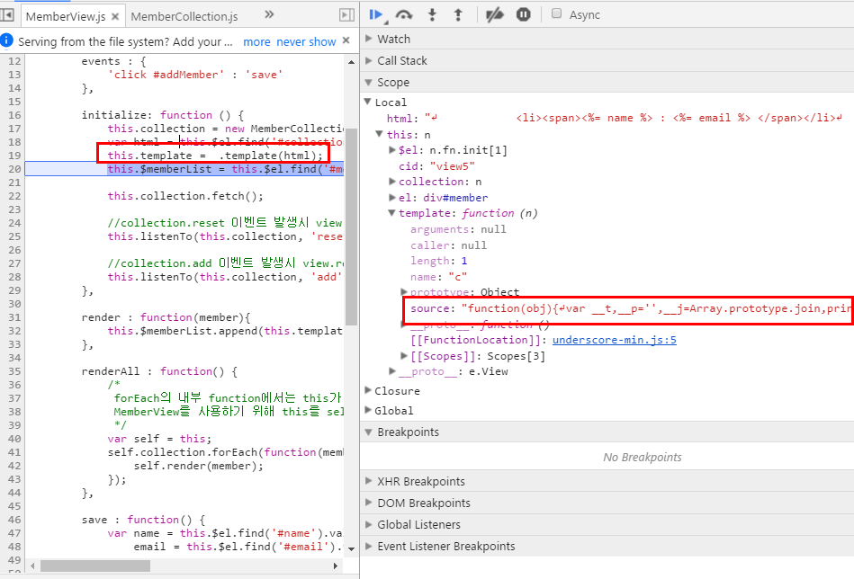

(MemberView.js의 초기화 과정. 보는것처럼 처음 view 초기화시 text/template코드를 순수 js코드로 전환하는 작업이 필요하다)<br/>
그래서 위와 같은 문제를 해결하기 위해 Handlebars를 적용하여 아래와 같이 수정할 것이다. <br/>

* text/template 를 별도의 파일과 영역으로 관리
  - .handebars 파일로 각각의 text/template를 생성한다.
  - 이후 각 view영역에서 필요한 template
* 빌드시 precompile하여 미리 컴파일된 js파일들로 변환한다.
  - 즉, ```text/template 호출 -> text/template 코드를 Javascript코드로 전환``` 하는 과정을 grunt로 배포전에 미리 해버린다.
  - Backbone의 view에서는 HTML 전환 과정이 사라져 이전보다 성능 향상이 있다.

<br/>
그럼 위 내용을 하나씩 적용해보자. <br/>
index.ftl의 collectionTemplate을 memberList.handlebars 라는 파일로 분리하자. <br/>
그리고 아래와 같이 코드내용을 조금 수정 하자.

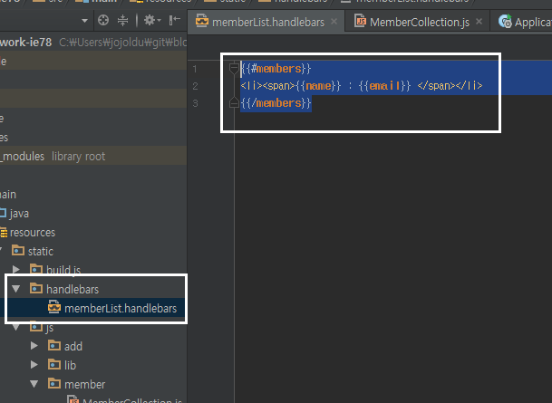

이 .handlebars 파일을 precompile 하기 위해 grunt 패키지의 도움을 받아야 한다. <br/>
이전과 동일한 방식으로 설치를 진행하겠다.

```
npm install grunt-contrib-handlebars --save-dev
```

그리고 Gruntfile.js에 아래의 코드를 추가하자

```
handlebars: {
    options: {
        namespace: "Handlebars.templates",
        //해당 handlebars 파일의 템플릿을 js에서 호출할때 사용할 함수명 지정
        processName:function(filePath) {
            //여기선 .handebars파일 앞의 이름을 호출 함수명으로 지정
            var pattern=/handlebars\/(.+\/)*(.+)\.handlebars/gi;
            var process = pattern.exec(filePath)[2];
            console.log("process : " + process);
            return process;
        }
    },
    compile : {
        files: {
            //templates.js에 모든 .handlebars 파일이 compile되서 processName에 따라 정리됨
            "src/main/resources/static/js/templates.js" : ["src/main/resources/static/handlebars/*.handlebars"]
        }
    }
}

grunt.loadNpmTasks('grunt-contrib-handlebars'); // handlebars load

grunt.registerTask('default', ['copy', 'handlebars', 'concat', 'requirejs']);
```

여기까지만 하고 한번 정상적으로 실행되는지 확인해보자. <br/>
터미널 혹은 CMD를 열어 아래와 같이 입력해보자.

```
grunt handlebars
```

그러면 아래와 같이 콘솔이 출력된다.

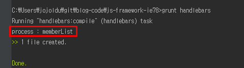

보면 memberList가 출력되었다. 자 그럼 src/main/resources/static/js/templates.js 파일을 열어보자.

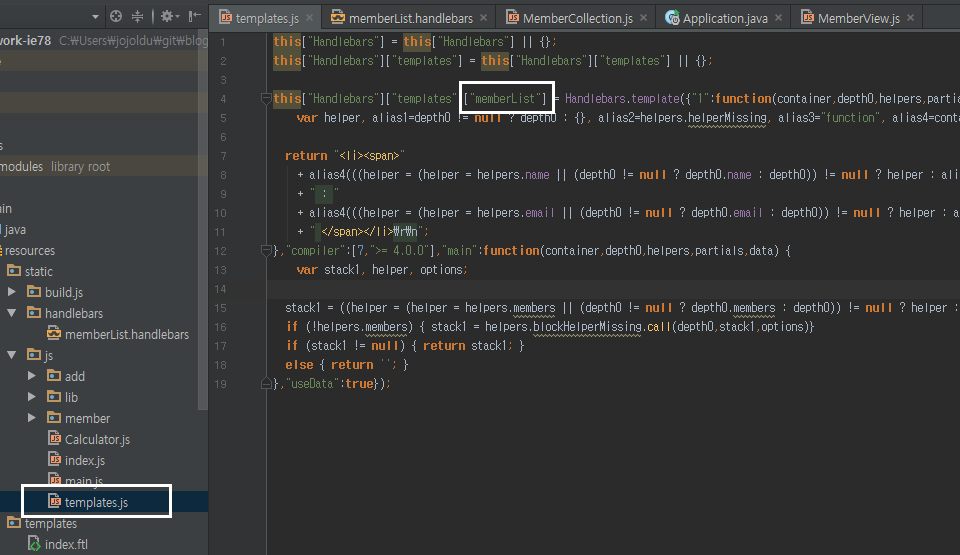

수많은 양의 js 코드를 확인할 수 있는데, 여기서 ```this["Handlebars"]["templates"]["memberList"]```가 바로 우리가 사용할 함수의 이름이다. <br/>
즉, **templates.js가 호출된 상태면 Handlebars.templates.memberList 로 템플릿 함수를 호출해서 사용** 할 수 있게 된것이다. <br/>
자 그럼 이걸 적용해보자.
