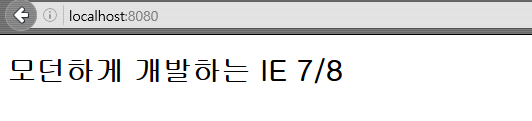
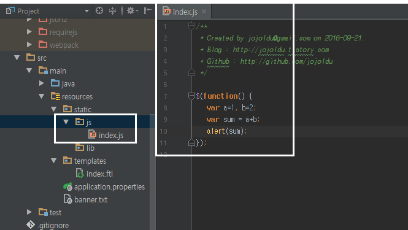
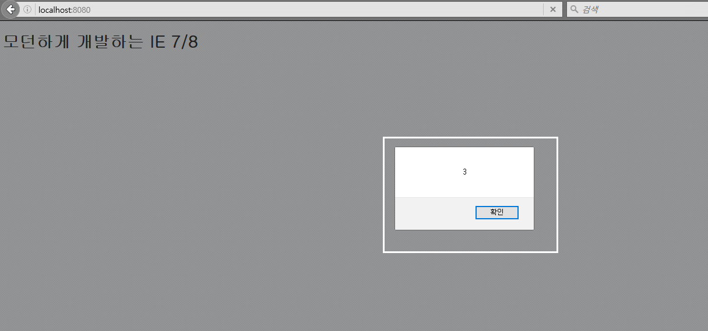
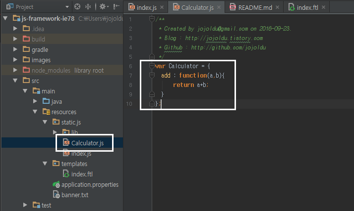
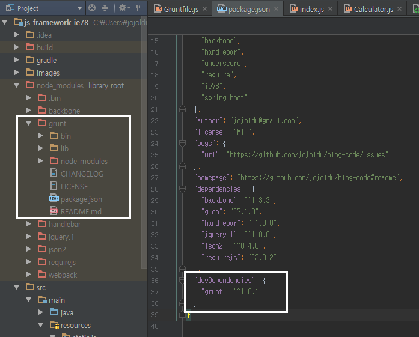
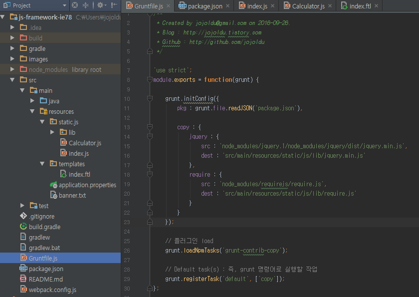
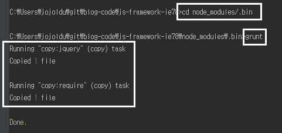
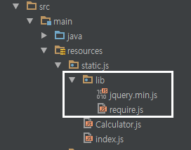
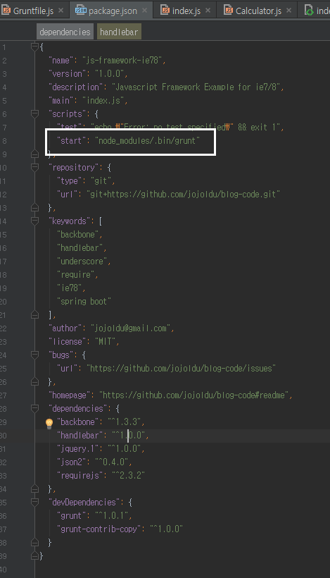
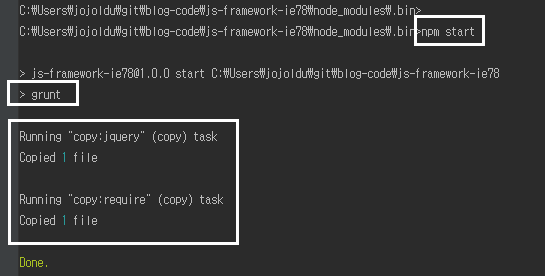

IE 7,8에서 JS 프레임워크 조합하기
---------------------------------
Angular나 React + @ 조합같은 경우 정말 매력적인 JS 프레임워크임은 분명하나 IE 7, 8에서는 사용할 수 없다는 치명적인 단점이 있다. 
국내에선 아직까지 IE 7,8의 점유율이 높은 편이라 회사 사정에 따라 IE 7,8을 지원해야하는 경우가 있다.


하지만 생각보다 많은 분들이 모던하게 Javascript를 개발하고 싶어한다. React/Angular/ES2015 스터디를 보면 **회사에서는 못쓰지만 이직을 위해** 라는 이유로 스터디에 참석하는 것을 정말 정말 많이 보았다.
그래서 최대한 이런 환경에서 모던하게 개발할 수 있는 방법을 소개하려 한다. 본인의 회사가 IE9부터 지원한다면 뒤로가기 버튼을 살포시 누르면 된다 <br/>
모든 코드는 [Github](https://github.com/jojoldu/blog-code/tree/master/js-framework-ie78) 에 있으니 참고하면 될것 같다.

### 사용할 JS
프로젝트 구성은 SpringBoot+Freemarker+Gradle을 기본으로 하여 아래 JS 라이브러리들을 조합할 예정이다.

* nodejs
  - 4.5.0 LTS 버전 사용 예정 (2016.09.20 기준)
  - grunt를 사용하기 위해 먼저 설치되어 있어야함
  - Javascript 패키지 관리를 bower가 아닌 npm 으로 관리하기 위해 사용
  - bower는 버그가 좀 있다. 웬만하면 npm으로 패키지 관리를 추천
  
* [backbone.js](http://backbonejs.org/)
  - Javascript를 MV* 구조로 개발할 수 있게 지원하는 프레임워크
  - [backbone.js 사용시 주의사항](http://huns.me/development/1212)

* jquery
  - 설명이 필요없는 Javascript 라이브러리
  - 여기선 Dom select와 이벤트 바인딩용으로 사용
  
* underscore.js
  - Javascript를 함수형으로 사용할 수 있게 지원 (client-side template engine용이 아니다.)
  - map, filter 등과 같은 함수형 기능들이 포함
  - backbone을 사용하려면 필수로 의존하게 되는데, 여기선 backbone 의존성을 위해서도 있지만, 좀 더 함수형으로 코드 작성하기 위해 사용
  - lodash라는 업그레이드 버전이 있지만 공식 사이트에서 IE 11까지만 확인되었다고해서 제외
  - underscore/lodash 모두 **ECMA2015** 때문에 포지션이 애매해졌다. (즉, ECMA2015 쓸수있는 환경이면 이거 다 몰라도 된다.)
  
* require.js
  - Javascript 의존성 관리 및 동적로딩
  - [네이버의 Requirejs 이해](http://d2.naver.com/helloworld/591319) 참고
  
* handlebars.js
  - client-side template engine
  - 서버 통신 없이 화면을 다시 그려야할 경우 사용
  - 기본적인 소개와 문법/기능은 [티몬의 개발 블로그](http://blog.naver.com/PostView.nhn?blogId=tmondev&logNo=220398995882)를 참고
  - 부끄럽지만.. 추가적으로 실제 배포환경에서 사용법은 [내 블로그](http://jojoldu.tistory.com/23) 내용을 참고

* grunt
  - Javascript build 및 task 관리
  - 예를 들면 Javascript들을 압축/난독화 등을 할때 이를 task로 지정하여 명령어 한번에 사용이 가능할 수 있게 지원
  - [널리 블로그에서 소개하는 Grunt](http://nuli.navercorp.com/sharing/blog/post/1132682) 참고하자 개인적으로 grunt 설명중 최고다

개발 진행
-----
### 기본 프로젝트 생성
여기선 SpringBoot + Gradle 기준으로 코드를 작성중이니 그대로하면 좋고, 아니라도 크게 차이는 없으니 본인이 사용할 프로젝트 스펙에 맞춰 프로젝트를 생성하면 된다. <br/>
View 템플릿은 JSP 대신에 Freemarker를 사용할 예정이다. JSP도 크게 상관은 없는데 Boot에서는 Freemarker/thymleaf와 같은 ViewTemplateEngine을 밀어주고 있으니 이참에 한번 사용해보는걸 추천한다. <br/>

* build.gradle에 freemarker 의존성 추가


* Application 및 config, index.ftl


```
//Application.java
@SpringBootApplication
@Controller
public class Application {

	public static void main(String[] args) {
		SpringApplication.run(Application.class, args);
	}

    //@RequestMapping(value = "/", method = RequestMethod.GET)가 GetMapping("/") 가 됨
	@GetMapping("/")
	public String index(){
		return "index";
	}
}

//WebConfig.java
@Configuration
@EnableWebMvc
public class WebConfig extends WebMvcConfigurerAdapter {

    @Override
    public void addResourceHandlers(ResourceHandlerRegistry registry) {
        registry.addResourceHandler("/**").addResourceLocations("classpath:/static/");
    }
}


// index.ftl
<!DOCTYPE html>
<html lang="ko">
<head>
    <meta charset="UTF-8">
    <title>모던 IE78</title>
</head>
<body>
    <h1>모던하게 개발하는 IE 7/8</h1>
</body>
</html>
```

기본적인 환경은 다 구축되었다. 이제 이 프로젝트를 구동시켜 브라우저에 localhost:8080으로 접속해보자 <br/>
그러면!



이렇게 기본적인 정상적으로 프로젝트가 생성되었음을 확인할 수 있다. <br/>
여기서부터 시작이다. 이제 하나씩 Javascript 라이브러리들을 붙여나가겠다.

### package.json 작성
모든 Javascript 프로젝트들의 시작은 package.json 생성부터 시작이다. <br/>
이를 위해선 node.js 설치가 필수이다. <br/>
[공식사이트](https://nodejs.org/ko/)를 방문하여 **LTS 버전**을 다운받아 설치하자. 이 글을 작성할 당시에는 4.5.0이였는데, 아마 보시는 분들은 그보다 높은 버전을 설치할 수도 있다. <br/>
(package.json 작성방법은 [outsider님의 글](https://blog.outsider.ne.kr/674)을 참고하면 아주 좋다.) <br/>
본인 프로젝트 폴더에서 터미널 혹은 CMD를 열어 아래와 같이 명령어를 입력해보자.

```
//package.json 초기화
npm init

//npm init 과정이 끝났다면 필요한 의존성들 설치 (package.json에도 작성하기 위해 -save 옵션을 추가)
npm install -save backbone

npm install -save handlebar

npm install -save jquery.1

npm install -save json2

npm install -save requirejs

```
위 과정이 끝나면 원하는 형태의 package.json과 라이브러리들이 받아져 있을 것이다.


자 그러면 간단하게 jquery를 이용하여 alert을 보여주는 기능을 작성해보겠다. <br/>
src/main/resources/static 폴더 아래에 js 라는 폴더를 생성하고, index.js 파일을 생성하자 <br/>



이렇게 생성은 했는데 이걸 쓰려면 jquery가 필요하다. <br/>
앞에 서버코드를 설정한것을 보면 ```registry.addResourceHandler("/**").addResourceLocations("classpath:/static/"); ``` 이렇게 되어있는데, 
이 말은 src/main/resources/static 폴더에 있는 static 파일들을 지원하겠다는 의미이다.  <br/>
  
그래서 귀찮지만 jquery 라이브러리를 src/main/resources/static/js/lib 폴더에 복사하자<br/>
(계속 이렇게 하지 않으니 조금만 참아달라) <br/>
jquery 라이브러리의 위치는 node_modules/jquery.1/node_modules/jquery/dist/에 있는 jquery.min.js 이다


파일을 복사했으면 freemarker에서 호출할 수 있도록 코드를 작성하자.

```
<!DOCTYPE html>
<html lang="ko">
<head>
    <meta charset="UTF-8">
    <title>모던 IE78</title>
</head>
<body>
    <h1>모던하게 개발하는 IE 7/8</h1>
    <script type="text/javascript" src="/js/lib/jquery.min.js"></script>
    <script type="text/javascript" src="/js/index.js"></script>
</body>
</html>
```
작성 후 프로젝트를 다시 실행시켜 localhost:8080에 접속하면 아래와 같이 jquery 기능과 index.js가 정상작동한 것을 확이할 수 있다.



npm과 jquery를 이용하여 간단한 기능을 구현해보았다. 다음은 require.js를 사용해보겠다.

### require.js 소개
index.js를 보면 2가지 기능을 하고 있다. <br/>
sum과 alert 기능인데, index.js가 한가지 기능만 하도록 sum 기능은 분리하고, alert만 남기자. <br/>
index.js가 있는 폴더에 Calculator.js 를 만들자



고쳐야할 코드는 아래와 같다.
```
//Calculator.js
var Calculator = {
  add : function(a,b){
      return a+b;
  }
};

//index.js
$(function() {
   var a=1, b=2;
   var sum = Calculator.add(a,b);
   alert(sum);
});

//index.ftl
<!DOCTYPE html>
<html lang="ko">
<head>
    <meta charset="UTF-8">
    <title>모던 IE78</title>
</head>
<body>

    <h1>모던하게 개발하는 IE 7/8</h1>
    <script type="text/javascript" src="/js/lib/jquery.min.js"></script>
    <script type="text/javascript" src="/js/Calculator.js"></script>
    <script type="text/javascript" src="/js/index.js"></script>
</body>
</html>
```

이렇게 구성후 프로젝트를 재시동하여 localhost:8080을 접속하면 정상적으로 코드가 분리된 것을 확인할 수 있다. <br/>
자 이 간단한 구성에서 조차 문제가 있다. <br/>
index.js는 항상 Calculator.js가 필요하다. 이를 index.js가 Calculator.js에 **의존한다** 라고 한다. <br/> 
즉, index.js를 사용하기 위해선 Calculator.js를 항상 먼저 호출해야한다. <br/>
<br/>
헌데 1~2개의 파일이면 문제 없지만 사이트의 규모가 커지면 커질수록 어떤 js를 호출하기 위해선 어떤 js가 먼저 호출되어야 한다는 것을 인지하고 개발하는것이 매우 어렵다. <br/>
Java와 같은 서버사이드 언어에서 이런 문제를 의식하지 못하는 이유는 기본적으로 **import 기능** 이 내장되어 있어 이를 통해 필요한 Class들이 무엇인지 지정할 수 있기 때문이다. <br/>
<br/>
Javascript는 이와 같은 기능이 기본적으로 내장되어 있지 않아 외부 라이브러리의 도움을 받아야 한다. <br/>
우리가 사용할 라이브러리는 require.js 라고 한다. <br/>

require.js를 사용하기 위해 node_modules에서 파일을 옮기자. 근데 또 수동으로 옮기지말고 이번엔 이런 **복사 작업을 자동화** 해보자.

### Grunt - 기본
앞에서 얘기한대로 node_modules에 받은 라이브러리들을 복사하는것이 매우 귀찮은 행위이므로 이를 자동화 하기 위해 grunt를 사용할 것이다 <br/>
grunt의 경우 워낙 [널리 블로그](http://nuli.navercorp.com/sharing/blog/post/1132682)에서 잘 설명하고 있어 참고하면 될 것같다. <br/>
<br/>
자 그럼 grunt 작업을 진행해보자. <br/>
grunt를 사용하기 위해 grunt 라이브러리를 npm으로 받자. 
```
//터미널 혹은 cmd를 프로젝트 폴더에서 open하여 아래 명령어 입력
npm install --save-dev grunt
```
(grunt를 받으면서 package.json에 반영 및 dev용으로 사용하기 위해 --save-dev 옵션 사용하였다.) <br/>
grunt를 전역으로 설치하면 여러 프로젝트간에 grunt 버전이 꼬일 경우 문제가 발생할 수 있으니 이 프로젝트에서만 쓸 수 있도록 grunt를 설치하였다.<br/>
설치가 끝나면 아래와 같이 package.json과 node_modules 폴더가 변경된 것을 확인할 수 있다.



정상적으로 설치된 것을 확인하였으면 grunt를 사용하기 위해 설정파일을 생성해보자 <br/>
package.json과 동일한 위치에 Gruntfile.js 파일을 생성해서 아래 코드를 붙여넣자

```
'use strict';
module.exports = function(grunt) {

    grunt.initConfig({
        pkg : grunt.file.readJSON('package.json'),
        
        //jquery와 requirejs를 copy하도록 지정
        copy : {
            jquery : {
                src : 'node_modules/jquery.1/node_modules/jquery/dist/jquery.min.js',
                dest : 'src/main/resources/static/js/lib/jquery.min.js'
            },
            require : {
                src : 'node_modules/requirejs/require.js',
                dest : 'src/main/resources/static/js/lib/require.js'
            }
        }
    });

    // 플러그인 load
    grunt.loadNpmTasks('grunt-contrib-copy');

    // Default task(s) : 즉, grunt 명령어로 실행할 작업
    grunt.registerTask('default', ['copy']);
};
```
코드 작성이 끝나면 아래와 같이 파일이 위치하면 된다.



grunt는 grunt를 위한 플러그인들이 존재하는데, 우린 copy 기능을 위해 copy관련 플러그인을 설치해야한다. <br/>
해당 플러그인 이름은 Gruntfile.js에도 명시되어있다. **grunt-contrib-copy**이다.

```
//열려있는 터미널 혹은 cmd에 아래와 같이 설치 명령어를 입력하자
npm install --save-dev grunt-contrib-copy
```

방금전 grunt 설치명령어와 유사하기 때문에 설치가 끝나면 확인 역시 똑같이 하면 된다. <br/>
플러그인 설치가 끝이났다면 한번 실행을 해보자



정상적으로 done 확인후 프로젝트 폴더를 다시 확인해보자 



require.js가 정상적으로 복사된것을 확인할 수 있다 <br/>
근데 매번 이렇게 터미널에서 .bin 폴더까지 이동후에 grunt 명령어를 사용해야하나? 귀찮지 않을까? <br/>
이런 귀찮은 명령어를 미리 지정해서 할 수 있다. <br/>

package.json을 열어 scripts에 아래 코드를 추가하자
```
  "scripts": {
    "test": "echo \"Error: no test specified\" && exit 1",
    "start": "node_modules/.bin/grunt"
  }
```



이렇게 등록하게 되면 프로젝트 폴더 내 어디서든 ```npm start``` 라는 명령어를 실행하면 node_modules/.bin/grunt 명령어를 실행시키게 된다. <br/>
정상적으로 작동되는지 확인하기 위해 lib폴더 아래에 있는 jquery.min.js와 require.js를 지우고 터미널 혹은 cmd에서 ```npm start```를 입력해보자



자! 이제야 require.js를 사용할 수 있게 되었다!! 


(삼천포로 느껴진다면 착각이 아닌.....) <br/>

여튼 다음시간엔 grunt를 통해 옮긴 require.js를 사용해보자!


