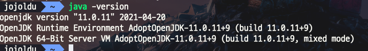
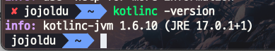
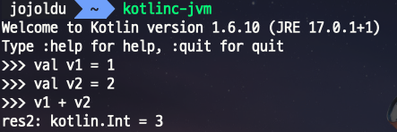

# Mac 코틀린 개발환경 구성하기

## JDK 구성

아직 JDK를 설치해본적이 없다면 다음과 같이 설치를 진행합니다.

```bash
brew install --cask adoptopenjdk11
```

```bash
java --version
```



## 코틀린 구성

```bash
brew install kotlin
```

```bash
kotlinc -version
```



## 테스트

```bash
kotlinc-jvm
```



