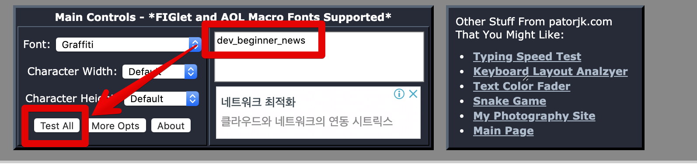

# 리눅스 서버 로그인시 배너 노출하게 하기

취약점 진단을 받아보신 분들은 아시겠지만 리눅스 서버 로그인시 노출되는 배너는 **기본 설정을 사용하면 안됩니다**


(출처: [kimhyun2017 님 블로그](https://kimhyun2017.tistory.com/200))  
  

## 1. 체크

### 1-1. /etc/motd

로그인 성공 시 출력할 메세지

### 1-2. /etc/issue.net

원격 접속 후, 패스워드 입력 전에 출력할 메세지, ssh 서버 설정 파일에 별도 설정이 필요

### 1-3. /etc/issue

로컬에서 패스워드 입력 전에 출력할 메세지

## 2. 수정

[배너 생성 사이트](http://patorjk.com/software/taag/#p=display&f=Graffiti&t=Type%20Something%20)로 이동하여 본인이 배너로 만들길 원하는 텍스트를 입력합니다.



Test All 버튼을 클릭하면 아래와 같이 다양한 종류의 아스키 배너를 볼 수 있습니다.


```bash
vim banner.sh
```

아래와 같이 배너 등록 쉘을 등록합니다.

```bash
BANNER_MESSAGE="배너코드"

echo "$BANNER_MESSAGE" > /etc/issue
echo "$BANNER_MESSAGE" > /etc/motd
echo "$BANNER_MESSAGE" > /etc/issue.net
```

저는 아래와 같이 등록했습니다.

```bash
BANNER_MESSAGE="
=================================================================================================

██████╗ ███████╗██╗   ██╗       ██████╗ ███████╗ ██████╗ ██╗███╗   ██╗███╗   ██╗███████╗██████╗ 
██╔══██╗██╔════╝██║   ██║       ██╔══██╗██╔════╝██╔════╝ ██║████╗  ██║████╗  ██║██╔════╝██╔══██╗
██║  ██║█████╗  ██║   ██║       ██████╔╝█████╗  ██║  ███╗██║██╔██╗ ██║██╔██╗ ██║█████╗  ██████╔╝
██║  ██║██╔══╝  ╚██╗ ██╔╝       ██╔══██╗██╔══╝  ██║   ██║██║██║╚██╗██║██║╚██╗██║██╔══╝  ██╔══██╗
██████╔╝███████╗ ╚████╔╝███████╗██████╔╝███████╗╚██████╔╝██║██║ ╚████║██║ ╚████║███████╗██║  ██║
╚═════╝ ╚══════╝  ╚═══╝ ╚══════╝╚═════╝ ╚══════╝ ╚═════╝ ╚═╝╚═╝  ╚═══╝╚═╝  ╚═══╝╚══════╝╚═╝  ╚═╝
                                                                                                
=================================================================================================
불법 접근시 법적인 처벌을 받을 수 있습니다.
=================================================================================================
"
 
echo "$BANNER_MESSAGE" > /etc/issue
echo "$BANNER_MESSAGE" > /etc/motd
echo "$BANNER_MESSAGE" > /etc/issue.net
```