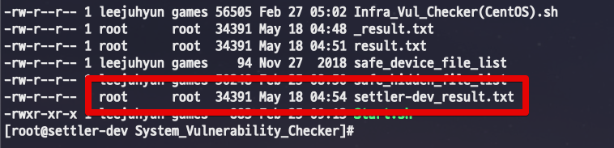

# Bash 명령어 모음

## 각 서버의 호스트네임 + 기존 파일명 합치기

이를테면 4대의 서버에서 서로 다른 내용을 가지고 있지만, 파일 이름은 result.txt 로 동일한 상황이 있다고 가정해봅시다.  
이 상태에서 **각 서버의 hostname을 result.txt 앞에 붙이려면** 어떻게 해야할까요?

```bash

hostname | xargs -I '{}' cp result.txt {}_result.txt
```

그럼 아래처럼 hostname (settler-dev) 가 result.txt에 붙어있는것을 알 수 있습니다.

