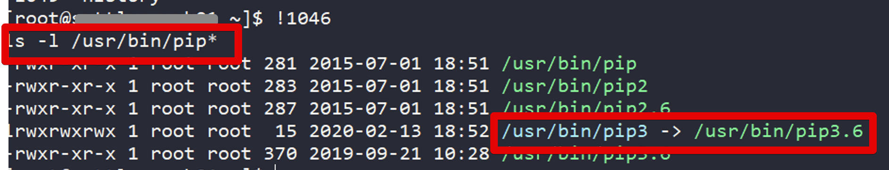

# Centos6 에서 Python3 & Pip3 설치하기 (feat. awscli)

기존에 사용중이던 서버인 Centos6 (6.9 Final)에 Python3와 pip를 설치가 필요해 진행합니다.  
  
> 모든 명령어는 ```root``` 사용자에서 진행합니다.  
> root 외 사용자라면 ```sudo```를 각 명령어 앞에 넣어서 실행하시면 됩니다.


Centos6 기본 yum repository에는 Python 3.6 패키지가 없어서 IUS Community Project의 리포지토리를 yum repository에 추가합니다.

```bash
yum install -y https://centos6.iuscommunity.org/ius-release.rpm
```

등록 되었다면 Python3를 비롯한 여러 관련 패키지들을 같이 설치합니다.

```bash
yum install -y python36u python36u-libs python36u-devel python36u-pip
```

pip는 ```python36u-pip``` 로 이미 설치되었지만, 이후 pip에 관련된 여러 작업들에 도움을 주는 ```get-pip``` 스크립트도 다운 받아 놓습니다.

> get-pip.py는 ```pip```, ```setuptools```, ```wheel```을 아직없는 Python 환경에 설치할 수 있게 도와주는 스크립트 파일 입니다.

```bash
curl https://bootstrap.pypa.io/get-pip.py -o get-pip.py
```

설치된 Python 3.6 을 ```python3``` 로 링크를 걸어 줍니다.

```bash
alternatives --install /usr/bin/python python3 /usr/bin/python3.6 5
```

링크까지 되었다면 아래 명령어로 설치와 설정이 잘 되었는지 확인해봅니다.

```bash
python3 --version
```

## pip3 로 링크 걸기

설치된 pip는 pip3이 아닌 pip3.6 으로 실행이 되니 pip3로 링크를 걸어줍니다.

```bash
ln -s /usr/bin/pip3.6 /usr/bin/pip3
```

아래 명령어로 제대로 링크가 되었는지 확인합니다.

```bash
ls -l /usr/bin/pip*
```



pip3가 잘 반영되었다면 본인이 원하는 패키지들을 적절히 설치하시면 됩니다.  
> ex) awscli

```bash
pip3 install awscli
```

