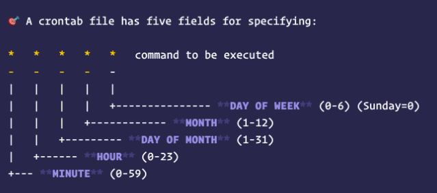

# Linux에서 crontab 실행시 명령어 찾지 못할때



crontab의 기본 PATH는 ```/usr/bin``` 밖에 없습니다.  
즉, ```/usr/local/bin``` 등 다른 경로에 있는 command에 대해서는 crontab 이 인식하지 못하는데요.  
  
만약 ```aws cli```를 ```pip```로 설치했다면 그 경로는 ```/usr/local/bin/aws```가 되기 때문에 crontab으로 명령어를 등록해고 제대로 실행이 되지 않습니다.  
  
예를 들어 아래와 같이 aws 커맨드를 실행하는 sh파일을 

```bash
#!/bin/bash

aws help
```

crontab으로 실행한다면

```bash
* * * * * my_command.sh some_args
```

다음과 같은 에러가 발생합니다.

```bash
/bin/sh aws command not found
```

## 해결책

해결책은 아래처럼 **crontab에 직접 PATH를 등록** 하는 것입니다.

```bash
PATH=/usr/bin:/bin:/usr/sbin:/sbin:/usr/local/bin
LD_LIBRARY_PATH=/usr/local/lib

* * * * * my_command.sh some_args
```

