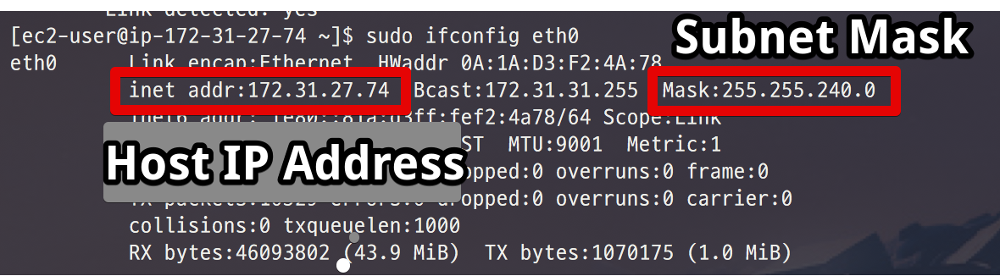
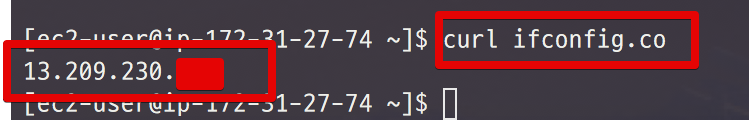

# Linux에서 네트워크 체크하기

## 1. 랜선 연결 체크

[이더넷](https://ko.wikipedia.org/wiki/%EC%9D%B4%EB%8D%94%EB%84%B7) 장치가 eth0에 있다면 아래 명령어로 확인 가능합니다.  

```bash
sudo ethtool eht0
```

> ```ifconfig```보다 더 많은 내용 확인 가능합니다.

## 2. 네트워크 인터페이스 체크

```bash
sudo ifconfig eth0
```



## 3. 외부로 나가는 IP 체크

```bash
curl ifconfig.co
```



13.209.230.xxx 로 IP가 나간다는 것을 알 수 있습니다.  
외부 서버에서 방화벽 인바운드 오픈이 필요하면 이 IP를 오픈해야합니다.