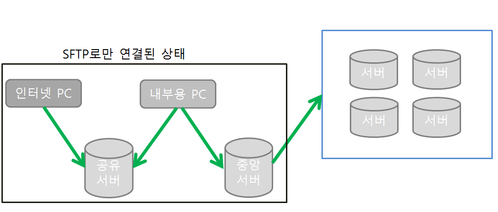
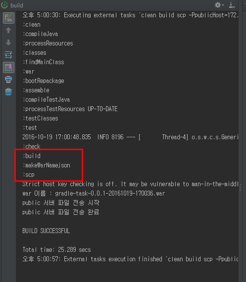
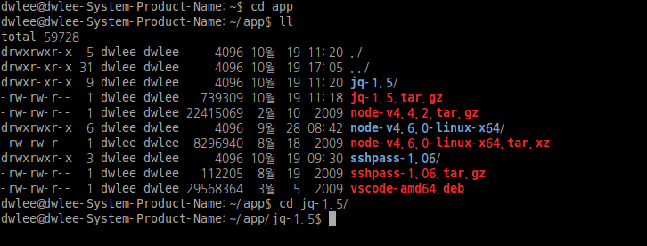
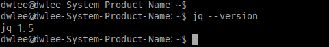
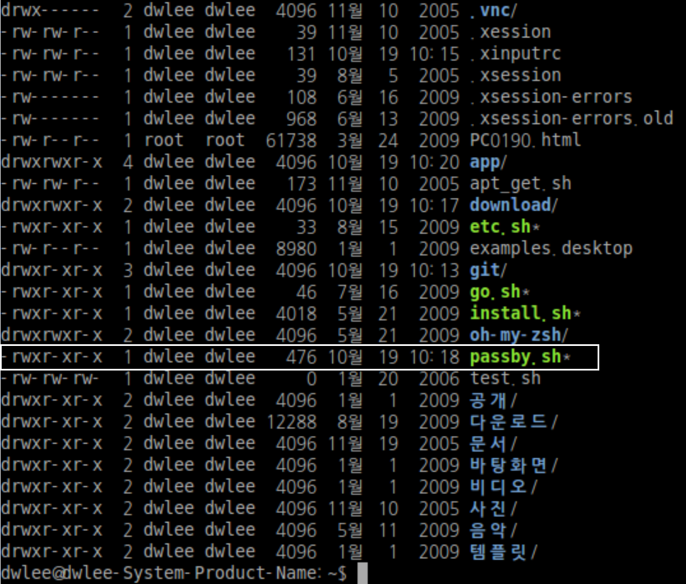
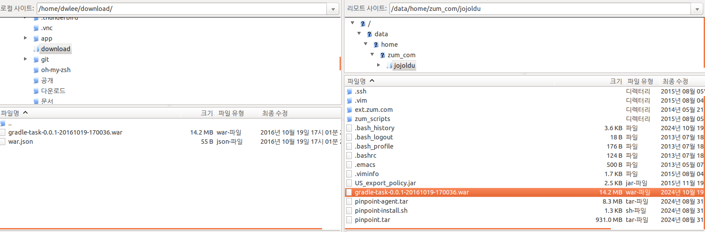

# 망 분리된 상태에서 build 파일 주고 받기
[이전에 포스팅했던 내용](http://jojoldu.tistory.com/51)의 확장팩을 진행하려고 한다. <br/>
지난 번에는 Gradle을 이용하여 build시 공유서버로 war 파일을 전송하는 것까지가 진행되었었다. <br/>
근데 이것만으로 불편함이 크게 감소하진 않았다. <br/>
왜냐하면 결국 **war의 목적지까지 가야할 길은 많이** 남았기 때문이다. <br/>
그래서 오늘은 이전 시간에 이어 쉘 스크립트로 추가적인 자동화 작업을 진행하려고 한다. <br/>
<br/>
아래 그림은 대략적인 배포에 필요한 과정을 그린 것이다.


조건은 아래와 같다고 가정해보자. <br/>
* 인터넷 PC를 제외하고서는 전부 **인터넷은 되지 않는다**.
* CI를 구축할수는 없다.
* 각각의 서버들은 SFTP 프로토콜만 오픈되어 있다.

<br/>
이런 상황에서 인터넷망에서 war를 build시, 중앙서버까지 war가 전송되도록 자동화를 진행할 것이다. <br/>
참고로 이전 포스팅으로 인터넷 망에서 공유서버까지 전송은 완료되었다고 가정하에 진행하는 것이다. <br/>
즉, 내부용 PC에서 공유서버의 war파일을 가져와 중앙서버로 전송하는것이 이번 포스팅의 목표이다. <br/>
내가 생각한 방법은 아래와 같다. <br/>

* build시에 war파일명을 담고 있는 war.json이라는 json파일을 생성하여 공유서버에 war전달시 같이 전달한다.
  - build할때마다 전송해야할 war파일명이 달라지는데 이를 내부용 PC에서 알 수 있는 방법이 없다.
  - 그래서 war.json의 내용을 보고 내부용 PC가 공유서버에서 가져와야할 war파일을 확인할 수 있도록 한다.

* 내부용 PC에서 필요한 쉘 스크립트 패키지는 수동설치한다.
  - 내부용 PC가 인터넷이 안되기 때문에 apt-get을 사용할 수가 없다.
  - 인터넷망에서 필요한 패키지를 직접 받아 전달한다.

자 그럼 하나씩 진행해보자.
### 1. war.json
gradle로 build시 war.json을 만들어 여기에 build로 만들어진 war파일명을 기록하도록 task를 만들어보자. <br/>
참고로 예제로 사용하는 프로젝트는 이전에 진행했던 [gradle-task프로젝트](https://github.com/jojoldu/blog-code/tree/master/gradle-task)이다.
<br/>
task명은 ```makeWarNamejson``` 로 한다.

```
import groovy.json.JsonBuilder
task makeWarNamejson <<{
	final warName = project.warBaseName + "-" + project.warVersion+".war"
	final jsonName = project.jsonName
	def content = [:]
	content['name'] = warName;
	new File(jsonName).write(new JsonBuilder(content).toPrettyString())
}

//scp task가 실행되기전에 makeWarNamejson task가 무조건 실행되도록 의존 추가
scp.dependsOn makeWarNamejson
```

war.json의 내용물은 간단한 json 형태가 될 것이다.
```
{
	"name" : war파일명
}
```

Gradle은 Groovy 기반이기 때문에 Groovy와 동일하게 코드를 작성할 수 있다. <br/>
Groovy에서는 Json파일을 생성할때 JsonBuilder 패키지를 사용하기 때문에 task에서 사용할 수 있도록 import 시켰다. <br/>
그리고 scp가 실행되기 전에 war.json이 **무조건 실행** 될 수 있도록 task간의 의존성을 추가하였다. <br/>
build.gradle의 전체 코드는 아래와 같다. (위 코드만으로 실행되지는 않는다.)

```
// 여러 task에서 사용할 수 있도록 build file 이름은 전역변수로 지정
project.ext{
	warBaseName = 'gradle-task'
	warVersion = '0.0.1-'+ new Date().format('yyyyMMdd-HHmmss')
	jsonName = 'war.json'
}

buildscript {
	ext {
		springBootVersion = '1.4.1.RELEASE'
		gradleSshVersion = '2.2.0'
	}
	repositories {
		jcenter()
	}
	dependencies {
		classpath("org.springframework.boot:spring-boot-gradle-plugin:${springBootVersion}")
		classpath("org.hidetake:gradle-ssh-plugin:${gradleSshVersion}")
	}
}

apply plugin: "war"
apply plugin: 'java'
apply plugin: 'eclipse'
apply plugin: 'spring-boot'
apply plugin: 'org.hidetake.ssh'

war {
	baseName = project.warBaseName
	version = project.warVersion
	exclude("build/**")
}

sourceCompatibility = 1.8
targetCompatibility = 1.8

repositories {
	jcenter()
}


dependencies {
	compile('org.springframework.boot:spring-boot-starter-web')
	testCompile('org.springframework.boot:spring-boot-starter-test')
}

remotes {
	publicServer {
		host = project.properties["publicHost"]
		port = project.properties["publicPort"].toInteger()
		user = project.properties["publicUser"]
		password = project.properties["publicPassword"]
		knownHosts = allowAnyHosts //알 수 없는 호스트라도 접속 가능
	}
}

task scp <<{
	ssh.run {
		//remotes.publicServer으로 호스트 세션 시작
		session(remotes.publicServer) {
			// war 파일명을 로컬변수에 지정
			final warName = project.warBaseName + "-" + project.warVersion+".war"
			println "war 이름 : ${warName}"

			println "public 서버 파일 전송 시작"
			/*
				from : 현재 폴더를 기준으로 from path 지정
				into : 도착서버의 디렉토리 path 지정
			 */
		    put from: "build/libs/${warName}", into: project.properties["publicDir"]

		    println "public 서버의 war.json 제거"
		    remove project.properties["publicDir"]+"${jsonName}"

		    println "public 서버 war.json 전송"
		    put from: "${jsonName}", into: project.properties["publicDir"]
			println "public 서버 파일 전송 완료"
		}
	}
}

import groovy.json.JsonBuilder
task makeWarNamejson <<{
	// sample
	//final warName = "war"
	final warName = project.warBaseName + "-" + project.warVersion+".war"
	final jsonName = project.jsonName
	def content = [:]
	content['name'] = warName;
	new File(jsonName).write(new JsonBuilder(content).toPrettyString())
}

//scp task가 실행되기전에 makeWarNamejson task가 무조건 실행되도록 의존 추가
scp.dependsOn makeWarNamejson
```

자 그럼 여기까지 진행 후에, 정상적으로 war.json이 생성되어 전달되는지 확인해보자


makeWarNamejson가 정상적으로 실행된 것을 확인할 수 있다.

### 2. 내부용 PC에 패키지 설치
내부용 PC에서 war.json과 war파일을 가져와 중앙서버로 전송하기 위해서는 2가지 패키지가 필요하다. <br/>
**jq**와 **sshpass** 이다. <br/>
jq는 쉘 환경에서 json 처리를 쉽게 할 수 있도록 도와주는 패키지이며, <br/>
sshpass는 ssh관련 작업시 password를 미리 붙일수 있도록 도와주는 패키지이다. <br/>
아래 링크를 따라 직접 다운로드후, 내부용 PC로 손수 전달하자. <br/>
(기존에 하던것처럼 FileZilla를 사용하면 된다. 아직 여기까지는 자동화 대상이 아니다.) <br/>

[jq 다운로드 페이지](https://stedolan.github.io/jq/download/) <br/>
[jq 직접 다운로드](https://github.com/stedolan/jq/releases/download/jq-1.5/jq-1.5.tar.gz) <br/>
<br/>
[sshpass 설치 가이드](https://gist.github.com/arunoda/7790979) <br/>
[sshpass 다운로드](https://sourceforge.net/projects/sshpass/) <br/>

나같은 경우에는 위 패키지들을 ~/app 디렉토리에 옮겨 압축을 해제하였다. <br/>
(node와 vscode는 무시하자..)<br/>
그래서 app 디렉토리는 아래와 같이 jq-1.5와 sshpass-1.06 디렉토리가 추가 생성되었다.



자 그럼 각 패키지마다 수동 설치를 진행해보자. <br/>

**jq 설치**

```
cd ~/app/jq-1.5

./configure && make && sudo make install

sudo chmod a+x ./jq

sudo cp ./jq /usr/bin

```

jq설치가 끝나면 버전확인을 해보자. 아래와 같이 나오면 잘 설치된 것이다.



jq 설치가 끝나면 다음은 sshpass 설치를 진행하겠다. <br/>

**sshpass 설치**

```
cd ~/app/sshpass-1.06

./configure

sudo make install
```

jq와 마찬가지로 sshpass도 버전을 확인해보겠다.


필요한 패키지들은 모두 설치하였다! 이제는 실제로 자동화를 실행할 스크립트를 작성해보겠다.

### 3. 자동화 스크립트 생성
생성할 자동화 스크립트의 이름은 **passby.sh** 로 할것이다. <br/>
위치는 굳이 bin에 등록할 필요 없이 ```~/``` 에 둘것이다. <br/>
```vim ~/passby.sh``` 로 파일을 생성하자. <br/>
그리고 아래의 코드를 추가하자.

**passby.sh**

```
#!/bin/bash
############
# description : Pass the war file from Public server to Mgmt server
############

# echo color list
# Black        0;30     Dark Gray     1;30
# Red          0;31     Light Red     1;31
# Green        0;32     Light Green   1;32
# Brown/Orange 0;33     Yellow        1;33
# Blue         0;34     Light Blue    1;34
# Purple       0;35     Light Purple  1;35
# Cyan         0;36     Light Cyan    1;36
# Light Gray   0;37     White         1;37

RED="\033[1;31m"
RESET="\033[0m"

function color_echo {
	# $RED + $1 + $RESET
	echo -e "$RED$1$RESET"
}

PUBLIC_SERVER_HOST=공용서버 IP
PUBLIC_SERVER_PORT=공용서버 Port
PUBLIC_SERVER_USER=공용서버 접속계정
PUBLIC_SERVER_PASSWORD=공용서버 접속비밀번호
PUBLIC_SERVER_DIR=공용서버의 war.json과 war파일이 위치한 디렉토리

WAR_NAME_JSON=war.json
LOCAL_DIR=공용서버의 war파일을 저장할 로컬PC 디렉토리

MGMT_SERVER_HOST=중앙서버 IP
MGMT_SERVER_PORT=중앙서버 Port
MGMT_SERVER_USER=중앙서버 접속계정
MGMT_SERVER_PASSWORD=중앙서버 접속비밀번호
MGMT_SERVER_DIR=중앙서버에 저장할 디렉토리

function get_war_name {
	color_echo "============== get WAR File Name =============="

	sshpass -p $PUBLIC_SERVER_PASSWORD sftp -oport=$PUBLIC_SERVER_PORT $PUBLIC_SERVER_USER@$PUBLIC_SERVER_HOST << EOF

	lcd $LOCAL_DIR

	cd $PUBLIC_SERVER_DIR

	get $WAR_NAME_JSON

	quit

EOF

	WAR_FILE_NAME=$(cat $LOCAL_DIR/$WAR_NAME_JSON | jq '.name')
	color_echo "============== WAR File Name =============="
	echo $WAR_FILE_NAME
}

function get_war_file {
	color_echo "============== get WAR File =============="

	sshpass -p $PUBLIC_SERVER_PASSWORD sftp -oport=$PUBLIC_SERVER_PORT $PUBLIC_SERVER_USER@$PUBLIC_SERVER_HOST << EOF

	lcd $LOCAL_DIR

	cd $PUBLIC_SERVER_DIR

	get $WAR_FILE_NAME

	quit

EOF
}

function put_war_file {
	color_echo "============== put WAR File =============="

	sshpass -p $MGMT_SERVER_PASSWORD sftp -oport=$MGMT_SERVER_PORT $MGMT_SERVER_USER@$MGMT_SERVER_HOST << EOF

	lcd $LOCAL_DIR

	cd $MGMT_SERVER_DIR

	put $WAR_FILE_NAME

	quit

EOF

}

color_echo "============== Start!! =============="

# call functions

# get war name
get_war_name

# get war file
get_war_file

# put war file
put_war_file

color_echo "============== The End =============="

```

잘 생성된 것을 확인해보자.



함수명과 변수명이 단순하여 이해하는데 크게 어려움은 없을것 같다. <br/>
sshpass를 이용하여 SFTP접속을 하고 이후 put/get 함수를 통해 파일을 주고 받는 것을 진행한다. <br/>
```sshpass -p 비밀번호 sftp -oport=포트번호 사용자명@호스트 혹은 IP```
<br/>
아래는 각 함수들의 소개이다. <br/>

* color_echo : echo (print함수)를 사용할때 컬러풀하게 보여주기 위해 별도로 생성한 함수
  - 여기서는 RED컬러를 사용하였다.
  - ```$1```는 color_echo 함수의 1번째 인자값을 나타낸다. 즉, 출력할 텍스트
  - ```$RED```와 ```$RESET```로 ```$1```를 감싸준 이유는 ```$1```영역만 RED로 출력되고, 이후 echo는 기존의 color로 출력되게 하기 위함이다.
  - 다른 color를 사용하고 싶으면 주석으로 추가한 color 표를 보고 변경하면 된다.
* get_war_name : sshpass를 이용하여 war.json을 공유서버에서 내부용 PC로 가져오는 함수
  - jq를 이용하여 war 파일명을 WAR_FILE_NAME 변수에 저장한다.

* get_war_file : sshpass를 이용하여 war 파일을 공유서버에서 내부용 PC로 가져온다.
  - get_war_name함수를 통해 war 파일명이 WAR_FILE_NAME에 저장되었다. 이를 통해 war를 찾아 가져온다.

* put_war_file : sshpass를 이용하여 war 파일을 내부용 PC에서 중앙서버로 전송한다.
  - 마찬가지로 get_war_name함수를 통해 가져온 war 파일명으로 파일을 전송한다.

자 그럼 모든 작업이 끝났으니 한번 실행을 시켜 정상적으로 중앙서버에 전달되었는지 확인해보자.

```
~/passby.sh
```



짜잔! <br/>
좌측이 내부용 PC이며, 우측이 중앙서버이다. <br/>
정상적으로 전달된 것을 확인할 수 있다. <br/>
<br/>
이전까지는 build후, war파일을 FileZilla를 통해
* 인터넷망 PC에서 공유서버로 전달
* 공유서버에서 내부용 PC로 전달
* 내부용 PC에서 중앙서버로 전달

작업을 진행했어야 했다. 수작업으로!! <br/>
그러나 이제는 인터넷망에서 build 후, 내부용 PC에서 ```passby.sh``` 스크립트를 실행만 시키면 된다!
<br/>
> 언뜻보면 고작 마우스 몇번하는게 귀찮아서 이 난리를 쳐야하나 생각할 수도 있다. <br/>
하지만 **좋은 개발자는 컴퓨터가 해야할 일은 컴퓨터에게 맡기는 사람** 이라고 생각한다.<br/>
자동화 할 수 있는 것은 계속해서 자동화 스크립트를 작성할 수 있도록 시도할것이다.<br/>
매일 아침 출근길에 오늘은 또 뭘 배워갈까 라는 생각에 너무 즐거운 나날들이다.
