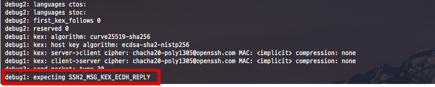

# SSH 접속시 time out 발생시

```bash
ssh 서버 -vvv
```




```bash
sudo vim /etc/ssh/ssh_config
```


```bash
MACs hmac-sha1
```

## 참고

* [debug1: expecting SSH2_MSG_KEX_DH_GEX_GROUP](https://serverfault.com/questions/592059/debug1-expecting-ssh2-msg-kex-dh-gex-group)