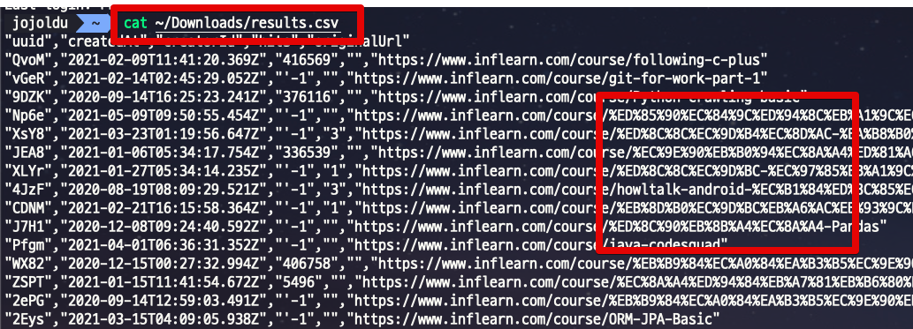
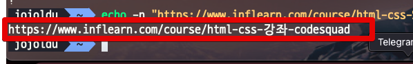
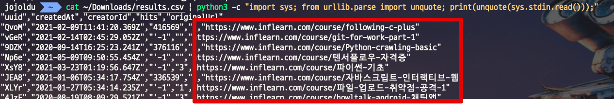
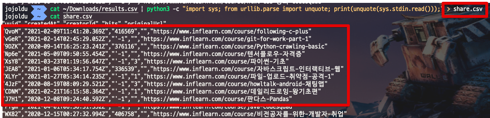

# URL Encoding 된 CSV 파일 Decode 하기 (feat. Python3)

간혹 DB에 URL을 저장하다보면 다음과 같이 Encoding된 내용으로 저장할 경우가 있습니다.  



(DB 데이터를 CSV로 뽑아낸 경우)

저장 자체에는 문제가 없지만, 이 데이터를 운영 이슈로 뽑아서 제출하거나 비개발팀에 제출해야할 경우 디코딩을 해야하는데요.  

굳이 여러 과정을 거치기 보다는 `Python3`의 `urllib` 을 이용해서 한번에 csv 파일을 전환합니다.

## 1. 스크립트

파이썬에서 URL 을 디코딩하는 간단한 코드는 다음과 같이 작성할 수 있습니다.

```python
from urllib.parse import unquote
s = 'id%253D184ff84d27c3613d%26quality%3Dmedium'
unquote(unquote(s))
```

이렇게 할 경우 다음과 같이 디코딩된 결과를 볼 수 있습니다.

```bash
'id=184ff84d27c3613d&quality=medium'
```

이걸 한줄의 스크립트 (+파이프라인적용)를 위해 다음과 같이 작성할 수 있습니다.

```python
python3 -c "import sys; from urllib.parse import unquote; print(unquote(sys.stdin.read()));
```

## 2. 적용

이 파이썬 코드가 잘 작동하는지 간단한 인코딩 문자열(`https://www.inflearn.com/course/html-css-%EA%B0%95%EC%A2%8C-codesquad`)을 넣어서 테스트해봅니다.

```python
echo -n "https://www.inflearn.com/course/html-css-%EA%B0%95%EC%A2%8C-codesquad" | python3 -c "import sys; from urllib.parse import unquote; print(unquote(sys.stdin.read()));"
```



정상적으로 전환이 되는 것을 확인했으니 이젠 CSV 파일에 적용해봅니다.

```python
cat csv파일위치 | python3 -c "import sys; from urllib.parse import unquote; print(unquote(sys.stdin.read()));"
```



csv 파일도 잘 전환되는 것이 확인되었으면, 이 전환된 내역을 **새로운 csv 파일로** 남기도록 합니다.

```python
cat ~/Downloads/results.csv | python3 -c "import sys; from urllib.parse import unquote; print(unquote(sys.stdin.read()));" > share.csv
```

> 2번째 스크립트에서 `> share.csv` 가 추가되었습니다.



share.csv에 디코딩된 문자열이 잘 남은것을 확인할 수 있습니다