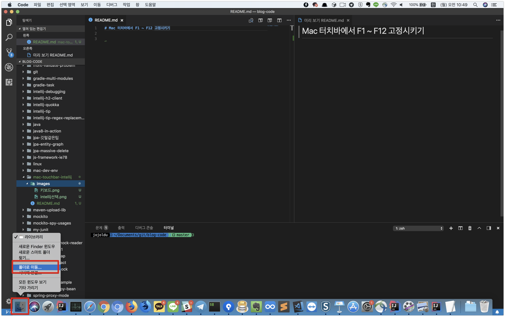
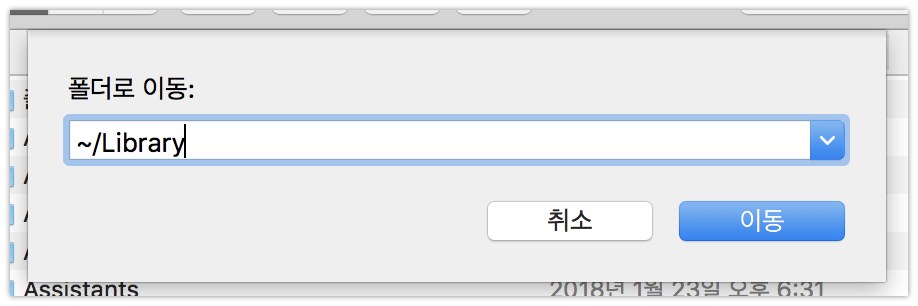
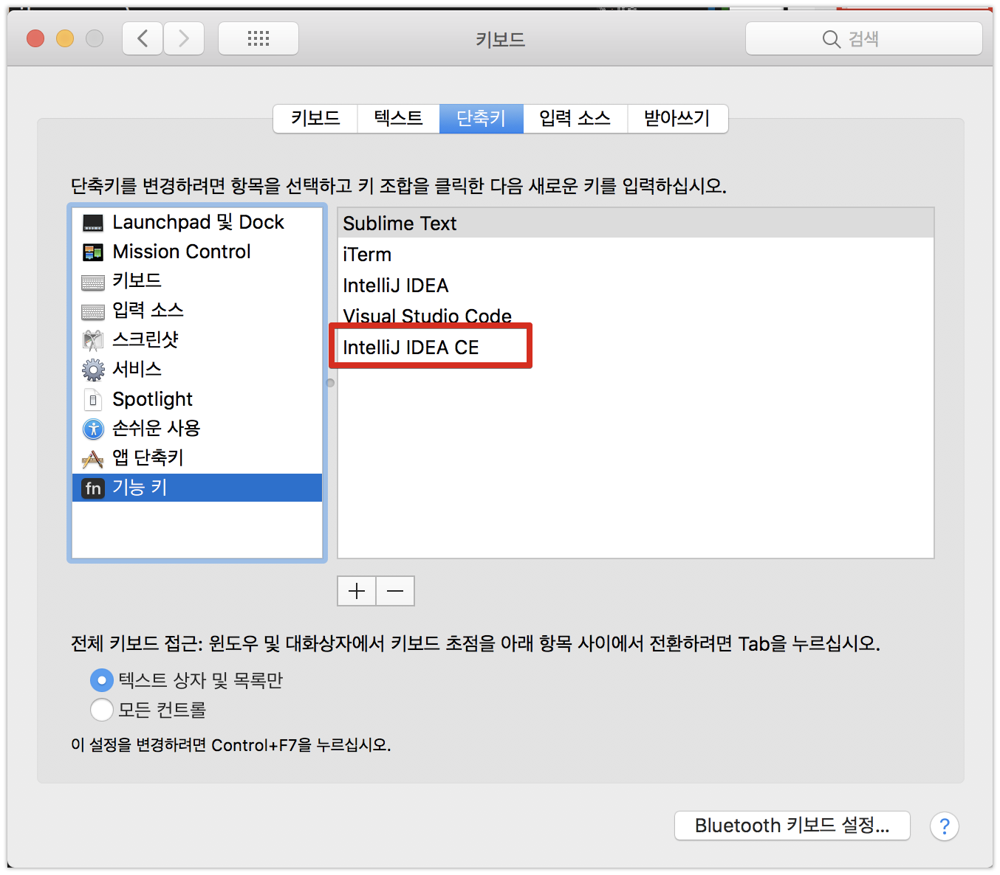
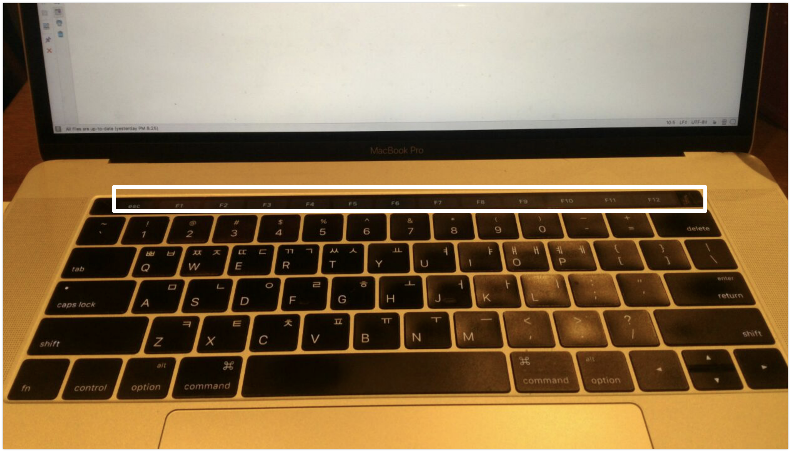

# Toolbox로 설치한 IntelliJ에서 Touchbar를 F1 ~ F12로 고정시키기

맥북 신형에서부터 터치바가 추가되었습니다.  


각 어플리케이션에 따라 특수키를 지원하는 기능인데요.  
지인으로부터 저도 터치바 맥북을 사서 현재까지 쓰고 있습니다.  
유튜브, 키노트등을 사용할때 유용하게 쓸 수 있었지만, IntelliJ나 기타 개발 환경에서는 F1 ~ F12 키를 사용하기가 불편했습니다.  
(기존의 **F1 ~ F12 자리가 터치바로** 활용됩니다.)  
  
F1 ~ F12를 사용할때마다 ```Fn```키를 함께 눌러서 사용하는게 너무 불편했습니다.  
그러다보니 생산성이 굉장히 떨어지는게 느껴졌습니다.  
개발환경에서는 F1 ~ F12를 고정시킬수 없을까 찾아보다가 [백투더백](http://macnews.tistory.com/5176)을 보고 해결책을 알게 되었습니다.  
문제는 **IntelliJ를 직접 다운받아 설치한 경우엔 쉽게 적용**이 가능한데, 저처럼 [Toolbox](https://www.jetbrains.com/toolbox/)를 통해 설치한 경우엔 추가 작업이 필요했습니다.  
그래서 그 과정을 기록합니다. 

## 1. Library 폴더 즐겨찾기 등록

가장 먼저 할일은 Library 폴더를 좌측 사이드바에 등록하는 것입니다.  
Finder를 우클릭해서 **폴더로 이동**을 클릭합니다.



그리고 ```~/Library```를 입력하고 이동합니다.



Library 폴더로 이동하시면 화면 상단의 **파일** -> **사이드바에 추가**를 클릭해서 사이드바에 등록합니다.


그럼 아래처럼 사이드바에 Library가 등록됩니다.


자 이렇게 하면 준비는 끝났습니다.

## 2. Fn키 활성화 등록

시스템 환경 설정 -> 키보드 -> 단축키 -> 기능키로 이동합니다.  


여기서 ```+```를 클릭합니다.  
그리고 1번에서 등록한 라이브러리 폴더로 이동해서  
Library -> Application Support -> Jetbrains -> Toolbox -> apps -> IDEA-C (Ultimate라면 IDEA-U 선택) -> ch-0 -> 버전 -> IDEA를 선택합니다.


> 바로가기를 등록하시면 안됩니다.  
무조건 실제 실행되는 앱을 등록해야만 됩니다.  
Toolbox 앱으로 설치된 IntelliJ가 위 위치에 있어서 라이브러리를 등록한 것입니다.

등록이 완료되면 아래처럼 목록에 추가됩니다.




직접 다운받아서 설치한 툴들을 등록하고 싶으시면 **응용 프로그램**에서 바로 등록하시면 됩니다.


자 이렇게 하시면 모든 설정이 끝납니다. 

### 세팅전


F1 ~ F12가 없는 터치바에서 
  
### 세팅후



F1 ~ F12가 활성화된 상태로 변경됩니다.  
  
(폰 화질이 안좋아서 죄송합니다 ㅠ)  
  
이제는 Toolbox에서 설치한 IntelliJ에서도 F1 ~ F12가 활성화된 채로 사용할 수 있게 됩니다.  
  