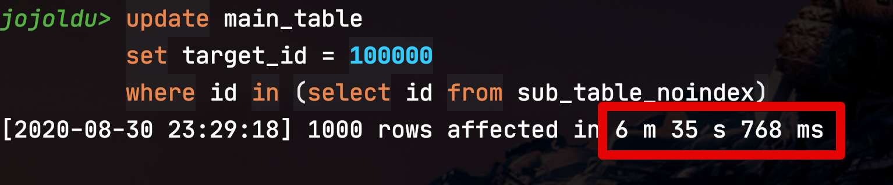
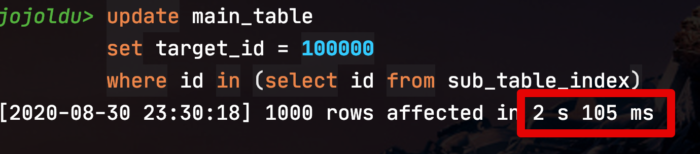
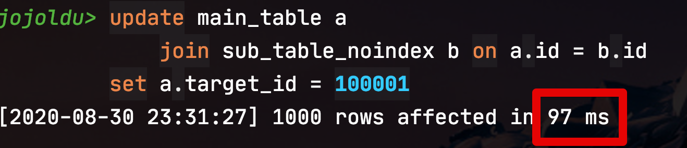
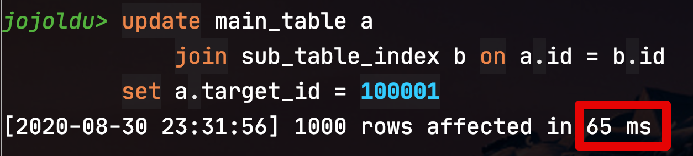

# Subquery로 Update를 하면 안되는 이유

[지난 포스팅](https://jojoldu.tistory.com/520)으로 ```select ~ where in (서브쿼리)```와 같은 서브쿼리가 MySQL 5.6 버전에서 대폭 최적화 되었음을 확인하였는데요.  
  
이번에는 **update** (```update ~ where in (서브쿼리)```) 에서도 서브쿼리 최적화가 잘 작동하는지 확인해보겠습니다.  
  
## 0. 테스트 환경

테스트 환경은 이전 select 테스트때와 같습니다.

* 메인 테이블 100만건
* 서브 테이블1 (인덱스 O) 1000건
* 서브 테이블2 (인덱스 X) 1000건

DDL 쿼리는 다음과 같습니다.  
  
**메인 테이블**

```sql
-- 업데이트 대상 테이블
create table main_table
(
    id int not null auto_increment,
    target_id int not NULL,
    primary key (id)
)ENGINE=InnoDB;
```

**서브 테이블1 (인덱스 O)**

```sql
-- 업데이트 조건 테이블 (인덱스 없음)
create table sub_table_noindex
(
    id int not null
)ENGINE=InnoDB;
```

**서브 테이블2 (인덱스 X)**

```sql
-- 업데이트 조건 테이블 (인덱스 있음)
create table sub_table_index
(
    id int not null ,
    primary key (id)
)ENGINE=InnoDB;
```

자 그럼 실험을 해보겠습니다.

## 1. Subquery

먼저 테스트해볼 것은 서브쿼리인 경우입니다.

### 1-1. No Index

테스트할 쿼리는 아래와 같습니다.

```sql
update main_table
set target_id = 100000
where id in (select id from sub_table_noindex);
``` 

**실행계획**


분명 MySQL 5.6부터는 서브쿼리의 최적화가 되었는데, 위 update쿼리의 실행계획을 보니 5.5 버전과 마찬가지로 **최적화가 되지 않은 형태**로 작동하는것을 확인할 수 있습니다.  
  
위 실행 계획을 해석하면,

* main_table을 풀스캔하면서 target_id 컬럼 값을 구해와서
* 그 target_id 값을 이용해 서브쿼리를 한 건씩 체크 조건으로 실행
* 해당 서브쿼리 역시 인덱스가 없어서 1000건을 다 체크

이 말은 전체 100만건의 main_table을 읽고, 서브 쿼리를 100만번 반복 실행하면서 그 서브쿼리 조차도 인덱스가 없어 1000건의 데이터를 일일이 체크한 것입니다.

즉, 

* 엑세스하는 데이터가 ```1,000,000 * 1,000``` (10억)

서브쿼리 최적화가 안된 것을 볼 수 있는 id 값을 보면 **두 라인이 서로 다릅니다**.  
  
이는 두 쿼리 (메인과 서브쿼리)가 조인이 아닌 서브쿼리로 실행되었음을 의미합니다.  
  
그래서 실제로 수행시간을 보면?  
  
**수행시간**



총 **6분 35초**가 걸렸습니다.  
  
겨우 100만건 중 1000건을 Update하는데 6분이 넘는 시간이 걸린것이죠.  
일반적인 커머스에서 테이블당 몇억건씩 쌓여있는 것을 고려하면 도저히 실무에서 사용할 수 있는 수준이 아닙니다.  
  
자 서브 테이블에 인덱스를 걸어놓으면 어떻게 될지 보겠습니다.  

### 1-2. Index

동일한 Update쿼리를 **인덱스가 있는 서브테이블**에 사용하게 되면 실행 계회은 다음과 같습니다.  
  
**실행계획**


인덱스가 없을때와 비교해서는 기존의 상관 서브쿼리 형태는 그대로지만, **인덱스로 인해 서브쿼리 자체의 실행이 개선** 되었음을 확인할 수 있습니다.  
  
그래서 

* 엑세스하는 데이터가 ```1,000,000 * 1``` (100만)
    * 인덱스가 없는 것에 비하면 엑세스 하는 데이터가 1/1000으로 개선되었습니다.

> type의 ```unique_subquery``` 는 WHERE 조건절에서 사용될 수 있는 **IN (subquery) 형태의 쿼리를 위한 접근 방식**입니다.  
> unique_subquery의 의미 그대로 서브 쿼리에서 중복되지 않은 유니크한 값만 반환할 때 이 접근 방법을 사용합니다.  
> 위 쿼리 문장의 IN (subquery) 부분에서 subquery를 보면 **서브테이블의 id는 중복이 없기 때문에** 실행 계획의 두 번째 라인의 dept_emp 테이블의 접근 방식은 unique_subquery로 표시된 것입니다.

그래서 실제로 수행시간을 보면?  
  
**수행시간**



기존 **6분 35초**에서 **2초**로 대폭 개선되었습니다.  
  
이정도만 해도 충분히 개선된것 같은데요.  
만약 여기서 Join으로 처리하게 되면 얼마나 개선이 될까요?

## 2. Join

서브쿼리에서 Join으로 변경해서 비교해보겠습니다.  
위 서브쿼리를 Join쿼리로 아래와 같이 변경하여 테스트하였습니다.

```sql
-- 서브쿼리 사용하지 않고 JOIN으로 작성 (인덱스 없음)
update target_table a
    join source_table_noindex b on a.id = b.id
set a.target_id = 100001
```

### 2-1. No Index

먼저 서브테이블에 Index가 없는 경우를 보겠습니다.  
  
**실행계획**


이 실행계획을 해석하면

* 첫번째 row가 **서브테이블**입니다.
  * 즉, 서브 테이블을 table full scan (```type=ALL```) 하고
  * 그 결과로 메인 테이블을 하나씩 바로 찍어서 (```type=eq_ref```) 메인 쿼리를 수행했음을 의미합니다.
* 메인 테이블의 조건문은 index가 있는 id이기 때문에 인덱스로 바로 찾을 수 있는 것입니다.

즉, 

* 엑세스하는 데이터가 ```1,000 * 1``` (1000)
  * 기존 인덱스 없는 서브 쿼리를 사용할때에 비해 접근하는 데이터가 1/100만 이 되었습니다.

그래서 실제로 수행시간을 보면?  
  
**수행시간**



**0.97초** 라는 말도안되는 속도로 개선이 되었습니다.  

### 2-2. Index

자 그럼 마지막으로 서브테이블까지 인덱스가 있는 경우엔 어떻게 될지 보겠습니다.  
  
**실행계획**


* 서브쿼리가 전체 데이터를 사용하므로 **index full scan** (```type=index```) 이 발생하였습니다.
  * MySQL에서는 index full scan도 table full scan만큼 피해야할 대상입니다.
  * 만약 서브쿼리에 **상세한 인덱스 조회 조건**이 있었다면 당연히 더 개선된 실행 계획이 나왔을 것입니다. 

그래서 마찬가지로 

* 엑세스하는 데이터가 ```1,000 * 1``` (1000)
  * 기존 인덱스 없는 서브 쿼리를 사용할때에 비해 접근하는 데이터가 1/100만 이 되었습니다.

**수행시간**



수행시간은 **0.6초**로 서브테이블에 인덱스가 없는 경우와 거의 비슷합니다.  
이는 아마도 다음과 같은 이유를 생각해볼 수 있는데요.

* 이미 1초 이내라서 드라마틱한 차이가 날수가 없음
  * 체감하긴 어렵지만, 비율로 본다면 0.9초와 0.6초는 50%의 차이가 난다고 볼 순 있음
* 서브쿼리에 **상세한 인덱스 조회 조건**이 없기 때문에 table full scan vs index full scan의 차이라서 차이가 크지 않음
  * 좀 더 인덱스를 탔을때 드라마틱한 성능 차이를 낼 수 있는 조회 조건을 사용한다면 큰 차이가 발생

## 결론

위와 같은 실험으로 다음과 같은 결론을 낼 수 있는데요.

* MySQL 5.6 에서 서브쿼리가 개선되었지만, **Update** 에는 적용되지 않는다.
* 즉, ```update ~ where in (서브쿼리)``` 형태는 다음의 방식으로 사용해야만 한다.
  * **join**을 쓰거나
  * join이 어렵다면 **최소한 서브쿼리 테이블에 인덱스**가 있어야만 한다.
    * 서브쿼리를 이용하여 update가 실행될 경우 업데이트 대상의 테이블 전체를 읽게 되어 매우 느리게 처리된다.  
    * 서브쿼리를 이용할 경우 작은 테이블이라도 인덱스가 반드시 있어야 한다.

꼭 이렇게 실험을 하지 않더라도, 이미 MySQL [공식문서](https://dev.mysql.com/doc/refman/5.6/en/subquery-optimization.html) 에서는 Update/Delete 서브쿼리에 대해 주의점을 언급하고 있습니다.


해석하면 ([갓파고](https://papago.naver.com/)가..)

> 서브쿼리를 사용하여 단일 테이블을 수정하는 UPDATE 및 DELETE 문에는 최적화 도구에 Semi-Join 또는 Materialization-Subquery-Optimizations이 사용되지 않는다는 한계가 있다.  
> 해결 방법으로 **하위 쿼리가 아닌 조인을 사용**하는 다중 테이블 UPDATE 및 DELETE 문으로 다시 작성해야 한다.

그래서 대량으로 update/delete 쿼리를 사용하실때 서브쿼리가 필요하시다면 꼭 **서브테이블에 인덱스를 걸거나/Join으로 변경**하시길 추천합니다.


