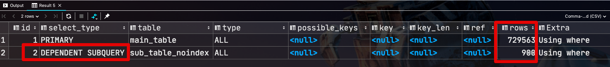
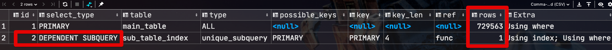
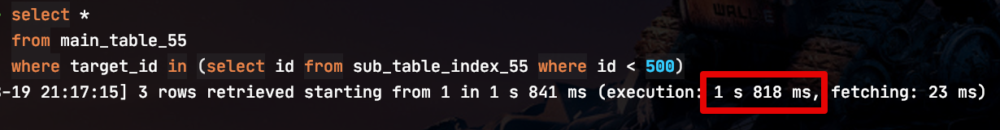
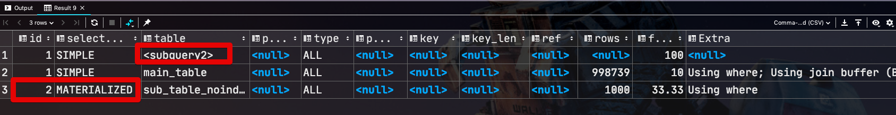
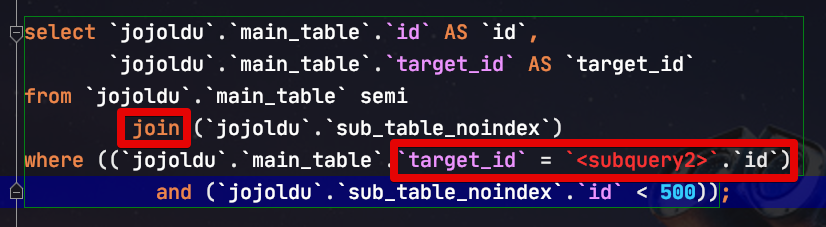
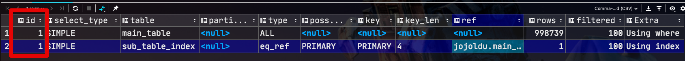
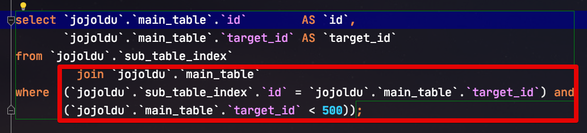

# Subquery로 Where Select할 경우 (MySQL 5.5 vs 5.6)

mysql에서 업데이트 쿼리 작성시 subquery를 사용할 경우 select와 동작방식이 다르기 때문에 주의가 필요하여 해당 테스트 스크립트를 작성했습니다.


* 메인 테이블 100만건
* 서브 테이블 1000건

```sql
-- 업데이트 대상 테이블
create table main_table
(
    id int not null auto_increment,
    target_id int not NULL,
    primary key (id)
)ENGINE=InnoDB;
```

```sql
-- 업데이트 조건 테이블 (인덱스 없음)
create table sub_table_noindex
(
    id int not null
)ENGINE=InnoDB;
```
 
```sql 
-- 업데이트 조건 테이블 (인덱스 있음)
create table sub_table_index
(
    id int not null ,
    primary key (id)
)ENGINE=InnoDB;
```


## MySQL 5.5

### Subquery








### Join

## MySQL 5.6

### Subquery











### Join

## 결론

* 버전 관계 없이 좋은 성능을 내려면 최대한 Join을 이용하자
* Join을 사용하기가 너무 어렵다면 Subquery는 사용하되, MySQL 5.5 이하라면 절대 사용하지 않는다.
  * 5.5 이하이면 차라리 쿼리를 나눠서 실행하는게 낫다.
