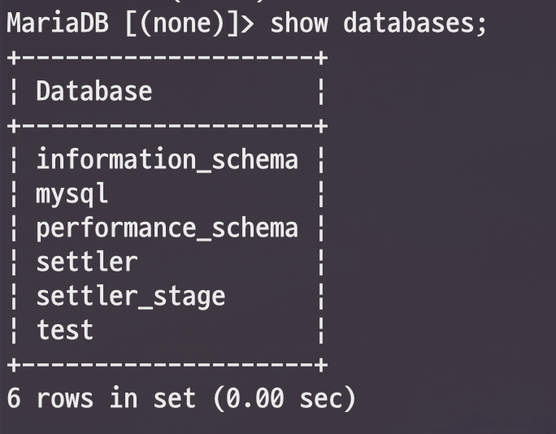

# Xtrabackup으로 DB 복구하기


아래부터 실행되는 모든 명령은 ```root``` 계정으로 실행합니다.  
즉, ```ec2-user```, ```centos``` 등의 계정에서 ```root``` 계정으로 전환합니다.

```bash
sudo su - root
```

## 1. 백업 파일 다운로드

**s3**

```bash
aws s3 cp s3://버킷/압축파일 ./
```

**wget**

```bash
wget https://aws주소/버킷/압축파일
```

## 2. 압축풀기

먼저 빠르게 압축 해제를 위해 ```pigz``` 패키지를 설치하겠습니다.

> pigz란? 압축 파일을 병렬 & 멀티프로세서 & 멀티코어로 해제 할 수 있게 지원하는 패키지입니다.
> 지금처럼 100G가 넘는 압축 파일을 해제시 속도 향상을 위해 사용됩니다.


```bash
yum install pigz
```

설치가 끝나셨다면 아래와 같이 ```nohup &``` 으로 ```pigz```를 실행합니다.

> ```nohup &``` 을 사용하는 이유는 지금처럼 대용량 파일 압축 해제시 최소 1시간, 최대 10시간 이상 소요될 수 있기 때문입니다.
> 압축 해제 하는 동안 사용자 세션이 끊기면 강제 종료 되니, 세션 관계 없이 백그라운드로 실행하기 위해 필수로 사용됩니다.
> 파일 용량이 적을때는 ```pigz -dc 압축파일.tar.gz | tar xvfi -``` 만 사용하셔도 됩니다.


```bash
nohup sh -c "pigz -dc 압축파일.tar.gz | tar xvfi -" &
```

해당 명령어가 잘 수행되는지 확인 하기 위해 ```tail -f```로 로그를 확인합니다.

```bash
tail -f nohup.out
```

아래와 같이 ibdata1을 시작으로 압축 해제된 디비 정보들이 보이면 잘 되고 있는 것입니다.

```bash
$ tail -f nohup.out
ibdata1
mysql/innodb_index_stats.ibd
mysql/gtid_slave_pos.ibd
```

## 3. 복구하기

먼저 기존에 실행중인 MariaDB를 종료합니다.

### innobackupex 설치하기

```bash
yum install -y percona-xtrabackup
```

> **MariaDB 10.1**이라면 **percona-xtrabackup** (2.3), **MariaDB 10.2**라면 **percona-xtrabackup-24** (2.4) 를 설치하시면 됩니다.

만약 설치 도중, 아래와 같은 에러가 발생한다면

```bash
Transaction check error:
  file /etc/my.cnf from install of mysql-config-5.5.62-1.23.amzn1.x86_64 conflicts with file from package MariaDB-common-10.1.43-1.el6.x86_64
```

**Amazon Linux 1**이 기본적으로 지원하는 패키지들이 MariaDB 1과 호환성이 안맞기 때문인데요.  
percona-xtrabackup 패키지 설치에 필요한 다른 패키지들은 직접 설치합니다.

* ```yum install -y libev```
* ```yum install -y perl-DBD-MySQL```

위 2명령어를 수행후 다시 ```yum install -y percona-xtrabackup```를 실행해봅니다.  
  
아래와 같이 설치 성공 메세지를 확인할 수 있습니다.

```bash
Running transaction
  Installing : percona-xtrabackup-2.3.10-1.el6.x86_64          1/1
  Verifying  : percona-xtrabackup-2.3.10-1.el6.x86_64          1/1
Installed:
  percona-xtrabackup.x86_64 0:2.3.10-1.el6

Complete!
```

설치가 다 되셨다면 root 디렉토리로 이동하여 복원 명령어를 수행해보겠습니다.

```bash
cd ~
```


```bash
innobackupex —-apply-log 백업디렉토리
```

예를 들어 저같은 경우 아래와 같이 적용합니다.

```bash
innobackupex --apply-log /data/mysql/backup/
```

### --move-back 으로 복구하기

풀백업을 복구하려면 MariaDB를 정지하고 데이터베이스의 현재 내용을 삭제해야 합니다.

```
service mysql stop
```

압축 해제가 잘되었으면 data 디렉토리로 해당 디렉토리를 이동시킵니다.  
아래와 같이 ```my.cnf``` 을 열어 data 디렉토리를 확인해봅니다.

```bash
vim /etc/my.cnf
```

아래와 같이 ```datadir``` 항목이 data 디렉토리입니다.

```bash
## config server and data path
datadir                         = /data/mysql/mysql-data
```

기존에 있던 ```datadir``` 를 삭제하고

```bash
rm -rf /data/mysql/mysql-data
```

copy-back 명령어로 복구를 진행합니다.

```bash
innobackupex --move-back /data/mysql/backup/
```

디렉토리 용량이 많다면 압축해제와 마찬가지로 ```nohup```으로 명령어를 실행합니다.

```bash
nohup sh -c "innobackupex --move-back /data/mysql/backup/" &
```

만약 아래와 같이 에러가 발생한다면

```bash
innobackupex: Can't create/write to file '/home/mysql/log/ib_logfile0' (Errcode: 17 - File exists)
[01] error: cannot open the destination stream for ib_logfile0
[01] Error: copy_file() failed.
```

로그 디렉토리의 특정 파일들이 존재해서 안된다는 의미이니 log 파일을 삭제하고 다시 실행해봅니다.

```bash
rm -rf 로그파일
```

저는 아래와 같이 수행했습니다.

```bash
rm -rf /home/mysql/log/ib_logfile0
```

모든 작업이 성공적으로 끝나면 다음과 같은 메세지가 나옵니다.

```bash
191203 18:07:36 [01] Moving ./xtrabackup_slave_info to /data/mysql/mysql-data/xtrabackup_slave_info
191203 18:07:36 [01]        ...done
191203 18:07:36 completed OK!
```

root로 모든 명령어를 수행했으니, 이동한 디렉토리 역시 root 권한으로 되어 있습니다.

```bash
$ ll
total 8
drwxr-xr-x 7 root  root  4096 Dec  2 14:03 mysql-data
drwxr-xr-x 2 mysql mysql 4096 Nov 15 17:09 mysql-ibdata
srwxrwxrwx 1 mysql mysql    0 Dec  1 12:55 mysql.sock
```

MariaDB가 사용할 수 있도록 ```mysql``` 권한으로 변경합니다.

```bash
cd /data/mysql/
chown -R mysql:mysql *
```

## 4. 실행하기

```bash
$ service mysql start
Starting MariaDB.191204 07:27:43 mysqld_safe Logging to '/home/mysql/log/error/mysql.err'.
191204 07:27:43 mysqld_safe Starting mysqld daemon with databases from /data/mysql/mysql-data
....................... SUCCESS!
```

```bash
$ mysql -u 사용자계정 -p
Enter password:
```




