# Java 라이브러리 maven 저장소에 등록하기 

안녕하세요? 이번 시간엔 **Java 라이브러리 maven 저장소에 등록**하는 방법을 소개드리려 합니다.  
모든 코드는 [Github](https://github.com/jojoldu/enum-mapper)에 있기 때문에 함께 보시면 더 이해하기 쉬우실 것 같습니다.  
(공부한 내용을 정리하는 [Github](https://github.com/jojoldu/blog-code)와 세미나+책 후기를 정리하는 [Github](https://github.com/jojoldu/review), 이 모든 내용을 담고 있는 [블로그](http://jojoldu.tistory.com/)가 있습니다. )<br/>

본인이 만든 Java 라이브러리를 Maven Repository에 등록하고, 이를 여러 프로젝트에서 활용하고 싶으신 분들이 계실것 같습니다.  
저 역시 이번에 그런 경우가 생겨, 직접 진행하고 정리해보았습니다.  

## 본문

Gradle로 진행하는 방법이 Maven보다 과정이 더 복잡하단 생각에 Maven으로 진행하겠습니다.  
(전 Maven보다는 Gradle을 선호합니다..)  
등록할 라이브러리가 Maven 프로젝트라는 가정하에 시작합니다.

### 1. bintray 등록

OSSRH를 이용할 수도 있지만, 그 과정이 매끄럽지 못해 bintray라는 대행서비스를 사용합니다.  
먼저 bintray.com에 가입을 합니다.  
이때 주의하실 점은 사이트 메인에서 가입하시면 **엔터프라이즈 트라이얼 가입자**가 됩니다.  
이렇게 될 경우 jcenter와 mavencentral에 jar를 무료로 업로드 할수 없습니다.  
그래서 오픈소스 개발자로 가입을 합니다.  

* [가입링크](https://bintray.com/signup/oss)

화면이 아래와 같은 형태여야 합니다.

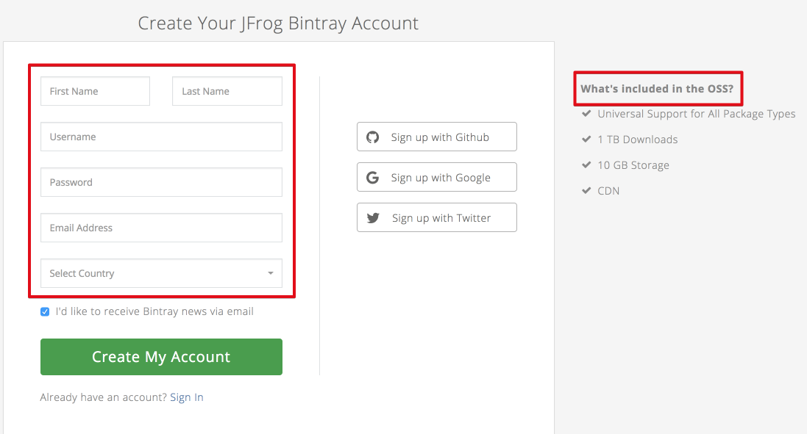

가입을 완료하시면 아래와 같이 프로필 페이지가 등장할텐데, 여기서 **Add New Repository**를 클릭합니다.

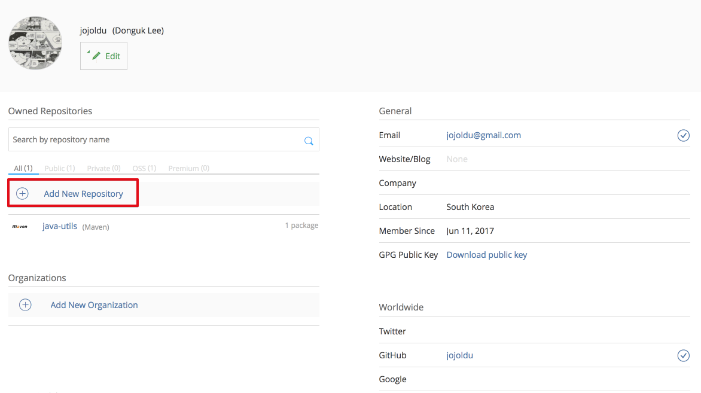

아래와 같이 원하는 형태로 저장소를 설정합니다.

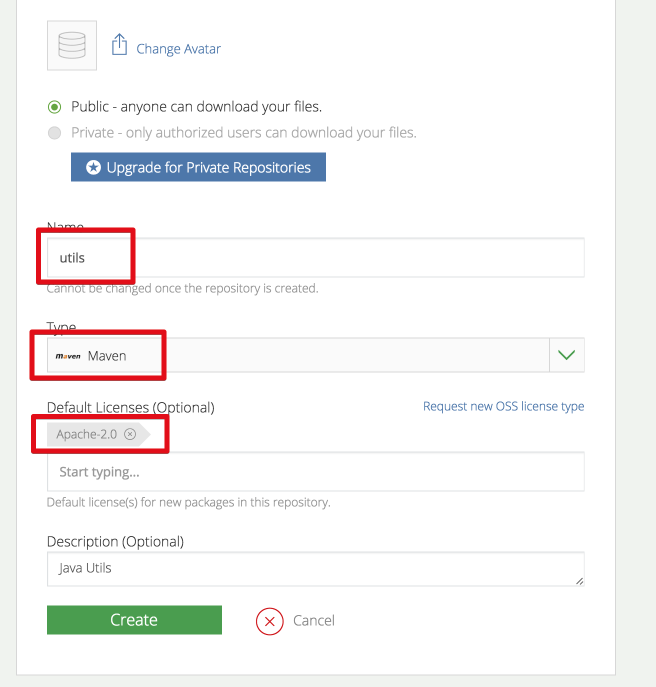

저는 Type은 Maven으로 (여기선 저장소 형태를 얘기합니다. Ant/Maven/Gradle 같은 빌드 시스템 선택이 아닙니다.), 라이센스는 Apache-2.0으로 하였습니다.  
create하시면 해당 저장소의 페이지로 이동합니다.  
여기서 **Add New Package**를 클릭합니다.

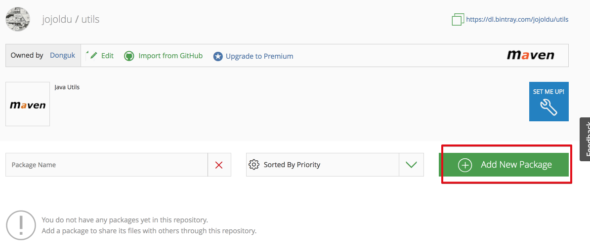

저는 기존에 생성해둔 저장소(**java-utils**를 사용하겠습니다.)  

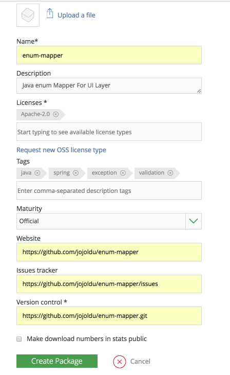

위 처럼 본인의 라이브러리 정보를 등록합니다.  
(보통은 github 정보를 등록하시면 됩니다.)  
Name은 일반적으로 **artifactId**를 권장합니다.  
(artifactId란 Maven 혹은 Gradle에서 의존성 추가하실때를 예로 들면 ```org.apache.commons:commons-lang3```에서 ```commons-lang3```를 얘기합니다.  
좀전에 생성한 저장소 이름을 groupId로, 지금 생성하는 패키지의 이름을 artifactId로 생성한다고 보시면 됩니다.)  
생성을 완료하시면 패키지 관리 페이지로 이동합니다.  
**Edit** 버튼을 클릭하고,

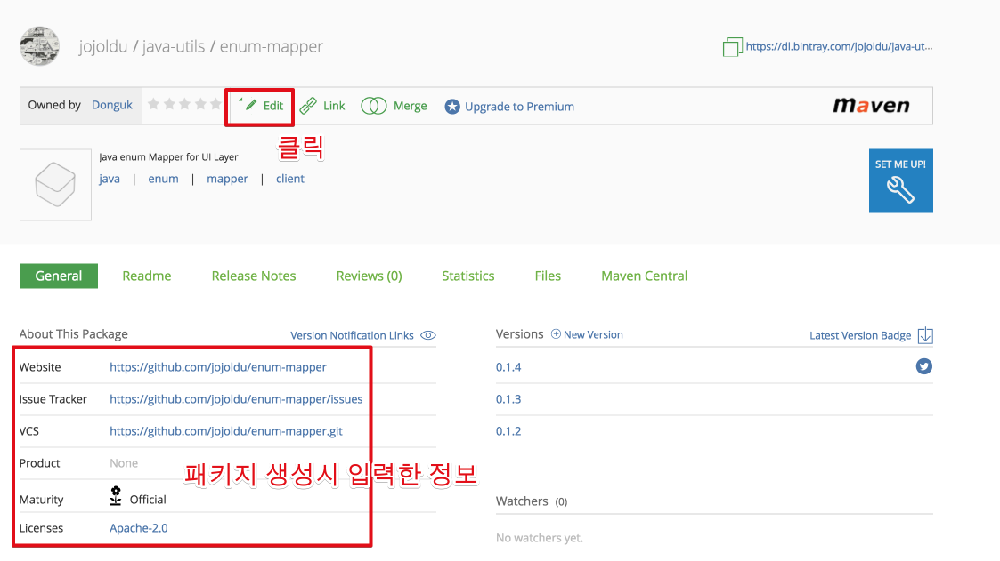

설정 페이지 가장 하단에 있는 **GitHub repo (user/repo)**에 Github 정보를 입력합니다.  
(usename/저장소명 으로 입력합니다.)

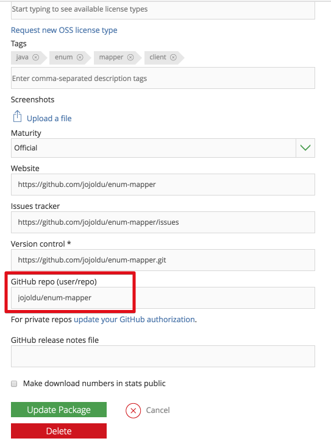

자 이제 잠깐 웹 페이지는 그대로 둔채, GPG 키 생성을 진행하겠습니다.

### 2. GPG Key 생성

라이브러리 위변조를 방지하기 위해 GPG키로 전자서명이 필요합니다.  
이번엔 그 과정을 진행하겠습니다.  
이번 과정은 맥과 윈도우가 다르게 진행됩니다.  
본인의 OS가 윈도우라면 다음 [링크](https://www.lesstif.com/pages/viewpage.action?pageId=30277671#id-메이븐중앙저장소에아티팩트업로딩-maven-uploadingartifacttocentralrepository-GPG키생성)를 따라 진행하시면 됩니다.  
여기서는 맥으로 진행합니다.  
  
[https://gpgtools.org](https://gpgtools.org/)에 접속하여 GPG Suite를 다운받아 설치합니다.

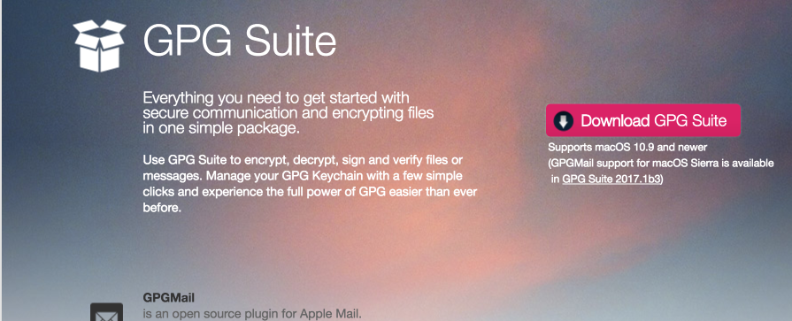

설치후, 실행을 해보시면 아래와 같은 화면이 출력됩니다.

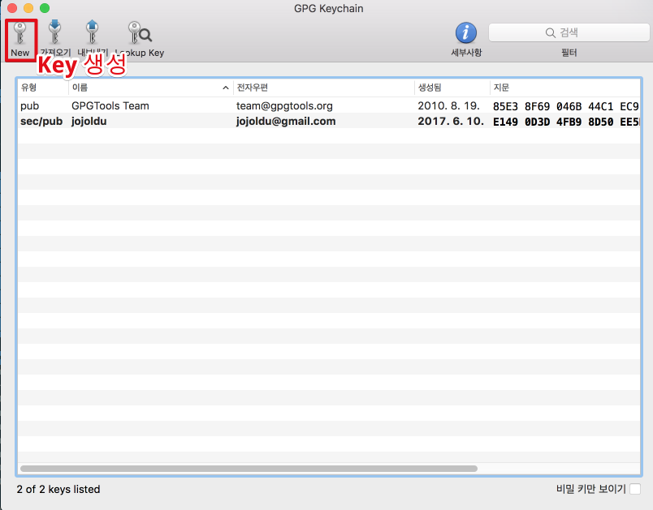

**New** 버튼으로 키를 생성합니다.

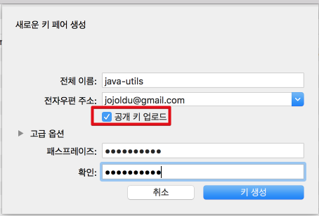

(이때, 공개키 업로드를 해야만 하니 꼭! 공개키 업로드를 체크해주세요)  
방금 생성한 키를 우클릭하여 **복사**를 클릭합니다.  

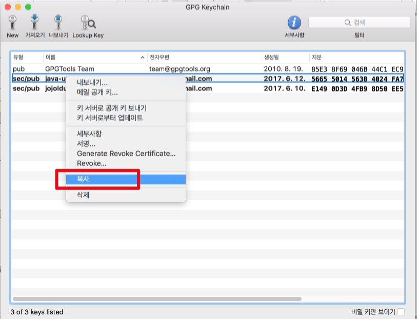

이 내용을 bintray 본인 계정에 등록해야합니다.  
bintray 페이지의 우측 상단 프로필 영역에서 **Edit Profile**을 클릭합니다.  
그리고 좌측 사이드 영역에 있는 **GPG Signing**을 클릭합니다.

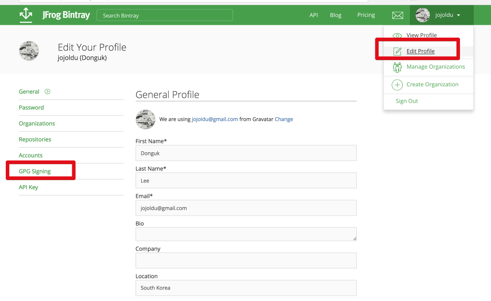

방금 복사한 키를 붙여넣기 합니다.

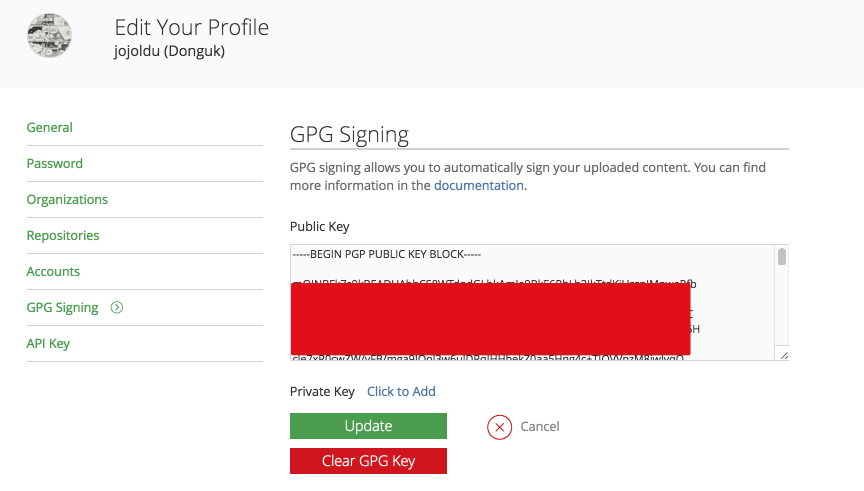

GPG 키 등록이 끝났습니다.  
이제 본인이 생성한 프로젝트의 pom.xml로 이동하겠습니다.

### 3. pom.xml

bintray에 라이브러리 업로드를 할 수 있도록 maven pom.xml 설정을 진행합니다.  
bintray 업로드 외 설정은 생략하였으니, 본인의 취향에 맞게 설정을 추가하시면 됩니다.  
(자세한 설정은 [Github](https://github.com/jojoldu/enum-mapper/blob/master/pom.xml)을 참고하세요!)

```
<?xml version="1.0" encoding="UTF-8"?>
<project xmlns="http://maven.apache.org/POM/4.0.0"
         xmlns:xsi="http://www.w3.org/2001/XMLSchema-instance"
         xsi:schemaLocation="http://maven.apache.org/POM/4.0.0 http://maven.apache.org/xsd/maven-4.0.0.xsd">
    <modelVersion>4.0.0</modelVersion>

    <groupId>com.github.jojoldu</groupId>
    <artifactId>enum-mapper</artifactId>
    <version>0.1.8</version>
    <packaging>jar</packaging>

    <name>Enum Mapper</name>
    <description>A Java enum mapper library for UI Layer(Select box, Radio Box, etc..) </description>
    <url>https://github.com/jojoldu/enum-mapper</url>

    <licenses>
        <license>
            <name>The Apache Software License, Version 2.0</name>
            <url>https://opensource.org/licenses/Apache-2.0</url>
            <distribution>repo</distribution>
        </license>
    </licenses>

    <developers>
        <developer>
            <name>jojoldu</name>
            <email>jojoldu@gmail.com</email>
        </developer>
    </developers>

    <scm>
        <url>https://github.com/jojoldu/enum-mapper</url>
    </scm>

    <distributionManagement>
        <repository>
            <id>enum-mapper</id>
            <url>https://api.bintray.com/maven/{bintray계정}/{bintray 저장소명}/{bintray 패키지명}/;publish=1</url>
        </repository>
    </distributionManagement>

    <properties>
        <java.version>1.8</java.version>
        <project.build.sourceEncoding>UTF-8</project.build.sourceEncoding>
        <bintray.repo>jojoldu/java-utils</bintray.repo>
        <bintray.package>enum-mapper</bintray.package>
    </properties>

    <build>
        <plugins>
            <plugin>
                <groupId>org.apache.maven.plugins</groupId>
                <artifactId>maven-compiler-plugin</artifactId>
                <configuration>
                    <source>1.8</source>
                    <target>1.8</target>
                </configuration>
            </plugin>
            <plugin>
                <groupId>org.apache.maven.plugins</groupId>
                <artifactId>maven-jar-plugin</artifactId>
                <version>2.3.2</version>
            </plugin>
            <plugin>
                <groupId>org.apache.maven.plugins</groupId>
                <artifactId>maven-source-plugin</artifactId>
                <version>2.3</version>
                <executions>
                    <execution>
                        <id>attach-sources</id>
                        <phase>verify</phase>
                        <goals>
                            <goal>jar</goal>
                        </goals>
                    </execution>
                </executions>
            </plugin>
            <plugin>
                <groupId>org.apache.maven.plugins</groupId>
                <artifactId>maven-javadoc-plugin</artifactId>
                <version>2.9.1</version>
                <executions>
                    <execution>
                        <id>attach-javadocs</id>
                        <phase>verify</phase>
                        <goals>
                            <goal>jar</goal>
                        </goals>
                    </execution>
                </executions>
            </plugin>

            <!-- GPG sign -->
            <plugin>
                <groupId>org.apache.maven.plugins</groupId>
                <artifactId>maven-gpg-plugin</artifactId>
                <version>1.5</version>
                <executions>
                    <execution>
                        <id>sign-artifacts</id>
                        <phase>verify</phase>
                        <goals>
                            <goal>sign</goal>
                        </goals>
                    </execution>
                </executions>
            </plugin>
        </plugins>
    </build>

    <dependencies>
        ...
    </dependencies>
</project>
```

제가 설정한 코드이기 때문에 본인의 라이브러리에 맞게 바꿔주시면 됩니다.  

* jojoldu : bintray 계정명
* java-utils : bintray 저장소명
* enum-mapper : bintray 패키지명

로 생각하시고 코드를 변경하시면 됩니다.  
이것만 가지고 maven 설정이 끝난것은 아닙니다.  
결국 업로드를 위해서 **API Key와 같은 부분을 설정**해야하는데, 이를 pom.xml에 등록하면 Github에 Key가 노출되므로 로컬의 **settings.xml**을 사용하겠습니다.

### 4. settings.xml 설정

로컬 PC에 Maven이 설치되어있다는 가정하에 시작합니다.  
터미널을 열어 아래와 같은 명령어를 입력합니다.  

```
vim ~/.m2/settings.xml
```

settings.xml이 기존에 생성되있으신 분들도 계실테고, 아니신 분들도 계실텐데 없다면 생성까지 진행되니 걱정안하셔도 될것 같습니다.  
settings.xml에 아래 내용을 추가하시면 됩니다.  
(아래는 전체 settings.xml 내용입니다. 이미 있으신 분들은 ```<servers>```, ```<profiles>```, ```<activeProfiles>``` 만 붙여넣으시면 됩니다.)

```
 <?xml version='1.0' encoding='UTF-8'?>
  <settings xsi:schemaLocation='http://maven.apache.org/SETTINGS/1.0.0 http://maven.apache.org/xsd/settings-1.0.0.xsd'
             xmlns='http://maven.apache.org/SETTINGS/1.0.0' xmlns:xsi='http://www.w3.org/2001/XMLSchema-instance'>
       <servers>
           <server>
               <id>{라이브러리명}</id>
               <username>{bintray 계정명}</username>
               <password>{bintray API Key}</password>
           </server>
      </servers>
      <profiles>
          <profile>
              <repositories>
                  <repository>
                      <snapshots>
                          <enabled>false</enabled>
                      </snapshots>
                      <id>central</id>
                      <name>bintray</name>
                      <url>http://jcenter.bintray.com</url>
                  </repository>
              </repositories>
              <pluginRepositories>
                  <pluginRepository>
                      <snapshots>
                          <enabled>false</enabled>
                      </snapshots>
                      <id>central</id>
                      <name>bintray-plugins</name>
                      <url>http://jcenter.bintray.com</url>
                  </pluginRepository>
              </pluginRepositories>
              <id>bintray</id>
          </profile>
      </profiles>
      <activeProfiles>
          <activeProfile>bintray</activeProfile>
      </activeProfiles>
  </settings>
```

이 코드에서 변경하실 내용은 ```<servers>``` 입니다.  
**id는 pom.xml에서 등록한 id**를 사용하셔야 합니다.

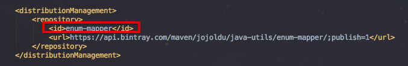

API Key의 경우 bintray -> Edit Profile -> API Key에서 확인하실수 있습니다.

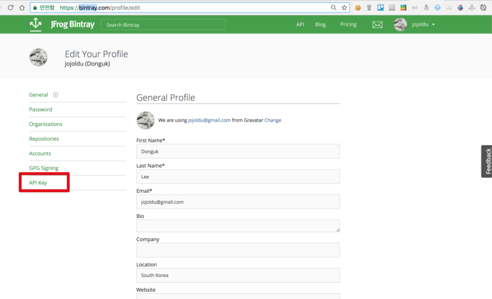

해당 key를 복사해서 ```<password>```에 입력해주시면 됩니다.  
  
설정이 완료 되셨으면 이제 bintray에 라이브러리를 업로드 해보겠습니다.

### 5. deploy

pom.xml이 있는 프로젝트에서 터미널을 열어 아래의 명령어를 입력합니다.

```
mvn clean deploy
```

정상적으로 진행되시면 아래와 같은 결과가 출력됩니다.

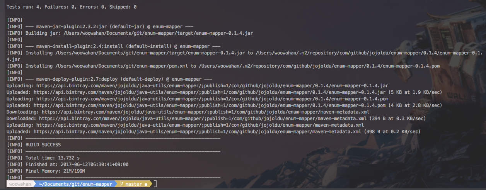

bintray의 패키지 페이지로 가보시면!

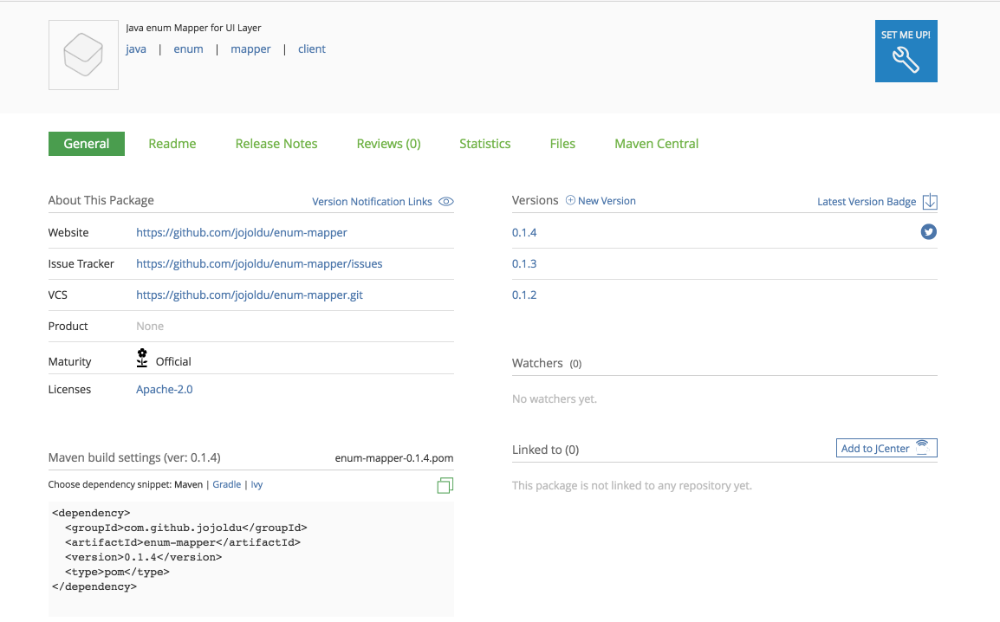

성공적으로 등록된 것을 확인할 수 있습니다.  
여기까지는 maven 라이브러리 관리 대행인 **bintray에 업로드** 하는 과정이였습니다.  
이걸 maven이나 gradle에서 받으려면 **jcenter 혹은 maven central에 등록**이 되어야 합니다.  
직접 업로드 할 필요 없이 bintray의 링크를 이용하여 아주 쉽게 진행하겠습니다.

### 6. jcenter link

방금전 확인한 bintray 패키지 관리 페이지의 우측 하단을 보시면 **Add to JCenter** 버튼이 보이실것입니다.

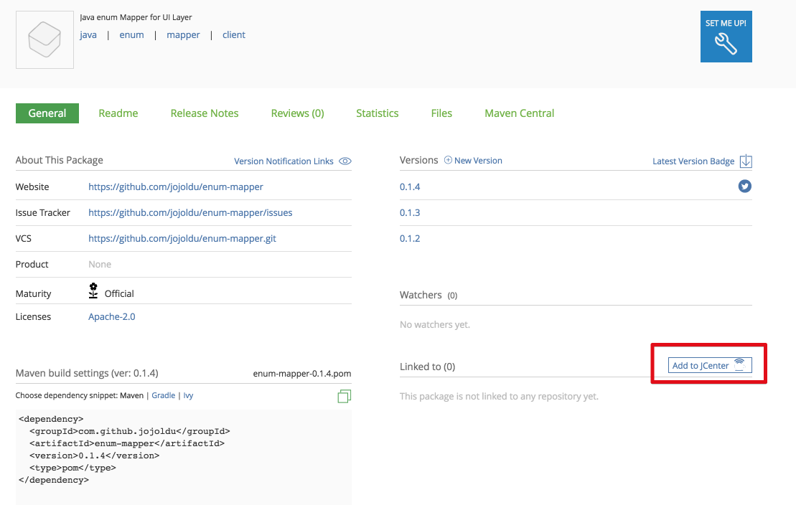

이걸 클릭하시면 제출 페이지가 등장하는데 **send** 버튼을 클릭하시면 JCenter와 현재 패키지 동기화 요청이 진행됩니다.

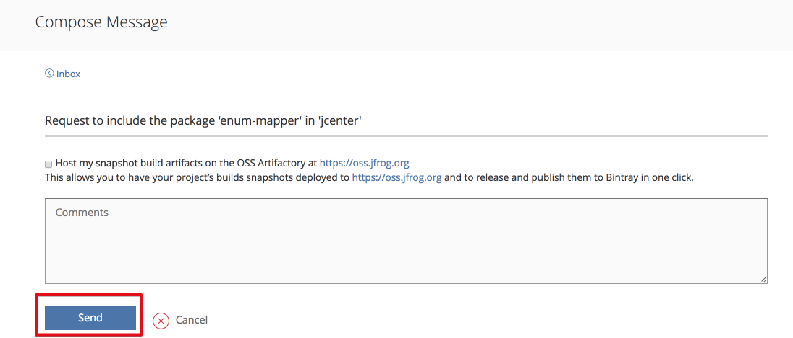

관리자 승인이 필요한데, 보통 시차때문에 밤 12시쯤 승인이 되니 느긋한 마음으로 기다립니다.  
(JetBrains도 그렇고 밤 12시에 승인되는 곳이 많아 밤잠 설칠일이 많네요ㅠ)  
  
조건을 다 맞추셨다면 다음과 같은 jcenter link 승인 메일이 올것입니다.


그리고 bintray로 가보시면 link된 것을 확인할 수 있습니다.

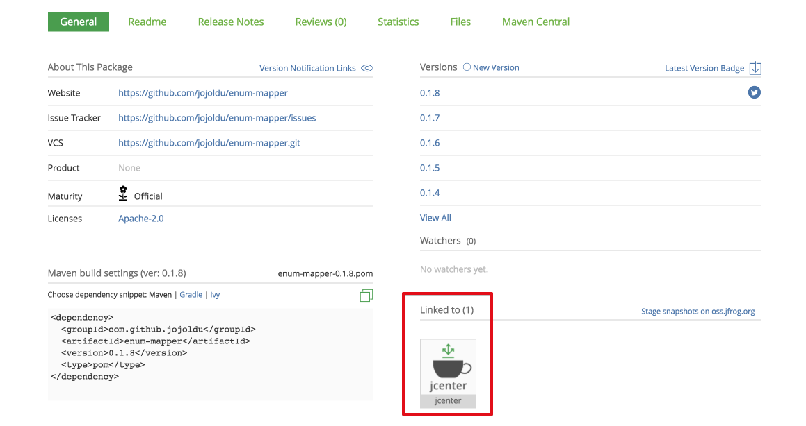

jcenter에 jar가 업로드 되었습니다!  
여기까지 진행할 경우에 빌드 파일에서 의존성을 받아 사용할수는 있습니다.

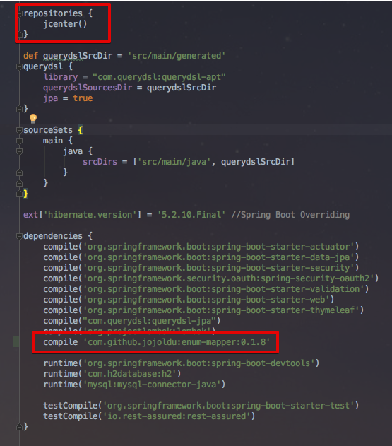

하지만 [search.maven.org](https://search.maven.org)에 검색이 되도록 하고, repositories가 mavencentral일 경우에도 받을 수 있도록 추가 작업을 진행하겠습니다.

### 7. maven central link
  
참고로 link 하는 것은 패키지가 link 되는 것이 아니라, **jcenter와 maven central이 링크**되는 것입니다.  
그래서 패키지가 jcenter와 링크되기 전까지는 maven central과 링크가 되지 않으니 유의해주세요.  
  
먼저 [issues.sonatype.org/projects/OSSRH ](https://issues.sonatype.org/projects/OSSRH)에 가입하고 이슈를 **CREATE**합니다.  

제가 등록한 [이슈](https://issues.sonatype.org/browse/OSSRH-32202)를 참고하셔서 **프로젝트의 이름과 groupId, URL 등의 정보**를 입력하면 이슈가 생성되고 **며칠이 지나서** 프로젝트 운영자가 해당 이슈의 상태를 Resolved 로 바꾸고 댓글을 달아주면 배포 사전 준비가 끝납니다.  

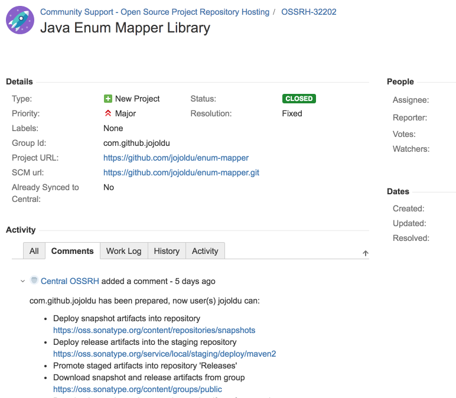

자 그럼 issues.sonatype.org에서 가입한 정보를 bintray에 등록하겠습니다.  
먼저 Edit Profile에 들어가서 Accounts 정보에 OSSRH의 id를 등록합니다.

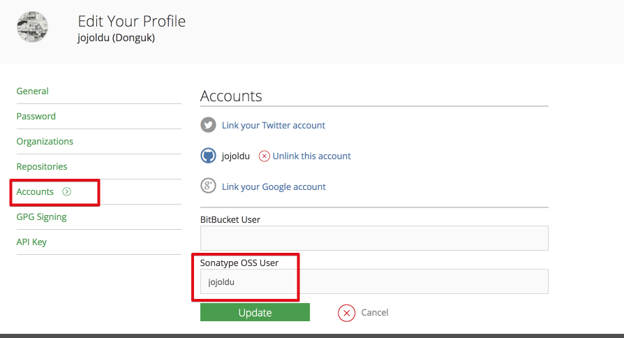

그리고 패키지 페이지로 돌아가 **Maven Central** 탭으로 이동합니다.  
여기서 token password는 OSSRH의 패스워드를 입력하시면 됩니다.  

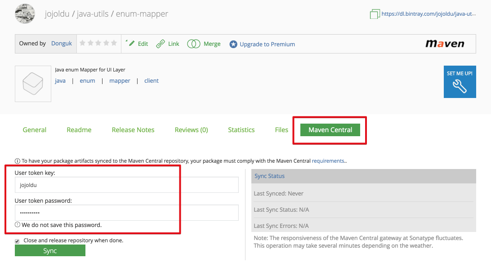

입력후 **SYNC** 버튼을 클릭하시면, 

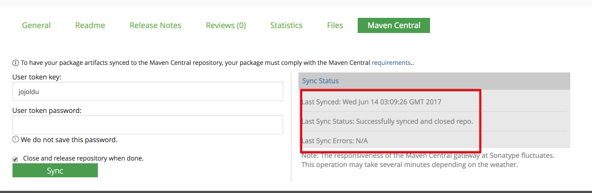

이렇게 우측 **Sync Status**가 Successfully 로 업데이트되면 sync가 성공된 것입니다.  
  
그리고 [repo2.maven.org/maven2/](http://repo2.maven.org/maven2/)에 접속하셔서 본인의 프로젝트가 성공적으로 등록되어있는지 확인합니다.  

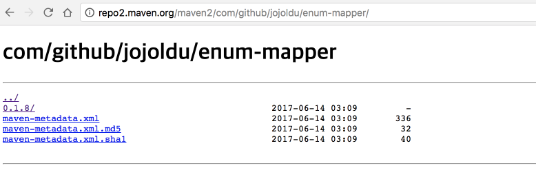

마지막으로 [search.maven.org](https://search.maven.org)에 본인의 라이브러리가 검색 되는지 확인합니다.  

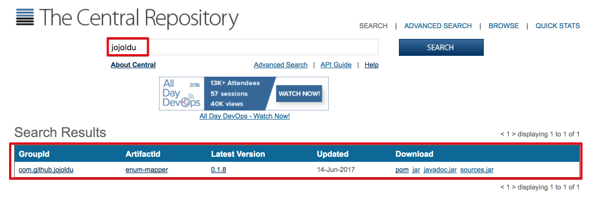

(mvnrepository.com은 공식 maven 검색 사이트가 아닙니다.    maven central의 공식사이트는 search.maven.org 때문에 사용하는 것을 권장드립니다.)  
  
어떠셨나요?  
최대한 쉽게 풀어쓰려고 했는데 어떠실지 모르겠습니다.  
혹시나 제가 정리하는 과정에서 누락된 내용이 있을 수 있으니, 틀린 내용이 있으시면 가감없는 댓글 부탁드리겠습니다.  
  
감사합니다!  

## 참고

* [lesstif님의 위키](https://www.lesstif.com/pages/viewpage.action?pageId=30277671#id-메이븐중앙저장소에아티팩트업로딩-maven-uploadingartifacttocentralrepository-deploy.1)

* [inthecheesefactory.com](https://inthecheesefactory.com/blog/how-to-upload-library-to-jcenter-maven-central-as-dependency/en)

* [bintray blog](https://blog.bintray.com/2015/09/17/publishing-your-maven-project-to-bintray/)

* [bintray docs](https://bintray.com/docs/usermanual/uploads/uploads_syncingwiththirdpartyplatforms.html#_syncing_artifacts_with_maven_central)